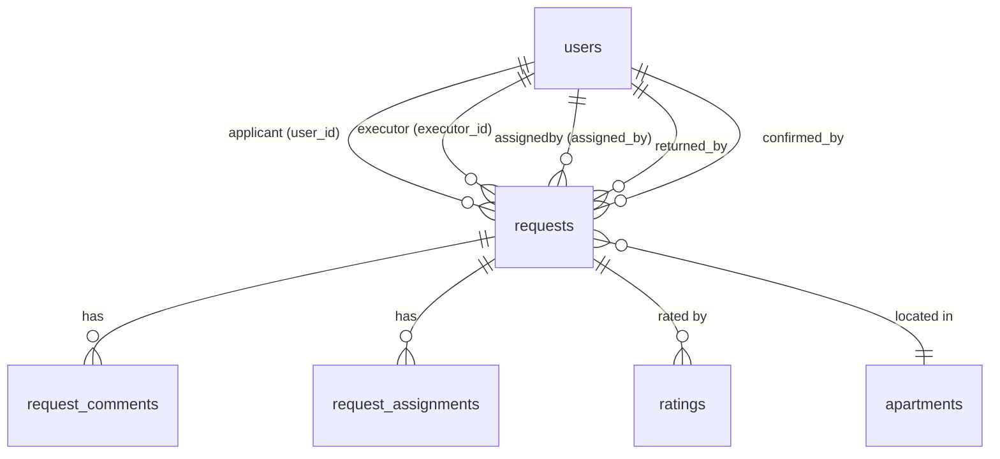
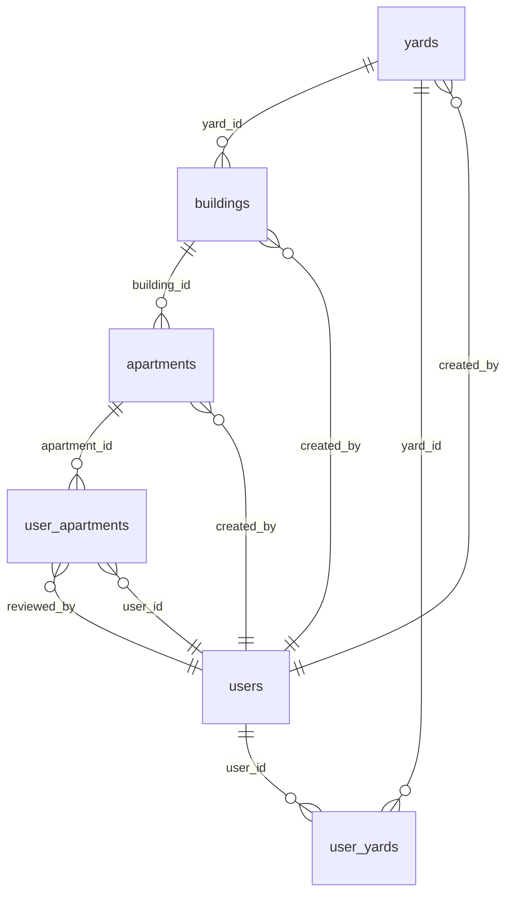
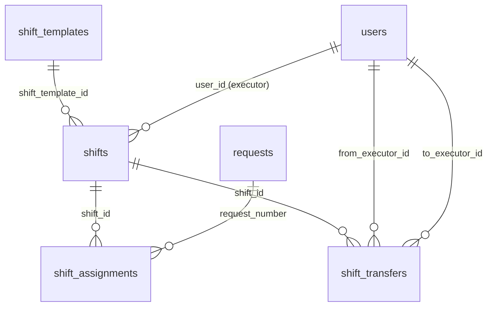
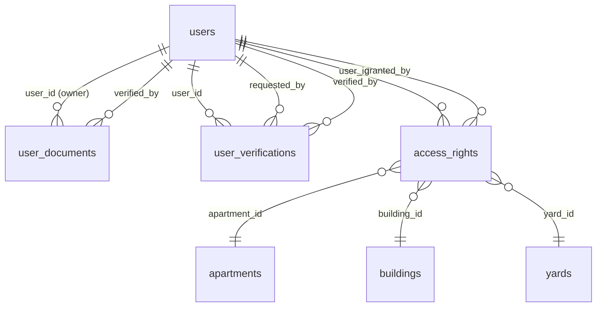

# 🗺️ UK Management Bot - Entity Relationship Diagram

> ⚠️ **WARNING: THIS ER DIAGRAM CONTAINS INACCURACIES!**
>
> **Incorrect relationships shown**:
> - `access_rights` → apartments/buildings/yards (these FK don't exist!)
> - `quarterly_plans` - missing 15+ fields in diagram
> - `shift_schedules` - incorrect structure shown
>
> See [DATABASE_CORRECTIONS.md](DATABASE_CORRECTIONS.md) for details.
>
> **Status**: ⚠️ OUTDATED - Requires Update

**Дата**: 15 октября 2025
**Версия**: 2.0
**Статус**: ⚠️ PARTIALLY OUTDATED
**Формат**: Mermaid ERD

---

## 📊 Полная ER-диаграмма

```mermaid
erDiagram
    %% ==========================================
    %% CORE ENTITIES
    %% ==========================================

    users {
        int id PK
        bigint telegram_id UK
        varchar username
        varchar first_name
        varchar last_name
        varchar role "legacy"
        text roles "JSON array"
        varchar active_role
        varchar status
        varchar language
        varchar phone
        text specialization "JSON"
        varchar verification_status
        text verification_notes
        timestamp verification_date
        int verified_by FK
        varchar passport_series
        varchar passport_number
        timestamp birth_date
        timestamp created_at
        timestamp updated_at
    }

    requests {
        varchar request_number PK "YYMMDD-NNN"
        int user_id FK
        int executor_id FK
        varchar category
        varchar status
        varchar urgency
        text description
        text address "legacy"
        varchar apartment "legacy"
        int apartment_id FK
        json media_files
        text notes
        text completion_report
        json completion_media
        varchar assignment_type
        varchar assigned_group
        timestamp assigned_at
        int assigned_by FK
        text requested_materials
        text manager_materials_comment
        bool is_returned
        text return_reason
        json return_media
        timestamp returned_at
        int returned_by FK
        bool manager_confirmed
        int manager_confirmed_by FK
        timestamp manager_confirmed_at
        timestamp created_at
        timestamp updated_at
        timestamp completed_at
    }

    %% ==========================================
    %% ADDRESS DIRECTORY
    %% ==========================================

    yards {
        int id PK
        varchar name UK
        text description
        float gps_latitude
        float gps_longitude
        bool is_active
        timestamp created_at
        int created_by FK
        timestamp updated_at
    }

    buildings {
        int id PK
        varchar address
        int yard_id FK
        float gps_latitude
        float gps_longitude
        int entrance_count
        int floor_count
        text description
        bool is_active
        timestamp created_at
        int created_by FK
        timestamp updated_at
    }

    apartments {
        int id PK
        int building_id FK
        varchar apartment_number
        int entrance
        int floor
        int rooms_count
        float area
        text description
        bool is_active
        timestamp created_at
        int created_by FK
        timestamp updated_at
    }

    user_apartments {
        int id PK
        int user_id FK
        int apartment_id FK
        varchar status
        timestamp requested_at
        timestamp reviewed_at
        int reviewed_by FK
        text admin_comment
        bool is_owner
        bool is_primary
        timestamp created_at
        timestamp updated_at
    }

    user_yards {
        int id PK
        int user_id FK
        int yard_id FK
        timestamp created_at
    }

    %% ==========================================
    %% SHIFT MANAGEMENT
    %% ==========================================

    shift_templates {
        int id PK
        varchar name
        text description
        int start_hour
        int start_minute
        int duration_hours
        json required_specializations
        int min_executors
        int max_executors
        int default_max_requests
        json coverage_areas
        varchar geographic_zone
        int priority_level
        bool auto_create
        json days_of_week
        int advance_days
        bool is_active
        varchar default_shift_type
        json settings
        timestamp created_at
        timestamp updated_at
    }

    shifts {
        int id PK
        int user_id FK
        int shift_template_id FK
        timestamp start_time
        timestamp end_time
        timestamp planned_start_time
        timestamp planned_end_time
        varchar status
        varchar shift_type
        text notes
        json specialization_focus
        json coverage_areas
        varchar geographic_zone
        int max_requests
        int current_request_count
        int priority_level
        int completed_requests
        float average_completion_time
        float average_response_time
        float efficiency_score
        float quality_rating
        timestamp created_at
        timestamp updated_at
    }

    shift_assignments {
        int id PK
        int shift_id FK
        varchar request_number FK
        int assignment_priority
        int estimated_duration
        int assignment_order
        float ai_score
        float confidence_level
        float specialization_match_score
        float geographic_score
        float workload_score
        varchar status
        bool auto_assigned
        bool confirmed_by_executor
        timestamp assigned_at
        timestamp started_at
        timestamp completed_at
        timestamp planned_start_at
        timestamp planned_completion_at
        varchar assignment_reason
        text notes
        text executor_instructions
        int actual_duration
        float execution_quality_rating
        bool had_issues
        text issues_description
        timestamp created_at
        timestamp updated_at
    }

    shift_transfers {
        int id PK
        int shift_id FK
        int from_executor_id FK
        int to_executor_id FK
        varchar status
        varchar reason
        varchar urgency_level
        text comment
        timestamp created_at
        timestamp assigned_at
        timestamp responded_at
        timestamp completed_at
        bool auto_assigned
        int retry_count
        int max_retries
    }

    %% ==========================================
    %% VERIFICATION SYSTEM
    %% ==========================================

    user_documents {
        int id PK
        int user_id FK
        enum document_type
        varchar file_id
        varchar file_name
        int file_size
        enum verification_status
        text verification_notes
        int verified_by FK
        timestamp verified_at
        timestamp created_at
        timestamp updated_at
    }

    user_verifications {
        int id PK
        int user_id FK
        enum status
        json requested_info
        timestamp requested_at
        int requested_by FK
        text admin_notes
        int verified_by FK
        timestamp verified_at
        timestamp created_at
        timestamp updated_at
    }

    access_rights {
        int id PK
        int user_id FK
        enum access_level
        int apartment_id FK
        int building_id FK
        int yard_id FK
        int granted_by FK
        timestamp granted_at
        timestamp created_at
    }

    %% ==========================================
    %% AUXILIARY TABLES
    %% ==========================================

    request_comments {
        int id PK
        varchar request_number FK
        int user_id FK
        text comment_text
        varchar comment_type
        varchar previous_status
        varchar new_status
        timestamp created_at
    }

    request_assignments {
        int id PK
        varchar request_number FK
        varchar assignment_type
        varchar group_specialization
        int executor_id FK
        varchar status
        timestamp created_at
        int created_by FK
    }

    ratings {
        int id PK
        varchar request_number FK
        int user_id FK
        int rating
        text review
        timestamp created_at
    }

    notifications {
        int id PK
        int user_id FK
        varchar notification_type
        varchar title
        text content
        bool is_read
        bool is_sent
        json meta_data
        timestamp created_at
        timestamp updated_at
    }

    audit_logs {
        int id PK
        int user_id FK
        int telegram_user_id
        varchar action
        json details
        varchar ip_address
        timestamp created_at
    }

    quarterly_plans {
        int id PK
        int year
        int quarter
        varchar status
        int created_by FK
        timestamp created_at
        timestamp updated_at
    }

    %% ==========================================
    %% RELATIONSHIPS
    %% ==========================================

    %% User relationships
    users ||--o{ requests : "creates (user_id)"
    users ||--o{ requests : "executes (executor_id)"
    users ||--o{ shifts : "works in"
    users ||--o{ user_apartments : "lives in"
    users ||--o{ user_yards : "manages"
    users ||--o{ shift_transfers : "transfers from"
    users ||--o{ shift_transfers : "transfers to"
    users ||--o{ user_documents : "uploads"
    users ||--o{ user_verifications : "verified"
    users ||--o{ access_rights : "has access"
    users ||--o{ notifications : "receives"
    users ||--o{ audit_logs : "performs actions"

    %% Address hierarchy
    yards ||--o{ buildings : "contains"
    buildings ||--o{ apartments : "has"
    apartments ||--o{ user_apartments : "linked to users"
    yards ||--o{ user_yards : "extra coverage"

    %% Request relationships
    requests ||--o{ request_comments : "has comments"
    requests ||--o{ request_assignments : "has assignments"
    requests ||--o{ ratings : "rated"
    requests ||--o{ shift_assignments : "assigned to shifts"
    apartments ||--o{ requests : "location of"

    %% Shift relationships
    shift_templates ||--o{ shifts : "template for"
    shifts ||--o{ shift_assignments : "contains"
    shifts ||--o{ shift_transfers : "can be transferred"

    %% Verification relationships
    users ||--o{ user_documents : "verified by (verified_by)"
    users ||--o{ user_verifications : "requested by"
    users ||--o{ user_verifications : "verified by"

    %% Access rights relationships
    access_rights }o--|| apartments : "apartment access"
    access_rights }o--|| buildings : "building access"
    access_rights }o--|| yards : "yard access"

    %% Quarterly planning
    quarterly_plans ||--o{ quarterly_plans : "created by user"
```



---

## 🔗 Детальные связи по модулям

### 1. Core User & Request Module



### 2. Address Directory Module



### 3. Shift Management Module



### 4. Verification Module



---

## 📋 Cascade Delete Summary

### ON DELETE CASCADE

Эти связи автоматически удаляют зависимые записи:

```
buildings.yard_id → yards.id
  └─ При удалении двора удаляются все здания

apartments.building_id → buildings.id
  └─ При удалении здания удаляются все квартиры

user_apartments.user_id → users.id
user_apartments.apartment_id → apartments.id
  └─ При удалении пользователя или квартиры удаляются связи

user_yards.user_id → users.id
user_yards.yard_id → yards.id
  └─ При удалении пользователя или двора удаляются связи

shift_assignments.shift_id → shifts.id
shift_assignments.request_number → requests.request_number
  └─ При удалении смены или заявки удаляются назначения
```

### SET NULL / PROTECTED

Эти связи защищены от удаления или устанавливают NULL:

```
requests.user_id → users.id (PROTECTED)
  └─ Нельзя удалить пользователя с заявками

requests.executor_id → users.id (SET NULL)
  └─ При удалении исполнителя executor_id = NULL

shifts.user_id → users.id (SET NULL)
  └─ При удалении пользователя user_id = NULL
```

---

## 🔑 Index Strategy

### Primary Keys
- **Auto-increment INTEGER**: все таблицы кроме `requests`
- **String PK**: `requests.request_number` (VARCHAR(10))

### Unique Constraints
```sql
users.telegram_id                      -- UNIQUE
yards.name                             -- UNIQUE
(buildings.id, apartments.apartment_number)  -- COMPOSITE UNIQUE
(user_apartments.user_id, apartment_id)      -- COMPOSITE UNIQUE
(quarterly_plans.year, quarter)              -- COMPOSITE UNIQUE
```

### Foreign Key Indexes
```sql
-- High traffic FKs
requests.user_id
requests.executor_id
requests.apartment_id
shifts.user_id
shift_assignments.shift_id
shift_assignments.request_number

-- Moderate traffic FKs
apartments.building_id
buildings.yard_id
user_apartments.user_id
user_apartments.apartment_id
```

### Query Optimization Indexes
```sql
-- Status filtering
user_apartments.status
shifts.status
shift_transfers.status

-- Date range queries
requests.created_at
shifts.start_time
shift_assignments.assigned_at
shift_transfers.created_at

-- Boolean filters
apartments.is_active
buildings.is_active
yards.is_active
```

---

## 📈 Cardinality Estimates

| Relationship | Type | Cardinality | Notes |
|--------------|------|-------------|-------|
| yards → buildings | 1:N | 1:5-10 | Каждый двор имеет 5-10 зданий |
| buildings → apartments | 1:N | 1:50-200 | Здание ��ожет иметь до 200 квартир |
| apartments → user_apartments | 1:N | 1:1-2 | Обычно 1-2 жителя на квартиру |
| users → requests | 1:N | 1:10-100 | Пользователь создает 10-100 заявок |
| users → shifts | 1:N | 1:50-200 | Исполнитель работает 50-200 смен |
| shifts → shift_assignments | 1:N | 1:5-15 | Смена содержит 5-15 заявок |
| requests → ratings | 1:1 | 1:1 | Одна оценка на заявку |
| requests → request_comments | 1:N | 1:5-20 | 5-20 комментариев на заявку |

---

## 🎯 Query Patterns

### Common Queries

**1. Get user's apartments:**
```sql
SELECT a.*, b.address, y.name as yard_name
FROM user_apartments ua
JOIN apartments a ON ua.apartment_id = a.id
JOIN buildings b ON a.building_id = b.id
JOIN yards y ON b.yard_id = y.id
WHERE ua.user_id = ? AND ua.status = 'approved';
```

**2. Get active requests for executor:**
```sql
SELECT r.*, u.first_name as applicant_name
FROM requests r
JOIN users u ON r.user_id = u.id
WHERE r.executor_id = ?
  AND r.status NOT IN ('Выполнена', 'Отменена')
ORDER BY r.urgency DESC, r.created_at ASC;
```

**3. Get shift with assignments:**
```sql
SELECT s.*, COUNT(sa.id) as assignment_count
FROM shifts s
LEFT JOIN shift_assignments sa ON s.id = sa.shift_id
WHERE s.user_id = ? AND s.status = 'active'
GROUP BY s.id;
```

**4. Find available executors for request:**
```sql
SELECT u.*, s.current_request_count, s.max_requests
FROM users u
JOIN shifts s ON u.id = s.user_id
WHERE s.status = 'active'
  AND s.current_request_count < s.max_requests
  AND u.active_role = 'executor'
  AND u.specialization::jsonb @> ?::jsonb  -- matches specialization
ORDER BY s.current_request_count ASC;
```

---

## 🛡️ Constraints Summary

### Check Constraints
```sql
ratings.rating CHECK (rating >= 1 AND rating <= 5)
quarterly_plans.quarter CHECK (quarter >= 1 AND quarter <= 4)
shifts.priority_level CHECK (priority_level >= 1 AND priority_level <= 5)
```

### NOT NULL Constraints
Critical fields that must always have values:
- `users.telegram_id`
- `requests.request_number`
- `requests.user_id`
- `requests.category`
- `requests.description`
- `shift_assignments.shift_id`
- `shift_assignments.request_number`

### Default Values
```sql
users.role DEFAULT 'applicant'
users.status DEFAULT 'pending'
users.language DEFAULT 'ru'
users.verification_status DEFAULT 'pending'
requests.status DEFAULT 'Новая'
requests.urgency DEFAULT 'Обычная'
shifts.status DEFAULT 'active'
shifts.max_requests DEFAULT 10
```

---

## 📊 Statistics & Monitoring

### Key Metrics to Track

**1. Table Growth:**
```sql
SELECT schemaname, tablename,
       pg_size_pretty(pg_total_relation_size(schemaname||'.'||tablename)) AS size
FROM pg_tables
WHERE schemaname = 'public'
ORDER BY pg_total_relation_size(schemaname||'.'||tablename) DESC;
```

**2. Index Usage:**
```sql
SELECT schemaname, tablename, indexname, idx_scan, idx_tup_read, idx_tup_fetch
FROM pg_stat_user_indexes
WHERE schemaname = 'public'
ORDER BY idx_scan DESC;
```

**3. Foreign Key Validation:**
```sql
SELECT conname, conrelid::regclass, confrelid::regclass
FROM pg_constraint
WHERE contype = 'f';
```

---

**Документ создан**: 15 октября 2025
**Автор**: Claude Sonnet 4.5
**Версия**: 2.0
