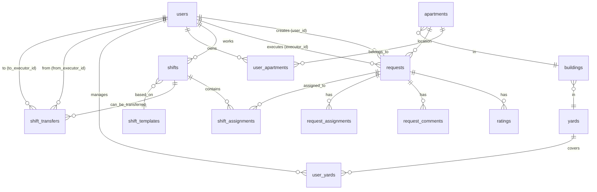

# 🗄️ UK Management Bot - Database Schema Documentation

> ⚠️ **WARNING: THIS DOCUMENTATION CONTAINS INACCURACIES!**
>
> **Use [DATABASE_SCHEMA_ACTUAL.md](DATABASE_SCHEMA_ACTUAL.md) instead.**
>
> This file has **incorrect descriptions** for 5 tables:
> - `access_rights` - missing FK, has extra fields
> - `quarterly_plans` - missing 15+ fields
> - `quarterly_shift_schedules` - missing 10+ fields
> - `shift_schedules` - completely different structure
> - `planning_conflicts` - missing 10+ fields
>
> See [DATABASE_CORRECTIONS.md](DATABASE_CORRECTIONS.md) for detailed list of discrepancies.
>
> **Status**: ⚠️ OUTDATED - Requires Update

**Дата создания**: 15 октября 2025
**Версия**: 2.0
**Статус**: ⚠️ PARTIALLY OUTDATED
**СУБД**: PostgreSQL 15

---

## 📋 Оглавление

1. [Обзор архитектуры](#обзор-архитектуры)
2. [Основные таблицы](#основные-таблицы)
3. [Справочник адресов](#справочник-адресов)
4. [Система смен](#система-смен)
5. [Система верификации](#система-верификации)
6. [Вспомогательные таблицы](#вспомогательные-таблицы)
7. [Связи и ограничения](#связи-и-ограничения)
8. [Индексы](#индексы)
9. [Миграция данных](#миграция-данных)

---

## 🏗️ Обзор архитектуры

### Ключевые особенности

- **ORM**: SQLAlchemy 2.0+
- **Создание таблиц**: `Base.metadata.create_all()` (без Alembic)
- **Primary Key заявок**: String `request_number` (формат YYMMDD-NNN)
- **Многоролевая система**: User может быть applicant, executor, manager одновременно
- **Многоквартирная система**: User может владеть несколькими квартирами
- **Иерархия адресов**: Yard → Building → Apartment
- **AI-оптимизация**: Встроенная система оценки назначений

---

## 📊 Основные таблицы

### 1. `users` - Пользователи

**Назначение**: Центральная таблица всех пользователей системы

| Поле | Тип | Ограничения | Описание |
|------|-----|-------------|----------|
| `id` | INTEGER | PRIMARY KEY, AUTO | Внутренний ID |
| `telegram_id` | BIGINT | UNIQUE, NOT NULL, INDEX | Telegram ID пользователя |
| `username` | VARCHAR(255) | NULL | Telegram username |
| `first_name` | VARCHAR(255) | NULL | Имя |
| `last_name` | VARCHAR(255) | NULL | Фамилия |
| `role` | VARCHAR(50) | NOT NULL, DEFAULT 'applicant' | Legacy роль (для совместимости) |
| `roles` | TEXT | NULL | JSON массив ролей: ["applicant", "executor"] |
| `active_role` | VARCHAR(50) | NULL | Текущая активная роль |
| `status` | VARCHAR(50) | NOT NULL, DEFAULT 'pending' | pending, approved, blocked |
| `language` | VARCHAR(10) | NOT NULL, DEFAULT 'ru' | Язык интерфейса (ru, uz) |
| `phone` | VARCHAR(20) | NULL | Телефон |
| `specialization` | TEXT | NULL | JSON массив специализаций исполнителя |
| `verification_status` | VARCHAR(50) | NOT NULL, DEFAULT 'pending' | pending, verified, rejected |
| `verification_notes` | TEXT | NULL | Комментарии администратора |
| `verification_date` | TIMESTAMP TZ | NULL | Дата верификации |
| `verified_by` | INTEGER | FK(users.id), NULL | ID администратора |
| `passport_series` | VARCHAR(10) | NULL | Серия паспорта |
| `passport_number` | VARCHAR(10) | NULL | Номер паспорта |
| `birth_date` | TIMESTAMP TZ | NULL | Дата рождения |
| `created_at` | TIMESTAMP TZ | DEFAULT now() | Дата регистрации |
| `updated_at` | TIMESTAMP TZ | ON UPDATE | Дата изменения |

**Индексы**:
- PRIMARY KEY: `id`
- UNIQUE INDEX: `telegram_id`
- INDEX: `telegram_id`

**Relationships**:
- `requests` → Request (one-to-many) via `user_id`
- `executed_requests` → Request (one-to-many) via `executor_id`
- `shifts` → Shift (one-to-many)
- `notifications` → Notification (one-to-many)
- `documents` → UserDocument (one-to-many)
- `verifications` → UserVerification (one-to-many)
- `access_rights` → AccessRights (one-to-many)
- `outgoing_transfers` → ShiftTransfer (one-to-many) via `from_executor_id`
- `incoming_transfers` → ShiftTransfer (one-to-many) via `to_executor_id`
- `user_apartments` → UserApartment (one-to-many)
- `user_yards` → UserYard (one-to-many)

---

### 2. `requests` - Заявки

**Назначение**: Заявки от жителей на обслуживание

| Поле | Тип | Ограничения | Описание |
|------|-----|-------------|----------|
| `request_number` | VARCHAR(10) | PRIMARY KEY, INDEX | Номер заявки YYMMDD-NNN |
| `user_id` | INTEGER | FK(users.id), NOT NULL | Заявитель |
| `category` | VARCHAR(100) | NOT NULL | Категория заявки |
| `status` | VARCHAR(50) | NOT NULL, DEFAULT 'Новая' | Статус заявки |
| `address` | TEXT | NULL | Legacy адрес (для старых заявок) |
| `description` | TEXT | NOT NULL | Описание проблемы |
| `apartment` | VARCHAR(20) | NULL | Legacy номер квартиры |
| `urgency` | VARCHAR(20) | NOT NULL, DEFAULT 'Обычная' | Обычная, Срочная, Критическая |
| `apartment_id` | INTEGER | FK(apartments.id), NULL, INDEX | Связь с квартирой из справочника |
| `media_files` | JSON | DEFAULT [] | Массив file_id медиафайлов |
| `executor_id` | INTEGER | FK(users.id), NULL | Назначенный исполнитель |
| `notes` | TEXT | NULL | Дополнительные заметки |
| `completion_report` | TEXT | NULL | Отчет о выполнении |
| `completion_media` | JSON | DEFAULT [] | Медиафайлы отчета |
| `assignment_type` | VARCHAR(20) | NULL | 'group' или 'individual' |
| `assigned_group` | VARCHAR(100) | NULL | Специализация группы |
| `assigned_at` | TIMESTAMP TZ | NULL | Время назначения |
| `assigned_by` | INTEGER | FK(users.id), NULL | Кто назначил |
| `purchase_materials` | TEXT | NULL | Legacy материалы для закупки |
| `requested_materials` | TEXT | NULL | Запрошенные материалы от исполнителя |
| `manager_materials_comment` | TEXT | NULL | Комментарии менеджера |
| `purchase_history` | TEXT | NULL | История закупок |
| `is_returned` | BOOLEAN | NOT NULL, DEFAULT FALSE | Флаг возвращенной заявки |
| `return_reason` | TEXT | NULL | Причина возврата |
| `return_media` | JSON | DEFAULT [] | Медиафайлы при возврате |
| `returned_at` | TIMESTAMP TZ | NULL | Время возврата |
| `returned_by` | INTEGER | FK(users.id), NULL | Кто вернул |
| `manager_confirmed` | BOOLEAN | NOT NULL, DEFAULT FALSE | Подтверждено менеджером |
| `manager_confirmed_by` | INTEGER | FK(users.id), NULL | Кто подтвердил |
| `manager_confirmed_at` | TIMESTAMP TZ | NULL | Когда подтверждено |
| `manager_confirmation_notes` | TEXT | NULL | Комментарии менеджера |
| `created_at` | TIMESTAMP TZ | DEFAULT now() | Дата создания |
| `updated_at` | TIMESTAMP TZ | ON UPDATE | Дата изменения |
| `completed_at` | TIMESTAMP TZ | NULL | Дата завершения |

**Индексы**:
- PRIMARY KEY: `request_number`
- INDEX: `request_number`
- INDEX: `apartment_id`

**Relationships**:
- `user` → User via `user_id`
- `executor` → User via `executor_id`
- `apartment_obj` → Apartment via `apartment_id`
- `ratings` → Rating (one-to-many)
- `comments` → RequestComment (one-to-many)
- `assignments` → RequestAssignment (one-to-many)

**Важно**:
- `request_number` генерируется через `RequestNumberService`
- Формат: YYMMDD-NNN (например, 251015-001)
- Атомарная генерация номеров для предотвращения дубликатов

---

## 🏘️ Справочник адресов

### 3. `yards` - Дворы (территории УК)

**Назначение**: Территориальные зоны управляющей компании

| Поле | Тип | Ограничения | Описание |
|------|-----|-------------|----------|
| `id` | INTEGER | PRIMARY KEY, AUTO | ID двора |
| `name` | VARCHAR(200) | NOT NULL, UNIQUE, INDEX | Название двора |
| `description` | TEXT | NULL | Описание |
| `gps_latitude` | FLOAT | NULL | GPS широта центра |
| `gps_longitude` | FLOAT | NULL | GPS долгота центра |
| `is_active` | BOOLEAN | NOT NULL, DEFAULT TRUE, INDEX | Активен ли двор |
| `created_at` | TIMESTAMP TZ | DEFAULT now() | Дата создания |
| `created_by` | INTEGER | FK(users.id), NULL | Кто создал |
| `updated_at` | TIMESTAMP TZ | ON UPDATE | Дата изменения |

**Relationships**:
- `buildings` → Building (one-to-many)
- `creator` → User via `created_by`
- `user_yards` → UserYard (one-to-many)

---

### 4. `buildings` - Здания (дома)

**Назначение**: Жилые здания на территории двора

| Поле | Тип | Ограничения | Описание |
|------|-----|-------------|----------|
| `id` | INTEGER | PRIMARY KEY, AUTO | ID здания |
| `address` | VARCHAR(300) | NOT NULL, INDEX | Полный адрес здания |
| `yard_id` | INTEGER | FK(yards.id, CASCADE), NOT NULL, INDEX | Двор |
| `gps_latitude` | FLOAT | NULL | GPS широта |
| `gps_longitude` | FLOAT | NULL | GPS долгота |
| `entrance_count` | INTEGER | NOT NULL, DEFAULT 1 | Количество подъездов |
| `floor_count` | INTEGER | NOT NULL, DEFAULT 1 | Количество этажей |
| `description` | TEXT | NULL | Описание |
| `is_active` | BOOLEAN | NOT NULL, DEFAULT TRUE, INDEX | Активно ли здание |
| `created_at` | TIMESTAMP TZ | DEFAULT now() | Дата создания |
| `created_by` | INTEGER | FK(users.id), NULL | Кто создал |
| `updated_at` | TIMESTAMP TZ | ON UPDATE | Дата изменения |

**Relationships**:
- `yard` → Yard via `yard_id`
- `apartments` → Apartment (one-to-many, CASCADE)
- `creator` → User via `created_by`

---

### 5. `apartments` - Квартиры

**Назначение**: Квартиры в зданиях

| Поле | Тип | Ограничения | Описание |
|------|-----|-------------|----------|
| `id` | INTEGER | PRIMARY KEY, AUTO | ID квартиры |
| `building_id` | INTEGER | FK(buildings.id, CASCADE), NOT NULL, INDEX | Здание |
| `apartment_number` | VARCHAR(20) | NOT NULL, INDEX | Номер квартиры |
| `entrance` | INTEGER | NULL | Номер подъезда |
| `floor` | INTEGER | NULL | Этаж |
| `rooms_count` | INTEGER | NULL | Количество комнат |
| `area` | FLOAT | NULL | Площадь (кв.м) |
| `description` | TEXT | NULL | Описание |
| `is_active` | BOOLEAN | NOT NULL, DEFAULT TRUE, INDEX | Активна ли квартира |
| `created_at` | TIMESTAMP TZ | DEFAULT now() | Дата создания |
| `created_by` | INTEGER | FK(users.id), NULL | Кто создал |
| `updated_at` | TIMESTAMP TZ | ON UPDATE | Дата изменения |

**Constraints**:
- UNIQUE(`building_id`, `apartment_number`) - уникальность номера в здании

**Relationships**:
- `building` → Building via `building_id`
- `user_apartments` → UserApartment (one-to-many, CASCADE)
- `requests` → Request (one-to-many)
- `creator` → User via `created_by`

---

### 6. `user_apartments` - Связь пользователя с квартирой

**Назначение**: Many-to-Many связь с модерацией

| Поле | Тип | Ограничения | Описание |
|------|-----|-------------|----------|
| `id` | INTEGER | PRIMARY KEY, AUTO | ID связи |
| `user_id` | INTEGER | FK(users.id, CASCADE), NOT NULL, INDEX | Пользователь |
| `apartment_id` | INTEGER | FK(apartments.id, CASCADE), NOT NULL, INDEX | Квартира |
| `status` | VARCHAR(20) | NOT NULL, DEFAULT 'pending', INDEX | pending, approved, rejected |
| `requested_at` | TIMESTAMP TZ | NOT NULL, DEFAULT now() | Дата запроса |
| `reviewed_at` | TIMESTAMP TZ | NULL | Дата рассмотрения |
| `reviewed_by` | INTEGER | FK(users.id), NULL | Кто рассмотрел |
| `admin_comment` | TEXT | NULL | Комментарий администратора |
| `is_owner` | BOOLEAN | NOT NULL, DEFAULT FALSE | Владелец или проживающий |
| `is_primary` | BOOLEAN | NOT NULL, DEFAULT TRUE | Основная квартира |
| `created_at` | TIMESTAMP TZ | DEFAULT now() | Дата создания |
| `updated_at` | TIMESTAMP TZ | ON UPDATE | Дата изменения |

**Constraints**:
- UNIQUE(`user_id`, `apartment_id`) - один пользователь не может дважды привязаться к одной квартире

**Relationships**:
- `user` → User via `user_id`
- `apartment` → Apartment via `apartment_id`
- `reviewer` → User via `reviewed_by`

---

### 7. `user_yards` - Дополнительные дворы пользователя

**Назначение**: Привязка исполнителей к дополнительным дворам (помимо основной квартиры)

| Поле | Тип | Ограничения | Описание |
|------|-----|-------------|----------|
| `id` | INTEGER | PRIMARY KEY, AUTO | ID связи |
| `user_id` | INTEGER | FK(users.id, CASCADE), NOT NULL, INDEX | Пользователь |
| `yard_id` | INTEGER | FK(yards.id, CASCADE), NOT NULL, INDEX | Двор |
| `created_at` | TIMESTAMP TZ | DEFAULT now() | Дата создания |

**Relationships**:
- `user` → User via `user_id`
- `yard` → Yard via `yard_id`

---

## ⏰ Система смен

### 8. `shifts` - Смены исполнителей

**Назначение**: Рабочие смены исполнителей

| Поле | Тип | Ограничения | Описание |
|------|-----|-------------|----------|
| `id` | INTEGER | PRIMARY KEY, AUTO | ID смены |
| `user_id` | INTEGER | FK(users.id), NULL | Исполнитель |
| `start_time` | TIMESTAMP TZ | NOT NULL | Время начала (факт) |
| `end_time` | TIMESTAMP TZ | NULL | Время окончания (факт) |
| `status` | VARCHAR(50) | NOT NULL, DEFAULT 'active' | active, completed, cancelled, planned, paused |
| `notes` | TEXT | NULL | Заметки |
| `planned_start_time` | TIMESTAMP TZ | NULL | Планируемое начало |
| `planned_end_time` | TIMESTAMP TZ | NULL | Планируемое окончание |
| `shift_template_id` | INTEGER | FK(shift_templates.id), NULL | Шаблон смены |
| `shift_type` | VARCHAR(50) | DEFAULT 'regular', NULL | regular, emergency, overtime, maintenance |
| `specialization_focus` | JSON | NULL | Массив специализаций: ["electric", "plumbing"] |
| `coverage_areas` | JSON | NULL | Зоны покрытия: ["building_A", "yard_1"] |
| `geographic_zone` | VARCHAR(100) | NULL | Географическая зона |
| `max_requests` | INTEGER | NOT NULL, DEFAULT 10 | Максимум заявок на смену |
| `current_request_count` | INTEGER | NOT NULL, DEFAULT 0 | Текущее количество заявок |
| `priority_level` | INTEGER | NOT NULL, DEFAULT 1 | Приоритет (1-5) |
| `completed_requests` | INTEGER | NOT NULL, DEFAULT 0 | За��ершенные заявки |
| `average_completion_time` | FLOAT | NULL | Среднее время выполнения (мин) |
| `average_response_time` | FLOAT | NULL | Среднее время отклика (мин) |
| `efficiency_score` | FLOAT | NULL | Оценка эффективности (0-100) |
| `quality_rating` | FLOAT | NULL | Рейтинг качества (1.0-5.0) |
| `created_at` | TIMESTAMP TZ | DEFAULT now() | Дата создания |
| `updated_at` | TIMESTAMP TZ | ON UPDATE | Дата изменения |

**Relationships**:
- `user` → User via `user_id`
- `template` → ShiftTemplate via `shift_template_id`
- `assignments` → ShiftAssignment (one-to-many, CASCADE)
- `transfers` → ShiftTransfer (one-to-many, CASCADE)

**Computed Properties**:
- `is_full` - смена заполнена до максимума
- `load_percentage` - процент загруженности
- `duration_hours` - продолжительность в часах

---

### 9. `shift_templates` - Шаблоны смен

**Назначение**: Шаблоны для автоматического создания смен

| Поле | Тип | Ограничения | Описание |
|------|-----|-------------|----------|
| `id` | INTEGER | PRIMARY KEY, AUTO | ID шаблона |
| `name` | VARCHAR(100) | NOT NULL | Название шаблона |
| `description` | TEXT | NULL | Описание |
| `start_hour` | INTEGER | NOT NULL | Час начала (0-23) |
| `start_minute` | INTEGER | NOT NULL, DEFAULT 0 | Минута начала (0-59) |
| `duration_hours` | INTEGER | NOT NULL, DEFAULT 8 | Продолжительность в часах |
| `required_specializations` | JSON | NULL | Требуемые специализации |
| `min_executors` | INTEGER | NOT NULL, DEFAULT 1 | Минимум исполнителей |
| `max_executors` | INTEGER | NOT NULL, DEFAULT 3 | Максимум исполнителей |
| `default_max_requests` | INTEGER | NOT NULL, DEFAULT 10 | Макс. заявок по умолчанию |
| `coverage_areas` | JSON | NULL | Зоны покрытия |
| `geographic_zone` | VARCHAR(100) | NULL | Географическая зона |
| `priority_level` | INTEGER | NOT NULL, DEFAULT 1 | Приоритет (1-5) |
| `auto_create` | BOOLEAN | NOT NULL, DEFAULT FALSE | Автосоздание смен |
| `days_of_week` | JSON | NULL | Дни недели: [1,2,3,4,5] |
| `advance_days` | INTEGER | NOT NULL, DEFAULT 7 | За сколько дней создавать |
| `is_active` | BOOLEAN | NOT NULL, DEFAULT TRUE | Активен ли шаблон |
| `default_shift_type` | VARCHAR(50) | NOT NULL, DEFAULT 'regular' | Тип смены |
| `settings` | JSON | NULL | Дополнительные настройки |
| `created_at` | TIMESTAMP TZ | DEFAULT now() | Дата создания |
| `updated_at` | TIMESTAMP TZ | ON UPDATE | Дата изменения |

**Relationships**:
- `shifts` → Shift (one-to-many)

---

### 10. `shift_assignments` - Назначение заявок на смены

**Назначение**: Связь заявки с конкретной сменой с AI-оценками

| Поле | Тип | Ограничения | Описание |
|------|-----|-------------|----------|
| `id` | INTEGER | PRIMARY KEY, AUTO | ID назначения |
| `shift_id` | INTEGER | FK(shifts.id, CASCADE), NOT NULL, INDEX | Смена |
| `request_number` | VARCHAR(10) | FK(requests.request_number, CASCADE), NOT NULL, INDEX | Заявка |
| `assignment_priority` | INTEGER | NOT NULL, DEFAULT 1 | Приоритет (1-5) |
| `estimated_duration` | INTEGER | NULL | Ожидаемая длительность (мин) |
| `assignment_order` | INTEGER | NULL | Порядок выполнения |
| `ai_score` | FLOAT | NULL | Оценка ИИ (0-100) |
| `confidence_level` | FLOAT | NULL | Уровень уверенности (0-1) |
| `specialization_match_score` | FLOAT | NULL | Оценка соответствия специализации (0-100) |
| `geographic_score` | FLOAT | NULL | Географическая оценка (0-100) |
| `workload_score` | FLOAT | NULL | Оценка загруженности (0-100) |
| `status` | VARCHAR(50) | NOT NULL, DEFAULT 'assigned' | assigned, accepted, rejected, in_progress, completed, cancelled |
| `auto_assigned` | BOOLEAN | NOT NULL, DEFAULT FALSE | Автоматическое назначение |
| `confirmed_by_executor` | BOOLEAN | NOT NULL, DEFAULT FALSE | Подтверждено исполнителем |
| `assigned_at` | TIMESTAMP TZ | DEFAULT now(), INDEX | Время назначения |
| `started_at` | TIMESTAMP TZ | NULL | Время начала |
| `completed_at` | TIMESTAMP TZ | NULL | Время завершения |
| `planned_start_at` | TIMESTAMP TZ | NULL | Планируемое начало |
| `planned_completion_at` | TIMESTAMP TZ | NULL | Планируемое завершение |
| `assignment_reason` | VARCHAR(200) | NULL | Причина назначения |
| `notes` | TEXT | NULL | Комментарии |
| `executor_instructions` | TEXT | NULL | Инструкции для исполнителя |
| `actual_duration` | INTEGER | NULL | Фактическая длительность (мин) |
| `execution_quality_rating` | FLOAT | NULL | Оценка качества (1.0-5.0) |
| `had_issues` | BOOLEAN | NOT NULL, DEFAULT FALSE | Были проблемы |
| `issues_description` | TEXT | NULL | Описание проблем |
| `created_at` | TIMESTAMP TZ | DEFAULT now() | Дата создания |
| `updated_at` | TIMESTAMP TZ | ON UPDATE | Дата изменения |

**Relationships**:
- `shift` → Shift via `shift_id`
- `request` → Request via `request_number`

**Computed Properties**:
- `is_overdue` - просрочено ли назначение
- `duration_actual_vs_estimated` - отношение факт/план
- `response_time_minutes` - время отклика
- `completion_time_minutes` - общее время выполнения

---

### 11. `shift_transfers` - Передача смен

**Назначение**: Передача смен между исполнителями с approval workflow

| Поле | Тип | Ограничения | Описание |
|------|-----|-------------|----------|
| `id` | INTEGER | PRIMARY KEY, AUTO | ID передачи |
| `shift_id` | INTEGER | FK(shifts.id), NOT NULL, INDEX | Смена |
| `from_executor_id` | INTEGER | FK(users.id), NOT NULL, INDEX | От кого |
| `to_executor_id` | INTEGER | FK(users.id), NULL, INDEX | Кому |
| `status` | VARCHAR(50) | NOT NULL, DEFAULT 'pending', INDEX | pending, assigned, accepted, rejected, cancelled, completed |
| `reason` | VARCHAR(100) | NOT NULL, INDEX | illness, emergency, workload, vacation, other |
| `comment` | TEXT | NULL | Комментарий |
| `urgency_level` | VARCHAR(20) | NOT NULL, DEFAULT 'normal' | low, normal, high, critical |
| `created_at` | TIMESTAMP | NOT NULL, DEFAULT NOW, INDEX | Время создания |
| `assigned_at` | TIMESTAMP | NULL, INDEX | Время назначения |
| `responded_at` | TIMESTAMP | NULL | Время ответа |
| `completed_at` | TIMESTAMP | NULL | Время завершения |
| `auto_assigned` | BOOLEAN | NOT NULL, DEFAULT FALSE | Автоназначение |
| `retry_count` | INTEGER | NOT NULL, DEFAULT 0 | Количество попыток |
| `max_retries` | INTEGER | NOT NULL, DEFAULT 3 | Максимум попыток |

**Relationships**:
- `shift` → Shift via `shift_id`
- `from_executor` → User via `from_executor_id`
- `to_executor` → User via `to_executor_id`

**Computed Properties**:
- `is_pending`, `is_active`, `can_retry`
- `time_since_created` - минут с момента создания

---

## 🔐 Система верификации

### 12. `user_documents` - Документы пользователей

**Назначение**: Документы для верификации

| Поле | Тип | Ограничения | Описание |
|------|-----|-------------|----------|
| `id` | INTEGER | PRIMARY KEY, AUTO | ID документа |
| `user_id` | INTEGER | FK(users.id), NOT NULL | Пользователь |
| `document_type` | ENUM | NOT NULL | passport, property_deed, rental_agreement, utility_bill, other |
| `file_id` | VARCHAR(255) | NOT NULL | Telegram file_id |
| `file_name` | VARCHAR(255) | NULL | Имя файла |
| `file_size` | INTEGER | NULL | Размер файла |
| `verification_status` | ENUM | DEFAULT 'pending' | pending, approved, rejected, requested |
| `verification_notes` | TEXT | NULL | Комментарии проверки |
| `verified_by` | INTEGER | FK(users.id), NULL | Кто проверил |
| `verified_at` | TIMESTAMP TZ | NULL | Когда проверено |
| `created_at` | TIMESTAMP TZ | DEFAULT now() | Дата загрузки |
| `updated_at` | TIMESTAMP TZ | ON UPDATE | Дата изменения |

**Relationships**:
- `user` → User via `user_id`

---

### 13. `user_verifications` - Процесс верификации

**Назначение**: Процесс верификации пользователя

| Поле | Тип | Ограничения | Описание |
|------|-----|-------------|----------|
| `id` | INTEGER | PRIMARY KEY, AUTO | ID верификации |
| `user_id` | INTEGER | FK(users.id), NOT NULL | Пользователь |
| `status` | ENUM | DEFAULT 'pending' | pending, approved, rejected, requested |
| `requested_info` | JSON | DEFAULT {} | Запрошенная информация: {"address": true} |
| `requested_at` | TIMESTAMP TZ | NULL | Когда запрошено |
| `requested_by` | INTEGER | FK(users.id), NULL | Кто запросил |
| `admin_notes` | TEXT | NULL | Заметки администратора |
| `verified_by` | INTEGER | FK(users.id), NULL | Кто проверил |
| `verified_at` | TIMESTAMP TZ | NULL | Когда проверено |
| `created_at` | TIMESTAMP TZ | DEFAULT now() | Дата создания |
| `updated_at` | TIMESTAMP TZ | ON UPDATE | Дата изменения |

**Relationships**:
- `user` → User via `user_id`

---

### 14. `access_rights` - Права доступа

**Назначение**: Уровни доступа для подачи заявок

| Поле | Тип | Ограничения | Описание |
|------|-----|-------------|----------|
| `id` | INTEGER | PRIMARY KEY, AUTO | ID права |
| `user_id` | INTEGER | FK(users.id), NOT NULL | Пользователь |
| `access_level` | ENUM | NOT NULL | apartment, house, yard |
| `apartment_id` | INTEGER | FK(apartments.id), NULL | Для уровня apartment |
| `building_id` | INTEGER | FK(buildings.id), NULL | Для уровня house |
| `yard_id` | INTEGER | FK(yards.id), NULL | Для уровня yard |
| `granted_by` | INTEGER | FK(users.id), NULL | Кто выдал |
| `granted_at` | TIMESTAMP TZ | DEFAULT now() | Когда выдано |
| `created_at` | TIMESTAMP TZ | DEFAULT now() | Дата создания |

**Relationships**:
- `user` → User via `user_id`

---

## 📝 Вспомогательные таблицы

### 15. `request_comments` - Комментарии к заявкам

**Назначение**: История комментариев и изменений статуса

| Поле | Тип | Ограничения | Описание |
|------|-----|-------------|----------|
| `id` | INTEGER | PRIMARY KEY, AUTO | ID комментария |
| `request_number` | VARCHAR(10) | FK(requests.request_number), NOT NULL | Заявка |
| `user_id` | INTEGER | FK(users.id), NOT NULL | Автор |
| `comment_text` | TEXT | NOT NULL | Текст комментария |
| `comment_type` | VARCHAR(50) | NOT NULL | status_change, clarification, purchase, report |
| `previous_status` | VARCHAR(50) | NULL | Предыдущий статус |
| `new_status` | VARCHAR(50) | NULL | Новый статус |
| `created_at` | TIMESTAMP TZ | DEFAULT now() | Дата создания |

**Relationships**:
- `request` → Request via `request_number`
- `user` → User via `user_id`

---

### 16. `request_assignments` - Назначения заявок (legacy)

**Назначение**: Групповые и индивидуальные назначения (дублирует данные в Request)

| Поле | Тип | Ограничения | Описание |
|------|-----|-------------|----------|
| `id` | INTEGER | PRIMARY KEY, AUTO | ID назначения |
| `request_number` | VARCHAR(10) | FK(requests.request_number), NOT NULL | Заявка |
| `assignment_type` | VARCHAR(20) | NOT NULL | 'group' или 'individual' |
| `group_specialization` | VARCHAR(100) | NULL | Для группового |
| `executor_id` | INTEGER | FK(users.id), NULL | Для индивидуального |
| `status` | VARCHAR(20) | DEFAULT 'active' | active, cancelled, completed |
| `created_at` | TIMESTAMP TZ | DEFAULT now() | Дата создания |
| `created_by` | INTEGER | FK(users.id), NOT NULL | Кто создал |

**Relationships**:
- `request` → Request via `request_number`
- `executor` → User via `executor_id`
- `creator` → User via `created_by`

---

### 17. `ratings` - Оценки выполненных заявок

**Назначение**: Рейтинги и отзывы от заявителей

| Поле | Тип | Ограничения | Описание |
|------|-----|-------------|----------|
| `id` | INTEGER | PRIMARY KEY, AUTO | ID оценки |
| `request_number` | VARCHAR(10) | FK(requests.request_number), NOT NULL | Заявка |
| `user_id` | INTEGER | FK(users.id), NOT NULL | Кто оценил |
| `rating` | INTEGER | NOT NULL | Оценка 1-5 |
| `review` | TEXT | NULL | Текстовый отзыв |
| `created_at` | TIMESTAMP TZ | DEFAULT now() | Дата создания |

**Relationships**:
- `request` → Request via `request_number`
- `user` → User via `user_id`

---

### 18. `notifications` - Уведомления

**Назначение**: История уведомлений пользователей

| Поле | Тип | Ограничения | Описание |
|------|-----|-------------|----------|
| `id` | INTEGER | PRIMARY KEY, AUTO | ID уведомления |
| `user_id` | INTEGER | FK(users.id), NOT NULL | Получатель |
| `notification_type` | VARCHAR(50) | NOT NULL | Тип уведомления |
| `title` | VARCHAR(255) | NULL | Заголовок |
| `content` | TEXT | NOT NULL | Содержание |
| `is_read` | BOOLEAN | DEFAULT FALSE | Прочитано |
| `is_sent` | BOOLEAN | DEFAULT FALSE | Отправлено |
| `meta_data` | JSON | DEFAULT {} | Дополнительные данные |
| `created_at` | TIMESTAMP TZ | DEFAULT now() | Дата создания |
| `updated_at` | TIMESTAMP TZ | ON UPDATE | Дата изменения |

**Relationships**:
- `user` → User via `user_id`

---

### 19. `audit_logs` - Аудит действий

**Назначение**: Журнал всех действий пользователей

| Поле | Тип | Ограничения | Описание |
|------|-----|-------------|----------|
| `id` | INTEGER | PRIMARY KEY, AUTO | ID записи |
| `user_id` | INTEGER | FK(users.id), NULL | Пользователь |
| `telegram_user_id` | INTEGER | NULL, INDEX | Telegram ID (для удаленных) |
| `action` | VARCHAR(100) | NOT NULL | Тип действия |
| `details` | JSON | NULL | Детали действия |
| `ip_address` | VARCHAR(45) | NULL | IP адрес |
| `created_at` | TIMESTAMP TZ | DEFAULT now() | Дата действия |

**Relationships**:
- `user` → User via `user_id`

---

### 20. `quarterly_plans` - Квартально�� планирование

**Назначение**: Квартальные планы смен

| Поле | Тип | Ограничения | Описание |
|------|-----|-------------|----------|
| `id` | INTEGER | PRIMARY KEY, AUTO | ID плана |
| `year` | INTEGER | NOT NULL | Год |
| `quarter` | INTEGER | NOT NULL | Квартал (1-4) |
| `status` | VARCHAR(50) | NOT NULL, DEFAULT 'draft' | draft, active, completed |
| `created_by` | INTEGER | FK(users.id), NULL | Кто создал |
| `created_at` | TIMESTAMP TZ | DEFAULT now() | Дата создания |
| `updated_at` | TIMESTAMP TZ | ON UPDATE | Дата изменения |

---

## 🔗 Связи и ограничения

### Foreign Keys Summary



### Cascade Rules

**ON DELETE CASCADE**:
- `buildings.yard_id` → `yards.id`
- `apartments.building_id` → `buildings.id`
- `user_apartments.user_id` → `users.id`
- `user_apartments.apartment_id` → `apartments.id`
- `user_yards.user_id` → `users.id`
- `user_yards.yard_id` → `yards.id`
- `shift_assignments.shift_id` → `shifts.id`
- `shift_assignments.request_number` → `requests.request_number`

**No Cascade** (SET NULL or protected):
- `requests.user_id` → `users.id` (protected)
- `requests.executor_id` → `users.id` (SET NULL)
- `shifts.user_id` → `users.id` (SET NULL)

---

## 📇 Индексы

### Primary Keys
Все таблицы имеют PRIMARY KEY (обычно `id` INTEGER AUTO_INCREMENT)
Исключение: `requests.request_number` (VARCHAR PRIMARY KEY)

### Unique Indexes
- `users.telegram_id`
- `yards.name`
- `(buildings.id, apartments.apartment_number)` - composite unique
- `(user_apartments.user_id, apartment_id)` - composite unique

### Regular Indexes
- `users.telegram_id` (также UNIQUE)
- `requests.request_number` (также PRIMARY)
- `requests.apartment_id`
- `apartments.building_id`
- `apartments.apartment_number`
- `apartments.is_active`
- `buildings.yard_id`
- `buildings.address`
- `buildings.is_active`
- `yards.name` (также UNIQUE)
- `yards.is_active`
- `user_apartments.user_id`
- `user_apartments.apartment_id`
- `user_apartments.status`
- `shift_assignments.shift_id`
- `shift_assignments.request_number`
- `shift_assignments.assigned_at`
- `shift_transfers.shift_id`
- `shift_transfers.from_executor_id`
- `shift_transfers.to_executor_id`
- `shift_transfers.status`
- `shift_transfers.reason`
- `shift_transfers.created_at`
- `shift_transfers.assigned_at`
- `audit_logs.telegram_user_id`

---

## 🔄 Миграция данных

### Изменения от старой структуры к новой

**Критические изменения**:

1. **Request.id → Request.request_number**
   - Старый Primary Key: INTEGER `id`
   - Новый Primary Key: VARCHAR(10) `request_number`
   - Формат: YYMMDD-NNN (например, 251015-001)

2. **Адресная система**
   - Старое: `Request.address` (TEXT, free-form)
   - Новое: Иерархия Yard → Building → Apartment
   - Миграция: Legacy поля оставлены как nullable

3. **Многоролевая система**
   - Старое: `User.role` (single VARCHAR)
   - Новое: `User.roles` (JSON array) + `User.active_role`

### Скрипт миграции

```sql
-- 1. Создать новые таблицы (все через Base.metadata.create_all())

-- 2. Мигрировать пользователей (конвертация role → roles)
UPDATE users
SET roles = CONCAT('["', role, '"]')
WHERE roles IS NULL;

-- 3. Мигрировать заявки (генерация request_number для старых)
-- Выполняется в Python через RequestNumberService

-- 4. Создать справочник адресов (вручную или импорт)

-- 5. Связать старые заявки с новыми адресами (опционально)
```

### Обратная совместимость

**Сохранены legacy поля**:
- `Request.address` (TEXT) - старые адреса
- `Request.apartment` (VARCHAR) - старые номера квартир
- `User.role` (VARCHAR) - для старого кода
- `Request.purchase_materials` (TEXT) - старая система материалов

---

## 📊 Статистика БД

### Количество таблиц
- **Основные**: 5 (users, requests, shifts, apartments, buildings, yards)
- **Связующие**: 4 (user_apartments, user_yards, shift_assignments, request_assignments)
- **Вспомогательные**: 11 (ratings, comments, notifications, audit_logs и др.)
- **Всего**: 20+ таблиц

### Количество индексов
- PRIMARY KEY: 20
- UNIQUE: 4
- INDEX: 30+
- **Всего**: 50+ индексов

### Размер данных (оценка)
- **users**: ~1000 записей × 2KB = 2MB
- **requests**: ~10000 записей × 5KB = 50MB
- **shifts**: ~5000 записей × 3KB = 15MB
- **apartments**: ~2000 записей × 1KB = 2MB
- **shift_assignments**: ~20000 записей × 2KB = 40MB
- **Итого**: ~110MB + indexes

---

## 🛠️ SQL для создания БД

База данных создается автоматически через SQLAlchemy:

```python
from uk_management_bot.database.session import Base, engine
import uk_management_bot.database.models  # Импорт всех моделей

# Создание всех таблиц
Base.metadata.create_all(bind=engine)
```

---

## 🔍 Проверка целостности

### SQL запросы для проверки

```sql
-- Проверка Foreign Keys
SELECT
    conname AS constraint_name,
    conrelid::regclass AS table_name,
    confrelid::regclass AS referenced_table
FROM pg_constraint
WHERE contype = 'f';

-- Проверка индексов
SELECT
    tablename,
    indexname,
    indexdef
FROM pg_indexes
WHERE schemaname = 'public'
ORDER BY tablename, indexname;

-- Количество записей
SELECT
    'users' as table, COUNT(*) FROM users
UNION ALL SELECT 'requests', COUNT(*) FROM requests
UNION ALL SELECT 'shifts', COUNT(*) FROM shifts
UNION ALL SELECT 'apartments', COUNT(*) FROM apartments
UNION ALL SELECT 'buildings', COUNT(*) FROM buildings
UNION ALL SELECT 'yards', COUNT(*) FROM yards;
```

---

## 📚 Дополнительная документация

- **Модели**: `uk_management_bot/database/models/`
- **Сессии**: `uk_management_bot/database/session.py`
- **Миграция**: `DATABASE_MIGRATION_GUIDE.md`
- **Восстановление**: `RESTORE_DATABASE_FROM_SCRATCH.md`
- **Архитектура**: `MemoryBank/MICROSERVICES_ARCHITECTURE.md`

---

**Документ создан**: 15 октября 2025
**Автор**: Claude Sonnet 4.5
**Версия БД**: 2.0 (Request.request_number as PRIMARY KEY)
**Статус**: Production Ready
