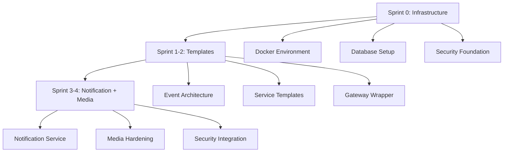
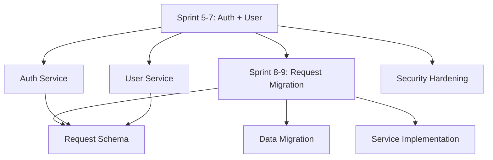
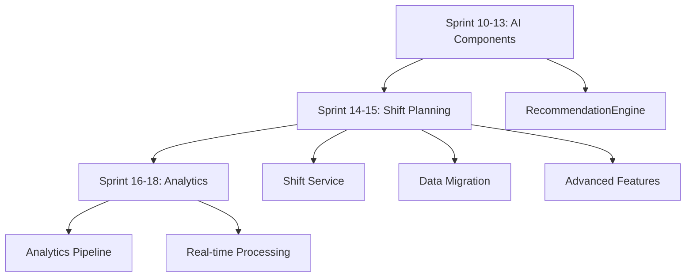
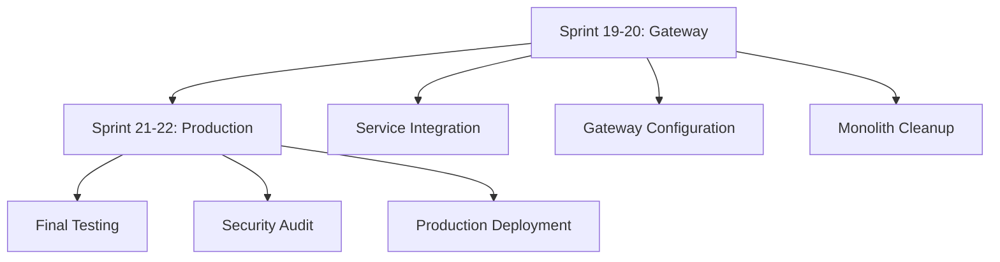

# 🚀 UK Management Bot — Сводный план реализации микросервисов
**Comprehensive Implementation Plan | Timeline: 22-30 weeks**

---

## 📊 СВОДНЫЙ АНАЛИЗ ЗАДАЧ

### **Общая статистика задач**
- **Всего задач**: 289 (базовых: 91 + добавленных: 198)
- **Детализированных задач**: 70 (отмечены %)
- **Критических компонентов**: 9 сервисов
- **Инфраструктурных задач**: 30
- **Security задач**: 40
- **AI/ML задач**: 29

### **Распределение по сложности**
| Категория | Количество задач | Временная оценка | Критичность |
|-----------|------------------|------------------|-------------|
| **Infrastructure** | 30 | 4 недели | 🔴 Высокая |
| **Auth + User** | 18 | 3 недели | 🔴 Критическая |
| **Request Migration** | 17 | 2 недели | 🔴 Критическая |
| **AI Components** | 29 | 4 недели | 🟡 Высокая |
| **Shift Planning** | 15 | 2 недели | 🟡 Средняя |
| **Analytics** | 16 | 3 недели | 🟡 Средняя |
| **Integration** | 12 | 2 недели | 🟡 Средняя |
| **Gateway + Production** | 20 | 2 недели | 🔴 Высокая |
| **Testing + Security** | 45 | 4 недели | 🔴 Критическая |

---

## 🎯 КРИТИЧЕСКИЙ ПУТЬ ВЫПОЛНЕНИЯ

### **Фаза 1: Foundation (Недели 1-4)**


**Блокирующие зависимости:**
- ❌ **Невозможно начать сервисы без Infrastructure**
- ❌ **Невозможно тестировать без Event Architecture**
- ❌ **Невозможно интегрировать без Security Foundation**

### **Фаза 2: Core Services (Недели 5-9)**


**Критические зависимости:**
- 🔴 **Request Service зависит от Auth Service для авторизации**
- 🔴 **User Service зависит от Auth Service для аутентификации**
- 🔴 **Data Migration требует работающих Auth + User сервисов**

### **Фаза 3: AI & Complex Services (Недели 10-17)**


**Параллельное выполнение возможно:**
- ✅ **AI Components могут разрабатываться параллельно**
- ✅ **Shift Planning независим от AI Components**
- ✅ **Analytics может начинаться после базовых сервисов**

### **Фаза 4: Production (Недели 18-22)**


---

## ⏱️ РЕАЛИСТИЧНЫЙ TIMELINE

### **Оригинальный vs Реалистичный план**
| Период | Оригинальный план | Реалистичная оценка | Причины изменений |
|--------|-------------------|---------------------|-------------------|
| **Sprint 0** | 2 недели | 2 недели | ✅ Корректно |
| **Sprint 1-2** | 2 недели | 3 недели | Event architecture сложнее |
| **Sprint 3-4** | 2 недели | 3 недели | Security integration требует времени |
| **Sprint 5-7** | 3 недели | 4 недели | Auth complexity недооценена |
| **Sprint 8-9** | 2 недели | 3 недели | Data migration критична |
| **Sprint 10-13** | 4 недели | 5 недель | AI components сложнее |
| **Sprint 14-15** | 2 недели | 3 недели | Shift complexity |
| **Sprint 16-18** | 3 недели | 4 недели | Analytics setup сложнее |
| **Sprint 19-20** | 2 недели | 3 недели | Integration testing |
| **Sprint 21-22** | 2 недели | 3 недели | Production readiness |
| **Buffer** | 0 недель | 2 недели | Непредвиденные проблемы |
| **ИТОГО** | **22 недели** | **28-30 недель** | **+27-36% времени** |

---

## 🔄 ПЛАН РЕАЛИЗАЦИИ ПО ФАЗАМ

### **ФАЗА 1: INFRASTRUCTURE FOUNDATION (Недели 1-4)**

#### **Sprint 0: Infrastructure Setup (Недели 1-2)**
**Цель**: Создать production-ready Docker environment
```yaml
Критические задачи (30):
  Infrastructure:
    - Docker environment с docker-compose
    - Traefik reverse proxy
    - Prometheus + Grafana + Jaeger
    - HashiCorp Vault
    - ELK stack для логирования
    
  Database:
    - PostgreSQL containers для каждого сервиса
    - Redis с persistence и pub/sub для messaging
    - Локальное файловое хранилище для медиа
    
  Security:
    - TLS certificates с Let's Encrypt
    - Docker network policies
    - Vulnerability scanning
    - Audit logging
```

**Критерии готовности:**
- ✅ Все контейнеры запускаются и доступны
- ✅ Monitoring stack собирает метрики
- ✅ Security scanning проходит без критических уязвимостей
- ✅ Backup/restore процедуры протестированы

#### **Sprint 1-2: Service Templates & Event Architecture (Недели 3-4)**
**Цель**: Создать шаблоны сервисов и событийную архитектуру
```yaml
Критические задачи (14):
  Templates:
    - FastAPI service template с OpenTelemetry
    - Docker Compose templates
    - CI/CD pipeline templates
    - Service discovery templates
    
  Event Architecture:
    - Event schema registry с versioning
    - Transactional outbox pattern
    - Event contract testing framework
    - Dead letter queues
    
  Gateway:
    - Telegram gateway wrapper
    - JWT validation middleware
    - Rate limiting
    - Circuit breakers
```

**Критерии готовности:**
- ✅ Service template создает новый сервис за 1 час
- ✅ Event publishing работает надежно
- ✅ Gateway маршрутизирует запросы корректно
- ✅ Все сервисы интегрированы с monitoring

### **ФАЗА 2: CORE SERVICES (Недели 5-9)**

#### **Sprint 3-4: Notification & Media (Недели 5-6)**
**Цель**: Выделить Notification service и усилить Media service
```yaml
Критические задачи (19):
  Notification Service:
    - Extract notification_service.py
    - REST endpoints implementation
    - Redis pub/sub integration
    - Telegram delivery (Email/SMS - future scope)
    
  Media Service:
    - Auth middleware integration
    - Signed URL generation
    - Virus scanning (ClamAV)
    - File validation
    
  Security Integration:
    - JWT authentication
    - TLS communication
    - RBAC policies
    - Input validation
```

**Критерии готовности:**
- ✅ Notification service отправляет уведомления через все каналы
- ✅ Media service безопасно обрабатывает файлы
- ✅ Все endpoints защищены JWT
- ✅ Event publishing работает корректно

#### **Sprint 5-7: Auth + User Domain (Недели 7-10)**
**Цель**: Создать критическую инфраструктуру аутентификации
```yaml
Критические задачи (28):
  Auth Service:
    - JWT token generation/validation
    - User authentication endpoints
    - Refresh token rotation
    - Redis session storage
    - Password reset flow
    - Basic password policies
    
  User Service:
    - User CRUD operations
    - Role management system
    - Verification workflow
    - Document upload integration
    - Profile management
    
  Security Hardening:
    - Password complexity requirements
    - Account lockout policies
    - Data encryption at rest
    - Basic audit logging
    - Session security
```

**Критерии готовности:**
- ✅ Auth service аутентифицирует пользователей
- ✅ User service управляет профилями и ролями
- ✅ MFA работает корректно
- ✅ Data migration из монолита завершена
- ✅ Все security требования выполнены

#### **Sprint 8-9: Request Lifecycle (Недели 11-13)**
**Цель**: Мигрировать критическую бизнес-логику заявок
```yaml
Критические задачи (26):
  Request Service:
    - request_number schema validation
    - CRUD endpoints implementation
    - Attachment metadata handling
    - Event publishing
    
  Critical Data Migration:
    - Dual-write pattern implementation
    - Incremental migration scripts
    - Data consistency validation
    - Rollback procedures
    - Monitoring and alerting
    
  Integration:
    - Gateway handlers update
    - Monolith handlers removal
    - Regression testing
```

**Критерии готовности:**
- ✅ Все заявки обрабатываются через новый сервис
- ✅ Data migration выполнена без потери данных
- ✅ Dual-write работает корректно
- ✅ Rollback procedures протестированы
- ✅ Performance соответствует требованиям

### **ФАЗА 3: AI & COMPLEX SERVICES (Недели 10-17)**

#### **Sprint 10-13: Assignment & AI (Недели 14-18)**
**Цель**: Выделить сложные AI компоненты
```yaml
Критические задачи (38):
  Core Assignment:
    - Smart dispatcher extraction
    - Auto-assign endpoints
    - Route optimization
    - SLA tracking
    
    
  RecommendationEngine (40KB):
    - Basic executor matching algorithms
    - Rule-based recommendations
    - Simple scoring mechanisms
    - Performance tracking
    - Historical data analysis
```

**Критерии готовности:**
- ✅ Assignment service назначает исполнителей
- ✅ GeoOptimizer оптимизирует маршруты
- ✅ WorkloadPredictor дает базовые прогнозы

#### **Sprint 14-15: Shift Planning (Недели 19-21)**
**Цель**: Мигрировать планирование смен
```yaml
Критические задачи (22):
  Shift Service:
    - Database schema design
    - CRUD endpoints
    - Template management
    - Schedule management
    - Transfer workflows
    
  Data Migration:
    - Shift data analysis
    - Migration scripts
    - Conflict detection
    - Integrity validation
    - Rollback procedures
    
  Advanced Features:
    - Intelligent scheduling
    - Capacity monitoring
    - Conflict resolution
    - Workload balancing
    - Predictive analytics
```

**Критерии готовности:**
- ✅ Shift service управляет расписанием
- ✅ Data migration завершена
- ✅ Intelligent scheduling работает
- ✅ Capacity monitoring активен
- ✅ All workflows протестированы

#### **Sprint 16-18: Integration & Analytics (Недели 22-25)**
**Цель**: Создать интеграции и аналитику
```yaml
Критические задачи (25):
  Integration Hub:
    - Internal event consumption
    - Database synchronization
    - Basic webhook management
    - Event routing and transformation
    
    
  Analytics Pipeline:
    - Basic KPI calculation engine
    - API endpoints for metrics
    - Simple dashboard framework
    - Batch processing analytics
    - Historical reporting
```

**Критерии готовности:**
- ✅ Integration Hub обрабатывает события
- ✅ Basic metrics доступны
- ✅ Simple dashboards отображают KPI
- ✅ Historical analytics работает

### **ФАЗА 4: PRODUCTION (Недели 18-22)**

#### **Sprint 19-20: Gateway & Cleanup (Недели 26-28)**
**Цель**: Завершить миграцию и очистить монолит
```yaml
Критические задачи (25):
  Service Integration:
    - Gateway routes update
    - Monolith endpoints disable
    - Load testing
    - Security assessment
    
  Advanced Gateway:
    - API versioning
    - Circuit breakers
    - Distributed tracing
    - Rate limiting
    - Request/response logging
    
  Production Gateway:
    - Traefik integration
    - Traffic management
    - Canary deployments
    - Service mesh
    - Fault injection
```

**Критерии готовности:**
- ✅ Все запросы идут через микросервисы
- ✅ Монолит отключен
- ✅ Load testing пройден
- ✅ Security audit завершен
- ✅ Performance соответствует SLO

#### **Sprint 21-22: Production Readiness (Недели 29-32)**
**Цель**: Подготовить к production deployment
```yaml
Критические задачи (25):
  Operations:
    - SLO/SLA definition
    - On-call procedures
    - Chaos testing
    - Backup/restore testing
    - Regression testing
    
  Security:
    - Vulnerability scanning
    - Zero-trust policies
    - Secrets rotation
    - Audit logging
    - SIEM integration
    
  Production Excellence:
    - Disaster recovery
    - Multi-region setup
    - Automated monitoring
    - Incident response
    - Documentation
```

**Критерии готовности:**
- ✅ Все SLO достигнуты
- ✅ Security audit пройден
- ✅ Disaster recovery протестирована
- ✅ Documentation готова
- ✅ Go-live checklist выполнен

---

## 🎯 SUCCESS METRICS & KPIs

### **Technical KPIs**
```yaml
Performance:
  - API Response Time: p95 < 500ms
  - System Availability: 99.9%
  - Deployment Frequency: Daily
  - Mean Time to Recovery: < 15 minutes
  
Quality:
  - Code Coverage: > 90%
  - Bug Rate: < 0.1%
  - Security Vulnerabilities: 0 Critical/High
  - Technical Debt: < 10%
```

### **Business KPIs**
```yaml
Development Velocity:
  - Feature Delivery: +200%
  - Bug Fix Time: -80%
  - Integration Time: -90%
  
Operational Excellence:
  - Incident Response: < 5 minutes
  - Root Cause Analysis: < 30 minutes
  - Zero-Downtime Deployments: 100%
  - Data Consistency: 100%
```

---

## ⚠️ RISK MITIGATION

### **Critical Risks**
| Risk | Probability | Impact | Mitigation |
|------|------------|---------|------------|
| **Request numbering conflicts** | Medium | High | Atomic generation, validation scripts |
| **Data consistency during migration** | High | Critical | Dual-write, validation, rollback |
| **AI model accuracy degradation** | Low | Medium | Model validation, A/B testing |
| **Security vulnerability in auth flow** | Low | Critical | Security audits, penetration testing |

### **Mitigation Strategies**
```yaml
Technical Safeguards:
  - Automated rollback procedures
  - Blue-green deployment
  - Canary releases
  - Chaos engineering
  - Comprehensive backup/restore

Operational Safeguards:
  - Detailed runbooks
  - 24/7 monitoring
  - Escalation procedures
  - Post-mortem process
  - Regular disaster recovery drills
```

---

## 🚀 NEXT STEPS

### **Immediate Actions (Week 0)**
1. **✅ Approve this simplified implementation plan**
2. **🔧 Setup basic Docker development environment**
3. **📋 Create detailed task tracking (GitHub Projects)**
4. **👥 Configure AI agent coordination**
5. **🛡️ Setup basic security scanning**
6. **📄 Document excluded future scope features**

### **Success Criteria for Go-Live**
- ✅ All 9 microservices operational
- ✅ 99.9% system availability
- ✅ Zero data loss during migration
- ✅ Security audit passed
- ✅ Performance targets met
- ✅ Documentation complete

---

**📝 Document Status**: FINAL IMPLEMENTATION PLAN  
**🔄 Version**: 1.0.0  
**📅 Date**: 23 September 2025  
**👥 Prepared by**: Codex Analysis  
**✅ Status**: Ready for Execution
