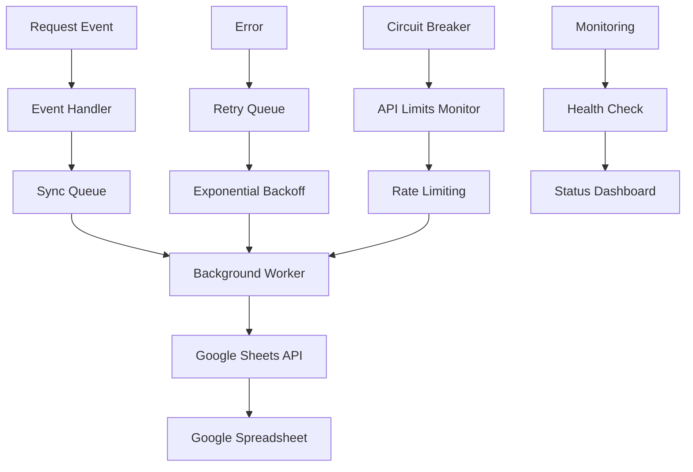

# TASK 2.16: GOOGLE SHEETS REAL-TIME СИНХРОНИЗАЦИЯ

## 📋 **ОБЩАЯ ИНФОРМАЦИЯ**

**Задача:** Google Sheets Real-time синхронизация  
**Статус:** ✅ ПЛАНИРОВАНИЕ ЗАВЕРШЕНО  
**Сложность:** Level 3 (Feature Development)  
**Время:** 2-3 недели  
**Приоритет:** 🥇 ВЫСОКИЙ  
**Создана:** Декабрь 2024  

## 🎯 **ЦЕЛЬ ЗАДАЧИ**

Реализовать полную синхронизацию всех заявок и их статусов с Google Sheets в режиме реального времени с автоматическим обновлением при любых изменениях.

### **Ключевые требования:**
- ✅ Автоматическое создание заявок в таблице
- ✅ Мгновенное обновление статусов (< 30 секунд)
- ✅ Синхронизация комментариев и дополнительной информации
- ✅ Надежная обработка ошибок и retry логика
- ✅ Мониторинг состояния синхронизации

## 🏗️ **ВЫБРАННАЯ АРХИТЕКТУРА**

### **Queue-based Sync Architecture**
Выбрана надежная асинхронная синхронизация через очередь с retry логикой и circuit breaker.



### **Компоненты системы:**

#### **1. Event Handler (Обработчик событий)**
```python
class SheetsEventHandler:
    """Обработчик событий для синхронизации с Google Sheets"""
    
    async def handle_request_created(self, request: Request):
        """Обработка создания заявки"""
        sync_task = SyncTask(
            type="create",
            request_id=request.id,
            data=request.to_dict(),
            priority="high"
        )
        await self.queue.put(sync_task)
    
    async def handle_request_updated(self, request: Request, changes: dict):
        """Обработка обновления заявки"""
        sync_task = SyncTask(
            type="update",
            request_id=request.id,
            data=changes,
            priority="medium"
        )
        await self.queue.put(sync_task)
```

#### **2. Sync Queue (Очередь синхронизации)**
```python
class SyncQueue:
    """Очередь для задач синхронизации"""
    
    def __init__(self, redis_client=None):
        self.redis = redis_client
        self.in_memory_queue = asyncio.Queue()
    
    async def put(self, task: SyncTask):
        """Добавление задачи в очередь"""
        if self.redis:
            await self.redis.lpush("sheets_sync_queue", task.to_json())
        else:
            await self.in_memory_queue.put(task)
    
    async def get(self) -> SyncTask:
        """Получение задачи из очереди"""
        if self.redis:
            data = await self.redis.brpop("sheets_sync_queue", timeout=1)
            return SyncTask.from_json(data[1])
        else:
            return await self.in_memory_queue.get()
```

#### **3. Background Worker (Фоновый обработчик)**
```python
class SheetsSyncWorker:
    """Фоновый обработчик синхронизации"""
    
    def __init__(self, sheets_service: SheetsService, queue: SyncQueue):
        self.sheets_service = sheets_service
        self.queue = queue
        self.circuit_breaker = CircuitBreaker()
        self.rate_limiter = RateLimiter()
    
    async def start(self):
        """Запуск обработчика"""
        while True:
            try:
                task = await self.queue.get()
                await self.process_task(task)
            except Exception as e:
                logger.error(f"Error processing sync task: {e}")
                await asyncio.sleep(1)
    
    async def process_task(self, task: SyncTask):
        """Обработка задачи синхронизации"""
        if not self.circuit_breaker.is_closed():
            await self.queue.put(task)  # Вернуть в очередь
            return
        
        try:
            await self.rate_limiter.wait_if_needed()
            
            if task.type == "create":
                await self.sheets_service.create_request_in_sheets(task.data)
            elif task.type == "update":
                await self.sheets_service.update_request_in_sheets(task.request_id, task.data)
            
            self.circuit_breaker.on_success()
            
        except Exception as e:
            self.circuit_breaker.on_error()
            await self.handle_error(task, e)
```

#### **4. Circuit Breaker (Предохранитель)**
```python
class CircuitBreaker:
    """Предохранитель для защиты от API лимитов"""
    
    def __init__(self, failure_threshold=5, recovery_timeout=60):
        self.failure_threshold = failure_threshold
        self.recovery_timeout = recovery_timeout
        self.failure_count = 0
        self.last_failure_time = None
        self.state = "CLOSED"  # CLOSED, OPEN, HALF_OPEN
    
    def is_closed(self) -> bool:
        """Проверка, можно ли выполнять операции"""
        if self.state == "CLOSED":
            return True
        elif self.state == "OPEN":
            if time.time() - self.last_failure_time > self.recovery_timeout:
                self.state = "HALF_OPEN"
                return True
            return False
        return True  # HALF_OPEN
    
    def on_success(self):
        """Успешная операция"""
        self.failure_count = 0
        self.state = "CLOSED"
    
    def on_error(self):
        """Ошибка операции"""
        self.failure_count += 1
        self.last_failure_time = time.time()
        
        if self.failure_count >= self.failure_threshold:
            self.state = "OPEN"
```

## 📊 **СТРУКТУРА ДАННЫХ GOOGLE SHEETS**

### **Лист "Заявки" (Requests)**
```yaml
Колонки:
  A: ID заявки (Request ID)
  B: Дата создания (Created At)
  C: Статус (Status)
  D: Категория (Category)
  E: Адрес (Address)
  F: Описание (Description)
  G: Срочность (Urgency)
  H: Заявитель ID (Applicant ID)
  I: Заявитель имя (Applicant Name)
  J: Исполнитель ID (Executor ID)
  K: Исполнитель имя (Executor Name)
  L: Дата назначения (Assigned At)
  M: Дата выполнения (Completed At)
  N: Комментарии (Comments)
  O: Фото ссылки (Photo URLs)
  P: Последнее обновление (Last Updated)
  Q: История изменений (Change History)
```

### **Лист "Статистика" (Statistics)**
```yaml
Колонки:
  A: Метрика (Metric)
  B: Значение (Value)
  C: Дата (Date)
  D: Время (Time)
  
Строки:
  - Синхронизировано заявок сегодня
  - Ошибок синхронизации сегодня
  - Среднее время синхронизации
  - Статус последней синхронизации
  - API лимиты использовано
```

## 📈 **ПЛАН РЕАЛИЗАЦИИ**

### **ФАЗА 1: ПОДГОТОВКА И БАЗОВАЯ ИНТЕГРАЦИЯ** (Неделя 1)

#### **День 1-2: Настройка окружения и API**
- [ ] Task 2.16.1: Настройка Google Sheets API credentials
- [ ] Task 2.16.2: Создание базового SheetsService
- [ ] Task 2.16.3: Тестирование подключения к Google Sheets

#### **День 3-4: Базовая синхронизация**
- [ ] Task 2.16.4: Реализация sync_request_to_sheets()
- [ ] Task 2.16.5: Реализация update_request_status()
- [ ] Task 2.16.6: Создание структуры таблицы

#### **День 5-7: Интеграция с существующими сервисами**
- [ ] Task 2.16.7: Интеграция с RequestService
- [ ] Task 2.16.8: Добавление event handlers
- [ ] Task 2.16.9: Тестирование базовой синхронизации

### **ФАЗА 2: РЕЖИМ РЕАЛЬНОГО ВРЕМЕНИ** (Неделя 2)

#### **День 8-10: Background Worker**
- [ ] Task 2.16.10: Создание SheetsSyncWorker
- [ ] Task 2.16.11: Реализация очереди синхронизации
- [ ] Task 2.16.12: Retry логика для ошибок

#### **День 11-12: Мониторинг и логирование**
- [ ] Task 2.16.13: Добавление мониторинга синхронизации
- [ ] Task 2.16.14: Structured logging для Google Sheets
- [ ] Task 2.16.15: Health check для синхронизации

#### **День 13-14: Обработка ошибок**
- [ ] Task 2.16.16: Обработка различных типов ошибок
- [ ] Task 2.16.17: Fallback механизмы
- [ ] Task 2.16.18: Уведомления об ошибках синхронизации

### **ФАЗА 3: ОПТИМИЗАЦИЯ И ТЕСТИРОВАНИЕ** (Неделя 3)

#### **День 15-17: Оптимизация производительности**
- [ ] Task 2.16.19: Оптимизация API вызовов
- [ ] Task 2.16.20: Batch операции для множественных обновлений
- [ ] Task 2.16.21: Кэширование для уменьшения API вызовов

#### **День 18-19: Комплексное тестирование**
- [ ] Task 2.16.22: Unit тесты для SheetsService
- [ ] Task 2.16.23: Integration тесты с Google Sheets API
- [ ] Task 2.16.24: Load тестирование синхронизации

#### **День 20-21: Документация и развертывание**
- [ ] Task 2.16.25: Документация по настройке Google Sheets
- [ ] Task 2.16.26: Инструкции по развертыванию
- [ ] Task 2.16.27: Production конфигурация

## 🎯 **КРИТЕРИИ ПРИЕМКИ**

### **Функциональные критерии:**
- [ ] Все новые заявки автоматически появляются в Google Sheets
- [ ] Все изменения статусов отражаются в таблице в течение 30 секунд
- [ ] Все комментарии и дополнительная информация синхронизируются
- [ ] Система корректно обрабатывает ошибки сети и API

### **Производительность:**
- [ ] Время синхронизации < 30 секунд для 95% случаев
- [ ] Система выдерживает до 100 одновременных изменений
- [ ] API лимиты Google Sheets не превышаются

### **Надежность:**
- [ ] 99.9% успешность синхронизации
- [ ] Автоматическое восстановление после ошибок
- [ ] Мониторинг и алерты работают корректно

### **Безопасность:**
- [ ] Credentials хранятся безопасно
- [ ] Sensitive данные не попадают в логи
- [ ] API ключи ротируются регулярно

## 🔧 **КОНФИГУРАЦИЯ**

### **Переменные окружения:**
```env
# Google Sheets Real-time Sync
GOOGLE_SHEETS_SYNC_ENABLED=true
GOOGLE_SHEETS_CREDENTIALS_FILE=/path/to/credentials.json
GOOGLE_SHEETS_SPREADSHEET_ID=your_spreadsheet_id
GOOGLE_SHEETS_SYNC_INTERVAL=30
GOOGLE_SHEETS_MAX_RETRIES=3
GOOGLE_SHEETS_RETRY_DELAY=60
```

### **Обработка ошибок:**
```python
ERROR_STRATEGIES = {
    "network_error": {
        "retry_count": 3,
        "backoff_multiplier": 2,
        "max_delay": 300,  # 5 минут
        "action": "retry"
    },
    "api_limit_exceeded": {
        "retry_count": 5,
        "backoff_multiplier": 3,
        "max_delay": 600,  # 10 минут
        "action": "retry_with_backoff"
    },
    "authentication_error": {
        "retry_count": 1,
        "action": "notify_admin"
    },
    "validation_error": {
        "retry_count": 0,
        "action": "log_and_skip"
    }
}
```

## 📊 **МОНИТОРИНГ И МЕТРИКИ**

### **Ключевые метрики:**
```python
METRICS = {
    "sync_success_rate": "Процент успешных синхронизаций",
    "sync_duration": "Время синхронизации",
    "queue_size": "Размер очереди синхронизации",
    "error_rate": "Частота ошибок",
    "api_usage": "Использование API лимитов",
    "circuit_breaker_state": "Состояние предохранителя"
}
```

### **Health Check:**
```python
async def health_check() -> dict:
    """Проверка состояния синхронизации"""
    return {
        "status": "healthy" if queue_size < 100 and error_rate < 0.01 else "degraded",
        "queue_size": queue_size,
        "error_rate": error_rate,
        "last_sync": last_sync_time,
        "circuit_breaker": circuit_breaker.state
    }
```

## 🚀 **СЛЕДУЮЩИЕ ШАГИ**

1. **Утверждение технической спецификации**
2. **Настройка Google Sheets API credentials**
3. **Создание тестовой таблицы**
4. **Начало разработки базового SheetsService**
5. **Реализация queue-based синхронизации**

## 📄 **ДОКУМЕНТАЦИЯ**

### **Связанные документы:**
- **CREATIVE документ:** Детальный архитектурный дизайн
- **PLAN документ:** Поэтапный план реализации
- **Техническая спецификация:** Готова к реализации

### **Статус документации:**
- ✅ Архитектурный дизайн завершен
- ✅ План реализации детализирован
- ✅ Техническая спецификация готова
- ✅ Критерии приемки определены

---

**Task 2.16 готова к реализации!** 🎯
