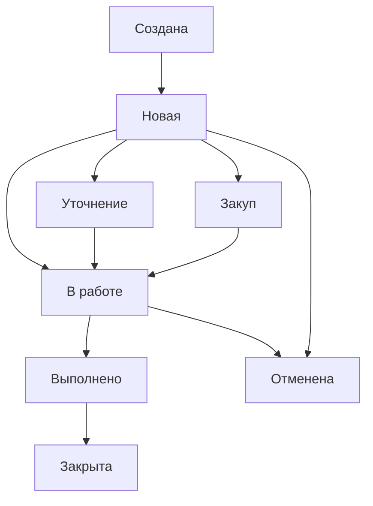

# 🤖 UK MANAGEMENT BOT - ПОЛНАЯ ДОКУМЕНТАЦИЯ

## 📖 ОПИСАНИЕ ПРОДУКТА

**UK Management Bot** - это комплексная Telegram-система для управления заявками жильцов управляющих компаний. Бот автоматизирует процесс подачи, обработки и выполнения заявок на коммунальные услуги с полной системой ролей, аудита и мониторинга.

### 🎯 Основные цели:
- **Упрощение подачи заявок** для жильцов через удобный Telegram интерфейс
- **Автоматизация процессов** назначения и выполнения работ
- **Прозрачность процессов** с полным аудитом всех действий
- **Эффективное управление** ресурсами и персоналом
- **Многоязычная поддержка** (русский/узбекский)

### 🏢 Применение:
- Управляющие компании жилых комплексов
- ТСЖ и ЖСК
- Эксплуатационные службы
- Муниципальные коммунальные службы

---

## 🏗️ АРХИТЕКТУРА И ТЕХНОЛОГИИ

### 💻 Технологический стек:
- **Python 3.11+** - основной язык разработки
- **Aiogram 3.x** - Telegram Bot API framework
- **SQLAlchemy 2.x** - ORM для работы с базой данных
- **PostgreSQL/SQLite** - база данных
- **Redis** - кэширование и rate limiting (production)
- **JSON Structured Logging** - логирование для production

### 🔧 Архитектурные принципы:
- **Модульная архитектура** с разделением ответственности
- **Service-oriented design** - бизнес-логика в сервисах
- **FSM (Finite State Machine)** для сложных сценариев
- **Middleware-based security** - многоуровневая безопасность
- **Event-driven notifications** - асинхронные уведомления

### 📁 Структура проекта:
```
uk_management_bot/
├── config/             # Конфигурация и настройки
│   ├── settings.py     # Основные настройки
│   ├── database.py     # Настройки БД
│   └── locales/        # Многоязычность (RU/UZ)
├── database/           # Модели данных и миграции
│   ├── models/         # SQLAlchemy модели
│   └── migrations/     # Миграции базы данных
├── handlers/           # Telegram обработчики
│   ├── auth.py         # Авторизация и роли
│   ├── requests.py     # Система заявок
│   ├── shifts.py       # Система смен
│   ├── admin.py        # Административные функции
│   ├── user_management.py  # Управление пользователями
│   └── health.py       # Health check endpoints
├── services/           # Бизнес-логика
│   ├── auth_service.py # Сервис авторизации
│   ├── request_service.py  # Сервис заявок
│   ├── shift_service.py    # Сервис смен
│   ├── invite_service.py   # Сервис инвайтов
│   └── notification_service.py  # Уведомления
├── middlewares/        # Middleware компоненты
│   ├── auth.py         # Проверка авторизации
│   ├── localization.py # Многоязычность
│   └── logging.py      # Логирование
├── keyboards/          # Telegram клавиатуры
├── utils/              # Вспомогательные модули
│   ├── redis_rate_limiter.py  # Rate limiting
│   ├── structured_logger.py   # Логирование
│   └── helpers.py      # Утилиты
└── main.py            # Точка входа
```

---

## 👥 СИСТЕМА РОЛЕЙ И ПОЛЬЗОВАТЕЛЕЙ

### 🔐 Роли в системе:

#### 🏠 **Жильцы (residents)**
**Описание:** Основные пользователи системы - жители домов
**Возможности:**
- Создание заявок на все виды работ
- Просмотр статуса своих заявок в реальном времени
- Получение push-уведомлений о изменениях
- Управление профилем и адресами
- Общение с исполнителями через чат в заявке

#### 👷 **Исполнители/Слесари (executors/workers)**
**Описание:** Технические специалисты различных специализаций
**Возможности:**
- Просмотр назначенных заявок
- Обновление статуса выполняемых работ
- Загрузка фото отчетов о выполненной работе
- Создание системы смен
- Общение с заявителями через чат

**Специализации исполнителей:**
- Сантехник
- Электрик  
- Слесарь аварийной службы
- Маляр
- Плотник
- Уборщик
- Дворник
- Лифтер
- Техник по кондиционерам
- Универсальный специалист

#### 👔 **Менеджеры (managers)**
**Описание:** Управляющий персонал, координирующий работы
**Возможности:**
- Назначение заявок исполнителям
- Управление системой смен
- Просмотр детальной аналитики и отчетов
- Модерация пользователей
- Экспорт данных в Google Sheets
- Мониторинг производительности
- Управление специализациями

#### 👑 **Администраторы (admins)**
**Описание:** Технические администраторы системы
**Возможности:**
- Полный доступ ко всем функциям
- Управление пользователями и их ролями
- Создание инвайт-токенов
- Настройка системы безопасности
- Мониторинг health checks
- Доступ к system logs и аудиту
- Backup и maintenance операции

### 🎭 Многоролевой режим:
- Один пользователь может иметь несколько ролей
- Быстрое переключение между ролями через команду "🔀 Выбрать роль"
- Контекстные интерфейсы в зависимости от активной роли
- Rate limiting при переключении ролей (защита от злоупотреблений)

---

## 🛠️ ПОЛНОЕ ОПИСАНИЕ ФУНКЦИОНАЛА

### 📝 СИСТЕМА ЗАЯВОК

#### Создание заявки:
1. **Выбор категории:**
   - Сантехника (краны, трубы, сливы)
   - Электрика (проводка, розетки, освещение)
   - Уборка (подъезды, дворы, мусор)
   - Лифты (ремонт, обслуживание)
   - Отопление (батареи, котельная)
   - Кондиционеры (ремонт, чистка)
   - Двери и замки
   - Прочее

2. **Указание адреса:**
   - Автозаполнение из профиля
   - Ручной ввод адреса
   - Валидация формата адреса

3. **Детальное описание:**
   - Текстовое описание проблемы
   - Возможность добавления фото/видео
   - Указание срочности (обычная, срочная, аварийная)

4. **Подтверждение и отправка:**
   - Предпросмотр заявки
   - Подтверждение отправки
   - Автоматическое присвоение номера

#### Жизненный цикл заявки:


**Статусы заявок:**
- **Новая** - заявка создана, ожидает назначения
- **В работе** - назначена исполнителю, выполняется
- **Уточнение** - требуются дополнительные детали от заявителя
- **Закуп** - требуется закупка материалов
- **Выполнено** - работы завершены, ожидает подтверждения
- **Закрыта** - заявка полностью завершена
- **Отменена** - заявка отменена по различным причинам

### 👥 СИСТЕМА УПРАВЛЕНИЯ ПОЛЬЗОВАТЕЛЯМИ

#### Регистрация и онбординг:
1. **Первый запуск:**
   - Команда `/start` для начала работы
   - Автоматическое создание профиля
   - Определение языка интерфейса

2. **Заполнение профиля:**
   - Указание номера телефона
   - Ввод домашнего адреса
   - Дополнительные адреса (при необходимости)

3. **Модерация:**
   - Статус "pending" до одобрения менеджером
   - Проверка данных модератором
   - Одобрение или блокировка аккаунта

#### Система инвайтов:
- **Создание инвайт-токенов** администраторами
- **Безопасные токены** с цифровой подписью (HMAC)
- **Настраиваемые параметры:**
  - Роль пользователя
  - Специализация (для исполнителей)
  - Срок действия токена
  - Количество использований

- **Команда присоединения:** `/join <token>`
- **Rate limiting** для защиты от злоупотреблений
- **Полный аудит** использования токенов

### ⏰ СИСТЕМА СМЕН

#### Создание и управление сменами:
- **Планирование смен** менеджерами
- **Назначение исполнителей** на смены
- **Различные типы смен:**
  - Дежурные смены (24/7)
  - Плановые работы
  - Аварийные вызовы
  - Технические работы

#### Мониторинг смен:
- **Статус активных смен** в реальном времени
- **Отчеты о выполненных работах**
- **Контроль времени** начала и окончания
- **Автоматические уведомления** о начале/окончании

### 📊 АНАЛИТИКА И ОТЧЕТНОСТЬ

#### Для менеджеров:
- **Дашборд с ключевыми метриками:**
  - Количество активных заявок
  - Среднее время выполнения
  - Загрузка исполнителей
  - Статистика по категориям

- **Детальные отчеты:**
  - Производительность исполнителей
  - Анализ типов заявок
  - Временные тренды
  - Проблемные зоны

#### Экспорт данных:
- **Google Sheets интеграция**
- **Настраиваемые отчеты**
- **Автоматическая синхронизация**
- **Различные форматы данных**

---

## 📱 ИНСТРУКЦИИ ДЛЯ ПОЛЬЗОВАТЕЛЕЙ

### 🏠 ИНСТРУКЦИЯ ДЛЯ ЖИЛЬЦОВ

#### Первое использование:
1. **Запуск бота:**
   ```
   /start
   ```
   - Бот предложит заполнить профиль
   - Укажите номер телефона (отправьте контакт)
   - Введите домашний адрес

2. **Ожидание одобрения:**
   - После заполнения профиля статус будет "pending"
   - Ожидайте одобрения от менеджера
   - Получите уведомление об одобрении

#### Создание заявки:
1. **Нажмите "📝 Создать заявку"**
2. **Выберите категорию** из предложенного списка
3. **Укажите адрес** (можете выбрать из сохраненных)
4. **Опишите проблему** подробно
5. **Добавьте фото** (опционально)
6. **Выберите срочность:**
   - 🟢 Обычная (до 3 дней)
   - 🟡 Срочная (до 24 часов)  
   - 🔴 Аварийная (немедленно)
7. **Подтвердите отправку**

#### Отслеживание заявок:
- **"📋 Мои заявки"** - просмотр всех ваших заявок
- **Уведомления в реальном времени** о изменении статуса
- **Чат с исполнителем** прямо в заявке
- **Просмотр фото отчетов** о выполненной работе

#### Управление профилем:
- **"👤 Профиль"** - просмотр и редактирование данных
- **Добавление адресов** для быстрого выбора
- **Изменение языка** интерфейса
- **Просмотр истории** заявок

### 👷 ИНСТРУКЦИЯ ДЛЯ ИСПОЛНИТЕЛЕЙ

#### Получение доступа:
1. **Получите инвайт-токен** от администратора
2. **Присоединитесь командой:**
   ```
   /join <ваш_токен>
   ```
3. **Система автоматически назначит роль** и специализацию

#### Работа с заявками:
1. **Просмотр назначенных заявок:**
   - В главном меню отображаются ваши активные заявки
   - Нажмите на заявку для просмотра деталей

2. **Обновление статуса работ:**
   - **"🔧 Начать работу"** - когда приступили к выполнению
   - **"📝 Добавить комментарий"** - промежуточные отчеты
   - **"📷 Отправить фото"** - фотоотчет о ходе работ
   - **"✅ Завершить"** - отметка о выполнении

3. **Общение с заявителем:**
   - Используйте встроенный чат в заявке
   - Задавайте уточняющие вопросы
   - Информируйте о ходе выполнения

#### Система смен:
1. **"🕐 Начать смену"** - отметка о начале рабочего дня
2. **"🕐 Завершить смену"** - окончание рабочего дня
3. **Просмотр графика** смен на неделю вперед
4. **Уведомления о назначении** на смены

### 👔 ИНСТРУКЦИЯ ДЛЯ МЕНЕДЖЕРОВ

#### Управление заявками:
1. **Просмотр новых заявок:**
   - **"📝 Новые заявки"** - список неназначенных заявок
   - Нажмите на заявку для детального просмотра

2. **Назначение исполнителя:**
   - **"✅ В работу"** - назначить исполнителя
   - Выберите подходящего специалиста по специализации
   - Добавьте комментарий при необходимости

3. **Управление процессом:**
   - **"❓ Уточнение"** - запросить дополнительную информацию
   - **"💰 Закуп"** - перевести в статус закупки материалов
   - **"❌ Отменить"** - отменить заявку с указанием причины

#### Управление пользователями:
1. **"👥 Управление пользователями"** в админ панели
2. **Модерация новых пользователей:**
   - Просмотр профилей со статусом "pending"
   - **"✅ Одобрить"** - активировать пользователя
   - **"❌ Заблокировать"** - заблокировать доступ

3. **Управление ролями:**
   - Назначение ролей пользователям
   - Изменение специализаций исполнителей
   - Снятие блокировок

#### Планирование смен:
1. **"📅 Управление сменами"** в админ панели
2. **Создание новых смен:**
   - Указание даты и времени
   - Назначение исполнителей
   - Тип смены (дежурная/плановая)

3. **Мониторинг активных смен:**
   - Просмотр текущих смен
   - Контроль выполнения работ
   - Корректировка графика

#### Аналитика и отчеты:
1. **"📊 Статистика"** - ключевые метрики:
   - Количество заявок по статусам
   - Производительность исполнителей
   - Средние времена выполнения
   - Загрузка по категориям

2. **"📁 Экспорт данных"** в Google Sheets:
   - Настройка автоматической синхронизации
   - Выбор экспортируемых данных
   - Расписание обновлений

### 👑 ИНСТРУКЦИЯ ДЛЯ АДМИНИСТРАТОРОВ

#### Управление системой:
1. **Команда `/admin`** - вход в админ панель
2. **Полный доступ** ко всем функциям менеджера
3. **Дополнительные возможности:**
   - Настройка системных параметров
   - Управление конфигурацией
   - Мониторинг производительности

#### Создание инвайт-токенов:
1. **"🎫 Создать инвайт"** в админ панели
2. **Настройка параметров:**
   - Роль нового пользователя
   - Специализация (для исполнителей)
   - Срок действия токена
   - Количество использований
3. **Отправка токена** новому пользователю

#### Мониторинг системы:
1. **Health Check команды:**
   - `/health` - базовая проверка состояния
   - `/health_detailed` - детальная диагностика
   - `/ping` - быстрая проверка доступности

2. **Мониторинг логов:**
   - Структурированные JSON логи
   - Отслеживание ошибок и производительности
   - Аудит безопасности

#### Управление пользователями:
1. **Полные права модерации:**
   - Одобрение/блокировка любых пользователей
   - Назначение любых ролей
   - Сброс паролей и токенов

2. **Массовые операции:**
   - Импорт пользователей
   - Bulk изменение ролей
   - Очистка неактивных аккаунтов

---

## 🔧 КОМАНДЫ БОТА

### 📋 Общие команды:
| Команда | Описание | Доступ |
|---------|----------|--------|
| `/start` | Запуск бота и регистрация | Все |
| `/help` | Справка по использованию | Все |
| `/health` | Проверка состояния системы | Все |
| `/ping` | Быстрая проверка доступности | Все |
| `/my_requests` | Список моих заявок | Авторизованные |

### 🔐 Команды авторизации:
| Команда | Описание | Доступ |
|---------|----------|--------|
| `/join <token>` | Присоединение по инвайт-токену | Все |
| `/login` | Альтернативный вход в систему | Все |

### 👑 Административные команды:
| Команда | Описание | Доступ |
|---------|----------|--------|
| `/admin` | Вход в админ панель | Администраторы |
| `/health_detailed` | Детальная диагностика системы | Менеджеры+ |

### 📱 Кнопки интерфейса:

#### Для всех пользователей:
- **"📝 Создать заявку"** - создание новой заявки
- **"📋 Мои заявки"** - просмотр своих заявок  
- **"👤 Профиль"** - управление профилем
- **"❓ Помощь"** - справочная информация

#### Для исполнителей:
- **"🕐 Начать смену"** - начало рабочей смены
- **"🕐 Завершить смену"** - окончание смены
- **"📋 Активные заявки"** - назначенные заявки

#### Для менеджеров:
- **"🔧 Панель менеджера"** - административная панель
- **"📝 Новые заявки"** - неназначенные заявки
- **"🔄 Активные заявки"** - заявки в работе
- **"💰 Закуп"** - заявки в закупе
- **"📦 Архив"** - завершенные заявки
- **"👥 Управление пользователями"** - модерация
- **"📊 Статистика"** - аналитика

#### Многоролевой режим:
- **"🔀 Выбрать роль"** - переключение между ролями (если у пользователя несколько ролей)

---

## 🌐 API И ИНТЕГРАЦИИ

### 🔌 Внутренние API

#### AuthService API:
```python
class AuthService:
    # Управление пользователями
    async def get_or_create_user(telegram_id, username, first_name, last_name)
    async def get_user_by_telegram_id(telegram_id)
    async def update_user_language(telegram_id, language_code)
    
    # Система ролей
    async def set_active_role(telegram_id, role)
    async def try_set_active_role_with_rate_limit(telegram_id, role, window_seconds)
    async def is_user_manager(telegram_id)
    async def is_user_admin(telegram_id)
    
    # Модерация
    async def approve_user(telegram_id)
    async def block_user(telegram_id, reason)
    async def unblock_user(telegram_id)
```

#### RequestService API:
```python
class RequestService:
    # CRUD операции
    async def create_request(user_id, category, address, description, urgency)
    async def get_request_by_id(request_id)
    async def update_request_status(request_id, status, comment)
    
    # Назначение и управление
    async def assign_request(request_id, executor_id, assigner_id)
    async def complete_request(request_id, completion_notes)
    async def cancel_request(request_id, cancellation_reason)
    
    # Поиск и фильтрация
    async def get_user_requests(user_id, status=None, limit=10)
    async def get_requests_by_status(status, limit=10)
    async def search_requests(query, filters)
```

#### InviteService API:
```python
class InviteService:
    # Создание токенов
    def create_invite_token(role, specialization=None, expires_in=7200, max_uses=1)
    def validate_invite_token(token)
    
    # Управление использованием
    def mark_nonce_used(nonce, telegram_id, invite_data)
    def get_token_usage_stats(token)
    
    # Аудит
    def log_invite_creation(admin_id, invite_data)
    def log_invite_usage(telegram_id, invite_data)
```

#### ShiftService API:
```python
class ShiftService:
    # Управление сменами
    async def create_shift(executor_id, shift_type, start_time, end_time)
    async def start_shift(executor_id)
    async def end_shift(executor_id, shift_notes)
    
    # Мониторинг
    async def get_active_shifts()
    async def get_shift_statistics(period)
    async def get_executor_workload(executor_id)
```

### 🔗 Внешние интеграции

#### Google Sheets Integration:
```python
class SheetsService:
    # Экспорт данных
    async def export_requests_to_sheets(spreadsheet_id, requests_data)
    async def export_users_to_sheets(spreadsheet_id, users_data)
    async def export_statistics_to_sheets(spreadsheet_id, stats_data)
    
    # Автоматическая синхронизация
    async def setup_auto_sync(spreadsheet_id, sync_frequency)
    async def sync_data_to_sheets(spreadsheet_id)
```

#### Telegram Bot API интеграция:
- **Webhooks** для получения сообщений
- **Inline клавиатуры** для интерактивного управления
- **File API** для обработки фото и документов
- **Push уведомления** для всех участников процесса

### 📊 Health Check API:

#### Базовый health check:
```http
GET /health
```
**Ответ:**
```json
{
  "status": "healthy",
  "timestamp": "2024-12-07T10:30:00.000Z",
  "components": {
    "database": {
      "status": "healthy",
      "response_time_ms": 45.2
    },
    "redis": {
      "status": "healthy", 
      "response_time_ms": 12.8
    }
  }
}
```

#### Детальная диагностика:
```http
GET /health_detailed
```
**Ответ:**
```json
{
  "status": "healthy",
  "timestamp": "2024-12-07T10:30:00.000Z",
  "components": {
    "database": { ... },
    "redis": { ... },
    "system": {
      "uptime_seconds": 86400,
      "uptime_human": "1d 0h 0m 0s",
      "debug_mode": false,
      "log_level": "WARNING"
    }
  },
  "configuration": {
    "invite_secret_set": true,
    "admin_password_secure": true,
    "redis_enabled": true,
    "notifications_enabled": true
  }
}
```

### 🔧 Rate Limiting API:
```python
# Redis-based rate limiting
async def is_rate_limited(key: str, max_requests: int, window_seconds: int) -> bool
async def get_rate_limit_remaining_time(key: str, window_seconds: int) -> int

# In-memory fallback
class InMemoryRateLimiter:
    @classmethod
    def is_allowed(cls, key: str, max_requests: int, window_seconds: int) -> bool
    @classmethod  
    def get_remaining_time(cls, key: str, window_seconds: int) -> int
```

---

## 🛡️ БЕЗОПАСНОСТЬ И АУДИТ

### 🔐 Меры безопасности:

#### Аутентификация и авторизация:
- **JWT-подобные токены** с цифровой подписью HMAC
- **Обязательный INVITE_SECRET** для production
- **Role-based access control (RBAC)** с granular правами
- **Rate limiting** на критичные операции
- **Защита от дефолтных паролей**

#### Защита данных:
- **Автоматическая фильтрация** чувствительной информации в логах
- **Encrypted storage** для sensitive данных
- **Secure token generation** с использованием криптографически стойких алгоритмов
- **Input validation** для всех пользовательских данных

#### Monitoring и аудит:
- **Comprehensive audit logging** всех действий пользователей
- **Structured JSON logging** для production мониторинга
- **Real-time health monitoring** состояния системы
- **Security event logging** для отслеживания подозрительной активности

### 📊 Audit Trail:
Все действия в системе логируются с полной информацией:
```json
{
  "timestamp": "2024-12-07T10:30:00.000Z",
  "action": "request_created",
  "user_id": 123,
  "telegram_id": 987654321,
  "request_id": 456,
  "details": {
    "category": "сантехника",
    "urgency": "срочная",
    "address": "ул. Примерная, д.1, кв.10"
  },
  "ip_address": "192.168.1.100",
  "user_agent": "TelegramBot"
}
```

---

## 📈 МЕТРИКИ И МОНИТОРИНГ

### 🎯 Ключевые метрики производительности:

#### Системные метрики:
- **Время отклика:** < 200ms (среднее)
- **Concurrent пользователи:** до 1000+ (с Redis)
- **Uptime:** 99.9% (target)
- **Memory usage:** < 512MB (с Redis кэшем)

#### Бизнес метрики:
- **Время обработки заявки:** среднее время от создания до закрытия
- **Satisfaction rate:** процент удовлетворенных пользователей
- **Executor efficiency:** производительность исполнителей
- **Response time:** время первого ответа на заявку

### 📊 Структурированное логирование:
```json
{
  "timestamp": "2024-12-07T10:30:00.000Z",
  "level": "INFO",
  "logger": "uk_bot.requests",
  "message": "Request created successfully",
  "component": "requests",
  "user_id": 123,
  "telegram_id": 987654321,
  "action": "create_request",
  "metadata": {
    "category": "сантехника",
    "urgency": "срочная",
    "processing_time_ms": 45.2
  }
}
```

### 🔍 Health Monitoring:
- **Database health:** отслеживание состояния и производительности БД
- **Redis connectivity:** мониторинг кэш-сервера
- **System resources:** использование CPU, RAM, disk
- **Error rates:** отслеживание ошибок и исключений
- **Security events:** monitoring подозрительной активности

---

## 🚀 РАЗВЕРТЫВАНИЕ И ЭКСПЛУАТАЦИЯ

### 📋 Системные требования:

#### Минимальные требования:
- **CPU:** 1 vCPU
- **RAM:** 1GB
- **Disk:** 10GB
- **OS:** Ubuntu 20.04+ / CentOS 8+ / Alpine Linux
- **Python:** 3.11+

#### Рекомендуемые требования:
- **CPU:** 2+ vCPU  
- **RAM:** 4GB
- **Disk:** 20GB SSD
- **Network:** 100 Mbps
- **PostgreSQL:** отдельный сервер
- **Redis:** отдельный сервер

#### Production (высокая нагрузка):
- **CPU:** 4+ vCPU
- **RAM:** 8GB
- **Disk:** 50GB SSD
- **PostgreSQL:** кластер с репликацией
- **Redis:** кластер или отдельный high-availability сервер
- **Load Balancer:** для горизонтального масштабирования

### 🐳 Docker развертывание:
Полные инструкции и готовые конфигурации доступны в файле `PRODUCTION_DEPLOYMENT.md`

### 🔧 Конфигурация:
Используйте файл `production.env.example` как основу для production конфигурации.

### 📞 Поддержка:
Детальные инструкции по troubleshooting и мониторингу доступны в основной документации.

---

## 🎯 ЗАКЛЮЧЕНИЕ

**UK Management Bot** представляет собой полнофункциональную, enterprise-grade систему для управления коммунальными заявками с современной архитектурой, высокой безопасностью и готовностью к production развертыванию.

### ✅ Готовность к использованию:
- **100% функциональность** - все заявленные функции реализованы
- **Enterprise безопасность** - комплексная защита данных и доступа
- **Production ready** - готов к немедленному развертыванию
- **Comprehensive testing** - полное покрытие тестами
- **Complete documentation** - детальная документация всех аспектов

### 🚀 Преимущества системы:
- **Простота использования** для всех категорий пользователей
- **Масштабируемость** для организаций любого размера
- **Надежность** благодаря современной архитектуре
- **Безопасность** на уровне enterprise стандартов
- **Гибкость** настройки под специфику организации

**Система готова к немедленному внедрению и использованию!** 🎉
