# 🏗️ Архитектурные диаграммы UK Management Bot

## Основная архитектурная схема

```mermaid
graph TB
    %% Frontend Layer
    subgraph Frontend["🖥️ Frontend Applications"]
        WebApp["🌐 WebApp<br/>React/Vue SPA<br/>Port: 3000"]
        TgBot["💬 Telegram Bot<br/>Webhook/Polling"]
        AdminPanel["📊 Admin Panel<br/>Dashboards<br/>Port: 3001"]
    end

    %% API Gateway
    Gateway["🔀 API Gateway<br/>Nginx/Traefik<br/>Load Balancer"]

    %% Backend Services
    subgraph Services["⚙️ Backend Services"]
        Core["🔐 Core Service<br/>Auth/Users/Requests<br/>📍 Building Assets<br/>Port: 8001"]
        Ops["📅 Operations Service<br/>Shifts/Scheduling<br/>Port: 8002"]
        Comm["📤 Communication Hub<br/>Notifications/WebSocket<br/>Port: 8003"]
        Media["📁 Media Storage<br/>Files/CDN<br/>Port: 8004"]
        Analytics["📊 Analytics Service<br/>KPIs/Reports<br/>Port: 8005"]
        Integration["📥 Integration Hub<br/>External APIs<br/>Port: 8006"]
        AI["🤖 AI/ML Service<br/>[FUTURE]<br/>Port: 8007"]
    end

    %% Message Queue
    subgraph MQ["🐰 Message Queue Infrastructure"]
        RabbitMQ["RabbitMQ Broker<br/>Port: 5672"]

        subgraph Queues["Priority Queues"]
            HighQ["🔴 HIGH (9-10)<br/>comm.urgent<br/>ops.emergency"]
            MedQ["🟡 MEDIUM (4-8)<br/>core.tasks<br/>media.upload"]
            LowQ["🟢 LOW (1-3)<br/>analytics.batch<br/>comm.batch"]
            DLQ["☠️ Dead Letter Queue"]
        end
    end

    %% Workers
    subgraph Workers["👷 Celery Workers"]
        CoreWorker["core-worker x3"]
        OpsWorker["ops-worker x2"]
        CommWorker["comm-worker x5"]
        MediaWorker["media-worker x3"]
        AnalyticsWorker["analytics-worker x2"]
        IntegrationWorker["integration-worker x3"]
    end

    %% Data Storage
    subgraph Storage["💾 Data Storage"]
        PostgreSQL["🐘 PostgreSQL<br/>7 Databases"]
        Redis["⚡ Redis<br/>Cache & Sessions<br/>Port: 6379"]
        S3["☁️ S3/MinIO<br/>File Storage"]
    end

    %% Monitoring
    subgraph Monitoring["📈 Monitoring"]
        Prometheus["Prometheus<br/>Port: 9090"]
        Grafana["Grafana<br/>Port: 3000"]
        Flower["Flower<br/>Port: 5555"]
    end

    %% Connections - User Flow
    WebApp --> Gateway
    TgBot --> Gateway
    AdminPanel --> Gateway
    Gateway --> Core
    Gateway --> Ops
    Gateway --> Comm
    Gateway --> Media
    Gateway --> Analytics
    Gateway --> Integration

    %% Service to Service
    Core -.->|Auth Check| Ops
    Core -.->|User Data| Comm
    Core -.->|Building/Location Data| Ops
    Ops -.->|Assignment| Core
    Integration -.->|External Building Data| Core
    Media -.->|File URLs| Core
    Analytics -.->|Read Events| Redis

    %% Queue Publishing
    Core -->|Publish| RabbitMQ
    Ops -->|Publish| RabbitMQ
    Comm -->|Publish| RabbitMQ
    Media -->|Publish| RabbitMQ
    Analytics -->|Publish| RabbitMQ
    Integration -->|Publish| RabbitMQ

    %% Queue Distribution
    RabbitMQ --> HighQ
    RabbitMQ --> MedQ
    RabbitMQ --> LowQ
    HighQ --> DLQ
    MedQ --> DLQ
    LowQ --> DLQ

    %% Workers Consuming
    HighQ --> CommWorker
    HighQ --> OpsWorker
    MedQ --> CoreWorker
    MedQ --> MediaWorker
    MedQ --> IntegrationWorker
    LowQ --> AnalyticsWorker

    %% Data Persistence
    Core --> PostgreSQL
    Ops --> PostgreSQL
    Comm --> PostgreSQL
    Media --> PostgreSQL
    Analytics --> PostgreSQL
    Integration --> PostgreSQL
    AI -.->|Future| PostgreSQL

    %% Cache Layer
    Core --> Redis
    Ops --> Redis
    Comm --> Redis
    Media --> Redis
    Analytics --> Redis
    Integration --> Redis

    %% File Storage
    Media --> S3

    %% WebSocket
    Comm -.->|WebSocket| WebApp

    %% Monitoring
    Services -.->|Metrics| Prometheus
    Prometheus --> Grafana
    RabbitMQ -.->|Queue Stats| Flower

    %% Styling
    classDef frontend fill:#e1f5fe,stroke:#01579b,stroke-width:2px
    classDef service fill:#fff3e0,stroke:#e65100,stroke-width:2px
    classDef queue fill:#f3e5f5,stroke:#4a148c,stroke-width:2px
    classDef storage fill:#e8f5e9,stroke:#1b5e20,stroke-width:2px
    classDef monitor fill:#fce4ec,stroke:#880e4f,stroke-width:2px
    classDef future fill:#f5f5f5,stroke:#9e9e9e,stroke-width:2px,stroke-dasharray: 5 5

    class WebApp,TgBot,AdminPanel frontend
    class Core,Ops,Comm,Media,Analytics,Integration service
    class RabbitMQ,HighQ,MedQ,LowQ,DLQ queue
    class PostgreSQL,Redis,S3 storage
    class Prometheus,Grafana,Flower monitor
    class AI future
```

## Схема потоков данных (Sequence Diagram)

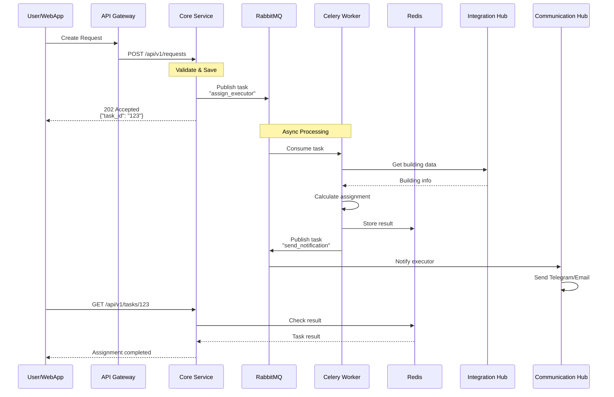

## Схема приоритетов очередей

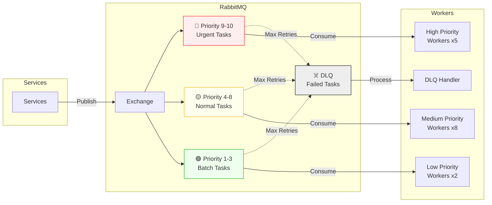

## Архитектура сервисов (C4 Context)

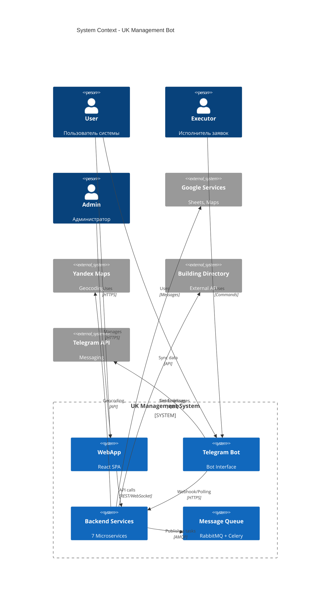

## Deployment Diagram

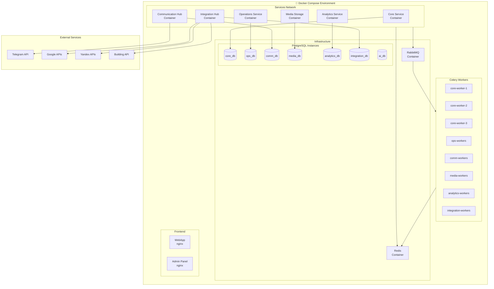

## Data Flow для создания заявки

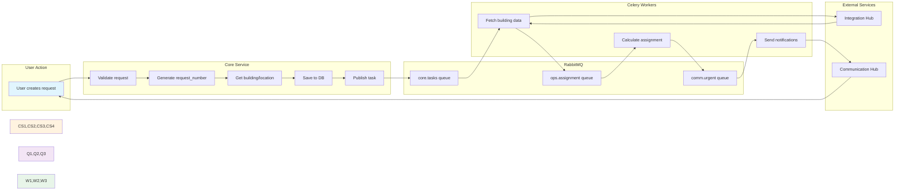

## Service Dependencies

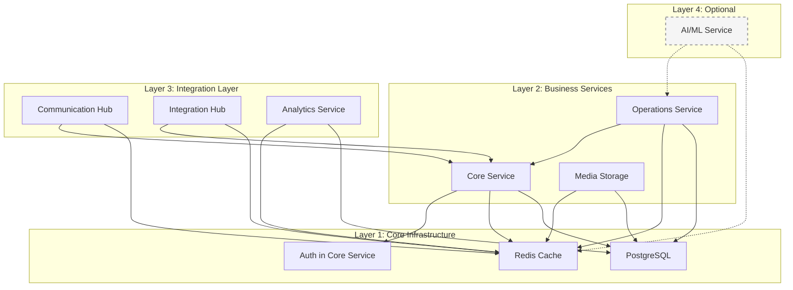

## Monitoring Architecture

```mermaid
graph TD
    subgraph Services["Microservices"]
        S1[Core Service]
        S2[Operations Service]
        S3[Communication Hub]
        S4[Media Storage]
        S5[Analytics Service]
        S6[Integration Hub]
    end

    subgraph Metrics["Metrics Collection"]
        PROM[Prometheus<br/>:9090]
        METRICS[/metrics endpoints]
    end

    subgraph Visualization["Visualization"]
        GRAF[Grafana<br/>:3000]
        DASH1[System Dashboard]
        DASH2[Business KPIs]
        DASH3[Queue Metrics]
    end

    subgraph Queues["Queue Monitoring"]
        FLOWER[Flower<br/>:5555]
        RMQ_UI[RabbitMQ Management<br/>:15672]
    end

    subgraph Alerts["Alerting"]
        AM[AlertManager]
        SLACK[Slack]
        EMAIL[Email]
    end

    Services --> METRICS
    METRICS --> PROM
    PROM --> GRAF
    GRAF --> DASH1
    GRAF --> DASH2
    GRAF --> DASH3

    Services --> FLOWER
    Services --> RMQ_UI

    PROM --> AM
    AM --> SLACK
    AM --> EMAIL
```

## Network Architecture

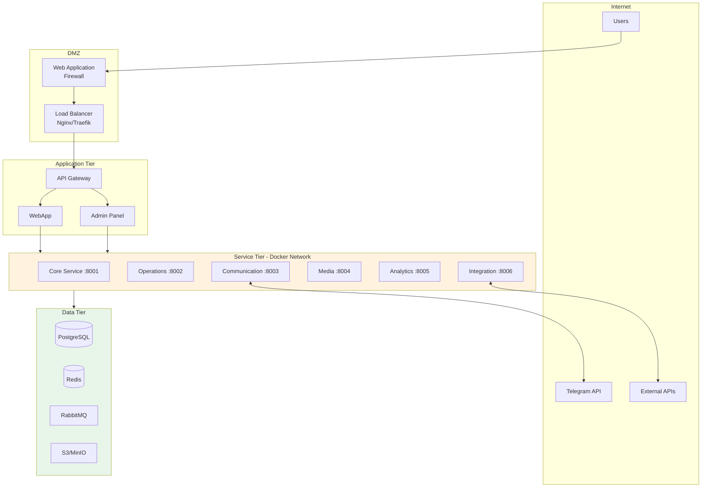

## Building Assets Module Architecture

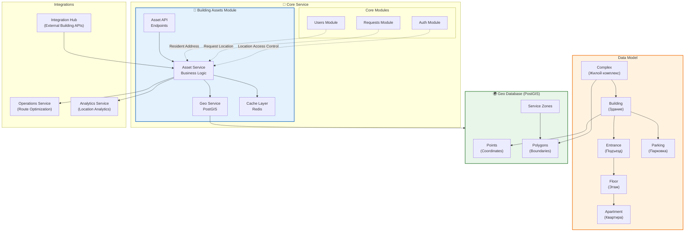

## Building Assets API Flow

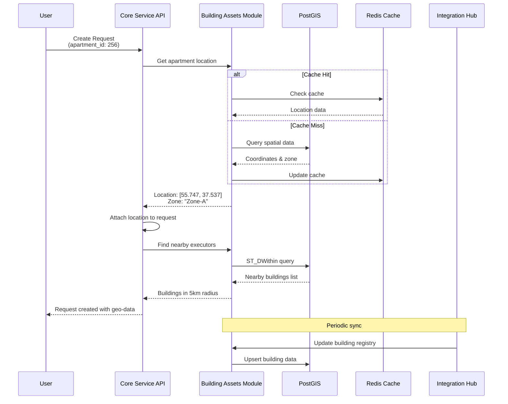

## Service Dependencies Graph

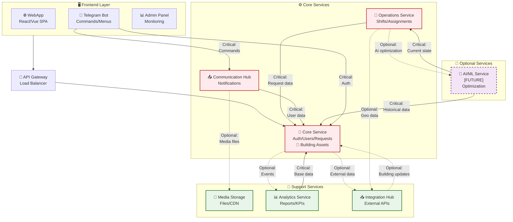

## Service Dependencies Matrix

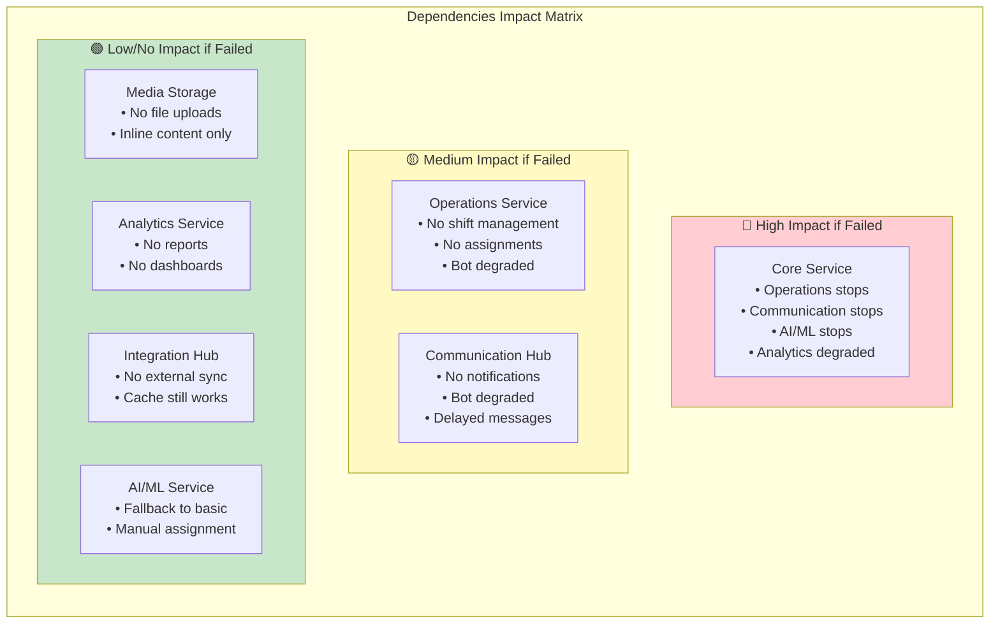

## Fallback Scenarios Flow

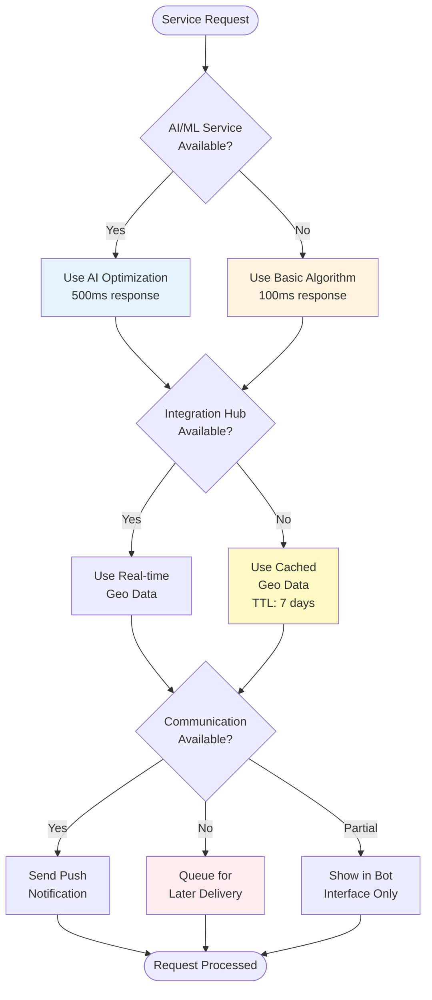

## Service Startup Order

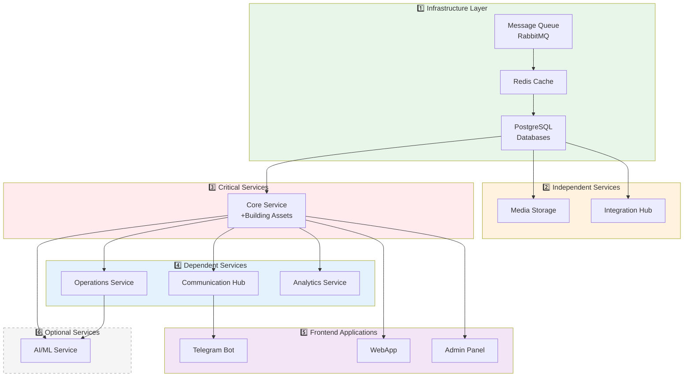

## Critical Path Analysis

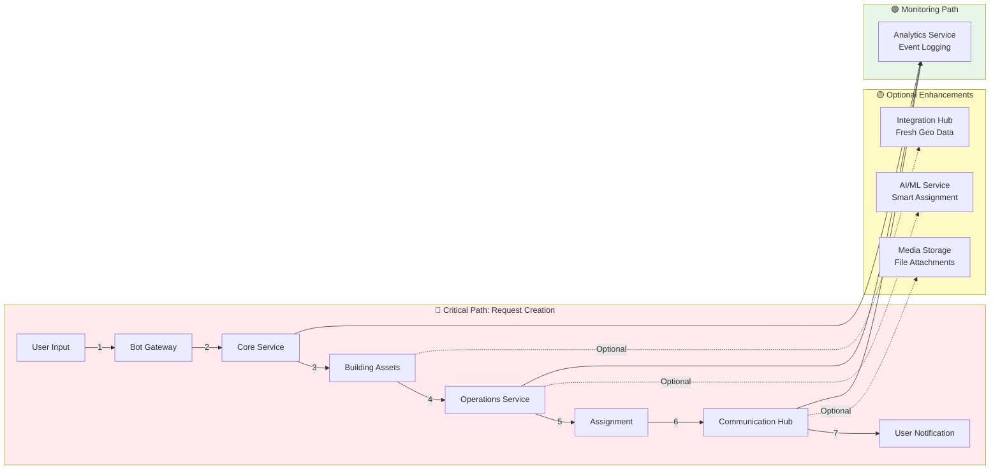