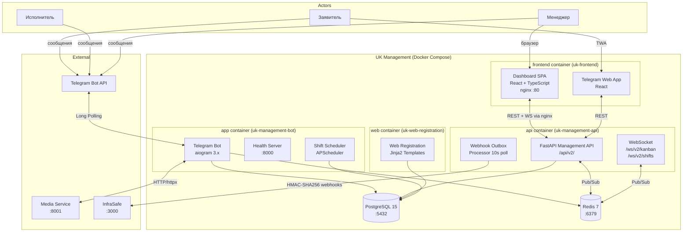
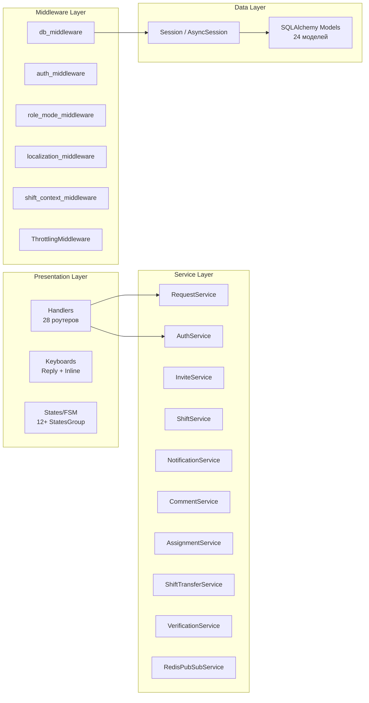
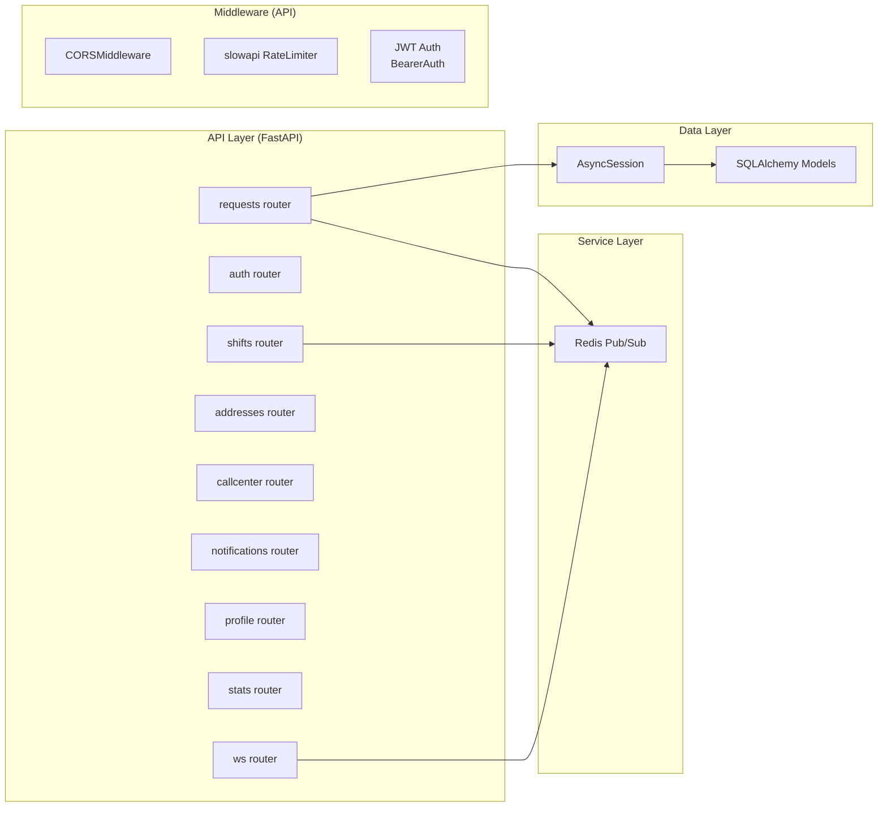

# 1. Архитектурный обзор системы

## 1.1. Стек технологий

### Backend

| Компонент | Технология | Версия |
|-----------|-----------|--------|
| Язык | Python | 3.11 |
| Telegram Bot Framework | aiogram | >= 3.0.0 |
| ORM | SQLAlchemy | >= 2.0.0 |
| СУБД (production) | PostgreSQL | 15-alpine |
| СУБД (development) | SQLite | -- |
| Кэш / Rate Limiting / FSM Storage | Redis | 7-alpine |
| Web Framework (API + регистрация) | FastAPI | >= 0.104.0 |
| ASGI Server | Uvicorn | >= 0.24.0 |
| Task Scheduler | APScheduler | >= 3.10.0 |
| HTTP Client (Media Service) | httpx | >= 0.25.0 |
| Logging | structlog | >= 23.1.0 |
| Миграции БД | Alembic | >= 1.12.0 |
| Async PostgreSQL | asyncpg | >= 0.29.0 |
| Шаблонизатор | Jinja2 | >= 3.1.0 |
| Rate Limiting (API) | slowapi | >= 0.1.0 |
| Redis Pub/Sub (real-time) | redis[async] (aioredis) | >= 5.0.0 |

### Frontend

| Компонент | Технология | Версия |
|-----------|-----------|--------|
| Фреймворк | React | 18.x |
| Язык | TypeScript | 5.x |
| Сборщик | Vite | 5.x |
| Роутинг | React Router | 6.x |
| State Management (серверный) | TanStack React Query | 5.x |
| State Management (клиентский) | Zustand | 4.x |
| Drag-and-Drop (Kanban) | @dnd-kit/core | -- |
| HTTP Client | Axios | -- |
| Иконки | Lucide React | -- |
| CSS | Tailwind CSS + shadcn/ui | -- |
| UI компоненты | shadcn/ui (Dialog, Toast/Sonner, ConfirmDialog) | -- |
| i18n | i18next + react-i18next | -- |
| Уведомления | Sonner (toast) | -- |
| Тема | dark/light через CSS variables | -- |

## 1.2. Компоненты системы

## 1.3. Слои приложения (Bot)

## 1.3.1. Слои приложения (API)

## 1.4. Цепочка Middleware

Middleware выполняются последовательно при каждом входящем Update:

| Порядок | Middleware | Назначение |
|---------|-----------|------------|
| 1 | `db_middleware` | Создает сессию БД, коммит/rollback, закрытие |
| 2 | `auth_middleware` | Загружает User по telegram_id, блокирует заблокированных |
| 3 | `role_mode_middleware` | Парсит roles (JSON) и active_role из User |
| 4 | `localization_middleware` | Определяет язык (ru/uz) из БД или Telegram |
| 5 | `shift_context_middleware` | Загружает контекст текущей смены исполнителя |
| 6 | `ThrottlingMiddleware` | Rate limit: max 2 msg/sec на пользователя |

## 1.5. Порядок регистрации роутеров

Порядок критически важен — aiogram обрабатывает роутеры по порядку регистрации:

1. `health_router` — Health check (быстрый доступ)
2. `auth_router` — Авторизация (/login, /join)
3. `profile_editing_router` — Редактирование профиля (смена языка)
4. `requests_router` — Создание заявок (Entry Handler)
5. `onboarding_router` — Онбординг новых пользователей
6. `admin_router` — Админ-панель
7. `request_acceptance_router` — Приёмка заявок
8. `unaccepted_requests_router` — Непринятые заявки
9. `shift_management_router` — Управление сменами (менеджер)
10. `my_shifts_router` — Мои смены (исполнитель)
11. `shift_transfer_router` — Передача смен
12. `shifts_router` — Старый роутер смен (legacy)
13. `request_assignment_router` — Назначение заявок
14. `request_status_management_router` — Управление статусами
15. `request_comments_router` — Комментарии к заявкам
16. `request_reports_router` — Отчёты по заявкам
17. `user_apartment_selection_router` — Выбор квартиры при регистрации
18. `user_apartments_router` — Управление квартирами
19. `address_moderation_router` — Модерация адресов
20. `address_apartments_router` — Справочник квартир
21. `address_buildings_router` — Справочник зданий
22. `address_yards_router` — Справочник дворов
23. `user_yards_router` — Дворы пользователей
24. `user_management_router` — Управление пользователями
25. `employee_management_router` — Управление сотрудниками
26. `user_verification_router` — Верификация
27. `clarification_replies_router` — Ответы на уточнения
28. `base_router` — Fallback (/start, /help, профиль)

## 1.6. Инфраструктура (Docker Compose)

**Сервисы:**

| Сервис | Образ | Порт | Назначение |
|--------|-------|------|------------|
| `app` | Custom (Dockerfile) | 8000 (health) | Telegram бот + планировщик |
| `web` | Custom (Dockerfile) | 8000 | Management API (/api/v2/) + WebSocket (/ws/v2/) + Web-регистрация |
| `postgres` | postgres:15-alpine | 5432 | База данных |
| `redis` | redis:7-alpine | 6379 | FSM, кэш, rate limiting, Pub/Sub (real-time) |

**Production ограничения:**
- app: 1 CPU, 1GB RAM
- postgres: 0.5 CPU, 512MB RAM
- redis: 0.25 CPU, 256MB RAM
- SQLite запрещен (проверка в settings.py)
- ADMIN_PASSWORD минимум 8 символов
- INVITE_SECRET обязателен

## 1.7. Frontend-приложение (React SPA)

Frontend представляет собой единое React-приложение с двумя режимами работы:

### Dashboard (для менеджеров)

Доступен по `/dashboard/*`. Требует JWT-аутентификации. Включает:

| Страница | Путь | Описание |
|----------|------|----------|
| Заявки (Kanban) | `/dashboard` | Kanban-доска с drag-and-drop |
| Дашборд | `/dashboard/analytics` | Аналитика и статистика |
| Сотрудники | `/dashboard/employees` | Список сотрудников, фильтры, одобрение/блокировка |
| Детали сотрудника | `/dashboard/employees/:id` | Профиль сотрудника, смены, рейтинг |
| Смены | `/dashboard/shifts` | Управление сменами, создание, Timeline, Heatmap |
| Шаблоны | `/dashboard/templates` | Шаблоны смен |
| Адреса | `/dashboard/addresses` | Справочник адресов (дворы/здания/квартиры) + модерация |

### TWA (для жителей-заявителей)

Telegram Web App, доступен по `/twa/*`. Аутентификация через Telegram `initData`.

| Страница | Путь | Описание |
|----------|------|----------|
| Главная | `/twa` | Список заявок жителя |
| Создание | `/twa/create` | Создание новой заявки |
| Детали | `/twa/requests/:number` | Детали заявки, комментарии, приёмка |

### Resident Board

Отдельная страница `/resident-board` -- информационная доска для жителей.
