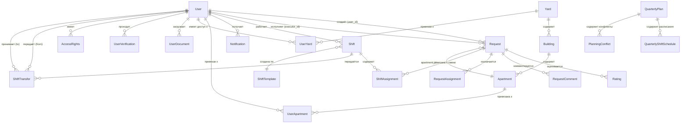
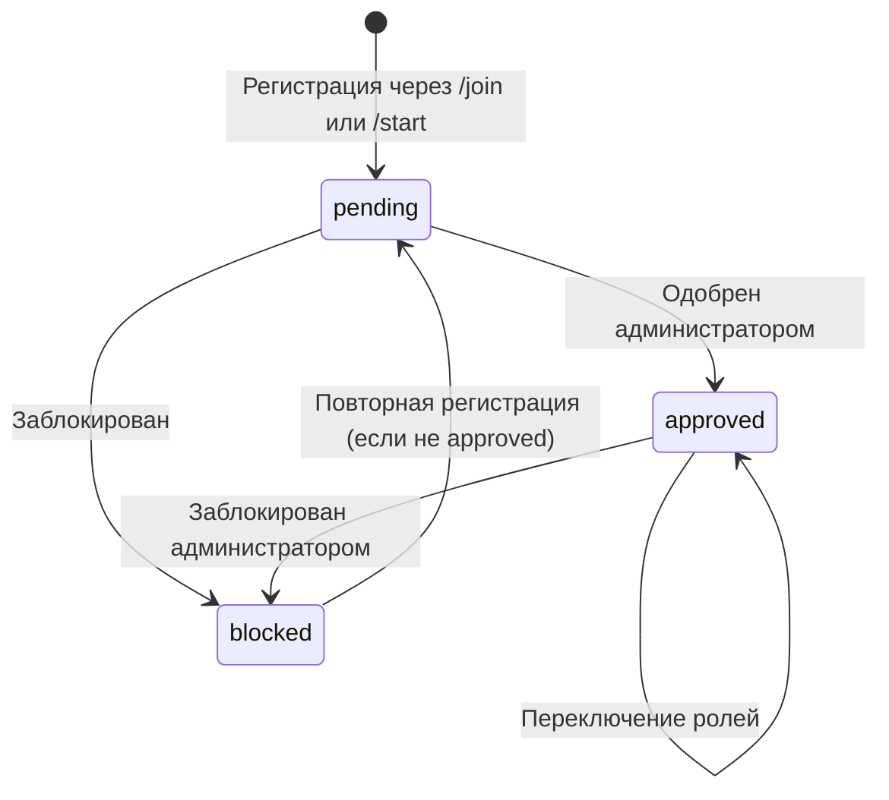
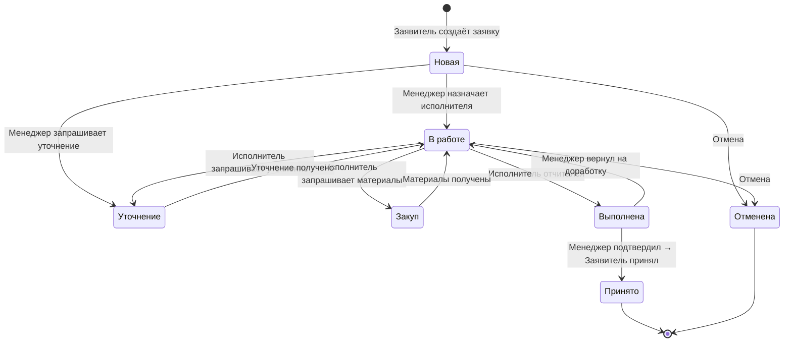
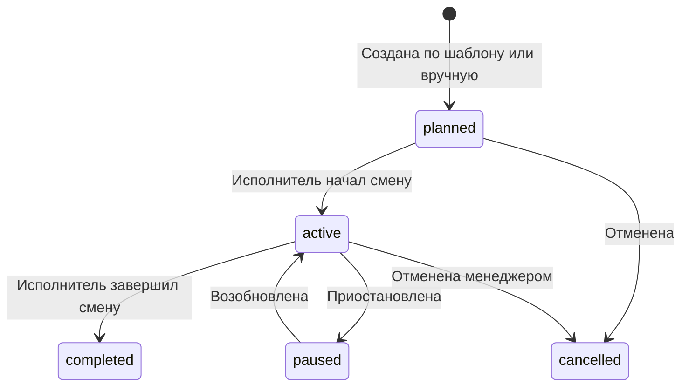
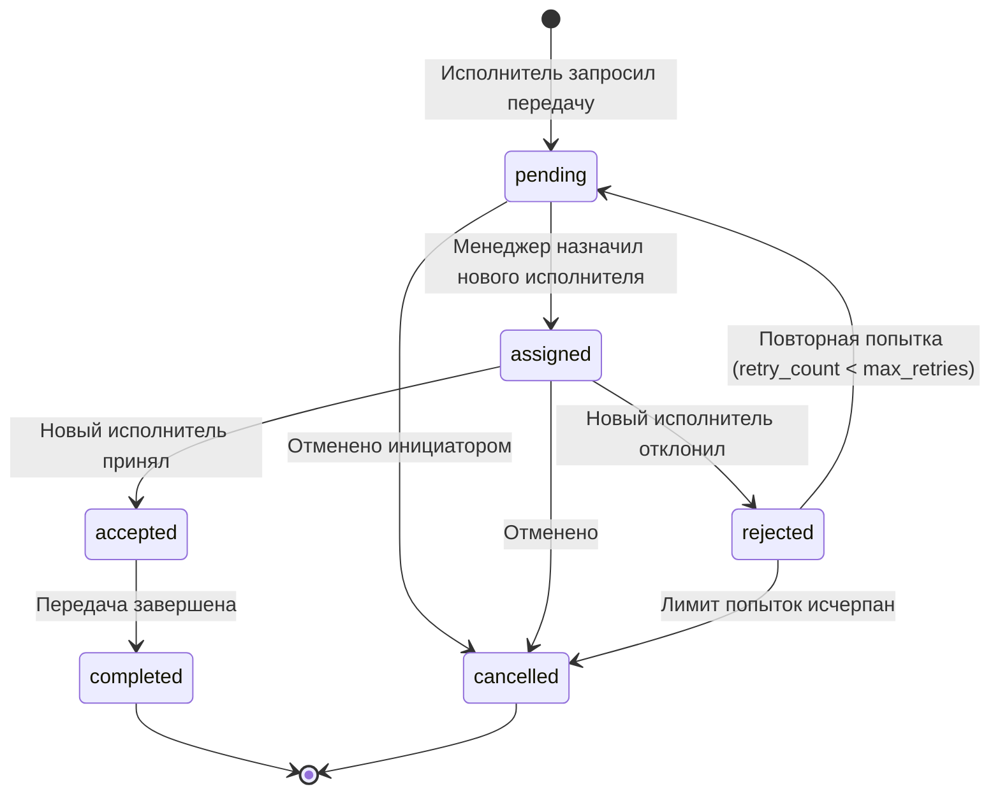
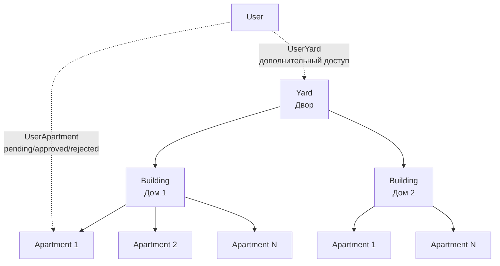
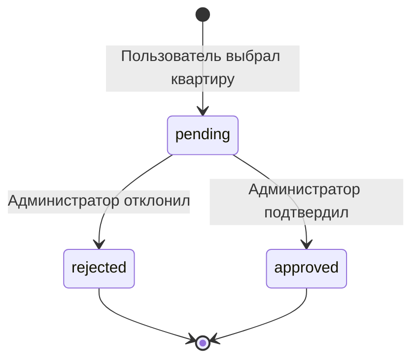
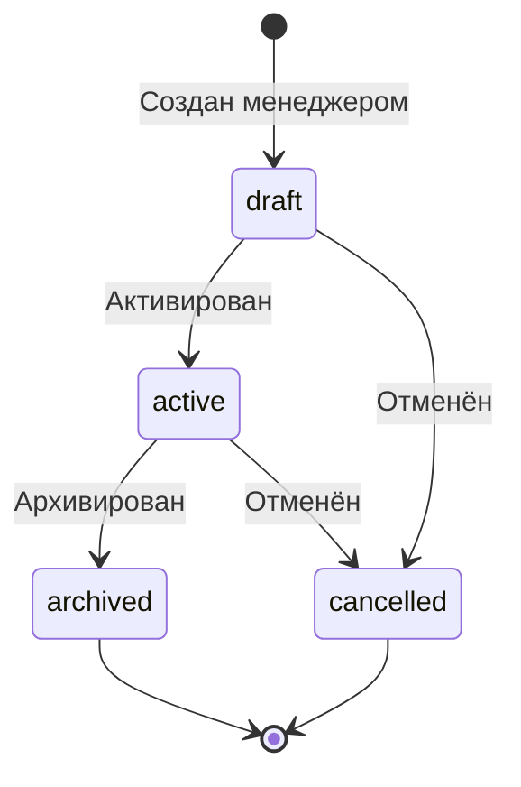

# 2. Бизнес-сущности и их жизненный цикл

## 2.1. Карта сущностей (ER-диаграмма)

## 2.2. Сущность: User (Пользователь)

**Таблица:** `users`

| Поле | Тип | Описание |
|------|-----|----------|
| `id` | Integer PK | Внутренний ID |
| `telegram_id` | BigInteger UNIQUE | Telegram ID пользователя |
| `username` | String(255) | Username в Telegram |
| `first_name` | String(255) | Имя |
| `last_name` | String(255) | Фамилия |
| `role` | String(50) | Legacy-роль (applicant/executor/manager) |
| `roles` | Text (JSON) | Список ролей: `["applicant","executor"]` |
| `active_role` | String(50) | Текущая активная роль |
| `status` | String(50) | Статус: pending / approved / blocked |
| `language` | String(10) | Язык интерфейса: ru / uz |
| `phone` | String(20) | Телефон |
| `specialization` | Text (JSON) | Специализации: `["electric","plumbing"]` |
| `verification_status` | String(50) | pending / verified / rejected |
| `verification_notes` | Text | Комментарии при верификации |
| `verification_date` | DateTime | Дата верификации |
| `verified_by` | Integer FK | Кто верифицировал |
| `passport_series` | String(10) | Серия паспорта |
| `passport_number` | String(10) | Номер паспорта |
| `birth_date` | DateTime | Дата рождения |
| `created_at` | DateTime | Дата создания |
| `updated_at` | DateTime | Дата обновления |

### Диаграмма состояний пользователя

### Роли пользователя

| Роль | Код | Возможности |
|------|-----|-------------|
| Заявитель | `applicant` | Создание заявок, просмотр своих заявок, приёмка выполненных |
| Исполнитель | `executor` | Работа со сменами, выполнение заявок, отчёты |
| Менеджер | `manager` | Назначение заявок, управление статусами, планирование смен, верификация |

Пользователь может иметь несколько ролей одновременно (поле `roles` — JSON-массив). Активная роль (`active_role`) определяет текущий интерфейс.

## 2.3. Сущность: Request (Заявка)

**Таблица:** `requests`

| Поле | Тип | Описание |
|------|-----|----------|
| `request_number` | String(10) PK | Номер в формате YYMMDD-NNN |
| `user_id` | Integer FK | Заявитель |
| `category` | String(100) | Категория заявки |
| `status` | String(50) | Текущий статус |
| `address` | Text | Legacy-адрес (текстовый) |
| `description` | Text | Описание проблемы |
| `apartment` | String(20) | Legacy-номер квартиры |
| `apartment_id` | Integer FK | Квартира из справочника |
| `urgency` | String(20) | Обычная/Средняя/Срочная/Критическая |
| `media_files` | JSON | Массив file_ids фото/видео |
| `executor_id` | Integer FK | Назначенный исполнитель |
| `notes` | Text | Заметки |
| `completion_report` | Text | Отчёт о выполнении |
| `completion_media` | JSON | Фото выполненной работы |
| `assignment_type` | String(20) | group / individual |
| `assigned_group` | String(100) | Специализация группы |
| `assigned_at` | DateTime | Время назначения |
| `assigned_by` | Integer FK | Кто назначил |
| `purchase_materials` | Text | Материалы для закупки |
| `requested_materials` | Text | Запрошенные исполнителем материалы |
| `manager_materials_comment` | Text | Комментарий менеджера к материалам |
| `purchase_history` | Text | История закупок |
| `is_returned` | Boolean | Флаг возвращённой заявки |
| `return_reason` | Text | Причина возврата |
| `return_media` | JSON | Медиа при возврате |
| `returned_at` | DateTime | Время возврата |
| `returned_by` | Integer FK | Кто вернул |
| `manager_confirmed` | Boolean | Подтверждено менеджером |
| `manager_confirmed_by` | Integer FK | Кто подтвердил |
| `manager_confirmed_at` | DateTime | Когда подтверждено |
| `manager_confirmation_notes` | Text | Комментарий менеджера |
| `created_at` | DateTime | Дата создания |
| `updated_at` | DateTime | Дата обновления |
| `completed_at` | DateTime | Дата завершения |

### Статусы заявки

| Статус | Описание |
|--------|----------|
| `Новая` | Создана заявителем, ожидает назначения |
| `В работе` | Назначена исполнителю, выполняется |
| `Закуп` | Требуется закупка материалов |
| `Уточнение` | Требуется уточнение деталей |
| `Выполнена` | Исполнитель отчитался, ожидает проверки менеджером |
| `Исполнено` | Менеджер подтвердил, ожидает приёмки заявителем |
| `Принято` | Заявитель принял работу (финальный статус) |
| `Отменена` | Заявка отменена |

### Диаграмма состояний заявки

### Система нумерации заявок

Формат: `YYMMDD-NNN`, где:
- `YY` — год (2 цифры)
- `MM` — месяц
- `DD` — день
- `NNN` — порядковый номер за день (001-999)

Пример: `251027-042` — 42-я заявка 27 октября 2025 года.

### Категории заявок

| Категория | Специализация исполнителя |
|-----------|--------------------------|
| Электрика | electric |
| Сантехника | plumbing |
| Отопление | hvac |
| Уборка | cleaning |
| Безопасность | security |
| Техобслуживание | maintenance |

## 2.4. Сущность: Shift (Смена)

**Таблица:** `shifts`

| Поле | Тип | Описание |
|------|-----|----------|
| `id` | Integer PK | ID смены |
| `user_id` | Integer FK | Исполнитель |
| `start_time` | DateTime | Время начала |
| `end_time` | DateTime | Время окончания |
| `status` | String(50) | active/completed/cancelled/planned/paused |
| `shift_type` | String(50) | regular/emergency/overtime/maintenance |
| `specialization_focus` | JSON | Фокус специализации |
| `coverage_areas` | JSON | Зоны покрытия |
| `geographic_zone` | String(100) | Географическая зона |
| `max_requests` | Integer | Макс. заявок на смену (default 10) |
| `current_request_count` | Integer | Текущее количество заявок |
| `priority_level` | Integer | Приоритет (1-5) |
| `completed_requests` | Integer | Завершённых заявок |
| `efficiency_score` | Float | Оценка эффективности (0-100) |
| `quality_rating` | Float | Рейтинг качества (1.0-5.0) |

### Диаграмма состояний смены

## 2.5. Сущность: ShiftTransfer (Передача смены)

**Таблица:** `shift_transfers`

| Поле | Тип | Описание |
|------|-----|----------|
| `id` | Integer PK | ID передачи |
| `shift_id` | Integer FK | Смена |
| `from_user_id` | Integer FK | Текущий исполнитель |
| `to_user_id` | Integer FK | Новый исполнитель |
| `status` | String(50) | pending/assigned/accepted/rejected/completed/cancelled |
| `reason` | String(50) | illness/emergency/workload/vacation/other |
| `priority` | String(20) | low/normal/high/critical |
| `retry_count` | Integer | Количество попыток |
| `max_retries` | Integer | Максимум попыток |
| `initiated_by` | Integer FK | Инициатор |
| `notes` | Text | Примечания |
| `created_at` | DateTime | Дата создания |

### Диаграмма состояний передачи смены

## 2.6. Справочник адресов (Yard → Building → Apartment)

**Yard (Двор):** name, description, GPS-координаты, is_active.

**Building (Здание):** address, yard_id, GPS-координаты, entrance_count, floor_count.

**Apartment (Квартира):** building_id, apartment_number, entrance, floor, rooms_count, area.

## 2.7. Сущность: UserApartment (Привязка к квартире)

### Диаграмма состояний привязки

## 2.8. Сущность: QuarterlyPlan (Квартальный план)

| Поле | Тип | Описание |
|------|-----|----------|
| `id` | Integer PK | ID плана |
| `year` | Integer | Год |
| `quarter` | Integer | Квартал (1-4) |
| `status` | String(50) | draft/active/archived/cancelled |
| `specializations` | JSON | Покрываемые специализации |
| `enable_247` | Boolean | Режим 24/7 |
| `enable_auto_transfer` | Boolean | Автопередача смен |
| `balance_workload` | Boolean | Балансировка нагрузки |
| `created_by` | Integer FK | Менеджер-создатель |
| `created_at` | DateTime | Дата создания |

### Диаграмма состояний плана

## 2.9. Сущности верификации

### UserDocument (Документ пользователя)

| Тип | Код | Описание |
|-----|-----|----------|
| Паспорт | `passport` | Основной документ |
| Свидетельство о собственности | `property_deed` | Подтверждение владения |
| Договор аренды | `rental_agreement` | Для арендаторов |
| Квитанция ЖКХ | `utility_bill` | Подтверждение проживания |
| Другое | `other` | Дополнительные документы |

### UserVerification (Верификация)

Статусы: `pending` → `approved` / `rejected` / `requested`

### AccessRights (Права доступа)

Уровни: `apartment` (макс. 2 заявителя), `house`, `yard`

## 2.10. RequestComment (Комментарий к заявке)

| Тип комментария | Код | Описание |
|----------------|-----|----------|
| Смена статуса | `status_change` | Автоматический при смене статуса |
| Уточнение | `clarification` | Запрос/ответ на уточнение |
| Закупка | `purchase` | Запрос/одобрение материалов |
| Отчёт | `report` | Отчёт о выполнении |

## 2.11. Rating (Оценка)

Связана с заявкой, создаётся при приёмке.

| Поле | Описание |
|------|----------|
| `request_number` | FK на заявку |
| `user_id` | Заявитель |
| `executor_id` | Исполнитель |
| `rating` | Оценка 1-5 |
| `comment` | Текстовый комментарий |
| `created_at` | Дата оценки |
