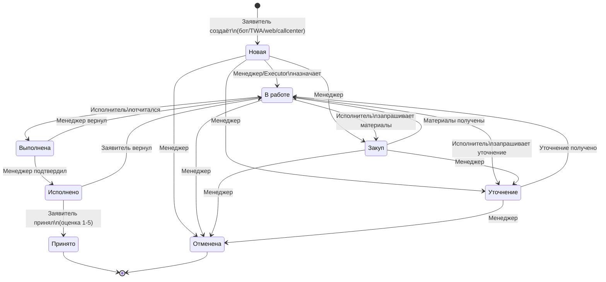
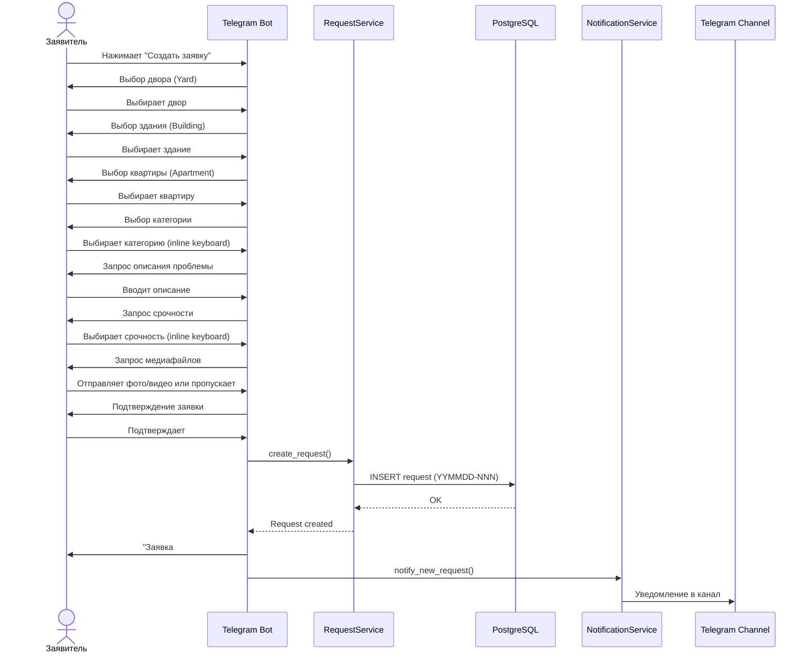
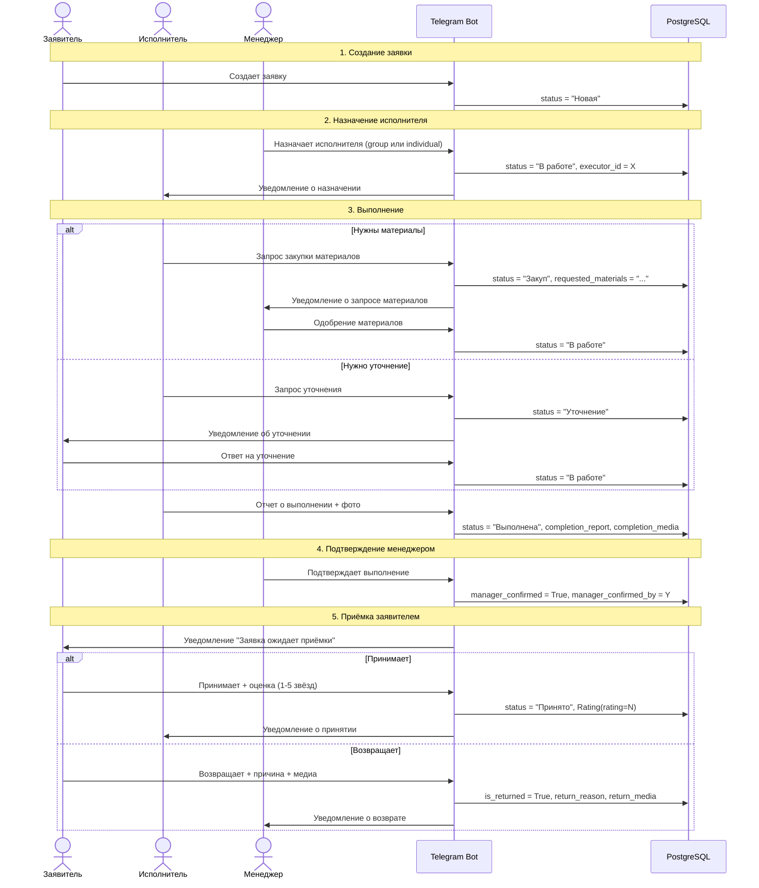
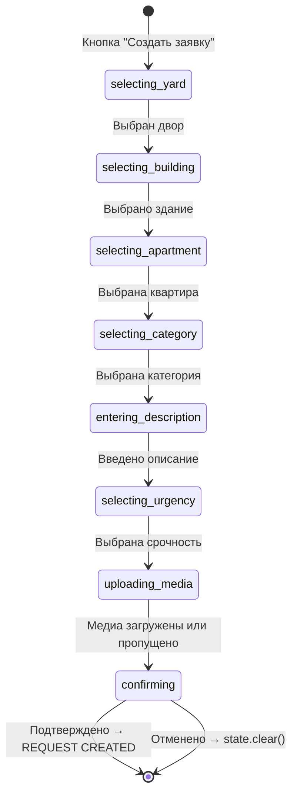

# 3. Жизненный цикл заявки (Request Lifecycle)

## 3.1. Полная карта статусов и переходов



## 3.1.1. Валидация переходов (State Machine)

С 2026-03-12 переходы статусов принудительно валидируются как на бэкенде (API, `_REQUEST_VALID_TRANSITIONS`), так и на фронтенде (Kanban-доска, `VALID_TRANSITIONS`). При попытке недопустимого перехода API возвращает HTTP 422.

```python
_REQUEST_VALID_TRANSITIONS = {
    "Новая":     {"В работе", "Закуп", "Уточнение", "Отменена"},
    "В работе":  {"Закуп", "Уточнение", "Выполнена", "Отменена"},
    "Закуп":     {"В работе", "Уточнение", "Отменена"},
    "Уточнение": {"В работе", "Отменена"},
    "Выполнена": {"Исполнено", "В работе"},
    "Исполнено": {"Принято", "В работе"},
    "Принято":   set(),   # финальный
    "Отменена":  set(),   # финальный
}
```

## 3.2. Матрица переходов по ролям

### Менеджер (manager) — полный доступ ко всем заявкам

| Текущий статус | Доступные переходы |
|----------------|-------------------|
| Новая | В работе, Закуп, Уточнение, Отменена |
| В работе | Закуп, Уточнение, Выполнена, Отменена |
| Закуп | В работе, Уточнение, Отменена |
| Уточнение | В работе, Отменена |
| Выполнена | Исполнено (подтверждение), В работе (возврат на доработку) |
| Исполнено | Принято (принять за заявителя), В работе (возврат) |

### Исполнитель (executor) — только назначенные заявки, требуется активная смена

| Текущий статус | Доступные переходы |
|----------------|-------------------|
| Новая | В работе |
| В работе | Закуп, Уточнение, Выполнена |
| Закуп | В работе |
| Уточнение | В работе |

**Ограничения executor (обновлено 2026-03-29):**
- Проверка назначения: через `RequestAssignment` (individual/group) ИЛИ `request.executor_id` (legacy fallback)
- Shift-gate: смена статуса разрешена только при активной смене (`require_active_shift`)
- Групповые заявки видны только при активной смене
- Допустимые поля для обновления: `status`, `completion_report`, `requested_materials`, `notes`

### Заявитель (applicant) — свои заявки + заявки квартиры (только для приёмки)

| Текущий статус | Доступные переходы |
|----------------|-------------------|
| Исполнено | Принято (с оценкой 1-5) или Возврат в работу |

**Правила доступа (обновлено 2026-03-29):**
- Свои заявки (`user_id = me`): полный доступ к просмотру и действиям
- Заявки соседей по квартире: доступ только если `status = "Исполнено"` (приёмка)
- Допустимые поля для обновления: `status`, `rating`

Заявитель также может **вернуть** заявку (`status → "В работе"`) вместо принятия.

## 3.3. Sequence-диаграмма: создание заявки



## 3.4. Sequence-диаграмма: полный цикл заявки



## 3.5. Назначение заявок

### 3.5.1. Индивидуальное назначение (individual)

Менеджер назначает заявку конкретному исполнителю (`executor_id`).

### 3.5.2. Групповое назначение (group)

Менеджер назначает заявку группе специализации (например, `electric`). Поля: `assignment_type = "group"`, `assigned_group = "electric"`.

Система автоматически подбирает подходящего исполнителя на основе:
- Специализации исполнителя (`user.specialization`)
- Текущей нагрузки (загруженности смены, `current_request_count`)
- Географической близости (GeoOptimizer)
- AI-оценки (`ShiftAssignment.ai_score`)

### 3.5.3. Автоматическое назначение по категории

| Категория заявки | Специализация |
|-----------------|--------------|
| Электрика | electric |
| Сантехника | plumbing |
| Отопление | hvac |
| Уборка | cleaning |
| Безопасность | security |
| Вентиляция | hvac |
| Лифт | maintenance |
| Благоустройство | cleaning |
| Интернет/ТВ | electric |
| Другое | universal |

Автоназначение запускается фоновой задачей APScheduler каждые 15 минут.

### 3.5.4. Назначение через Dashboard

Менеджер может назначить исполнителя через drag-and-drop заявки в колонку "В работе" на Kanban-доске. При этом открывается `TransitionModal` с выбором исполнителя из списка верифицированных сотрудников (включая опцию "Дежурный").

## 3.6. Система приёмки заявок

### 3.6.1. Двухэтапная приёмка

1. **Менеджер подтверждает** выполнение — `manager_confirmed = True`, `manager_confirmed_by`, `manager_confirmed_at`
2. **Заявитель принимает** работу — статус → `Принято`, создаётся `Rating`

### 3.6.2. Непринятые заявки (для менеджеров)

Менеджер видит список заявок, которые:
- `status = "Выполнена"` ИЛИ `status = "Исполнено"`
- `manager_confirmed = True`
- Заявитель ещё не принял

Менеджер может:
- **Напомнить** заявителю о приёмке (push-уведомление)
- **Принять за заявителя** с обязательным комментарием (без оценки)

### 3.6.3. Прямое принятие менеджером (legacy path)

Менеджер может поставить `manager_confirmed = True` и одновременно перевести статус в `Принято`, минуя этап ожидания заявителя (поле `manager_confirmation_notes` для обязательного комментария).

## 3.7. Уведомления по статусам

| Переход | Кому | Содержание |
|---------|------|------------|
| Новая | Канал | Новая заявка создана |
| Новая → В работе | Исполнитель | Назначена заявка |
| * → Закуп | Менеджер | Запрос материалов от исполнителя |
| * → Уточнение | Заявитель | Запрос уточнения |
| * → Выполнена | Менеджер | Заявка выполнена, ожидает проверки |
| Выполнена (confirmed) | Заявитель | Ожидает приёмки |
| * → Принято | Исполнитель, Канал | Заявка принята, оценка |
| Возврат | Менеджер, Канал | Заявка возвращена заявителем |

## 3.8. Источники создания заявок

Заявки могут создаваться из нескольких источников (поле `source`):

| Источник | Код | Интерфейс |
|----------|-----|-----------|
| Telegram бот | `bot` | Заявитель через бот (FSM) |
| Web Dashboard | `web` | Менеджер через Dashboard |
| Callcenter | `callcenter` | Оператор через Callcenter-модалку |
| TWA | `twa` | Заявитель через Telegram Web App |

Источник используется для фильтрации в API (`GET /requests?source=web`) и отображается на карточке заявки (иконка `SOURCE_ICON`).

## 3.9. FSM-состояния создания заявки



## 3.10. Access Control Layer (ACL) — обновлено 2026-03-29

API endpoints защищены через `check_request_access()` (`dependencies_access.py`):

| Роль | Доступ к просмотру | Доступ к изменению |
|------|-------------------|-------------------|
| **Manager** | Все заявки | Все переходы (state machine) |
| **Executor** | Назначенные через RequestAssignment ИЛИ executor_id | Ограниченные переходы + shift-gate |
| **Applicant (owner)** | Свои заявки (user_id = me) | status + rating |
| **Apartment resident** | Только `status = 'Исполнено'` | Принято (приёмка) |

### Executor shift-gate

Исполнитель может менять статус заявки **только при активной смене**. Групповые заявки (по специализации) видны в списке также только при активной смене. Это поведение унаследовано от бота (`_get_executor_requests_query`) и реализовано в API через `require_active_shift()`.

### Webhook events (InfraSafe)

При создании и смене статуса заявки через API в outbox записываются webhook-события:

| Событие | Endpoint InfraSafe | Данные |
|---------|-------------------|--------|
| `request.created` | `POST /api/webhooks/uk/request` | request_number, category, status, urgency, description, address |
| `request.status_changed` | `POST /api/webhooks/uk/request` | request_number, old_status, new_status |
