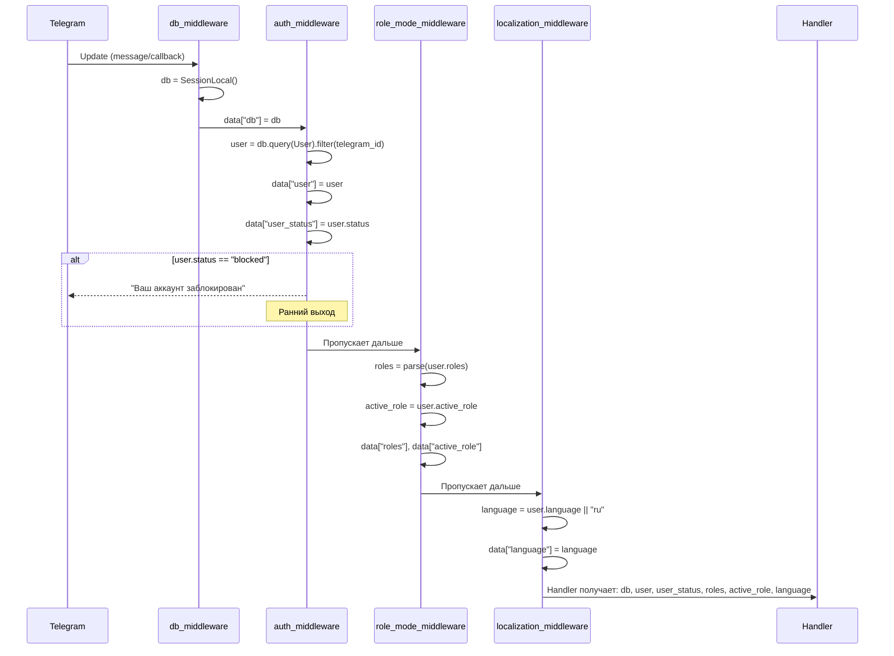
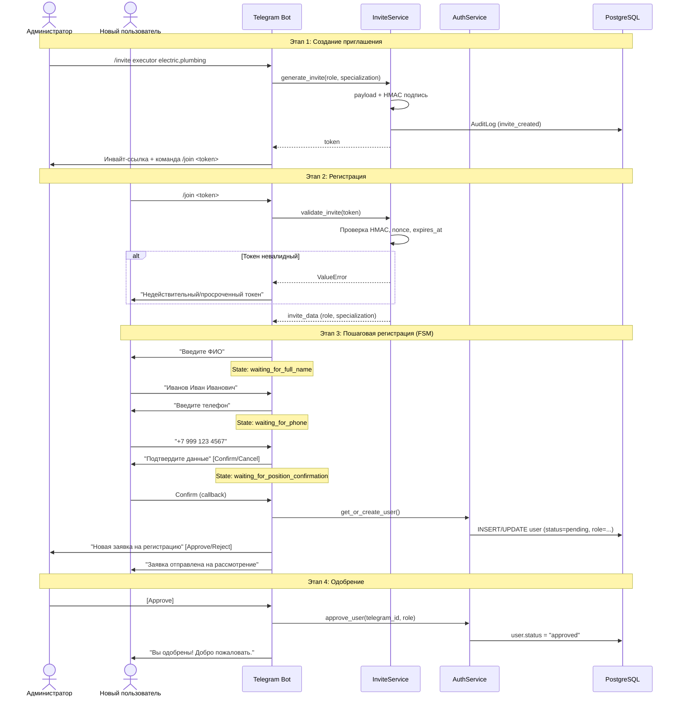
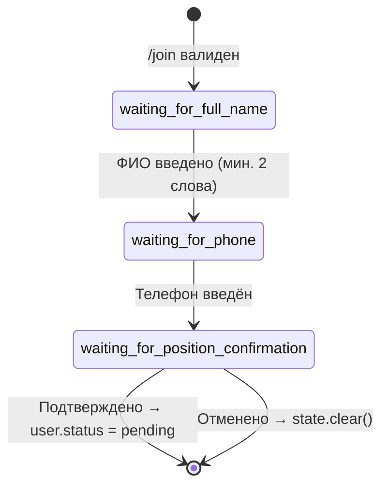
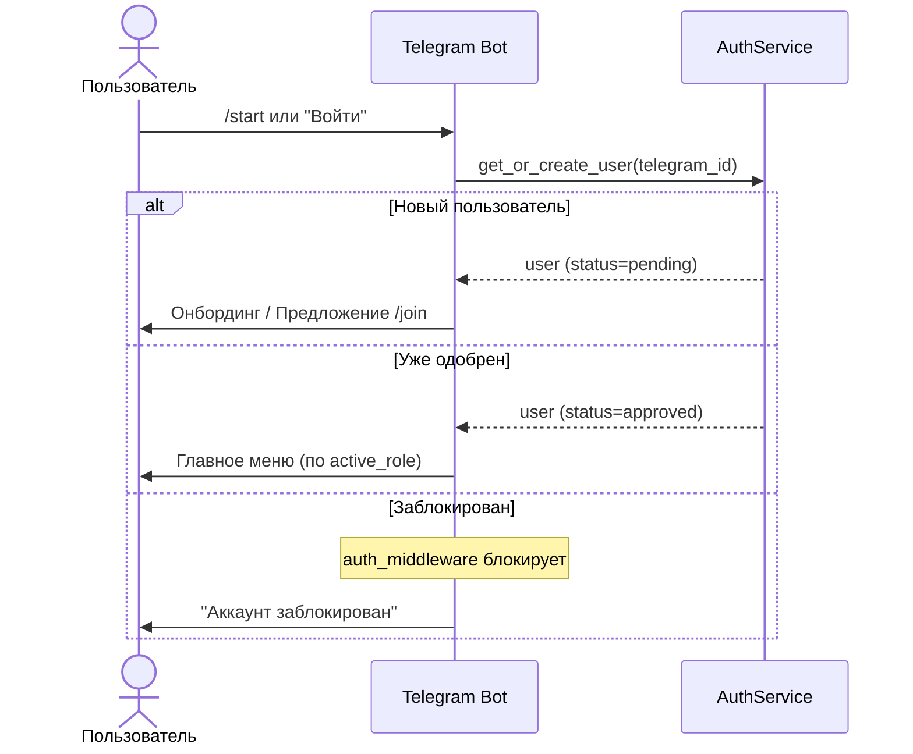
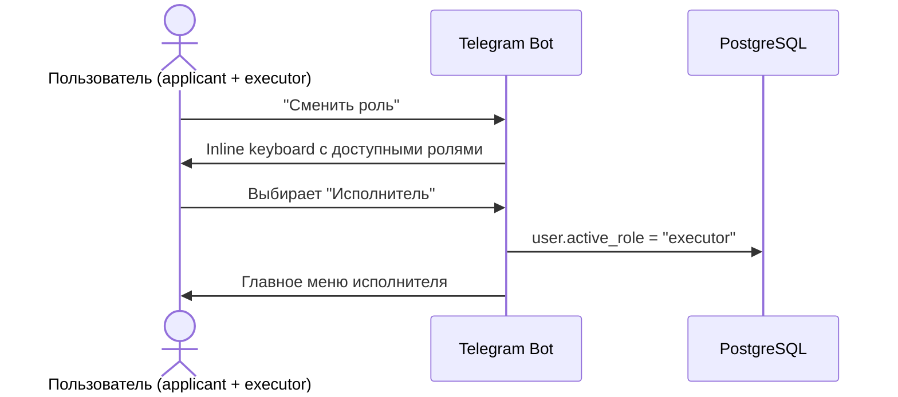
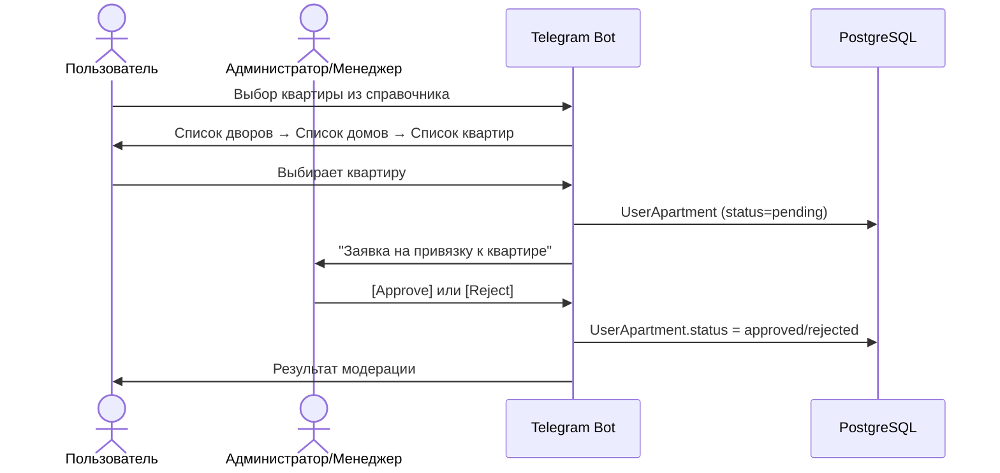
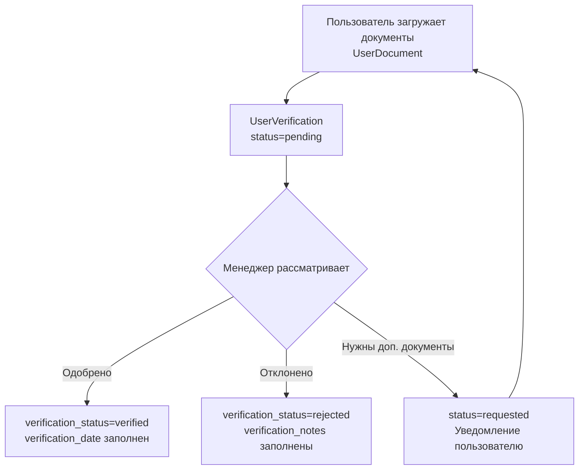
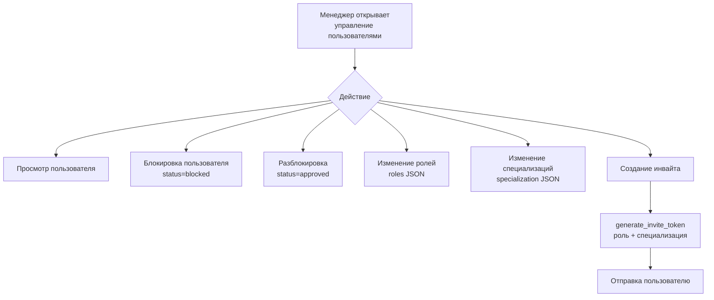

# 4. Регистрация, авторизация и верификация пользователей

## 4.1. Общая схема авторизации

Система использует **Telegram ID** в качестве основного идентификатора. JWT-токены описаны в openapi.yaml (BearerAuth) — для Web API. Аутентификация в боте работает через Telegram ID + middleware-цепочку.

### Цепочка авторизации (Middleware)



## 4.2. Регистрация по приглашению

### 4.2.1. Генерация invite-токена

Администратор/менеджер создаёт приглашение через бота. Формат токена:

```
invite_v1:{base64_payload}.{hmac_sha256_signature}
```

**Payload содержит:**
- `role` — роль (applicant/executor/manager)
- `expires_at` — Unix timestamp истечения (по умолчанию 24 часа)
- `nonce` — уникальный одноразовый ключ
- `created_by` — Telegram ID создателя
- `specialization` — специализация (для executor)

**Безопасность:**
- HMAC-SHA256 подпись на основе `INVITE_SECRET`
- Одноразовый nonce (защита от повторного использования)
- Rate limiting: 3 попытки / 10 минут на пользователя (Redis)

### 4.2.2. Процесс регистрации



### 4.2.3. FSM-состояния регистрации



## 4.3. Вход для существующих пользователей



## 4.4. Переключение ролей

Пользователь с несколькими ролями может переключаться через кнопку "Сменить роль".



## 4.5. Привязка к квартире



## 4.6. Система верификации

### Типы документов

| Тип | Код | Описание |
|-----|-----|----------|
| Паспорт | `passport` | Основной документ |
| Свидетельство о собственности | `property_deed` | Подтверждение владения |
| Договор аренды | `rental_agreement` | Для арендаторов |
| Квитанция ЖКХ | `utility_bill` | Подтверждение проживания |
| Другое | `other` | Дополнительные документы |

### Процесс верификации



### Уровни доступа (AccessRights)

| Уровень | Код | Описание |
|---------|-----|----------|
| Квартира | `apartment` | Доступ на уровне квартиры (макс. 2 заявителя) |
| Дом | `house` | Доступ на уровне дома |
| Двор | `yard` | Доступ на уровне двора |

## 4.7. Декоратор проверки ролей

Хендлеры защищены декоратором `@require_role(['manager', 'admin'])`, который:

1. Получает роли из `data["roles"]` (middleware DI)
2. Если ролей нет — загружает из БД
3. Проверяет пересечение с требуемыми ролями
4. При отсутствии доступа — отправляет локализованное сообщение и останавливает обработку

## 4.8. Управление пользователями (Admin/Manager)


