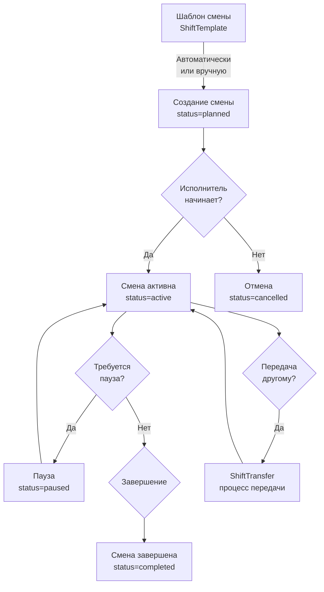
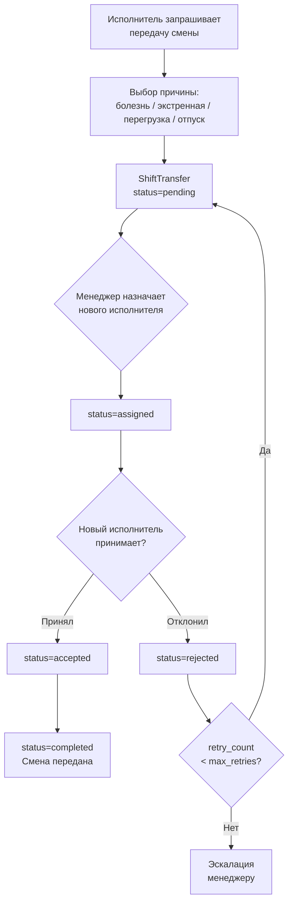
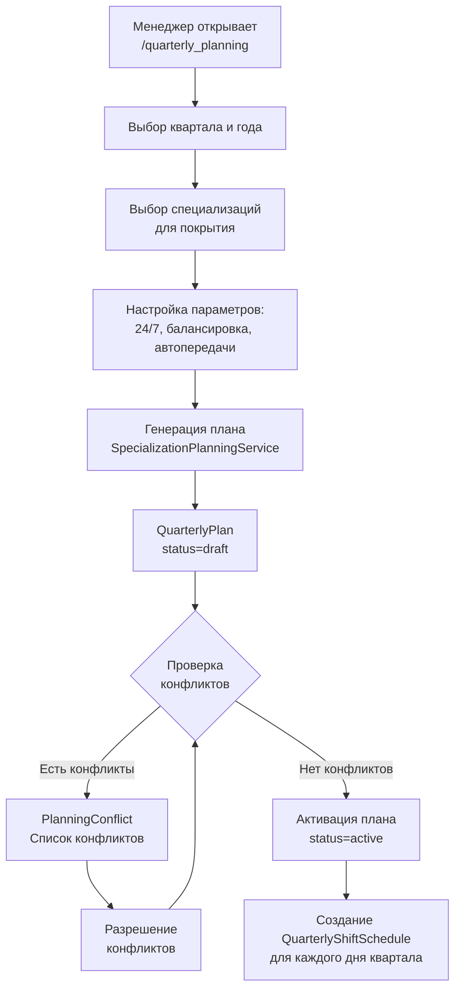
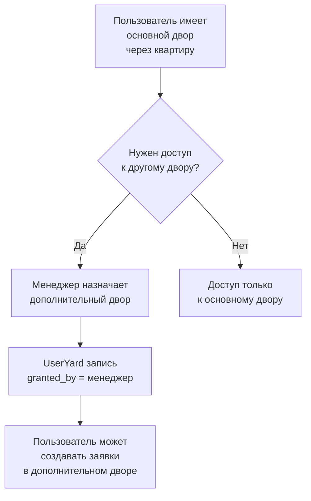
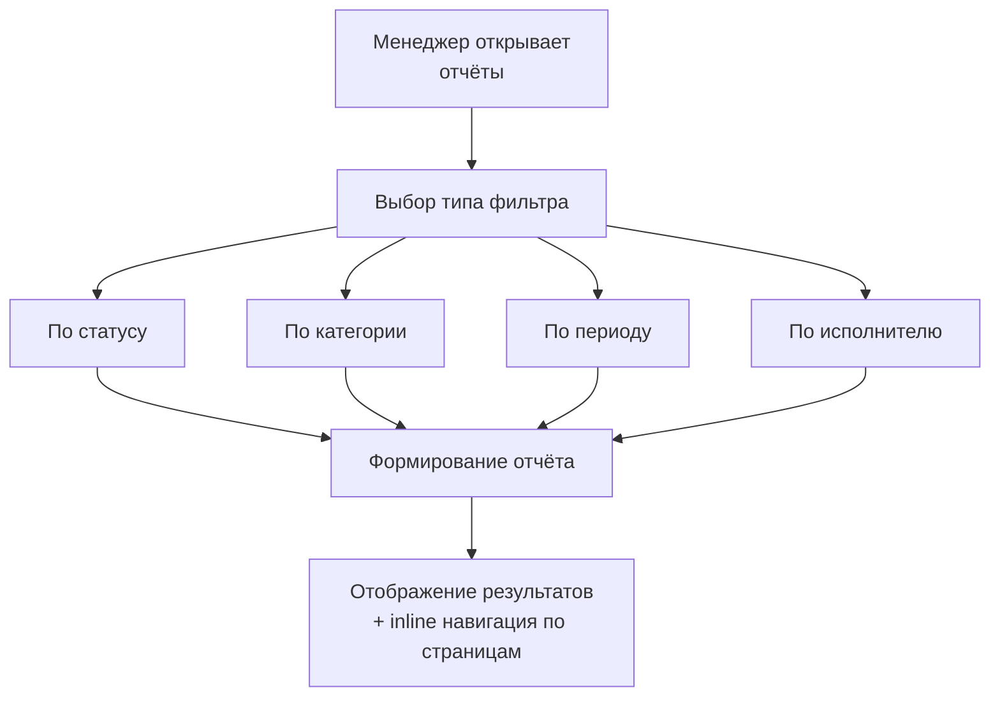
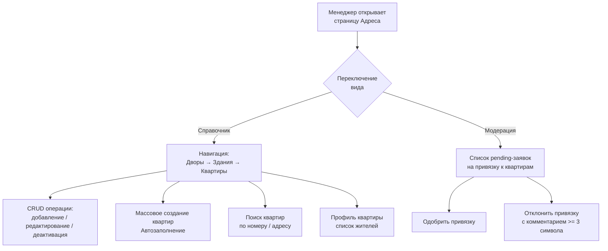
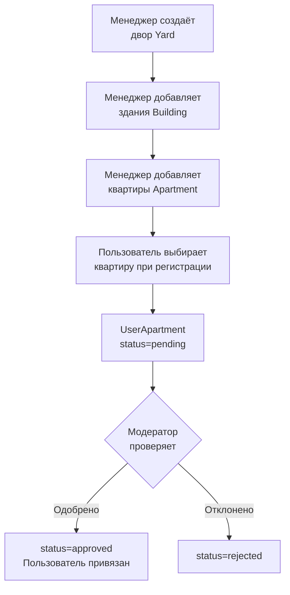

# 5. Бизнес-процессы

## 5.1. Управление сменами

### 5.1.1. Типы смен

| Тип | Код | Описание |
|-----|-----|----------|
| Обычная | `regular` | Стандартная рабочая смена |
| Экстренная | `emergency` | Экстренный вызов |
| Сверхурочная | `overtime` | Дополнительная смена |
| Техобслуживание | `maintenance` | Плановое обслуживание |
| Охрана | `security` | Охранная смена |

### 5.1.2. Жизненный цикл смены

### 5.1.3. Процесс передачи смены

### 5.1.4. ShiftTemplate (Шаблон смены)

Шаблоны определяют параметры автоматически создаваемых смен:
- Время начала/окончания
- Тип смены (`shift_type`)
- Специализация (`specialization_focus`)
- Зоны покрытия (`coverage_areas`)
- Максимальное количество заявок (`max_requests`)
- Дни недели для применения

## 5.2. Квартальное планирование

### 5.2.1. Процесс создания квартального плана

### 5.2.2. Типы конфликтов планирования

| Тип | Код | Описание |
|-----|-----|----------|
| Пересечение | `overlap` | Исполнитель назначен на пересекающиеся смены |
| Перегрузка | `overload` | Превышение допустимой нагрузки |
| Недоступность | `unavailable` | Исполнитель недоступен в указанное время |
| Пробел покрытия | `coverage_gap` | Нет покрытия в определённый период |

### 5.2.3. Типы расписаний (QuarterlyShiftSchedule)

| Тип | Код | Описание |
|-----|-----|----------|
| Дежурство 24/3 | `duty_24_3` | Сутки через трое |
| Будни 5/2 | `workday_5_2` | Пн-Пт, стандартные часы |
| Смена 2/2 | `shift_2_2` | Два рабочих, два выходных |
| Гибкий | `flexible` | Произвольное расписание |

## 5.3. Автоматический планировщик (ShiftScheduler / APScheduler)

Фоновые задачи, запускаемые автоматически:

| Задача | Расписание | Описание |
|--------|-----------|----------|
| Автосоздание смен | Ежедневно 00:30 | Создание смен по шаблонам на следующий день |
| Перебалансировка | Ежедневно 06:00 | Перебалансировка назначений по нагрузке |
| Обработка передач | Каждые 30 мин | Обработка ожидающих ShiftTransfer |
| Очистка устаревших | Ежедневно 03:00 | Удаление старых данных |
| Уведомления | Ежедневно 07:00 | Напоминания о предстоящих сменах |
| Автоназначение | Каждые 15 мин | Автоматическое назначение новых заявок исполнителям |
| Синхронизация | Каждые 30 мин | Синхронизация данных назначений ShiftAssignment |

## 5.4. Управление дворами пользователей

## 5.5. Отчёты по заявкам

Система отчётов (`request_reports` handler) предоставляет менеджерам фильтрацию и аналитику:

**Доступные метрики:**
- Количество заявок по статусам
- Среднее время выполнения
- Нагрузка на исполнителей
- Категории заявок

## 5.6. Модерация адресного справочника

Адресный справочник управляется через два интерфейса: Telegram-бот (менеджер) и Dashboard (веб-интерфейс).

### 5.6.1. Управление через Dashboard (AddressesPage)

Dashboard поддерживает два режима отображения: плитка (tile) и таблица (table). Выбор сохраняется в `localStorage`.

### 5.6.2. Защита от каскадного удаления

API блокирует деактивацию с зависимостями (HTTP 409):
- Двор нельзя деактивировать, если есть активные здания
- Здание нельзя деактивировать, если есть активные квартиры
- Квартиру нельзя деактивировать, если есть одобренные жители

### 5.6.3. Управление через Telegram-бот

## 5.7. Система уведомлений

### 5.7.1. Каналы уведомлений

| Канал | Описание |
|-------|----------|
| Личное сообщение | Прямое сообщение пользователю в Telegram |
| Telegram Channel | Публичный канал для логирования событий (`TELEGRAM_CHANNEL_ID`) |

### 5.7.2. Типы уведомлений (NotificationService)

| Тип | Получатели |
|-----|-----------|
| Новая заявка | Менеджеры, Канал |
| Смена статуса | Заявитель, Исполнитель, Канал |
| Запрос материалов | Менеджер |
| Уточнение | Заявитель |
| Выполнена | Менеджер, Заявитель |
| Возврат заявки | Менеджер, Канал |
| Смена начата | Исполнитель, Канал |
| Смена завершена | Исполнитель, Канал |
| Передача смены | Исполнитель-получатель |
| Новый пользователь | Администраторы, Канал |
| Запрос документов | Пользователь, Канал |

## 5.8. Локализация (i18n)

Система поддерживает два языка: **русский (ru)** и **узбекский (uz)**.

- Файлы локалей: `config/locales/ru.json`, `config/locales/uz.json`
- Функция `get_text(key, language)` для получения строк
- Локали кэшируются в памяти (функция `load_locale()` с кэшем, добавлено 2026-03-10)
- Кнопки клавиатур локализуются через `utils/button_texts.py` -- единый источник текстов кнопок (45+ записей)
- Middleware `localization_middleware` внедряет `language` в контекст хендлера (из БД, НЕ из `callback.from_user.language_code`)
- Пользователь может сменить язык через профиль
- `NotificationService` использует `get_text()` с языком пользователя из БД

**Паттерн фильтров кнопок:**
- Декораторы: `F.text.in_(CONSTANT_TEXTS)`
- Тело хендлера: `message.text in CONSTANT_TEXTS`
- Защита от fallback `get_text()`: `text != locale_key` (ключ должен быть English dot-path, не кириллица)

## 5.9. Специализации сотрудников

| Код | Название |
|-----|----------|
| `electric` | Электрика |
| `plumbing` | Сантехника |
| `security` | Охрана |
| `cleaning` | Уборка |
| `hvac` | Отопление/Кондиционирование |
| `maintenance` | Техническое обслуживание |
| `universal` | Универсальный специалист |
| `other` | Разное |

Специализации хранятся в `user.specialization` как JSON-массив. Один исполнитель может иметь несколько специализаций.

## 5.10. Система оценок (Rating)

После приёмки заявки заявитель ставит оценку от 1 до 5 звёзд.

- Оценка записывается в `Rating` и связывается с заявкой и исполнителем
- `Shift.quality_rating` — средний рейтинг смены
- `Shift.efficiency_score` — оценка эффективности (0-100) на основе выполненных заявок

## 5.11. Health Monitoring

HTTP health-сервер (`utils/health_server.py`) на порту 8000:

| Путь | Описание |
|------|----------|
| `/health` | Базовый статус: `{"status": "healthy", "timestamp": "..."}` |
| `/health/detailed` | Детальный: состояние БД, Redis, планировщика |

Docker healthcheck: `curl -f /health` каждые 30 секунд, 3 retry, start_period 40 сек.
