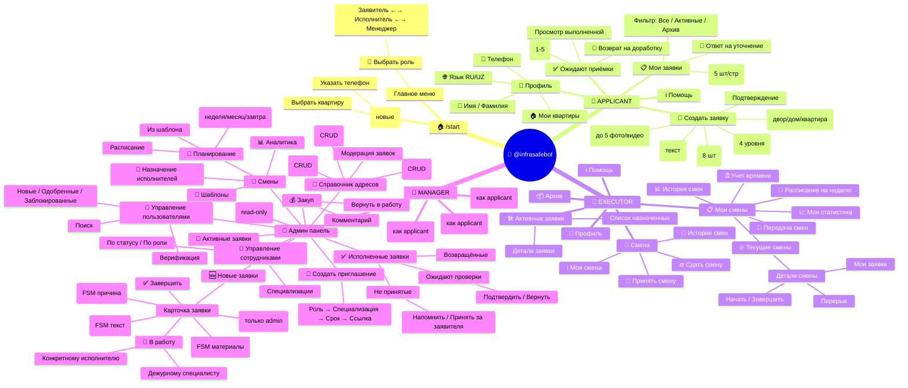

# Полная карта навигации бота @infrasafebot

> Дата аудита: 2026-03-22 | Источник: анализ кода handlers/, keyboards/, main.py

---

## Mind Map (Mermaid)



---

## 1. Архитектура: Порядок роутеров

Файл: `main.py:261-304`. Первый совпавший роутер перехватывает событие.

```
health → auth → profile_editing → requests → onboarding → admin →
request_acceptance → unaccepted_requests → shift_management_new →
my_shifts → shift_transfer → shifts → request_assignment →
request_status_management → request_comments → request_reports →
user_apartment_selection → user_apartments → address_moderation →
address_apartments → address_buildings → address_yards →
user_yards → user_management → employee_management →
user_verification → clarification_replies → base (fallback)
```

---

## 2. Система ролей

Каждый пользователь имеет:
- `roles` — JSON-массив (например `["applicant", "executor", "manager"]`)
- `active_role` — текущая активная роль
- `status` — `pending` / `approved` / `blocked`

Клавиатура строится в `get_main_keyboard_for_role()` (`keyboards/base.py:91`).

### Кнопки главного меню по ролям

| Кнопка | Applicant | Executor | Manager |
|--------|-----------|----------|---------|
| 📝 Создать заявку | ✅ (если approved) | - | ✅ |
| 📋 Мои заявки | ✅ | - | ✅ |
| 🛠 Активные заявки | - | ✅ | - |
| 📦 Архив | - | ✅ | - |
| ✅ Ожидают приёмки | ✅ | - | ✅ |
| 👤 Профиль | ✅ | ✅ | ✅ |
| ℹ️ Помощь | ✅ | ✅ | ✅ |
| 🔄 Смена | - | ✅ | - |
| 📋 Мои смены | - | ✅ | - |
| 🔀 Выбрать роль | если ≥2 ролей | если ≥2 ролей | если ≥2 ролей |
| 🔧 Админ панель | - | - | ✅ |

---

## 3. Роль APPLICANT — Полная карта

### 3.1 Создание заявки (FSM)

**Триггер:** кнопка "📝 Создать заявку"
**Файл:** `handlers/requests.py:374`

```
RequestStates.category ─── Inline: 8 категорий + ❌ Отмена
    │ callback: category_{key}
    ▼
RequestStates.address ──── Reply: адреса из БД (🏘️ двор / 🏢 дом / 🏠 квартира)
    │ текст кнопки адреса
    ▼
RequestStates.description ─ Свободный ввод текста
    │
    ▼
RequestStates.urgency ──── Inline: Обычная / Важная / Срочная / Критическая
    │ callback: urgency_{key}
    ▼
RequestStates.media ────── Фото/видео (до 5) или "Продолжить"
    │
    ▼
RequestStates.confirm ──── Inline: ✅ Подтвердить / ❌ Отмена
    │ callback: confirm_yes
    ▼
Заявка создана → Главное меню
```

**BUG-3 fix:** `/start` в любом из состояний сбрасывает FSM → главное меню.

### 3.2 Мои заявки

**Триггер:** кнопка "📋 Мои заявки"
**Файл:** `handlers/requests.py:2157` (`show_my_requests`)

- Фильтр: Все / Активные / Архив (Inline: `status_all`, `status_active`, `status_archive`)
- Пагинация: 5 шт/стр (Inline: `page_{n}`)
- Кнопка "💬 Ответить" для заявок в статусе "Уточнение" → `replyclarify_{номер}`
- Детали заявки: категория, статус, адрес, описание, срочность, дата

### 3.3 Ожидают приёмки

**Триггер:** кнопка "✅ Ожидают приёмки"
**Файл:** `handlers/request_acceptance.py:45`

```
Список заявок (status=Выполнена, manager_confirmed=True)
    │ callback: view_completed_{номер}
    ▼
Детали выполненной заявки + отчёт исполнителя
    ├── 📎 Просмотреть медиа → отправка фото/видео
    ├── ✅ Принять → callback: accept_request_{номер}
    │       └── ⭐ Оценка 1-5 → callback: rate_{номер}_{оценка} → статус "Принято"
    └── 🔄 Вернуть → callback: return_request_{номер}
            └── FSM: причина (текст) → медиа (опционально) → статус "Исполнено"
```

### 3.4 Профиль

**Триггер:** кнопка "👤 Профиль"
**Файл:** `handlers/base.py:362`

```
Профиль (текст: имя, роли, адрес, язык)
    ├── Роль 1 / Роль 2 / ... → переключение роли
    └── ✏️ Редактировать → callback: edit_profile
            ├── 📱 {телефон} → FSM ввода
            ├── 🌐 {RU/UZ} → выбор языка (set_language_ru/uz)
            ├── 👤 {имя} → FSM ввода
            ├── 👤 {фамилия} → FSM ввода
            ├── 🏠 Мои квартиры → управление привязкой
            └── ❌ Отмена → профиль
```

### 3.5 Переключение роли

**Триггер:** кнопка "🔀 Выбрать роль"
**Файл:** `handlers/base.py:430`

Inline: список всех ролей, активная с "✓". Callback: `role:{target}`.
Обновляет `user.active_role` в БД, пересобирает Reply-клавиатуру.

---

## 4. Роль EXECUTOR — Полная карта

### 4.1 Активные заявки

**Триггер:** кнопка "🛠 Активные заявки"
**Файл:** `handlers/requests.py:2157` (ветка `active_role == "executor"`)

- Показывает заявки назначенные исполнителю (через `RequestAssignment` или `Request.executor_id`)
- Кнопки: `{icon} #{номер} - {категория}` → callback `view_request_{номер}`
- Пагинация: 5 шт/стр

### 4.2 Меню "🔄 Смена" (оперативное)

**Триггер:** кнопка "🔄 Смена"
**Файл:** `handlers/shifts.py` (через `handlers/base.py:343`)

```
Reply-меню:
├── 🔄 Принять смену → ShiftService.start_shift() → уведомления
├── 🔚 Сдать смену
│   ├── (одна активная) → детали + подтверждение
│   └── (несколько) → выбор смены → подтверждение
├── ℹ️ Моя смена → текст "🟢 Активная смена с {HH:MM}"
├── 📜 История смен → постраничный список + фильтры
└── 🔙 Назад → главное меню
```

### 4.3 Меню "📋 Мои смены" (детальное)

**Триггер:** кнопка "📋 Мои смены"
**Файл:** `handlers/my_shifts.py:43`

```
Inline-меню:
├── 🔥 Текущие смены → список на сегодня/завтра
│   └── shift_details:{id} → полная карточка смены
│       ├── (planned): Начать / Передать / Отказаться
│       ├── (active): Завершить / Мои заявки / Перерыв / Передать
│       └── (completed): Отчёт / Обработанные заявки / Расчёт оплаты
├── 📅 Расписание на неделю → пн-вс с часами и статусами
├── 📊 История смен → последние 30 дней, до 10 записей
├── ⏰ Учёт времени
├── 📈 Моя статистика
└── 🔄 Передача смен → initiate_transfer → выбор смены → выбор получателя
```

---

## 5. Роль MANAGER — Полная карта

### 5.0 Вход в панель

**Триггер:** кнопка "🔧 Админ панель"
**Файл:** `handlers/admin.py:1009`
**Клавиатура:** `get_manager_main_keyboard()` (`keyboards/admin.py:8`)

Reply-меню (2 в ряд, 11 кнопок):

```
┌──────────────────────┬──────────────────────┐
│ 🆕 Новые заявки       │ 🔄 Активные заявки    │
├──────────────────────┼──────────────────────┤
│ ✅ Исполненные заявки  │ 💰 Закуп              │
├──────────────────────┼──────────────────────┤
│ 📦 Архив              │ 👥 Смены              │
├──────────────────────┼──────────────────────┤
│ 📍 Справочник адресов  │ 👥 Управление польз.  │
├──────────────────────┼──────────────────────┤
│ 👷 Управление сотр.   │ 📨 Создать приглашение │
├──────────────────────┴──────────────────────┤
│                 🔙 Назад                     │
└─────────────────────────────────────────────┘
```

### 5.1 Новые заявки

**Триггер:** "🆕 Новые заявки"
**Файл:** `handlers/admin.py:1093`
**Данные:** `Request.status == "Новая"`, limit 10, `ORDER BY created_at DESC`

Inline-список: `{emoji} #{номер} • {категория} • {адрес[:40]}` → callback `mview_{номер}`

#### Карточка заявки (`mview_{номер}`)

**Файл:** `handlers/admin.py:294`

Текст: Заявитель, Telegram ID, Категория, Статус, Адрес, Описание, Срочность, Квартира, Дата создания/обновления, Назначение, Примечания.

**Кнопки действий** (`keyboards/admin.py:144`):

| Кнопка | callback | Handler | Результат |
|--------|----------|---------|-----------|
| 🔧 В работу | `accept_{N}` | `admin.py:1727` | Статус → "В работе" + выбор назначения |
| ❌ Отклонить | `deny_{N}` | `admin.py:1784` | FSM: ввод причины → статус "Отменена" |
| ❓ Уточнить | `clarify_{N}` | `admin.py:1829` | FSM: ввод текста → статус "Уточнение" |
| 💰 В закуп | `purchase_{N}` | `admin.py:1897` | FSM: ввод материалов → статус "Закуп" |
| ✅ Завершить | `complete_{N}` | `admin.py:1983` | Статус → "Выполнена" |
| 🗑️ Удалить | `delete_{N}` | `admin.py:2035` | Только для ADMIN_USER_IDS |
| 📎 Медиа | `media_{N}` | `admin.py:442` | Показ фото/видео заявки |
| 🔙 Назад | `mreq_back_to_list` | `admin.py:853` | К списку заявок |

#### Поток назначения (после "В работу")

```
accept_{N} → Статус "В работе" → get_assignment_type_keyboard()
    ├── assign_duty_{N} ──── Дежурному специалисту
    │   └── auto_assign_request_by_category()
    │       Маппинг: plumbing→plumber, electricity→electrician, ...
    │       Ищет исполнителей с активной сменой и нужной специализацией
    │       Создаёт RequestAssignment (type=group)
    │
    └── assign_specific_{N} ── Конкретному исполнителю
        └── get_executors_by_category_keyboard()
            Маппинг категории → специализация
            Список: "{🟢/⚪} {Имя} ({спец})" → callback assign_executor_{N}_{id}
                └── Создаёт RequestAssignment (type=individual)
                    + уведомление исполнителю
```

### 5.2 Активные заявки

**Триггер:** "🔄 Активные заявки"
**Файл:** `handlers/admin.py:1122`
**Данные:** статусы ["В работе", "Закуп", "Уточнение"], limit 10
**Действия:** те же, что в 5.1

### 5.3 Исполненные заявки — подменю

**Триггер:** "✅ Исполненные заявки"
**Файл:** `handlers/admin.py:1151`

```
Reply-подменю (get_completed_requests_submenu):
├── "Ожидают проверки" ── status=Выполнена, manager_confirmed=False
│   └── mview_{N} → confirm_completed_{N} (подтвердить)
│                  → return_to_work_{N} (вернуть в работу)
│
├── "Возвращённые" ────── status=Исполнено, is_returned=True
│   └── mview_{N} → reconfirm_completed_{N} / return_to_work_{N}
│
├── "Не принятые" ─────── manager_confirmed=True, ожидают заявителя
│   └── mview_{N} → unaccepted_remind_{N} (напомнить)
│                  → unaccepted_accept_{N} (принять за заявителя, FSM)
│
└── "Назад в меню" ────── → главное меню
```

### 5.4 Закуп

**Триггер:** "💰 Закуп"
**Файл:** `handlers/admin.py:1444`
**Данные:** `status=Закуп`, limit 10

Серия сообщений (по одному на заявку) с деталями + кнопки:
- `purchase_return_to_work_{N}` — закуп завершён → "В работе"
- `edit_materials_{N}` — FSM: комментарий менеджера

### 5.5 Архив

**Триггер:** "📦 Архив"
**Файл:** `handlers/admin.py:1404`
**Данные:** статусы [Выполнена, Исполнено, Принято, Отменена], limit 10
**Режим:** только чтение, без действий

### 5.6 Управление сменами

**Триггер:** "👥 Смены"
**Файл:** `handlers/admin.py:2295` → `shift_management.py`

```
Inline-меню (get_main_shift_menu):
├── 📅 Планирование (shift_planning)
│   ├── Из шаблона (create_shift_from_template)
│   │   └── Выбор шаблона → Выбор даты → Создание
│   ├── Планировать неделю (plan_weekly_schedule)
│   ├── Авто-планирование (auto_planning)
│   │   ├── На эту неделю (auto_plan_week)
│   │   ├── На 4 недели (auto_plan_month)
│   │   └── На завтра (auto_plan_tomorrow)
│   └── Расписание (view_schedule)
│       └── Навигация по датам с детализацией смен
│
├── 📊 Аналитика (shift_analytics)
│   ├── weekly_analytics
│   ├── monthly_analytics
│   ├── workload_forecast
│   ├── optimization_recommendations
│   └── efficiency_analysis
│
├── 📝 Шаблоны (template_management)
│   ├── Просмотр всех (templates_view_all)
│   ├── Создать новый (create_new_template)
│   ├── Редактировать (templates_edit)
│   ├── Статистика использования (template_usage_stats)
│   ├── Импорт (import_templates)
│   └── Экспорт (export_templates)
│
└── 👷 Назначение исполнителей (shift_executor_assignment)
    ├── Назначить на смену (assign_to_shift)
    ├── Массовое назначение (bulk_assignment)
    ├── AI-назначение (ai_assignment)
    ├── Перераспределение (redistribute_load)
    ├── Анализ нагрузки (workload_analysis)
    └── Конфликты расписания (schedule_conflicts)
```

### 5.7 Справочник адресов

**Триггер:** "📍 Справочник адресов"
**Файл:** `handlers/address_yards.py:49`

```
Inline-меню (get_address_management_menu):
├── 🏘️ Дворы (addr_yards_list)
│   └── addr_yard_view:{id} → Детали двора
│       ├── Редактировать (addr_yard_edit:{id}) → FSM
│       ├── Деактивировать (addr_yard_deactivate:{id})
│       ├── Здания двора (addr_yard_buildings:{id})
│       └── Создать двор (addr_yard_create) → FSM: имя → описание → подтверждение
│
├── 🏢 Здания (addr_buildings_list)
│   └── CRUD зданий
│
├── 🏠 Квартиры (addr_apartments_list)
│   └── CRUD квартир
│
├── 📋 Модерация (addr_moderation_list)
│   └── addr_moderation_view:{id} → Детали заявки пользователя
│       ├── Одобрить (addr_moderation_approve:{id}) → FSM: комментарий
│       └── Отклонить (addr_moderation_reject:{id}) → FSM: комментарий
│
└── 📊 Статистика (addr_stats)
```

### 5.8 Управление пользователями

**Триггер:** "👥 Управление пользователями"
**Файл:** `handlers/user_management.py` (через `admin.py:1027`)

```
Inline-меню (get_user_management_main_keyboard):
├── 📊 Статистика (user_mgmt_stats)
├── 🆕 Новые (N) (user_mgmt_list_pending_1)
├── ✅ Одобренные (N) (user_mgmt_list_approved_1)
├── 🚫 Заблокированные (N) (user_mgmt_list_blocked_1)
├── 👷 Сотрудники (N) (user_mgmt_list_staff_1)
├── 🔍 Поиск (user_mgmt_search)
├── 🔐 Верификация (user_verification_panel)
│   └── quick_verify_{id} / quick_reject_{id}
└── 🔙 Назад (admin_panel)

Список → user_mgmt_user_{id} → Детали пользователя
    ├── Одобрить / Заблокировать
    ├── Изменить роль
    └── Просмотреть документы
```

**Уведомления о регистрации** (приходят менеджеру автоматически):

| callback | Действие |
|----------|----------|
| `approve_user_{id}` | Одобрить |
| `reject_user_{id}` | Отклонить |
| `view_user_{id}` | Просмотр профиля |

### 5.9 Управление сотрудниками

**Триггер:** "👷 Управление сотрудниками"
**Файл:** `handlers/employee_management.py` (через `admin.py:1059`)

```
Inline-меню (get_employee_management_main_keyboard):
├── 📊 Статистика
├── По статусу: На рассмотрении / Активные / Заблокированные
├── По роли: Исполнители / Менеджеры
├── 🔍 Поиск
├── 🔧 Специализации
└── 🔙 Назад

Список → employee_mgmt_employee_{id} → Детали сотрудника
    ├── Одобрить / Заблокировать
    ├── Изменить роль / специализацию
    └── Просмотр профиля
```

### 5.10 Создание приглашения

**Триггер:** "📨 Создать приглашение"
**Файл:** `handlers/admin.py:1504`

```
FSM-поток:
1. Выбор роли (get_invite_role_keyboard)
   invite_role_{applicant|executor|manager}

2. Выбор специализации (ТОЛЬКО для executor)
   (get_invite_specialization_keyboard)
   invite_spec_{plumber|electrician|hvac|cleaning|security|maintenance|landscaping|repair|installation}

3. Выбор срока (get_invite_expiry_keyboard)
   invite_expiry_{1h|24h|7d}

4. Подтверждение (get_invite_confirmation_keyboard)
   invite_confirm → генерация ссылки + токена
   invite_cancel → отмена
```

---

## 6. Жизненный цикл заявки (cross-role)

```
                    ┌─ Заявитель ─┐     ┌── Менеджер ──┐     ┌─ Исполнитель ─┐

Создать заявку ──► [Новая] ──────► accept_{N} ──────► [В работе]
                       │                                    │
                       │          deny_{N}                  │ (исполнитель работает)
                       │              │                     │
                       │         [Отменена]                 ▼
                       │                              complete_{N}
                       │                                    │
                       │          clarify_{N}               ▼
                       │              │              [Выполнена]
                       │         [Уточнение] ◄──────── manager_confirmed=False
                       │              │                     │
                       │         replyclarify_{N}    confirm_completed_{N}
                       │              │                     │
                       │              ▼              manager_confirmed=True
                       │         [В работе]                 │
                       │                                    ▼
                       │          purchase_{N}     [Выполнена] (ждёт заявителя)
                       │              │                     │
                       │          [Закуп]           accept_request_{N}
                       │              │              + rate (⭐1-5)
                       │    purchase_return_{N}             │
                       │              │                     ▼
                       │         [В работе]          [Принято] ✅
                       │
                       │                      return_request_{N}
                       │                             │
                       │                        [Исполнено]
                       │                     (is_returned=True)
                       │                             │
                       │                    return_to_work_{N}
                       │                             │
                       └─────────────────────── [В работе]
```

---

## 7. Все FSM States

### Создание заявки (applicant)

| State | Файл | Триггер | Ввод |
|-------|-------|---------|------|
| `RequestStates.category` | requests.py:337 | "Создать заявку" | Inline: категория |
| `RequestStates.address` | requests.py:341 | category_{key} | Reply: адрес |
| `RequestStates.description` | requests.py:342 | выбор адреса | Свободный текст |
| `RequestStates.urgency` | requests.py:343 | ввод описания | Inline: срочность |
| `RequestStates.media` | requests.py:344 | urgency_{key} | Фото/видео или "Продолжить" |
| `RequestStates.confirm` | requests.py:345 | медиа готовы | Inline: подтвердить/отмена |

### Менеджер

| State | Файл | Триггер | Ввод |
|-------|-------|---------|------|
| `ManagerStates.cancel_reason` | admin.py:91 | deny_{N} | Текст причины |
| `ManagerStates.waiting_for_clarification_text` | admin.py:94 | clarify_{N} | Текст уточнения |
| `ManagerStates.waiting_for_materials_edit` | admin.py:95 | edit_materials_{N} | Текст комментария |
| `InviteCreationStates.*` | states/ | invite flow | Роль → спец → срок → confirm |
| `ShiftManagementStates.*` | states/ | shift menus | Inline навигация |
| `ApartmentModerationStates.*` | states/ | moderation | Approve/reject + комментарий |
| `RequestStatusStates.waiting_for_materials` | states/ | purchase_{N} | Список материалов |

### Приёмка заявок (applicant)

| State | Файл | Триггер | Ввод |
|-------|-------|---------|------|
| `ApplicantAcceptanceStates.awaiting_return_reason` | states/ | return_request_{N} | Текст причины |
| `ApplicantAcceptanceStates.awaiting_return_media` | states/ | причина введена | Фото или "Пропустить" |

---

## 8. Ключевые файлы

| Файл | Строк | Назначение |
|------|-------|------------|
| `handlers/admin.py` | ~2800 | Центральный handler менеджера |
| `handlers/requests.py` | ~2700 | Создание заявок, списки, FSM |
| `handlers/shift_management.py` | ~3600 | Управление сменами (менеджер) |
| `handlers/my_shifts.py` | ~700 | Интерфейс смен (исполнитель) |
| `handlers/shifts.py` | ~600 | Оперативное меню смены |
| `handlers/base.py` | ~500 | /start, /help, профиль, роли |
| `handlers/user_management.py` | ~800 | Управление пользователями |
| `handlers/employee_management.py` | ~600 | Управление сотрудниками |
| `handlers/request_acceptance.py` | ~500 | Приёмка заявок |
| `handlers/address_yards.py` | ~300 | Справочник адресов (вход) |
| `handlers/address_moderation.py` | ~200 | Модерация квартир |
| `keyboards/admin.py` | ~350 | Inline-клавиатуры менеджера |
| `keyboards/base.py` | ~170 | Главные клавиатуры по ролям |
| `keyboards/shift_management.py` | ~300 | Клавиатуры смен |

---

## 9. Наблюдения и потенциальные проблемы

1. **Два интерфейса смен у исполнителя.** "🔄 Смена" (`shifts.py`) — оперативный, "📋 Мои смены" (`my_shifts.py`) — детальный. Работают с разными полями (`start_time` vs `planned_start_time`), возможна рассинхронизация.

2. **`admin.py` — 2800 строк.** Монолитный handler, содержит: список заявок, карточку, все действия (accept/deny/clarify/purchase/complete/delete), назначение, закуп, архив, приглашения, автоназначение. Кандидат на декомпозицию.

3. **callback `admin_panel`** в клавиатурах управления пользователями/сотрудниками — потенциально "мёртвая" кнопка (нет явного handler).

4. **`mreq_back_to_list`** определяет исходный список по regex текста сообщения — хрупкая логика, зависящая от языка интерфейса.

5. **Удаление заявок** (`delete_{N}`) проверяет `ADMIN_USER_IDS` из env, а не роль — отдельный уровень доступа.

6. **`@require_role` не работает** с aiogram DI (kwargs не пробрасываются) — обнаружено и исправлено в BUG-5.

7. **Менеджер наследует все кнопки applicant** (создание заявок, мои заявки, приёмка) — может сам создавать и принимать заявки.
