# 📊 АРХИТЕКТУРНЫЕ ДИАГРАММЫ
## UK Management Bot - Microservices Architecture Diagrams

---

## 1. HIGH-LEVEL ARCHITECTURE

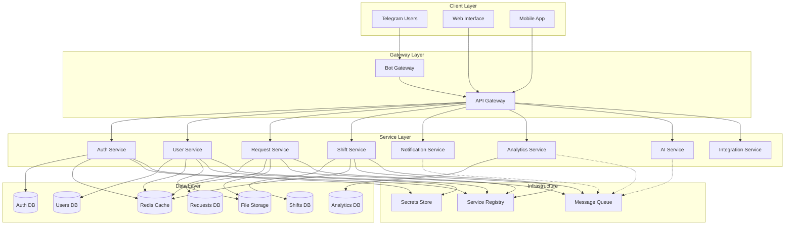

---

## 2. SERVICE INTERACTIONS

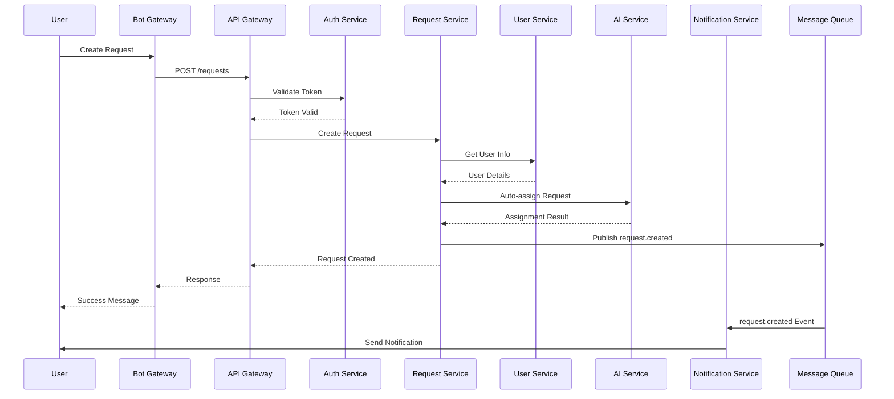

---

## 3. DATABASE SCHEMA

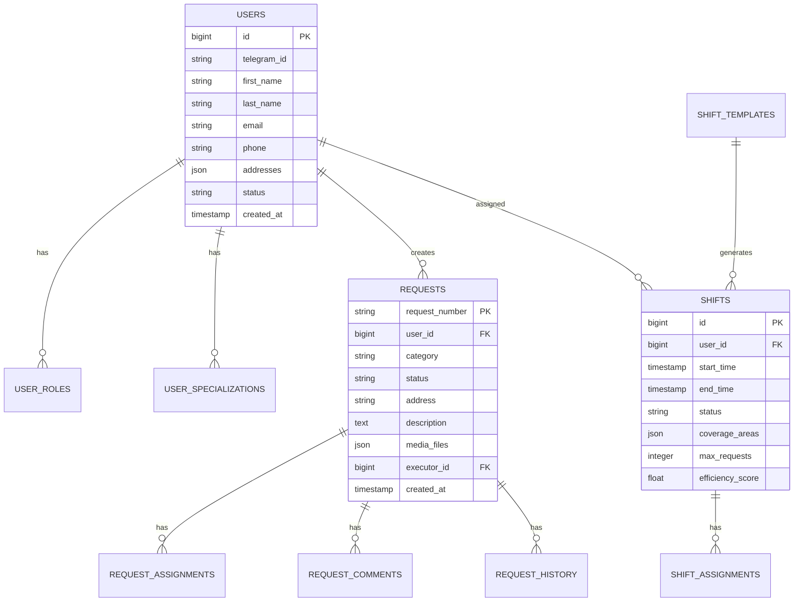

---

## 4. EVENT FLOW

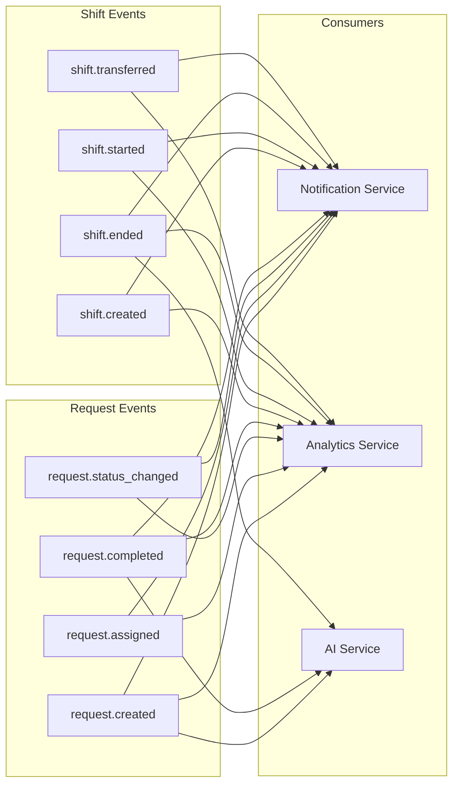

---

## 5. DEPLOYMENT ARCHITECTURE

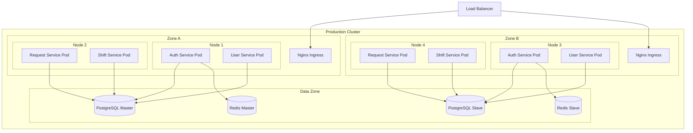

---

## 6. SECURITY ARCHITECTURE

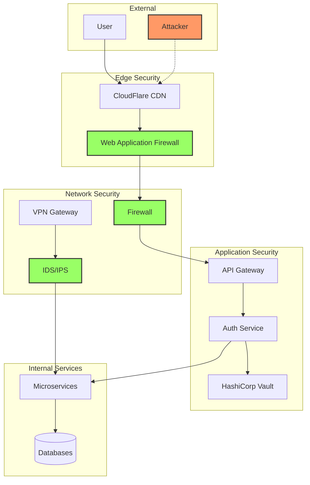

---

## 7. CI/CD PIPELINE

```mermaid
graph LR
    subgraph "Development"
        DEV[Developer]
        LOCAL[Local Test]
    end
    
    subgraph "Version Control"
        GIT[Git Repository]
        PR[Pull Request]
    end
    
    subgraph "CI Pipeline"
        BUILD[Build]
        TEST[Unit Tests]
        LINT[Code Quality]
        SEC[Security Scan]
        IMG[Build Image]
    end
    
    subgraph "CD Pipeline"
        STAGING[Deploy to Staging]
        E2E[E2E Tests]
        PERF[Performance Tests]
        PROD[Deploy to Production]
    end
    
    subgraph "Monitoring"
        MON[Monitoring]
        ALERT[Alerting]
    end
    
    DEV --> LOCAL
    LOCAL --> GIT
    GIT --> PR
    PR --> BUILD
    BUILD --> TEST
    TEST --> LINT
    LINT --> SEC
    SEC --> IMG
    IMG --> STAGING
    STAGING --> E2E
    E2E --> PERF
    PERF --> PROD
    PROD --> MON
    MON --> ALERT
    
    style BUILD fill:#ff9,stroke:#333,stroke-width:2px
    style TEST fill:#ff9,stroke:#333,stroke-width:2px
    style PROD fill:#9f9,stroke:#333,stroke-width:2px
```

---

## 8. DATA FLOW ARCHITECTURE

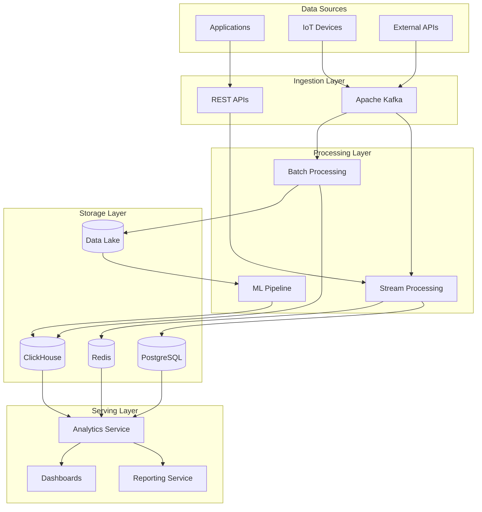

---

## 9. MONITORING ARCHITECTURE

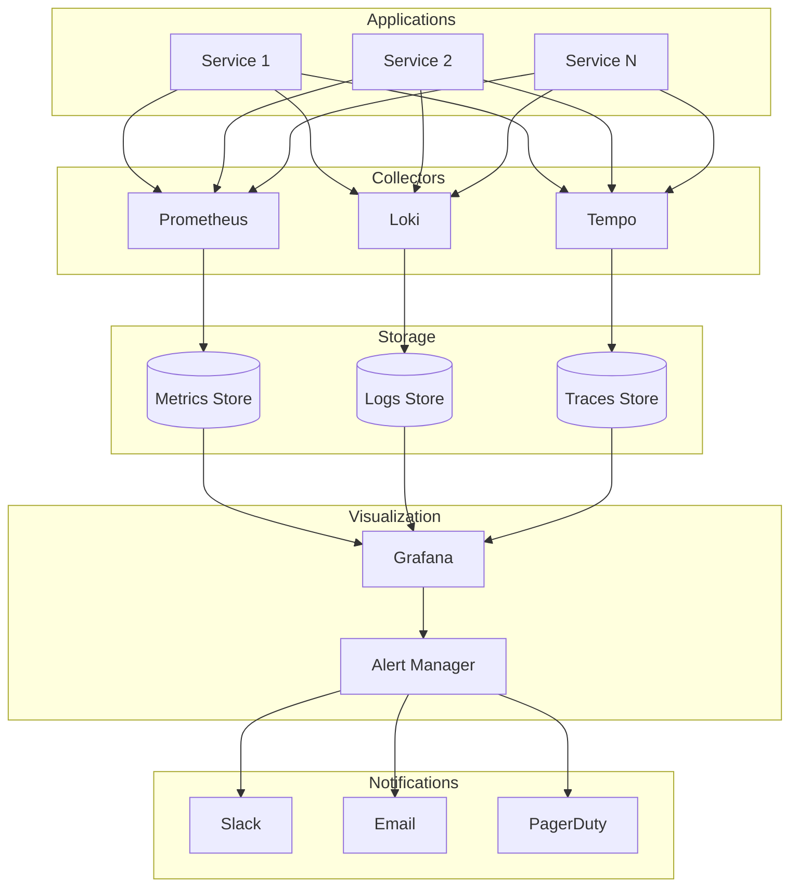

---

## 10. DISASTER RECOVERY

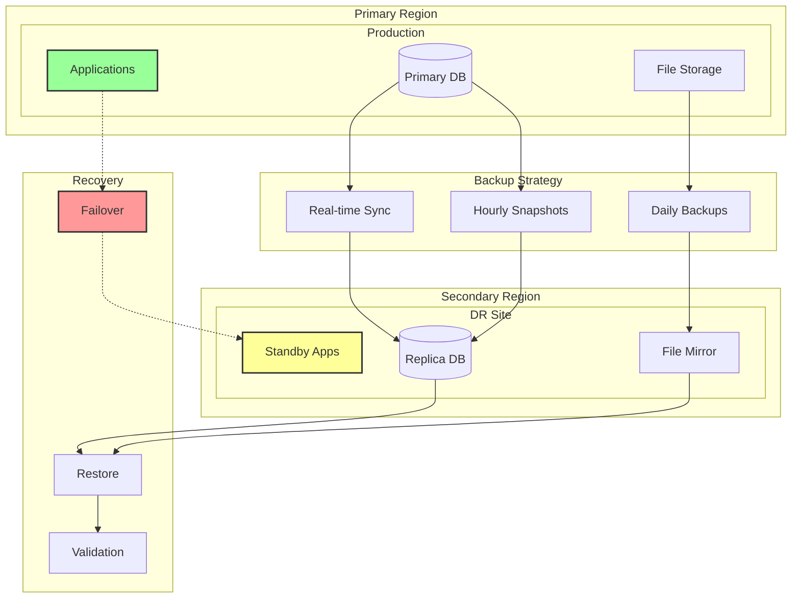

---

## LEGEND

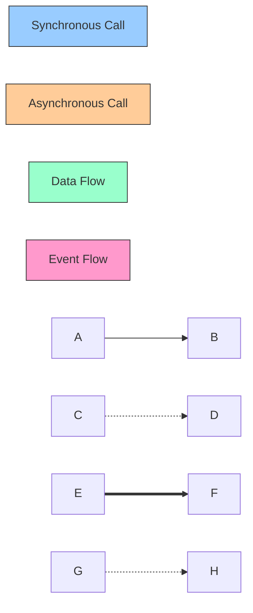

**Обозначения:**
- `-->` Синхронное взаимодействие
- `-.->` Асинхронное взаимодействие
- `==>` Поток данных
- `[( )]` База данных
- `[ ]` Сервис/Компонент
- `{ }` Внешняя система

---

**📝 Документ подготовлен**: Claude Code Assistant  
**📅 Дата**: 18 сентября 2025  
**🔄 Версия**: 1.0.0