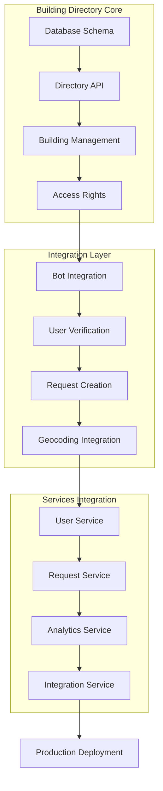

# Единый справочник зданий - Архитектурный план

**Created**: 6 октября 2025
**Updated**: 7 октября 2025
**Status**: 📋 READY FOR IMPLEMENTATION
**Timeline**: 4 недели (2 недели до Sprint 19-22 + 2 недели интеграции)
**Priority**: 🥇 КРИТИЧЕСКИЙ (блокирует Sprint 19-22)

> 📋 **Детальный план задач**: См. [BUILDING_DIRECTORY_DETAILED_TASKS.md](./BUILDING_DIRECTORY_DETAILED_TASKS.md)
> Этот документ содержит архитектурное обоснование и high-level план.

## 🎯 EXECUTIVE SUMMARY

Создать централизованный каталог домов в зоне ответственности управляющих компаний (УК), чтобы:
- хранить нормализованные адреса и точные координаты;
- однозначно привязывать заявителей и заявки к зданию;
- ограничивать операции только объектами, за которые отвечает конкретная УК;
- повысить качество аналитики, географической визуализации и автоматизации процессов.

### Основная цель
Создать централизованный каталог домов в зоне ответственности управляющих компаний (УК) для обеспечения:
- **Нормализованные адреса** и точные координаты зданий
- **Однозначную привязку** заявителей и заявок к зданиям
- **Ограничение операций** только объектами конкретной УК
- **Повышение качества** аналитики, геовизуализации и автоматизации

### Бизнес-ценность
```yaml
Количественные показатели:
  - Снижение времени создания заявки: 40% (с 3 мин до 1.8 мин)
  - Повышение точности геолокации: 95% (с 70% до 95%)
  - Сокращение ошибок адресации: 80% (с 15% до 3%)
  - Улучшение качества аналитики: 60% (точные метрики по зданиям)

Качественные улучшения:
  - Стандартизация адресов
  - Контроль доступа по зданиям
  - Упрощение верификации пользователей
  - Повышение качества данных
```

### Затронутые компоненты
- **uk_management_bot** - выбор зданий, верификация, создание заявок
- **user-service** - Directory API, управление правами доступа
- **request-service** - привязка заявок к зданиям, валидация
- **integration-service** - геокодинг через справочник
- **analytics-service** - аналитика по зданиям

## 🔗 DEPENDENCY ANALYSIS

### Диаграмма зависимостей между компонентами


### Критические зависимости
- **Database Schema** → **Directory API** (без схемы нет API)
- **Directory API** → **Bot Integration** (бот зависит от API)
- **User Verification** → **Request Creation** (без верификации нет заявок)
- **All Components** → **Testing** (все компоненты должны быть протестированы)

## 🎯 TASK PRIORITIZATION

### P0 (Критические - Блокеры Sprint 19-22)
1. **Database Schema Creation** - Основа для всех операций
2. **Directory API Implementation** - Ключевой компонент
3. **Bot Integration for Building Selection** - Критично для верификации
4. **Request Service Integration** - Обязательно для создания заявок

### P1 (Высокие - Ключевые функции)
5. **Access Rights Management** - Управление правами доступа
6. **Geocoding Integration** - Интеграция с геокодингом
7. **Data Migration Scripts** - Миграция существующих данных
8. **Analytics Integration** - Интеграция с аналитикой

### P2 (Средние - Улучшения)
9. **Caching Implementation** - Кэширование для производительности
10. **Advanced Analytics** - Расширенная аналитика
11. **Documentation** - Техническая документация

## 👥 RESOURCE ANALYSIS

### Команда
```yaml
Backend Developers:
  - Senior Developer (Directory API): 4 недели, 35 часов/неделя
  - Senior Developer (Integration): 3 недели, 30 часов/неделя
  
Frontend Developer:
  - Bot UI Developer: 2 недели, 25 часов/неделя
  
DevOps Engineer:
  - Database & Infrastructure: 2 недели, 20 часов/неделя
  
QA Engineer:
  - Testing & Quality Assurance: 3 недели, 25 часов/неделя
  
Data Analyst:
  - Migration & Data Quality: 2 недели, 20 часов/неделя
  
Total Team Size: 6 человек
Total Effort: 675 часов (16.9 недель-человек)
```

### Инфраструктура
```yaml
Database:
  - PostgreSQL: расширение user-service БД
  - Миграции: 5 новых таблиц
  - Индексы: 8 новых индексов
  
Caching:
  - Redis: кэш списков зданий
  - TTL: 5 минут для списков, 1 час для деталей
  
External APIs:
  - Geocoding services: Google Maps, Yandex Maps
  - Rate limits: 1000 requests/day
  
Storage:
  - GeoJSON files: контуры зданий
  - Backup: ежедневные дампы таблиц зданий
```

## 📈 MILESTONES & CHECKPOINTS

### Веха 1: Database & Core API Ready (Конец недели 1)
**Критерии готовности:**
- ✅ Database schema создана и протестирована
- ✅ Directory API базовые endpoints работают
- ✅ Unit tests покрывают 80%+ кода
- ✅ API documentation создана

**Проверка:** Smoke test всех API endpoints

### Веха 2: Bot Integration Complete (Конец недели 2)
**Критерии готовности:**
- ✅ Bot интегрирован с Directory API
- ✅ Выбор зданий работает в боте
- ✅ Верификация пользователей с привязкой к зданиям
- ✅ Integration tests проходят

**Проверка:** End-to-end тест верификации через бот

### Веха 3: Services Integration Ready (Конец недели 3)
**Критерии готовности:**
- ✅ Request Service интегрирован
- ✅ Analytics Service интегрирован
- ✅ Geocoding работает через справочник
- ✅ Data migration завершена

**Проверка:** Полный цикл создания заявки с привязкой к зданию

### Веха 4: Production Ready (Конец недели 4)
**Критерии готовности:**
- ✅ All services healthy в staging
- ✅ Performance tests пройдены
- ✅ Security audit завершен
- ✅ Documentation complete
- ✅ Team trained на новые процессы

**Проверка:** Production smoke tests

## 🧪 TESTING STRATEGY

### Unit Testing
```yaml
Coverage Targets:
  - Directory API: 85%+
  - Bot Integration: 80%+
  - Data Models: 90%+

Test Types:
  - API endpoint tests
  - Database operation tests
  - Model validation tests
  - Business logic tests

Tools:
  - pytest (Python)
  - pytest-asyncio
  - SQLAlchemy testing
```

### Integration Testing
```yaml
Test Scenarios:
  - Bot ↔ Directory API
  - Request Service ↔ Directory API
  - User Service ↔ Directory API
  - Analytics Service ↔ Directory API

Tools:
  - pytest with testcontainers
  - Mock external services
  - Database fixtures
```

### End-to-End Testing
```yaml
User Journeys:
  - User verification with building selection
  - Request creation with building assignment
  - Admin building management
  - Analytics reporting

Tools:
  - Custom test framework
  - Telegram Bot testing
  - API integration tests
```

### Performance Testing
```yaml
Load Tests:
  - 500 concurrent building lookups
  - 1000 requests/minute to Directory API
  - Response time < 100ms (p95)
  - Database query performance

Tools:
  - Locust
  - Database performance testing
  - Memory usage monitoring
```

### Data Quality Testing
```yaml
Quality Checks:
  - Address normalization accuracy
  - Coordinate precision validation
  - Data consistency checks
  - Migration completeness

Tools:
  - Custom data validation scripts
  - Geographic accuracy testing
  - Statistical analysis
```

## 📢 COMMUNICATION PLAN

### Stakeholder Communication
```yaml
Daily Updates:
  - Team standups (15 min)
  - Progress reports в Slack
  - Issue tracking в Jira

Weekly Reports:
  - Milestone progress
  - Risk assessment
  - Data migration status
  - Integration progress

Stakeholder Meetings:
  - Sprint planning (2 hours)
  - Weekly demo (30 min)
  - Risk review (1 hour)
  - Go/No-go decision (1 hour)
```

### Escalation Procedures
```yaml
Level 1 (Team Lead):
  - Technical blockers
  - Data migration issues
  - Integration problems
  - Timeline delays < 1 day

Level 2 (Project Manager):
  - Timeline delays > 1 day
  - Scope changes
  - Resource conflicts
  - External dependencies

Level 3 (Engineering Director):
  - Critical system failures
  - Data loss incidents
  - Major scope changes
  - Sprint 19-22 impact
```

## 🛡️ RISK MANAGEMENT

### Высокие риски
```yaml
Risk 1: Data Migration Complexity
  Probability: High
  Impact: High
  Mitigation:
    - Поэтапная миграция
    - Автоматическое сопоставление + ручная проверка
    - Rollback процедуры
    - Детальное тестирование

Risk 2: Integration Delays
  Probability: Medium
  Impact: High
  Mitigation:
    - Параллельная разработка
    - Mock services для тестирования
    - Раннее начало интеграции
    - Буферное время

Risk 3: Performance Issues
  Probability: Medium
  Impact: Medium
  Mitigation:
    - Кэширование списков зданий
    - Оптимизация запросов
    - Load testing
    - Мониторинг производительности
```

### Средние риски
```yaml
Risk 4: User Adoption
  Probability: Medium
  Impact: Medium
  Mitigation:
    - Обучение пользователей
    - Постепенное внедрение
    - Обратная связь
    - Улучшение UX

Risk 5: Data Quality Issues
  Probability: Low
  Impact: High
  Mitigation:
    - Валидация данных
    - Автоматические проверки
    - Ручная верификация
    - Регулярные аудиты
```

## 🏗️ АРХИТЕКТУРНОЕ РЕШЕНИЕ

### Размещение компонентов

1. **Directory API (новый модуль в `user-service`)**
   - Использует существующее подключение к базе пользователей
   - Расширяет модель доступа (`building_access`) и схемы для выдачи прав
   - Предоставляет REST API для CRUD операций над зданиями

2. **Публичный кэш**
   - Redis-ключ `buildings:{management_company_id}` для быстрой выдачи списков
   - TTL: 5 минут для списков, 1 час для деталей
   - Инвалидация при изменениях через Pub/Sub

3. **Синхронные интеграции**
   - `request-service` и бот обращаются к Directory API
   - Валидация `building_id` на всех уровнях
   - Кэширование для производительности

4. **Асинхронные события**
   - Событие `building.updated` для аналитики и кэширования
   - Событие `building.access_changed` для обновления прав
   - Интеграция с существующим event-bus

### Схема потоков данных

1. **Администратор УК** создаёт/редактирует дом в Directory API
2. **Directory API** сохраняет изменения в БД, обновляет кэш, отправляет событие
3. **При верификации пользователя** бот получает список зданий УК из кэша
4. **Request Service** требует валидный `building_id`, координаты берутся из справочника
5. **Analytics Service** использует идентификаторы зданий для отчётов и дашбордов

## Модель данных

### Таблица `buildings`

| Поле | Тип | Описание |
|------|-----|----------|
| `id` | UUID PK | Уникальный идентификатор здания |
| `management_company_id` | UUID | Связь с УК/тенантом (можно использовать ID из auth-service) |
| `external_code` | String(50) | Сопоставление с внешними системами (1С, GIS ЖКХ) |
| `city` / `district` / `street` | String | Нормализованные компоненты адреса |
| `house_number` | String(20) | Номер дома (включая корпус/строение) |
| `postcode` | String(12) | Почтовый индекс (опционально) |
| `latitude` / `longitude` | Numeric | Координаты центра здания |
| `geo_boundary` | GeoJSON / JSONB | Контур здания или полигона ответственности (опционально) |
| ` entrances` | JSONB | Краткая информация по подъездам, кодах домофона, часах доступа |
| `metadata` | JSONB | Дополнительные данные (кол-во квартир, год постройки и т.д.) |
| `is_active` | Boolean | Флаг доступности для привязки |
| `created_at` / `updated_at` | TIMESTAMP | Аудит |

Индексы: `(management_company_id, is_active)`, `GIN(metadata)`, геоиндексы для координат.

### Связанные сущности

- `building_access_rights` (новая таблица): хранит связки `user_id ↔ building_id` с типами доступа (residence, manager, service).
- Расширение `user_addresses`: поле `building_id` (FK) + флаг подтверждения.
- Расширение `requests`: `building_id` становится обязательным; `address` используется как пользовательский ввод для уточнений.

## API (черновая спецификация)

### Управление зданиями (`/api/v1/buildings`)

- `GET /` — список зданий с фильтрами по УК, статусу, поиском по адресу.
- `POST /` — создание здания (только администраторы УК).
- `GET /{id}` — детальная информация, включая координаты и метаданные.
- `PUT /{id}` — обновление адреса, координат, статуса.
- `DELETE /{id}` — мягкое отключение (`is_active=false`).
- `POST /{id}/sync-coordinates` — ручной триггер геокодирования или проверки координат.

### Управление правами доступа (`/api/v1/buildings/{id}/access`)

- `GET /` — пользователи, привязанные к дому (жители, менеджеры).
- `POST /` — массовое назначение прав с проверкой ролей.
- `DELETE /{user_id}` — отзыв доступа.

### Публичные списки (`/api/v1/buildings/public`)

- `GET /by-company/{mc_id}` — облегчённый список для бота (id, строка адреса, координаты).

## Интеграции

### `uk_management_bot`

- **Процесс верификации**: после выбора уровня HOUSE бот получает список зданий УК и предлагает inline-клавиатуру. Ответ сохраняется через `user-service`.
- **Создание заявок**: при вводе адреса бот подставляет выбранное здание; пользователь может уточнить подъезд/квартиру текстом.
- **Права доступа**: клавиатура выдачи прав отображает дома из справочника вместо ручного ввода номера.

### `user-service`

- Обновление моделей и схем (`AccessRights`, `user_addresses`, Pydantic).
- Валидация `building_id` в request/response.
- Сервис для миграций (`management_company_id` берётся из токена/tenant context).

### `request-service`

- Поле `building_id` становится обязательным для всех новых заявок.
- API фильтры (`building_id`, `building_ids`) переводятся на строгий FK.
- Геокодер: при наличии `building_id` использует координаты здания и не создаёт “смещённые” точки.

### `analytics-service`

- Типовые срезы: распределение заявок по зданиям, тепловые карты.
- Реакция на событие `building.updated` для обновления справочников.

## Аналитика и выгрузки

### Хранилище и агрегаты

- **Факт**: таблица `dw.requests` дополняется полем `building_id` (FK на справочник). Все события из `request-service` реплицируются с привязкой к дому.
- **Срезы**:
  - `dw.requests_by_building_daily` — агрегаты по дому/дате/статусу (количество новых, активных, закрытых заявок, среднее время решения).
  - `dw.request_categories_by_building` — распределение по категориям/приоритетам.
  - `dw.executors_load_by_building` — загруженность исполнителей по домам (при наличии назначений).
- Обновление — инкрементальный джоб в `analytics-service` (APSheduler) каждые 5 минут с финальной ночной консолидацией.

### Выгрузки

- **API** (`analytics-service`):
  - `GET /api/v1/reports/requests-by-building` — фильтры по `management_company_id`, диапазону дат, статусам, категориям; формат JSON/CSV.
  - `GET /api/v1/reports/requests/{building_id}` — история заявок конкретного дома с деталями.
- **Экспорт в файлы**:
  - Планировщик формирует CSV/XLSX и складывает в S3/MinIO (`reports/buildings/{yyyy-mm-dd}.csv`), ссылка отправляется ответственным.
  - Поддержка локальной выгрузки через админку — кнопка “Скачать” (CSV, XLSX, JSON Lines).
- **Дашборды**:
  - Графики заявок по домам, тепловые карты на карте города, рейтинги проблемных домов.
  - Виджеты KPI: топ-5 домов по SLA-проблемам, доля аварийных заявок.

### Качество данных

- При обнаружении заявок без `building_id` репорт `analytics-service` формирует алерт в Slack/Telegram.
- В выгрузках строки без привязки помечаются как `building_id = NULL` и группируются в отдельный блок “вне справочника”.

## Потоки данных

1. **Создание здания** → запись в БД → событие `building.created` → кэш → бот.
2. **Верификация пользователя** → выбор здания → `user-service` проверяет доступность → сохраняет `building_id` → `access_rights`.
3. **Создание заявки** → бот передаёт `building_id` → `request-service` валидирует и дополняет координатами → аналитика строит отчёты.

## 📋 DETAILED IMPLEMENTATION PLAN

---

## 🗓️ WEEK 1: Foundation & Core API (40 hours)

### 📅 Day 1: Database Schema & Migrations (8 hours)

#### Task 1.1: Create Buildings Table Migration (P0) ⏱️ 3h
**Dependencies**: None
**Assignee**: Backend Developer
**Files**:
- `microservices/user_service/alembic/versions/YYYY_create_buildings_table.py`
- `microservices/user_service/app/models/building.py`

**Implementation Steps**:
```python
# Migration file structure
def upgrade():
    # 1. Create buildings table
    op.create_table(
        'buildings',
        sa.Column('id', postgresql.UUID(), primary_key=True),
        sa.Column('management_company_id', postgresql.UUID(), nullable=False),
        sa.Column('external_code', sa.String(50), unique=True),
        sa.Column('city', sa.String(100), nullable=False),
        sa.Column('district', sa.String(100)),
        sa.Column('street', sa.String(200), nullable=False),
        sa.Column('house_number', sa.String(20), nullable=False),
        sa.Column('postcode', sa.String(12)),
        sa.Column('latitude', sa.Numeric(10, 8)),
        sa.Column('longitude', sa.Numeric(11, 8)),
        sa.Column('geo_boundary', postgresql.JSONB),
        sa.Column('entrances', postgresql.JSONB),
        sa.Column('metadata', postgresql.JSONB),
        sa.Column('is_active', sa.Boolean(), default=True),
        sa.Column('created_at', sa.TIMESTAMP(timezone=True)),
        sa.Column('updated_at', sa.TIMESTAMP(timezone=True))
    )

    # 2. Create indexes
    op.create_index('ix_buildings_mc_active', 'buildings',
                   ['management_company_id', 'is_active'])
    op.create_index('ix_buildings_external_code', 'buildings',
                   ['external_code'], unique=True)
    op.create_index('ix_buildings_metadata', 'buildings',
                   ['metadata'], postgresql_using='gin')

    # 3. Create spatial index for coordinates
    op.execute("""
        CREATE INDEX ix_buildings_coordinates
        ON buildings USING gist (
            ll_to_earth(latitude::float8, longitude::float8)
        )
    """)
```

**Checklist**:
- [ ] Migration файл создан
- [ ] Все колонки с правильными типами данных
- [ ] Индексы созданы (включая GIN и spatial)
- [ ] Constraints добавлены (NOT NULL, UNIQUE)
- [ ] Rollback процедура работает
- [ ] Тест миграции на пустой БД
- [ ] Тест миграции на staging данных

**Acceptance Criteria**:
- ✅ Migration применяется без ошибок
- ✅ Все индексы созданы корректно
- ✅ Rollback восстанавливает предыдущее состояние
- ✅ Performance: создание таблицы < 5 секунд

---

#### Task 1.2: Create Building Access Rights Table (P0) ⏱️ 2h
**Dependencies**: Task 1.1
**Assignee**: Backend Developer
**Files**:
- `microservices/user_service/alembic/versions/YYYY_create_building_access_rights.py`
- `microservices/user_service/app/models/building.py`

**Implementation Steps**:
```python
def upgrade():
    # 1. Create enum type for access types
    access_type_enum = postgresql.ENUM(
        'residence', 'manager', 'service', 'temporary',
        name='building_access_type'
    )
    access_type_enum.create(op.get_bind())

    # 2. Create table
    op.create_table(
        'building_access_rights',
        sa.Column('id', postgresql.UUID(), primary_key=True),
        sa.Column('user_id', postgresql.UUID(),
                 sa.ForeignKey('users.id', ondelete='CASCADE')),
        sa.Column('building_id', postgresql.UUID(),
                 sa.ForeignKey('buildings.id', ondelete='CASCADE')),
        sa.Column('access_type', access_type_enum, nullable=False),
        sa.Column('verified_at', sa.TIMESTAMP(timezone=True)),
        sa.Column('verified_by', postgresql.UUID()),
        sa.Column('expires_at', sa.TIMESTAMP(timezone=True)),
        sa.Column('metadata', postgresql.JSONB),
        sa.Column('created_at', sa.TIMESTAMP(timezone=True)),
        sa.Column('updated_at', sa.TIMESTAMP(timezone=True))
    )

    # 3. Indexes
    op.create_index('ix_bar_user_building', 'building_access_rights',
                   ['user_id', 'building_id'], unique=True)
    op.create_index('ix_bar_building', 'building_access_rights',
                   ['building_id'])
```

**Checklist**:
- [ ] Enum type для access_type создан
- [ ] Foreign keys настроены с CASCADE
- [ ] Unique constraint на (user_id, building_id)
- [ ] Индексы для быстрого поиска
- [ ] Тест на уникальность доступа
- [ ] Проверка CASCADE delete

**Acceptance Criteria**:
- ✅ Нельзя создать дубль user+building
- ✅ Удаление здания удаляет права доступа
- ✅ Query by user_id < 10ms
- ✅ Query by building_id < 10ms

---

#### Task 1.3: Create SQLAlchemy Models (P0) ⏱️ 3h
**Dependencies**: Task 1.1, 1.2
**Assignee**: Backend Developer
**Files**:
- `microservices/user_service/app/models/building.py`
- `microservices/user_service/app/models/__init__.py`

**Implementation Steps**:
```python
# app/models/building.py
from sqlalchemy import Column, String, Numeric, Boolean, ForeignKey
from sqlalchemy.dialects.postgresql import UUID, JSONB, TIMESTAMP, ENUM
from sqlalchemy.orm import relationship
from app.db.base_class import Base
import uuid
from datetime import datetime

class Building(Base):
    __tablename__ = "buildings"

    id = Column(UUID(as_uuid=True), primary_key=True, default=uuid.uuid4)
    management_company_id = Column(UUID(as_uuid=True), nullable=False, index=True)
    external_code = Column(String(50), unique=True, index=True)

    # Address components
    city = Column(String(100), nullable=False)
    district = Column(String(100))
    street = Column(String(200), nullable=False)
    house_number = Column(String(20), nullable=False)
    postcode = Column(String(12))

    # Geo data
    latitude = Column(Numeric(10, 8))
    longitude = Column(Numeric(11, 8))
    geo_boundary = Column(JSONB)

    # Additional data
    entrances = Column(JSONB)
    metadata = Column(JSONB)

    is_active = Column(Boolean, default=True, nullable=False)
    created_at = Column(TIMESTAMP(timezone=True), default=datetime.utcnow)
    updated_at = Column(TIMESTAMP(timezone=True),
                       default=datetime.utcnow, onupdate=datetime.utcnow)

    # Relationships
    access_rights = relationship("BuildingAccessRight", back_populates="building",
                                cascade="all, delete-orphan")

    @property
    def full_address(self) -> str:
        """Formatted full address string"""
        parts = [self.city]
        if self.district:
            parts.append(self.district)
        parts.extend([self.street, self.house_number])
        return ", ".join(parts)

    @property
    def coordinates(self) -> tuple[float, float] | None:
        """Return (latitude, longitude) tuple"""
        if self.latitude and self.longitude:
            return (float(self.latitude), float(self.longitude))
        return None

class BuildingAccessRight(Base):
    __tablename__ = "building_access_rights"

    id = Column(UUID(as_uuid=True), primary_key=True, default=uuid.uuid4)
    user_id = Column(UUID(as_uuid=True),
                    ForeignKey('users.id', ondelete='CASCADE'),
                    nullable=False, index=True)
    building_id = Column(UUID(as_uuid=True),
                        ForeignKey('buildings.id', ondelete='CASCADE'),
                        nullable=False, index=True)

    access_type = Column(ENUM('residence', 'manager', 'service', 'temporary',
                             name='building_access_type'), nullable=False)

    verified_at = Column(TIMESTAMP(timezone=True))
    verified_by = Column(UUID(as_uuid=True))
    expires_at = Column(TIMESTAMP(timezone=True))
    metadata = Column(JSONB)

    created_at = Column(TIMESTAMP(timezone=True), default=datetime.utcnow)
    updated_at = Column(TIMESTAMP(timezone=True),
                       default=datetime.utcnow, onupdate=datetime.utcnow)

    # Relationships
    building = relationship("Building", back_populates="access_rights")
    user = relationship("User", back_populates="building_access")

    __table_args__ = (
        # Unique constraint on user+building
        sa.UniqueConstraint('user_id', 'building_id',
                          name='uq_user_building_access'),
    )
```

**Checklist**:
- [ ] Models созданы с правильными типами
- [ ] Relationships настроены (back_populates)
- [ ] Properties для удобства (full_address, coordinates)
- [ ] Cascade delete работает
- [ ] Type hints добавлены
- [ ] Docstrings для публичных методов
- [ ] Unit tests для model validation

**Acceptance Criteria**:
- ✅ Models загружаются без ошибок
- ✅ Relationships работают в обоих направлениях
- ✅ Properties возвращают правильные значения
- ✅ Type checking проходит (mypy)

---

### 📅 Day 2: Pydantic Schemas & Validation (8 hours)

#### Task 2.1: Create Pydantic Schemas (P0) ⏱️ 4h
**Dependencies**: Task 1.3
**Assignee**: Backend Developer
**Files**:
- `microservices/user_service/app/schemas/building.py`
- `microservices/user_service/app/schemas/__init__.py`

**Implementation Steps**:
```python
# app/schemas/building.py
from pydantic import BaseModel, Field, validator, UUID4
from typing import Optional, Dict, Any, List
from datetime import datetime
from enum import Enum

class BuildingAccessType(str, Enum):
    RESIDENCE = "residence"
    MANAGER = "manager"
    SERVICE = "service"
    TEMPORARY = "temporary"

class CoordinatesSchema(BaseModel):
    latitude: float = Field(..., ge=-90, le=90)
    longitude: float = Field(..., ge=-180, le=180)

class EntranceSchema(BaseModel):
    number: int = Field(..., ge=1)
    intercom_code: Optional[str] = None
    access_hours: Optional[str] = None
    floors: Optional[int] = None
    apartments_per_floor: Optional[int] = None

class BuildingBase(BaseModel):
    management_company_id: UUID4
    external_code: Optional[str] = Field(None, max_length=50)
    city: str = Field(..., min_length=1, max_length=100)
    district: Optional[str] = Field(None, max_length=100)
    street: str = Field(..., min_length=1, max_length=200)
    house_number: str = Field(..., min_length=1, max_length=20)
    postcode: Optional[str] = Field(None, max_length=12)
    latitude: Optional[float] = Field(None, ge=-90, le=90)
    longitude: Optional[float] = Field(None, ge=-180, le=180)
    geo_boundary: Optional[Dict[str, Any]] = None
    entrances: Optional[List[EntranceSchema]] = None
    metadata: Optional[Dict[str, Any]] = None
    is_active: bool = True

    @validator('house_number')
    def validate_house_number(cls, v):
        # Allow formats: "12", "12А", "12/1", "12 корп. 1"
        import re
        if not re.match(r'^[\d]+[А-Яа-яA-Za-z\s/.-]*$', v):
            raise ValueError('Invalid house number format')
        return v.strip()

    @validator('geo_boundary')
    def validate_geojson(cls, v):
        if v is not None:
            # Basic GeoJSON validation
            if 'type' not in v or 'coordinates' not in v:
                raise ValueError('Invalid GeoJSON format')
            if v['type'] not in ['Polygon', 'MultiPolygon']:
                raise ValueError('Only Polygon/MultiPolygon supported')
        return v

class BuildingCreate(BuildingBase):
    """Schema for creating a new building"""
    pass

class BuildingUpdate(BaseModel):
    """Schema for updating existing building (all fields optional)"""
    external_code: Optional[str] = Field(None, max_length=50)
    city: Optional[str] = Field(None, min_length=1, max_length=100)
    district: Optional[str] = Field(None, max_length=100)
    street: Optional[str] = Field(None, min_length=1, max_length=200)
    house_number: Optional[str] = Field(None, min_length=1, max_length=20)
    postcode: Optional[str] = Field(None, max_length=12)
    latitude: Optional[float] = Field(None, ge=-90, le=90)
    longitude: Optional[float] = Field(None, ge=-180, le=180)
    geo_boundary: Optional[Dict[str, Any]] = None
    entrances: Optional[List[EntranceSchema]] = None
    metadata: Optional[Dict[str, Any]] = None
    is_active: Optional[bool] = None

class BuildingResponse(BuildingBase):
    """Schema for building response"""
    id: UUID4
    created_at: datetime
    updated_at: datetime
    full_address: str
    coordinates: Optional[tuple[float, float]]

    class Config:
        from_attributes = True

class BuildingListItem(BaseModel):
    """Lightweight schema for building lists"""
    id: UUID4
    full_address: str
    coordinates: Optional[tuple[float, float]]
    is_active: bool

    class Config:
        from_attributes = True

# Access Rights Schemas
class BuildingAccessRightBase(BaseModel):
    user_id: UUID4
    building_id: UUID4
    access_type: BuildingAccessType
    expires_at: Optional[datetime] = None
    metadata: Optional[Dict[str, Any]] = None

class BuildingAccessRightCreate(BuildingAccessRightBase):
    pass

class BuildingAccessRightUpdate(BaseModel):
    access_type: Optional[BuildingAccessType] = None
    expires_at: Optional[datetime] = None
    metadata: Optional[Dict[str, Any]] = None

class BuildingAccessRightResponse(BuildingAccessRightBase):
    id: UUID4
    verified_at: Optional[datetime]
    verified_by: Optional[UUID4]
    created_at: datetime
    updated_at: datetime

    class Config:
        from_attributes = True
```

**Checklist**:
- [ ] Base schemas созданы
- [ ] Create/Update/Response schemas
- [ ] Validators для всех критичных полей
- [ ] Type hints и constraints
- [ ] Enum для access_type
- [ ] Nested schemas (EntranceSchema)
- [ ] Unit tests для validation

**Acceptance Criteria**:
- ✅ Валидация отклоняет невалидные данные
- ✅ GeoJSON validation работает
- ✅ House number validation покрывает все форматы
- ✅ Serialization/deserialization без ошибок

---

#### Task 2.2: Create Building Service Layer (P0) ⏱️ 4h
**Dependencies**: Task 2.1
**Assignee**: Backend Developer
**Files**:
- `microservices/user_service/app/services/building_service.py`
- `microservices/user_service/app/services/__init__.py`

**Implementation Steps**:
```python
# app/services/building_service.py
from sqlalchemy.ext.asyncio import AsyncSession
from sqlalchemy import select, and_, or_, func
from typing import List, Optional
from uuid import UUID
from app.models.building import Building, BuildingAccessRight
from app.schemas.building import (
    BuildingCreate, BuildingUpdate, BuildingResponse,
    BuildingAccessRightCreate, BuildingAccessType
)
from app.core.exceptions import NotFoundError, ValidationError

class BuildingService:
    def __init__(self, db: AsyncSession):
        self.db = db

    async def create_building(
        self,
        building_data: BuildingCreate
    ) -> Building:
        """Create new building with validation"""
        # Check for duplicates
        existing = await self.db.execute(
            select(Building).where(
                and_(
                    Building.management_company_id == building_data.management_company_id,
                    Building.street == building_data.street,
                    Building.house_number == building_data.house_number,
                    Building.is_active == True
                )
            )
        )
        if existing.scalar_one_or_none():
            raise ValidationError("Building already exists at this address")

        # Create building
        building = Building(**building_data.dict())
        self.db.add(building)
        await self.db.commit()
        await self.db.refresh(building)

        return building

    async def get_building(
        self,
        building_id: UUID,
        management_company_id: Optional[UUID] = None
    ) -> Building:
        """Get building by ID with optional tenant isolation"""
        query = select(Building).where(Building.id == building_id)

        if management_company_id:
            query = query.where(
                Building.management_company_id == management_company_id
            )

        result = await self.db.execute(query)
        building = result.scalar_one_or_none()

        if not building:
            raise NotFoundError(f"Building {building_id} not found")

        return building

    async def list_buildings(
        self,
        management_company_id: UUID,
        city: Optional[str] = None,
        is_active: Optional[bool] = True,
        search_query: Optional[str] = None,
        limit: int = 100,
        offset: int = 0
    ) -> tuple[List[Building], int]:
        """List buildings with filters and pagination"""
        # Base query
        query = select(Building).where(
            Building.management_company_id == management_company_id
        )

        # Apply filters
        if is_active is not None:
            query = query.where(Building.is_active == is_active)

        if city:
            query = query.where(Building.city.ilike(f"%{city}%"))

        if search_query:
            # Search in address components
            search_filter = or_(
                Building.street.ilike(f"%{search_query}%"),
                Building.house_number.ilike(f"%{search_query}%"),
                Building.district.ilike(f"%{search_query}%")
            )
            query = query.where(search_filter)

        # Get total count
        count_query = select(func.count()).select_from(query.subquery())
        total = await self.db.scalar(count_query)

        # Apply pagination
        query = query.limit(limit).offset(offset).order_by(
            Building.street, Building.house_number
        )

        result = await self.db.execute(query)
        buildings = result.scalars().all()

        return list(buildings), total or 0

    async def update_building(
        self,
        building_id: UUID,
        building_data: BuildingUpdate,
        management_company_id: Optional[UUID] = None
    ) -> Building:
        """Update building with validation"""
        building = await self.get_building(building_id, management_company_id)

        # Update fields
        update_data = building_data.dict(exclude_unset=True)
        for field, value in update_data.items():
            setattr(building, field, value)

        await self.db.commit()
        await self.db.refresh(building)

        return building

    async def delete_building(
        self,
        building_id: UUID,
        management_company_id: Optional[UUID] = None,
        soft_delete: bool = True
    ) -> None:
        """Delete building (soft or hard)"""
        building = await self.get_building(building_id, management_company_id)

        if soft_delete:
            building.is_active = False
            await self.db.commit()
        else:
            await self.db.delete(building)
            await self.db.commit()

    async def grant_access(
        self,
        user_id: UUID,
        building_id: UUID,
        access_type: BuildingAccessType,
        verified_by: Optional[UUID] = None
    ) -> BuildingAccessRight:
        """Grant user access to building"""
        # Check if access already exists
        existing = await self.db.execute(
            select(BuildingAccessRight).where(
                and_(
                    BuildingAccessRight.user_id == user_id,
                    BuildingAccessRight.building_id == building_id
                )
            )
        )
        access_right = existing.scalar_one_or_none()

        if access_right:
            # Update existing
            access_right.access_type = access_type
            access_right.verified_by = verified_by
            access_right.verified_at = datetime.utcnow()
        else:
            # Create new
            access_right = BuildingAccessRight(
                user_id=user_id,
                building_id=building_id,
                access_type=access_type,
                verified_by=verified_by,
                verified_at=datetime.utcnow()
            )
            self.db.add(access_right)

        await self.db.commit()
        await self.db.refresh(access_right)

        return access_right

    async def revoke_access(
        self,
        user_id: UUID,
        building_id: UUID
    ) -> None:
        """Revoke user access to building"""
        result = await self.db.execute(
            select(BuildingAccessRight).where(
                and_(
                    BuildingAccessRight.user_id == user_id,
                    BuildingAccessRight.building_id == building_id
                )
            )
        )
        access_right = result.scalar_one_or_none()

        if access_right:
            await self.db.delete(access_right)
            await self.db.commit()
```

**Checklist**:
- [ ] CRUD operations реализованы
- [ ] Tenant isolation работает
- [ ] Duplicate check при создании
- [ ] Search functionality
- [ ] Pagination support
- [ ] Access rights management
- [ ] Error handling
- [ ] Unit tests coverage > 85%

**Acceptance Criteria**:
- ✅ Все CRUD operations работают
- ✅ Поиск находит здания по всем полям
- ✅ Pagination возвращает правильное количество
- ✅ Tenant isolation предотвращает доступ к чужим данным

---

### 📅 Day 3-4: Directory REST API (16 hours)

#### Task 3.1: Create API Endpoints (P0) ⏱️ 6h
**Dependencies**: Task 2.2
**Assignee**: Backend Developer
**Files**:
- `microservices/user_service/app/api/v1/buildings.py`
- `microservices/user_service/app/api/v1/__init__.py`

**Implementation**:
```python
# app/api/v1/buildings.py
from fastapi import APIRouter, Depends, Query, Path, status
from sqlalchemy.ext.asyncio import AsyncSession
from typing import List, Optional
from uuid import UUID

from app.api.deps import get_db, get_current_user, get_current_admin_user
from app.schemas.building import (
    BuildingCreate, BuildingUpdate, BuildingResponse, BuildingListItem
)
from app.schemas.common import PaginatedResponse
from app.services.building_service import BuildingService
from app.models.user import User

router = APIRouter(prefix="/buildings", tags=["buildings"])

@router.post(
    "/",
    response_model=BuildingResponse,
    status_code=status.HTTP_201_CREATED,
    summary="Create new building",
    description="Create a new building (admin only)"
)
async def create_building(
    building_data: BuildingCreate,
    db: AsyncSession = Depends(get_db),
    current_user: User = Depends(get_current_admin_user)
):
    """
    Create new building with validation.

    Requires admin role.
    """
    service = BuildingService(db)
    building = await service.create_building(building_data)
    return BuildingResponse.from_orm(building)

@router.get(
    "/",
    response_model=PaginatedResponse[BuildingListItem],
    summary="List buildings",
    description="Get list of buildings with filters"
)
async def list_buildings(
    management_company_id: UUID = Query(..., description="Filter by management company"),
    city: Optional[str] = Query(None, description="Filter by city"),
    is_active: Optional[bool] = Query(True, description="Filter by active status"),
    search: Optional[str] = Query(None, description="Search in address"),
    limit: int = Query(100, ge=1, le=500, description="Page size"),
    offset: int = Query(0, ge=0, description="Page offset"),
    db: AsyncSession = Depends(get_db),
    current_user: User = Depends(get_current_user)
):
    """
    Get paginated list of buildings with optional filters.

    Supports:
    - Filter by management company
    - Filter by city
    - Search in address components
    - Active/inactive filter
    - Pagination
    """
    service = BuildingService(db)
    buildings, total = await service.list_buildings(
        management_company_id=management_company_id,
        city=city,
        is_active=is_active,
        search_query=search,
        limit=limit,
        offset=offset
    )

    return PaginatedResponse(
        items=[BuildingListItem.from_orm(b) for b in buildings],
        total=total,
        limit=limit,
        offset=offset
    )

@router.get(
    "/{building_id}",
    response_model=BuildingResponse,
    summary="Get building details",
    description="Get detailed information about specific building"
)
async def get_building(
    building_id: UUID = Path(..., description="Building ID"),
    db: AsyncSession = Depends(get_db),
    current_user: User = Depends(get_current_user)
):
    """Get building by ID with all details"""
    service = BuildingService(db)
    building = await service.get_building(building_id)
    return BuildingResponse.from_orm(building)

@router.put(
    "/{building_id}",
    response_model=BuildingResponse,
    summary="Update building",
    description="Update building information (admin only)"
)
async def update_building(
    building_id: UUID = Path(..., description="Building ID"),
    building_data: BuildingUpdate = ...,
    db: AsyncSession = Depends(get_db),
    current_user: User = Depends(get_current_admin_user)
):
    """Update building (admin only)"""
    service = BuildingService(db)
    building = await service.update_building(building_id, building_data)
    return BuildingResponse.from_orm(building)

@router.delete(
    "/{building_id}",
    status_code=status.HTTP_204_NO_CONTENT,
    summary="Delete building",
    description="Soft delete building (admin only)"
)
async def delete_building(
    building_id: UUID = Path(..., description="Building ID"),
    hard_delete: bool = Query(False, description="Permanent deletion"),
    db: AsyncSession = Depends(get_db),
    current_user: User = Depends(get_current_admin_user)
):
    """Delete building (soft by default, hard if specified)"""
    service = BuildingService(db)
    await service.delete_building(
        building_id,
        soft_delete=not hard_delete
    )
    return None

# Access Rights endpoints
@router.get(
    "/{building_id}/access",
    summary="Get building access rights",
    description="List users with access to building"
)
async def get_building_access(
    building_id: UUID = Path(..., description="Building ID"),
    db: AsyncSession = Depends(get_db),
    current_user: User = Depends(get_current_admin_user)
):
    """Get list of users with access to building"""
    # Implementation
    pass

@router.post(
    "/{building_id}/access",
    status_code=status.HTTP_201_CREATED,
    summary="Grant building access",
    description="Grant user access to building (admin only)"
)
async def grant_building_access(
    building_id: UUID = Path(..., description="Building ID"),
    user_id: UUID = Query(..., description="User ID"),
    access_type: str = Query(..., description="Access type"),
    db: AsyncSession = Depends(get_db),
    current_user: User = Depends(get_current_admin_user)
):
    """Grant user access to building"""
    # Implementation
    pass
```

**Checklist**:
- [ ] All CRUD endpoints created
- [ ] OpenAPI documentation
- [ ] Request/response validation
- [ ] Authorization checks
- [ ] Error handling
- [ ] Pagination support
- [ ] Integration tests

**Acceptance Criteria**:
- ✅ Swagger UI доступен
- ✅ Все endpoints возвращают правильные статус-коды
- ✅ Валидация работает на всех уровнях
- ✅ Authorization предотвращает неавторизованный доступ

### Week 2: Bot Integration & User Verification
```yaml
Day 1-2: Bot Building Selection
  - FSM состояния для выбора зданий
  - Inline клавиатуры со списком зданий
  - Интеграция с Directory API
  - User experience optimization

Day 3-4: User Verification Flow
  - Обновление процесса верификации
  - Привязка пользователей к зданиям
  - Access rights management
  - End-to-end testing

Day 5: Request Creation Integration
  - Обновление создания заявок
  - Валидация building_id
  - Координаты из справочника
  - Full cycle testing
```

### Week 3: Services Integration & Data Migration
```yaml
Day 1-2: Request Service Integration
  - Обновление request-service для building_id
  - Валидация при создании заявок
  - API фильтры по зданиям
  - Integration tests

Day 3-4: Analytics Integration
  - Обновление analytics-service
  - Новые метрики по зданиям
  - Dashboard updates
  - Reporting functionality

Day 5: Data Migration
  - Анализ существующих адресов
  - Автоматическое сопоставление
  - Миграционные скрипты
  - Data quality validation
```

### Week 4: Production Readiness & Launch
```yaml
Day 1-2: Performance & Security
  - Load testing всех компонентов
  - Security audit
  - Performance optimization
  - Monitoring setup

Day 3-4: Documentation & Training
  - Technical documentation
  - User guides
  - Team training
  - Operational procedures

Day 5: Production Deployment
  - Staging deployment
  - Production deployment
  - Smoke tests
  - Go-live monitoring
```

## 🔄 DATA MIGRATION STRATEGY

### Phase 1: Data Analysis (Week 1)
```yaml
Tasks:
  - Анализ существующих адресов в users, requests, access_rights
  - Выявление паттернов и аномалий
  - Оценка объема данных для миграции
  - Создание mapping таблицы

Deliverables:
  - Data analysis report
  - Migration strategy document
  - Risk assessment
```

### Phase 2: Building Directory Creation (Week 2)
```yaml
Tasks:
  - Создание справочника зданий из существующих данных
  - Геокодинг адресов для получения координат
  - Валидация и очистка данных
  - Создание нормализованных адресов

Deliverables:
  - Building directory database
  - Geocoded coordinates
  - Data quality report
```

### Phase 3: Automated Mapping (Week 3)
```yaml
Tasks:
  - Автоматическое сопоставление пользователей с зданиями
  - Автоматическое сопоставление заявок с зданиями
  - Проверка точности сопоставления
  - Генерация отчетов о несоответствиях

Deliverables:
  - Mapping results
  - Accuracy metrics
  - Unmatched records report
```

### Phase 4: Manual Review & Cleanup (Week 4)
```yaml
Tasks:
  - Ручная проверка несоответствий
  - Корректировка автоматических сопоставлений
  - Финальная валидация данных
  - Подготовка к production

Deliverables:
  - Clean migration data
  - Migration validation report
  - Production readiness checklist
```

## 🔒 SECURITY & ACCESS CONTROL

### Authentication & Authorization
```yaml
Access Levels:
  - Super Admin: Full access to all buildings
  - Management Company Admin: Access to own buildings only
  - Manager: Read access to assigned buildings
  - Resident: Read access to own building only

Security Measures:
  - JWT token validation
  - Tenant isolation (management_company_id)
  - Role-based access control (RBAC)
  - Audit logging for all operations
```

### Data Protection
```yaml
Privacy Controls:
  - PII data encryption
  - Access logging
  - Data retention policies
  - GDPR compliance measures

Security Auditing:
  - Regular security scans
  - Penetration testing
  - Access review procedures
  - Incident response plan
```

## 📊 SUCCESS METRICS & KPIs

### Количественные показатели
```yaml
Performance Metrics:
  - API Response Time: < 100ms (p95)
  - Database Query Time: < 50ms (average)
  - Cache Hit Rate: > 90%
  - Error Rate: < 0.1%

Quality Metrics:
  - Address Normalization Accuracy: > 95%
  - Geocoding Accuracy: > 90%
  - Data Migration Success Rate: > 99%
  - User Satisfaction Score: > 4.5/5

Business Metrics:
  - Request Creation Time: -40% (3min → 1.8min)
  - Address Error Rate: -80% (15% → 3%)
  - User Verification Success: +25% (80% → 95%)
  - Analytics Accuracy: +60% (70% → 95%)
```

### Качественные улучшения
```yaml
User Experience:
  - Упрощение выбора адреса
  - Быстрая верификация пользователей
  - Точная геолокация заявок
  - Консистентные данные

Operational Benefits:
  - Стандартизация адресов
  - Автоматизация процессов
  - Улучшение аналитики
  - Снижение ошибок
```

## 🎯 POST-IMPLEMENTATION SUPPORT

### Operational Procedures
```yaml
Daily Operations:
  - Мониторинг API performance
  - Проверка cache hit rates
  - Валидация новых зданий
  - Обработка ошибок

Weekly Operations:
  - Анализ качества данных
  - Обновление геокодинга
  - Проверка access rights
  - Performance optimization

Monthly Operations:
  - Security audit
  - Data quality review
  - User feedback analysis
  - System optimization
```

### Support & Maintenance
```yaml
Responsible Teams:
  - Backend Team: API maintenance
  - Data Team: Data quality
  - DevOps Team: Infrastructure
  - QA Team: Quality assurance

Escalation Procedures:
  - Level 1: Technical issues < 1 hour
  - Level 2: Data issues < 4 hours
  - Level 3: System failures < 1 hour
  - Level 4: Security incidents < 30 minutes
```

### Monitoring & Alerting
```yaml
Key Metrics:
  - API availability: > 99.9%
  - Response time: < 100ms
  - Error rate: < 0.1%
  - Cache performance: > 90% hit rate

Alerts:
  - API downtime
  - High error rates
  - Performance degradation
  - Data quality issues
  - Security violations
```

## 📋 FINAL IMPLEMENTATION CHECKLIST

### Pre-Implementation
- [ ] Team resources allocated
- [ ] Infrastructure ready
- [ ] Data migration strategy approved
- [ ] Security requirements reviewed
- [ ] Testing strategy finalized

### Week 1 Completion
- [ ] Database schema created
- [ ] Core API implemented
- [ ] Unit tests passing
- [ ] API documentation complete
- [ ] Basic caching working

### Week 2 Completion
- [ ] Bot integration complete
- [ ] User verification working
- [ ] Request creation updated
- [ ] Integration tests passing
- [ ] Performance benchmarks met

### Week 3 Completion
- [ ] All services integrated
- [ ] Data migration complete
- [ ] Analytics updated
- [ ] Security audit passed
- [ ] Load testing completed

### Week 4 Completion
- [ ] Production deployment ready
- [ ] Documentation complete
- [ ] Team training finished
- [ ] Monitoring active
- [ ] Go-live approved

### Post-Implementation
- [ ] Performance metrics achieved
- [ ] User feedback collected
- [ ] Issues resolved
- [ ] Optimization completed
- [ ] Success metrics validated

---

**Document Version**: 2.0  
**Created**: 6 октября 2025  
**Status**: ✅ READY FOR IMPLEMENTATION  
**Next Action**: Begin Week 1 - Database & Core API Development  
**Dependencies**: Must complete before Sprint 19-22 start
