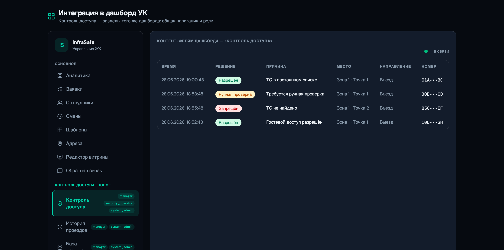
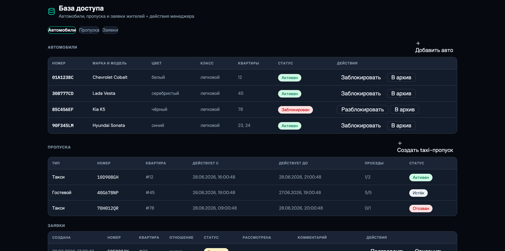
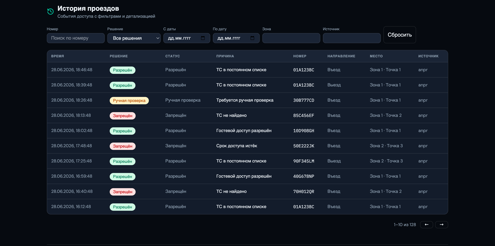
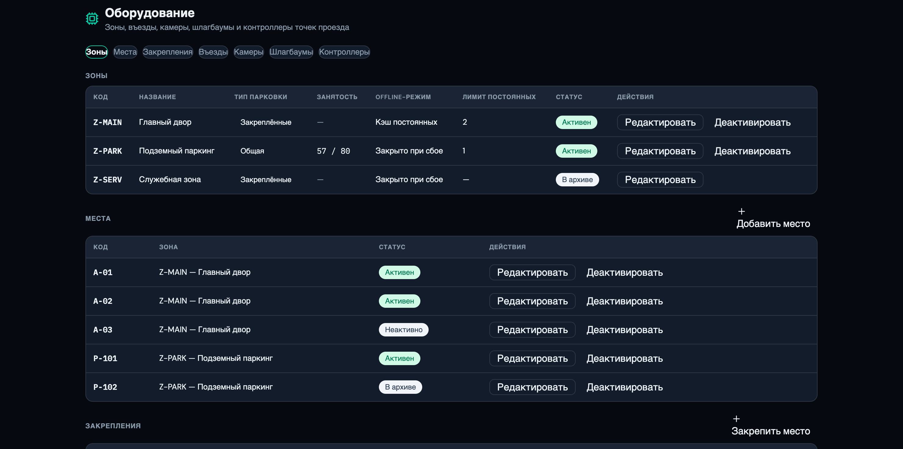
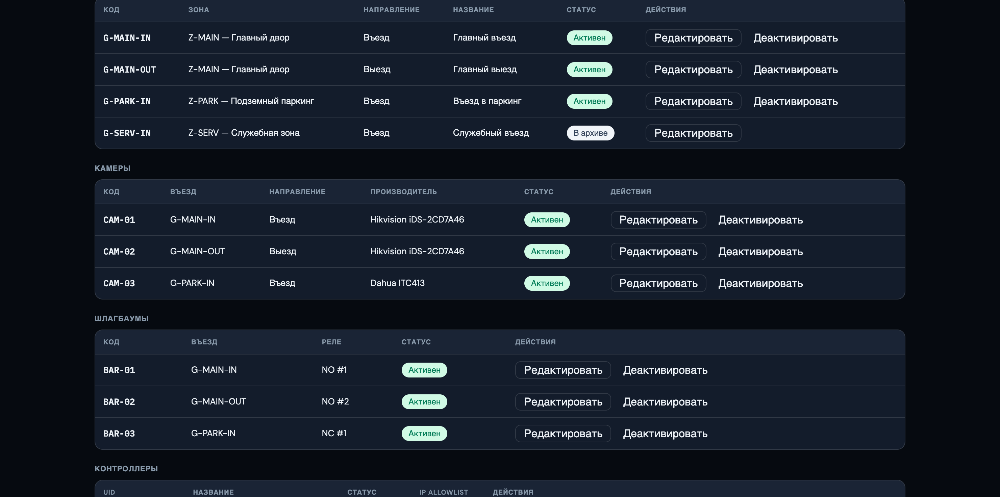

# Инструкция менеджера / администратора — Контроль доступа

> _Последнее редактирование: 2026-06-28_

Менеджер УК работает в **дашборде** в разделах контроля доступа. Часть функций
(оборудование, device-ключи) доступна только системному администратору (`system_admin`).

> Роли: `manager` — авто, заявки, пропуска, зоны, история; `system_admin` — дополнительно
> камеры, шлагбаумы, edge-контроллеры и device-ключи.

Контроль доступа — это **разделы того же дашборда УК**: общая навигация, вход и роли.

---

## 1. База доступа (раздел «База доступа»)

Три вкладки:

### Автомобили
Список авто: номер (оригинал/нормализованный), страна/тип, марка/цвет, статус
(активен/заблокирован/архив), связанные квартиры. Действия:
- **«Добавить авто»** — создать авто и при необходимости привязать к квартире (+ право на зону).
- **«Заблокировать»** — с обязательной причиной (фиксируется); **«Разблокировать»**, **«В архив»**.

### Пропуска
Список временных пропусков (тип, квартира, номер, зона, срок, использовано/лимит, статус).
- **«Создать taxi-пропуск»** — выдать пропуск вручную.

### Заявки жителей
Заявки на постоянный авто (квартира, заявитель, номер, тип связи, статус).
- **«Подтвердить»** (опц. зона + комментарий) — активирует постоянный авто (создаются
  авто + связь с квартирой + право на зону), житель получает уведомление.
- **«Отклонить»** — с комментарием.

---

## 2. История проездов (раздел «История проездов»)

Журнал всех проездов с фильтрами (период, решение, зона, номер, источник) и пагинацией.
Клик по строке → деталь: камера, достоверность, append-only цепочка решений, команды
шлагбаума, ручные открытия, фото.

---

## 3. Оборудование и зоны (раздел «Оборудование»)

Управление топологией точек въезда. Зоны и въезды — `manager`+`system_admin`; камеры,
шлагбаумы, контроллеры — только `system_admin`.

Вкладки:
- **Зоны** — код, название, **тип парковки** (закреплённая/общая), ёмкость, лимит авто на
  квартиру, привязанные **фазы** (yards). Для общих зон видна занятость.
- **Въезды** — точка проезда, направление.
- **Камеры** — привязка к въезду, вендор/модель, доп-атрибуты (JSON).
- **Шлагбаумы** — тип реле, конфиг (JSON).
- **Контроллеры (edge)** — создание контроллера выдаёт **device API-ключ один раз**
  (сохраните!); есть **ротация ключа**.

### Тип парковки
- **Закреплённые места** — заведите **места** (вкладка «Места») и **закрепления** за
  квартирами (вкладка «Закрепления»: владение `owned`/аренда `rented` со сроком; отзыв/
  продление). Авто квартиры пускают при активном закреплении; просрочка аренды → отказ.
- **Общие зоны** — личных мест нет; пускаем все авто квартиры, обслуживаемой зоной;
  гибкий лимит на квартиру. Сейчас ведётся **учёт заездов**; полный контроль занятости —
  после оснащения выездных камер.

### Диагностика точки (без камеры)
Для контроллера — действие **«Тест»**: синтетический проезд проходит реальный Decision
Engine, видно решение/команду; событие появляется в live-ленте и истории (помечено как
диагностическое). Позволяет принять настроенную точку до подключения реальной камеры.

---

## 4. Что менеджер НЕ может
- Изменять или удалять события/решения/аудит (журналы append-only).
- Открывать шлагбаум «за оператора» без причины и аудита.

---

### Типовые сценарии
- **Новый житель с авто:** житель подаёт заявку → вы подтверждаете в «База доступа →
  Заявки» → авто активируется автоматически.
- **Заблокировать должника:** «База доступа → Автомобили → Заблокировать» с причиной.
- **Завести подземный паркинг с местами:** «Оборудование → Зоны» (тип «закреплённые») →
  «Места» → «Закрепления» за квартирами (купля/аренда+срок).
- **Принять точку въезда без камеры:** «Оборудование → Контроллеры → Тест».
