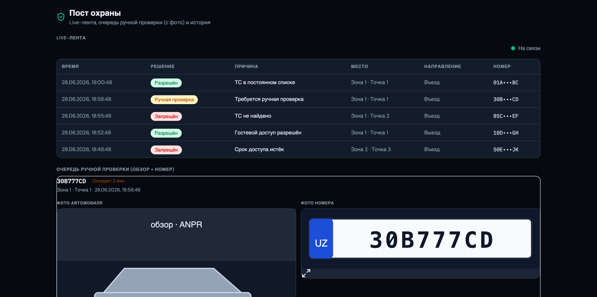
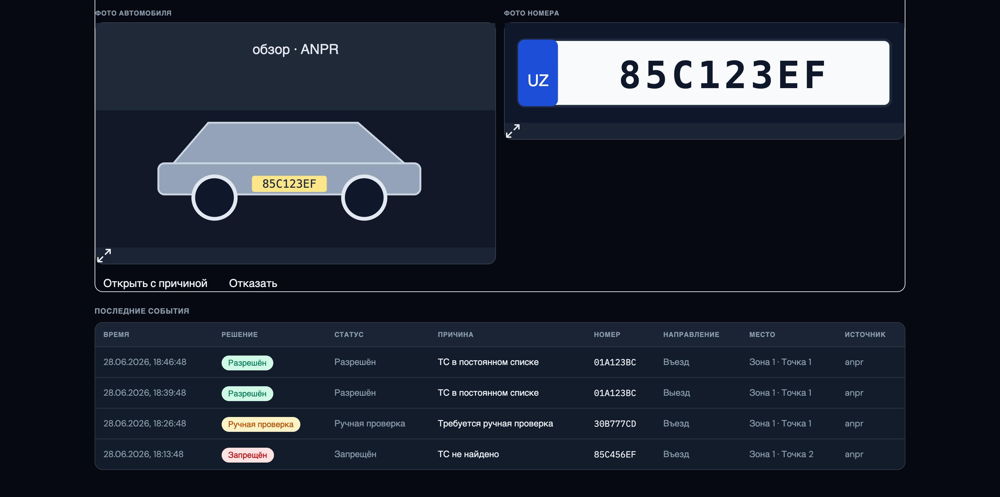
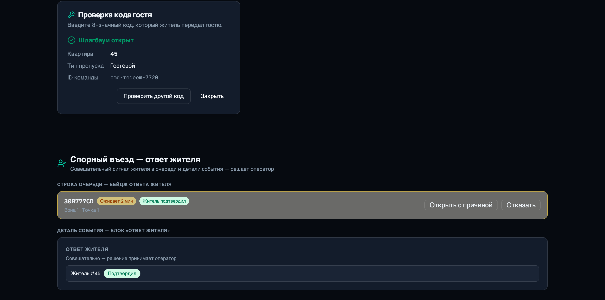
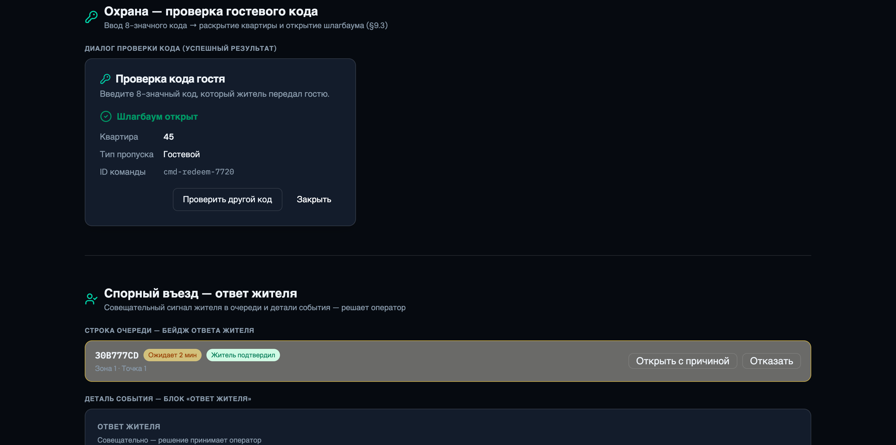

# Инструкция охраны — Пост охраны

> _Последнее редактирование: 2026-06-28_

Оператор охраны работает в **дашборде УК**, раздел **«Контроль доступа»** (Пост охраны).
Вход — личный аккаунт (роль `security_operator`); под общим аккаунтом работать нельзя.

> Все ручные действия требуют **персонального аккаунта и причины** и фиксируются в аудите.

---

## 1. Live-лента въездов

Раздел открывается на вкладке **Live** — события приходят в реальном времени по
защищённому WebSocket: время, решение (🟢 разрешён / 🔴 запрещён / 🟠 ручная проверка),
причина, зона·точка, направление, **маскированный номер** (полный номер — в детали события).

Индикатор «На связи» показывает состояние соединения.

---

## 2. Очередь ручной проверки (manual_review)

Когда система не уверена (низкое качество распознавания, аномалия), решение попадает в
**очередь ручной проверки** с таймером ожидания. По каждому событию видны **фото
автомобиля и фото номера**, и доступны два действия:

- **«Открыть с причиной»** — впустить: укажите причину → создаётся ручное открытие и
  команда на шлагбаум.
- **«Отказать»** — зафиксировать отказ с причиной (без открытия).

Если не решить в отведённое время — событие автоматически становится **просроченным**
(автоматическое открытие не происходит).

> **Ответ жителя.** Если по номеру был спорный въезд, в карточке/детали виден ответ
> жителя — «Житель подтвердил/отклонил». Это **совещательный сигнал**: решение всё равно
> принимаете вы.

---

## 3. Проверка гостевого кода

Гость без зарегистрированного номера называет **8-значный код**. На Посту охраны:

1. Кнопка **«Проверить код гостя»**.
2. Введите код → **«Проверить»**.
3. При успехе раскрываются **квартира и тип пропуска**, шлагбаум открывается.
4. Неверный/просроченный код → общая ошибка (детали не раскрываются). После нескольких
   неверных попыток ввод временно блокируется.

> Квартира и тип заявки показываются **только после успешной проверки кода** (защита ПД).

---

## 4. Ручное открытие без события

Если нужно открыть шлагбаум вне привязки к событию (аварийная служба, техпроверка) —
используется ручное открытие с **обязательной причиной**. Если по этому шлагбауму есть
активная ручная проверка — система вернёт конфликт и предложит сначала разрешить её.

---

## 5. Поиск и история

- **История/поиск** — последние события с фильтрами (номер, решение, период) и переходом
  в деталь события (камера, достоверность, цепочка решений и команд, фото).

---

### Важно
- Решение об открытии принимает система/оператор — медленный ответ backend **не даёт**
  edge открыть шлагбаум самовольно.
- Все ручные открытия и отказы — с причиной и под вашим аккаунтом (аудит).
- Полные номера/фото — только в интерфейсе по праву доступа, не в общих логах.
