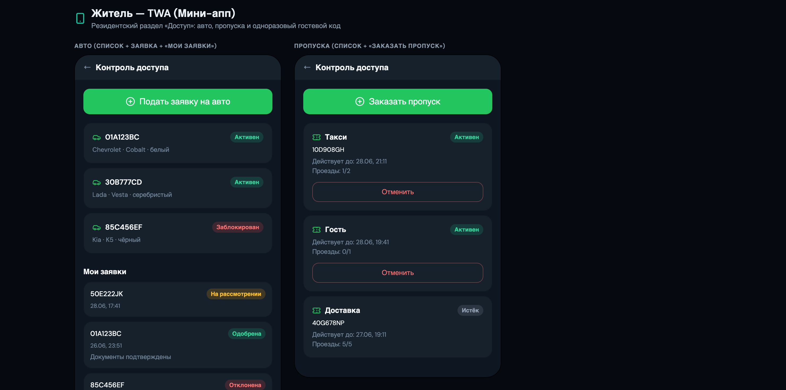
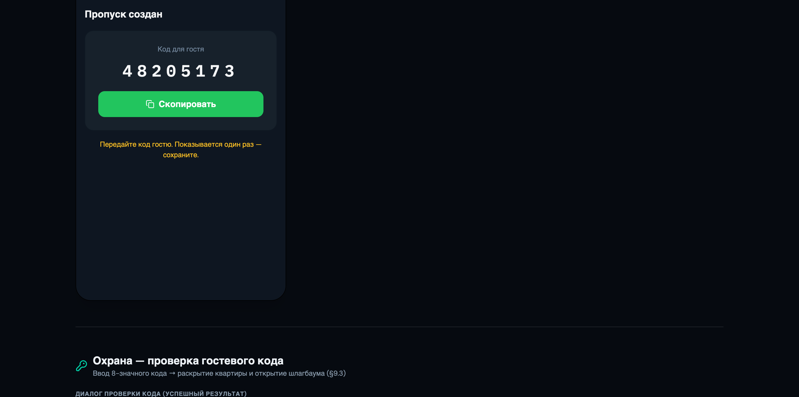

# Инструкция жителя — Контроль доступа

Житель управляет своими автомобилями и пропусками через **Telegram-бот** или
**Mini App (TWA)**. Доступ только к **своим подтверждённым квартирам**.

> Роль: `applicant`. Все действия — для квартир, где вы подтверждены управляющей компанией.

---

## 1. Где находится

- **Бот:** меню → **«Контроль доступа»** (появляется у жителя).
- **Mini App (TWA):** нижняя вкладка **«Доступ»**.

Разделы: **Авто**, **Пропуска**, **Проезды**.

---

## 2. Постоянный автомобиль

Чтобы ваш автомобиль пускали постоянно, подайте заявку — её подтверждает управляющая компания.

1. **Авто → «Подать заявку на авто»**.
2. Укажите **гос-номер**, **тип связи** (владелец / арендатор / семья / служебный),
   при необходимости — марку/цвет и квартиру (если их несколько).
3. Отправьте. Заявка появится в **«Мои заявки»** со статусом **«На рассмотрении»**.
4. После решения УК придёт **уведомление в бот** («Одобрено» / «Отклонено» с причиной).
   Одобренный авто начинает открывать шлагбаум автоматически.

> Несколько машин на квартиру — норма (например, приезжаете на разных служебных авто):
> все зарегистрированные на квартиру номера получают доступ согласно типу парковки.

---

## 3. Временный пропуск (такси / гость / доставка)

1. **Пропуска → «Заказать пропуск»**.
2. Выберите тип: **такси**, **гость** или **доставка**.
3. Укажите **гос-номер** (если известен) и **срок действия**; при необходимости — квартиру.
4. Готово — пропуск активен; в списке видно срок и счётчик въездов (использовано/лимит).
   Активный пропуск можно **отменить** кнопкой «Отменить».

---

## 4. Гостевой код (гость без номера)

Если номер гостя заранее неизвестен — создайте гостевой пропуск **без номера**:
система выдаст **одноразовый 8-значный код**.

- Код показывается **один раз** — скопируйте и передайте гостю.
- Срок действия — до 30 минут; код одноразовый.
- На въезде гость называет код охране — охрана проверяет его и открывает шлагбаум.
- Код нигде не хранится в открытом виде и не попадает в логи.

---

## 5. Спорный въезд (подтверждение)

Если по вашему номеру возникает спорная ситуация (например, нечёткое распознавание),
система может прислать в бот запрос:

> ⚠️ «Спорный въезд по вашему авто •••123, зона 3. Это вы?» — **[Подтвердить] [Отклонить]**

- Нажмите **«Подтвердить»** или **«Отклонить»** — ваш ответ увидит охрана.
- Это **совещательный** ответ: финальное решение об открытии принимает оператор охраны
  (для защиты от подмены номера).

---

## 6. Просмотр проездов

**Проезды** — последние въезды по вашим автомобилям: время, решение (разрешён/отказ),
направление, место. Видны только ваши события.

---

### Частые вопросы
- **Не вижу раздел «Контроль доступа».** Убедитесь, что у вас роль жителя и есть
  подтверждённая квартира.
- **Заявка долго «на рассмотрении».** Подтверждение — на стороне УК; придёт уведомление.
- **Потерял гостевой код.** Создайте новый гостевой пропуск (старый можно отменить).
