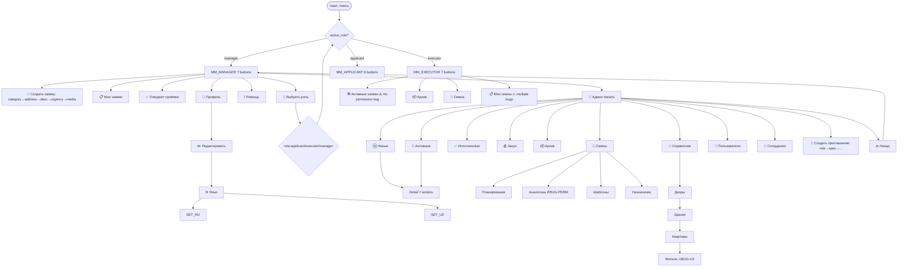

# UK Bot — Полный граф переходов по кнопкам (E2E через MCP)

> _Последнее редактирование: 2026-05-28_

> # 🔄 ОБНОВЛЕНИЕ 2026-05-28 (PROD, роль MANAGER)
>
> Исходный отчёт ниже (2026-05-21) снят на **DEV**-боте `@Work_space_away_bot` с другим набором данных (14 жителей / 31 staff). Этот раздел — **актуальное состояние на PROD** (`@infrasafebot`), полный обход меню менеджера через MCP `telegram-qa` 2026-05-28.
>
> **Среда:** prod, бот `@infrasafebot`. **Test user:** id=4, tg=6055402868 (временно повышен до manager, восстановлен в executor по окончании). **Данные:** 7 пользователей (id=1 Andrey — реальный, id=2 dummy-житель, id=3 InfraSafe system, id=4–7 тестовые исполнители).
>
> Легенда: **R** reply-кнопка · **I** inline (callback) · 🔁 FSM-шаг · ✓ работает · ✗ баг · ⚠ работает с замечаниями · ⛔ не выполнялось намеренно.
>
> ## Граф меню менеджера (актуальный)
>
> ```
> /start (active_role=manager)
> └─ MM_MANAGER (R): 📝 Создать заявку | 📋 Мои заявки | ✅ Ожидают приёмки |
>                    👤 Профиль | ℹ️ Помощь | 🔀 Выбрать роль | 🔧 Админ панель
>    └─ 🔧 Админ панель → ADMIN_PANEL (R, 11 кнопок):
>       ├─ 🆕 Новые заявки → список (I, mview_<num>) → ДЕТАЛЬ ✓
>       │    детали-действия (I): 🔧 В работу accept_ | ❌ Отклонить deny_ |
>       │      ❓ Уточнить clarify_ | 💰 В закуп purchase_ | ✅ Завершить complete_ |
>       │      🗑️ Удалить delete_ | 🔙 Назад mreq_back_   ⛔ статус-действия не жал (исходящие webhooks в InfraSafe)
>       ├─ 🔄 Активные заявки → список (аналогично) ✓
>       ├─ ✅ Исполненные заявки → submenu (R): 📋 Ожидают проверки(2) | 🔄 Возвращённые | ⏳ Не принятые | 🔙 Назад в меню ✓ (+ inline-статистика)
>       ├─ 💰 Закуп → список (I): 🔄 Вернуть в работу purchase_return_to_work_ | ✏️ Комментарий менеджера edit_materials_ ✓
>       ├─ 📦 Архив → "Конец списка архива" ✓ (пусто)
>       ├─ 👥 Смены → SHIFT_MGMT_ROOT (I, без Назад на корне):
>       │    ├─ 📅 Планирование смен shift_planning ⛔ (destructive auto-create — не жал)
>       │    ├─ 📊 Аналитика и отчёты shift_analytics → submenu:
>       │    │     📊 Недельная ✓ | 📈 Месячный | 🔮 Прогноз ✓ | 💡 Рекомендации | 📋 Эффективность | 🔙 Назад
>       │    │     ✅ ВСЕ работают (BUG-PERM-001 ИСПРАВЛЕН)
>       │    ├─ 🗂️ Управление шаблонами template_management ⛔ (deep actions не тестировал)
>       │    └─ 👥 Назначение исполнителей shift_executor_assignment ✓
>       │          6 действий + 🔙 Назад (BUG-NAV-001 ИСПРАВЛЕН — back появился)
>       ├─ 📍 Справочник адресов → ADDR_DIRECTORY (I):
>       │    ├─ 🏘 Управление дворами addr_yards_list → yard_view → 🏢 Здания → building_view → 🏠 Квартиры → apartment_view ✓ (вся иерархия)
>       │    │     └─ apartment → 👥 Жители addr_apartment_residents:<id> → ✗ "❌ Ошибка загрузки данных"
>       │    │         (лог: address_apartments "message is not modified" — хендлер ре-рендерит тот же контент)
>       │    ├─ 🏢 Управление зданиями ✓
>       │    ├─ 🏠 Управление квартирами ✓
>       │    ├─ 📋 Модерация заявок ✓
>       │    ├─ 📊 Статистика addr_stats → ✓ показывает статистику (BUG-STATS-001 ИСПРАВЛЕН)
>       │    └─ ◀️ Назад → ADMIN_PANEL ✓
>       ├─ 👥 Управление пользователями → USER_MGMT (I):
>       │    ├─ 📊 Статистика user_mgmt_stats ✓
>       │    ├─ 📝 Новые жители (N) user_mgmt_list_pending_1 ✓ (заголовок норм — BUG-L10N-002 ИСПРАВЛЕН)
>       │    ├─ ✅ Одобренные жители (N) ✓  ├─ 🚫 Заблокированные (N) ✓  ├─ 👷 Сотрудники (N) ✓
>       │    ├─ 🔍 Поиск user_mgmt_search → ✗ БАГ: молча, prompt не появляется, текст игнорируется
>       │    ├─ 🔙 Назад admin_panel ✓ (одинарная иконка — BUG-L10N-003 ИСПРАВЛЕН)
>       │    └─ <житель> user_mgmt_user_<id> → КАРТОЧКА:
>       │         ✅ Одобрить user_action_approve_ → 🔁 коммент → ✓ (был MGR-01, ИСПРАВЛЕН)
>       │         🚫 Заблокировать user_action_block_ → 🔁 причина → ✓
>       │         🔓 Разблокировать user_action_unblock_ → 🔁 коммент → ✓
>       │         👥 Управление ролями user_roles_ → форма (role_add_applicant/executor/manager,💾,❌) → 🔁 коммент → ✓ (add/remove)
>       │         🏘️ Управление дворами manage_user_yards_<tg> → список + ➕Добавить(user_yard_add_confirm) / ❌Удалить(remove_user_yard) → ✓
>       │         🏠 Управление квартирами admin_manage_apartments_<tg> → ✓ (empty-state только 🔙)
>       │         📋 Запросить документы user_action_request_docs_ → мультивыбор (check_document_<id>_<type>) → 📤 Запросить → 🔁 текст → ✓ (mapped)
>       │         📄 Документы user_action_view_documents_ → ✓
>       │         🗑️ Удалить пользователя user_action_delete_ → 🔁 причина → ✓ HARD delete (строка удаляется)
>       │         🔙 Назад user_mgmt_back_to_list ✓
>       ├─ 👷 Управление сотрудниками → EMPLOYEE_MGMT (I):
>       │    ├─ 📊 Статистика employee_mgmt_stats ✓
>       │    ├─ 📝 В ожидании (N) | ✅ Активные (N) | 🚫 Заблокированные (N) | 🛠️ Исполнители (N) | 👨‍💼 Менеджеры (N) ✓ (счётчики live)
>       │    ├─ 🔍 Поиск employee_mgmt_search → ✓ prompt + результаты (employee_view_<id>) (BUG-BOT-025 ИСПРАВЛЕН для сотрудников)
>       │    ├─ 🛠️ Специализации employee_mgmt_specializations → статистика по спец-ам ✓; 🔙 Назад (BUG-L10N-004 ИСПРАВЛЕН)
>       │    │     ⚠ таксономия: тут 10 меток (Отопление/вентиляция, Общие работы, Благоустройство, Установка),
>       │    │       а в per-employee toggle — 9 (HVAC, Ландшафт, Монтаж, без «Общие работы») — рассинхрон
>       │    ├─ 🔙 Назад admin_panel ✓
>       │    └─ <сотрудник> employee_mgmt_employee_<id> → КАРТОЧКА (значения локализованы — BUG-BOT-023 ИСПРАВЛЕН):
>       │         [pending]  ✅ Одобрить approve_employee_ | ❌ Отклонить reject_employee_  ⛔ (нет pending-фикстуры)
>       │         [approved] 🚫 Заблокировать block_employee_ → ✓ (immediate, без FSM; ⚠ карточка не рефрешится)
>       │         🛠️ Изменить роль change_employee_role_ → toggle(role_toggle_*),💾 → 🔁 коммент → ✓ (add/remove; ⚠ заголовок «executor» сырой)
>       │         🔧 Специализация change_employee_specialization_ → toggle(spec_toggle_*),💾 → 🔁 коммент → ✓ (add/remove)
>       │         [blocked]  ✅ Разблокировать unblock_employee_ → ✓ (immediate)
>       │         🗑️ Удалить delete_employee_ ⛔ (не выполнял — FK-риск; аналог resident hard-delete подтверждён)
>       │         📝 Редактировать edit_employee_ → ✗ БАГ: dead button (no-op, нет реакции и записи в логе)
>       │         🔙 Назад employee_mgmt_main ✓
>       ├─ 📨 Создать приглашение → INVITE_FSM:
>       │    role (👤 Заявитель|🛠️ Исполнитель|👨‍💼 Менеджер|❌) → [executor: спец] → срок (⏰1ч|📅24ч|📆7д|❌) → ✅ Создать → токен ✓
>       │    ссылка https://t.me/infrasafebot (на prod корректна; DEV-баг BUG-CFG-001 здесь N/A)
>       └─ 🔙 Назад → MM_MANAGER ✓
> ```
>
> ## Дельта багов: PROD 2026-05-28 vs DEV 2026-05-21
>
> **✅ Исправлено (подтверждено на prod):**
> - **MGR-01** — int4-переполнение `audit_logs.telegram_user_id` (одобрение/блок/роли/спец-и падали для tg_id>2^31). Исправлено в этой сессии (миграция 010 + ALTER на prod). См. `docs/bugs-2026-05-28.md`.
> - **BUG-L10N-002** — сырой ключ `user_management.pending_users` → теперь «Новые жители».
> - **BUG-L10N-003** — двойные иконки (`◀️🔙`, `💾💾`, `🔄🔄`) → одинарные.
> - **BUG-L10N-004** — в Специализациях «❌ Отмена» как Назад → теперь «🔙 Назад».
> - **BUG-BOT-023** — сырые DB-значения в карточке сотрудника → локализованы (Исполнитель/Одобрен/Электрик).
> - **BUG-BOT-025** — поиск сотрудников не обрабатывал текст → работает (prompt + результаты).
> - **BUG-PERM-001** — менеджер «Нет прав» в аналитике смен → все отчёты работают.
> - **BUG-STATS-001** — `📊 Статистика` справочника адресов молчала → работает.
> - **BUG-NAV-001** — нет «Назад» в «Назначение исполнителей» → кнопка появилась.
>
> **✗ Открытые / новые (PROD 2026-05-28):**
> | ID | Sev | Где | Симптом |
> |---|---|---|---|
> | MGR-02 | S2 | USER_MGMT → 🔍 Поиск (`user_mgmt_search`) | Молча: prompt не появляется, введённый текст игнорируется. (Поиск сотрудников при этом работает.) |
> | MGR-03 | S2 | EMPLOYEE card → 📝 Редактировать (`edit_employee_<id>`) | Dead button: нет реакции, нет записи в логе — хендлер не срабатывает. |
> | MGR-04 | S2 | ADDR apartment → 👥 Жители (`addr_apartment_residents`) | «❌ Ошибка загрузки данных». Лог: `message is not modified` — хендлер ре-рендерит идентичный контент вместо списка жителей. |
> | MGR-05 | S4 | EMPLOYEE card → block | Карточка не рефрешится после блокировки (показывает старый статус/кнопки). |
> | MGR-06 | S4 | EMPLOYEE → Изменить роль | Заголовок «Текущие роли: executor» — сырое значение (кнопки локализованы). |
> | MGR-07 | S4 | Специализации (global vs per-employee) | Рассинхрон таксономии: 10 меток в общей статистике vs 9 в per-employee toggle («Общие работы» лишняя; HVAC/Ландшафт/Монтаж ≠ Отопление-вент./Благоустройство/Установка). |
> | MGR-08 | S4 | ADDR apartment view | Двойная иконка в заголовке «🏠 🏠 Квартира 1». |
> | MGR-09 | S4 | ADDR buildings | Дубли имён зданий «Yangi Olmazor 14V» (id 2,5) — гигиена данных. |
>
> **⛔ Не выполнялось намеренно (side-effects):** статус-действия заявок (исходящие webhooks в InfraSafe), авто-планирование смен (массовое создание), approve/reject pending-сотрудника (нет фикстуры), hard-delete сотрудника (FK-риск).
>
> ---

**Дата:** 2026-05-21
**Bot username (фактически):** `@Work_space_away_bot` (bot_id=8051385339)
**Bot username в конфиге:** `infrasafebot` (settings.py:BOT_USERNAME default) — **несоответствие, см. BUG-CFG-001**
**Test user:** telegram_id=6055402868, id=43, roles=[applicant,executor,manager], status=approved, language=ru→uz→ru
**Среда:** docker-compose dev (uk-management-bot)
**Инструмент:** MCP `telegram-qa` (Telethon)
**Покрытие:** все top-level меню (manager/executor/applicant), language switch, FSM create-request (до confirm), главные admin sub-menus. Не тестировались деструктивные действия (delete/approve/block/cancel-request-of-another), invite tokens, payment, media-upload.

## Легенда

| Символ | Значение |
|---|---|
| **R:** | Reply Keyboard (text-кнопка под сообщением) |
| **I:** | Inline Keyboard (callback) |
| → | переход на следующий экран (new message) |
| ⟲ | edit текущего сообщения (callback inline) |
| 🔁 | вход в FSM (state machine) |
| ✓ | работает |
| ✗ | баг |
| ⚠ | работает, но с замечаниями |
| □ | не тестировал |

---

# Часть I. Граф переходов

## Глобальные команды

| Команда | Реакция | Verdict |
|---|---|---|
| `/start` | → `MM_MANAGER` (если active_role=manager) / `MM_EXECUTOR` / `MM_APPLICANT` | ✓ |
| `/start join_<TOKEN>` | invite-flow (handlers/base.py:78) | □ |
| `/help` | text: "Справка по командам бота:" + предыдущая клавиатура | ✓ |
| `/menu` | → MM согласно active_role | □ (был протестирован против чужого бота — нужен ретест) |
| `/cancel` | завершает FSM | ✓ (косвенно — кнопка ❌ Отмена) |

## State 0: Главное меню `MM_MANAGER`

7 кнопок (R), наблюдается при `active_role=manager`, `status=approved`.

| # | Кнопка R | Переход | Verdict |
|---|---|---|---|
| 1 | `📝 Создать заявку` | → `CR_FSM:category` | ✓ |
| 2 | `📋 Мои заявки` | → `MY_REQUESTS_LIST` | ✓ |
| 3 | `✅ Ожидают приёмки` | → text "📭 У вас нет заявок..." | ✓ |
| 4 | `👤 Профиль` | → `PROFILE_VIEW` | ✓ |
| 5 | `ℹ️ Помощь` | → text "📖 Справка по командам..." | ✓ |
| 6 | `🔀 Выбрать роль` | → `ROLE_PICKER` | ✓ |
| 7 | `🔧 Админ панель` | → `ADMIN_PANEL` | ✓ |

## State 0a: `MM_EXECUTOR`

7 кнопок, видны при `active_role=executor`.

| # | Кнопка R | Переход | Verdict |
|---|---|---|---|
| 1 | `🛠 Активные заявки` | → `EX_ACTIVE_REQUESTS_LIST` | ⚠ click по заявке → "Нет прав" (BUG-EX-001) |
| 2 | `📦 Архив` | □ | □ |
| 3 | `👤 Профиль` | → `PROFILE_VIEW` | ✓ |
| 4 | `ℹ️ Помощь` | → справка | ✓ |
| 5 | `🔄 Смена` | → `SHIFT_MENU` | ✓ |
| 6 | `📋 Мои смены` | → `MY_SHIFTS_INLINE` | ⚠ половина кнопок: "Нет прав" / "Заявка не найдена" |
| 7 | `🔀 Выбрать роль` | → `ROLE_PICKER` | ✓ |

## State 0b: `MM_APPLICANT`

6 кнопок (R) при `active_role=applicant`. Same as MM_MANAGER без `🔧 Админ панель`.

## State `ROLE_PICKER`

Inline, показывается через `🔀 Выбрать роль` или из `PROFILE_VIEW`.

| # | Кнопка I | callback | Action | Verdict |
|---|---|---|---|---|
| 1 | `Заявитель` / `Заявитель ✓` | role:applicant | switch + new MM | ✓ |
| 2 | `Исполнитель` / `Исполнитель ✓` | role:executor | switch + new MM | ✓ |
| 3 | `Менеджер` / `Менеджер ✓` | role:manager | switch + new MM | ✓ |

После переключения: callback answer "Режим переключён", новое сообщение "Главное меню:" + новая клавиатура согласно роли.

## State `PROFILE_VIEW`

Show profile + inline role picker + edit button.

| # | Кнопка I | callback | Action | Verdict |
|---|---|---|---|---|
| 1-3 | Заявитель / Исполнитель / Менеджер | role:X | switch (same as ROLE_PICKER) | ✓ |
| 4 | `✏️ Редактировать профиль` | edit_profile | → `PROFILE_EDIT` | ✓ |

## State `PROFILE_EDIT`

| # | Кнопка I | callback | Действие |
|---|---|---|---|
| 1 | `📱 +<phone>` | edit_phone | □ FSM ввод нового номера |
| 2 | `🌐 🇷🇺 RU` / `🌐 🇺🇿 UZ` | edit_language | → `LANG_PICKER` ✓ |
| 3 | `👤 <first_name>` | edit_first_name | □ FSM |
| 4 | `👤 <last_name>` | edit_last_name | □ FSM |
| 5 | `🏠 Мои квартиры` | my_apartments | □ |
| 6 | `❌ Отмена` | cancel_profile_edit | → back to PROFILE_VIEW |

### `LANG_PICKER`

| Кнопка I | callback | Action |
|---|---|---|
| `🇷🇺 Русский` / `🇷🇺 Ruscha` | set_language_ru | switch → "✅ Язык интерфейса обновлён!" ✓ |
| `🇺🇿 O'zbek` | set_language_uz | switch → "✅ Interfeys tili yangilandi!" ✓ |
| `❌ Отмена` / `❌ Bekor qilish` | cancel_language_choice | back |

Localization после смены: команда `/start` → MM с локализованными названиями кнопок ✓.

## State `MY_REQUESTS_LIST`

Inline, filter + pagination. Заголовок страницы 1 = `📋 **Все** (стр. N/M)`, страницы 2+ = `📋 Ваши заявки (страница N/M)` — **BUG-L10N-001**.

| # | Кнопка I | callback | Action |
|---|---|---|---|
| 1 | `• 📋 Все заявки` (active marker `•`) | status_all | ⟲ all-filter |
| 2 | `Активные заявки` | status_active | ⟲ active-filter |
| 3 | `Архив заявок` | status_archive | ⟲ archive-filter |
| 4 | `1/N` | current_page | no-op |
| 5 | `▶️` | page_<N> | ⟲ next page |
| 6 | `◀️` | page_<N> | ⟲ prev page |
| 7 | `💬 Ответить по #NNN-NNN` | replyclarify_NNN | □ open clarify FSM |

## State `CR_FSM` (Создание заявки FSM)

```
[MM] → 📝 Создать заявку
  ↓
[CR_CATEGORY]   I: Электрика | Сантехника | Отопление | Лифт |
                   Уборка | Благоустройство | Безопасность | Интернет/ТВ
                   ❌ Отмена → cancel_create
  ↓ выбор category
[CR_ADDRESS]    R: Suggested addresses from user profile:
                   🏘️ <yard> | 🏢 <building> | 🏠 <apartment>
                   ❌ Отмена
                + manual text input
  ↓ click | type
[CR_DESCRIPTION] text input
                R: ❌ Отмена
  ↓
[CR_URGENCY]    I: Обычная | Средняя | Срочная | Критическая
  ↓
[CR_MEDIA]      Upload up to 5 files OR
                R: ▶️ Продолжить | ❌ Отмена
  ↓
[CR_CONFIRM?]   □ не тестировал (отменил на media-step)
```

Verdict per FSM step:
- `category select` → ✓ переход на address
- `address select` → ✓ переход на description
- `description text` → ✓ переход на urgency
- `urgency select` → ✓ переход на media
- `❌ Отмена` на media → ✓ "❌ Создание заявки отменено." + MM keyboard

## State `ADMIN_PANEL`

Reply-keyboard, 11 кнопок при `active_role=manager`.

| # | Кнопка R | Переход | Verdict |
|---|---|---|---|
| 1 | `🆕 Новые заявки` | → `AR_NEW_LIST` | ✓ |
| 2 | `🔄 Активные заявки` | → `AR_ACTIVE_LIST` | ✓ |
| 3 | `✅ Исполненные заявки` | → `AR_COMPLETED_SUBMENU` | ✓ |
| 4 | `💰 Закуп` | → list "Закуп" + "Конец списка" + admin keyboard | ✓ |
| 5 | `📦 Архив` | → "Конец списка архива" + admin keyboard | ✓ |
| 6 | `👥 Смены` | → `SHIFT_MGMT_ROOT` | ✓ |
| 7 | `📍 Справочник адресов` | → `ADDR_DIRECTORY` | ✓ |
| 8 | `👥 Управление пользователями` | → `USER_MGMT_ROOT` | ✓ |
| 9 | `👷 Управление сотрудниками` | → `EMPLOYEE_MGMT_ROOT` | ✓ |
| 10 | `📨 Создать приглашение` | → `INVITE_FSM:role` | ✓ |
| 11 | `🔙 Назад` | → `MM_MANAGER` | ✓ |

### `AR_NEW_LIST` / `AR_ACTIVE_LIST`

Inline list of requests + pagination.

| Кнопка | callback | Action |
|---|---|---|
| `🆕 #YYMMDD-NNN • <category> • <addr>` | mview_<NNN> | → `AR_REQUEST_DETAIL` |
| `1/N` | mreq_page_curr | no-op |

### `AR_REQUEST_DETAIL`

7 actions + back на одной заявке.

| # | Кнопка I | callback | Действие | Verdict |
|---|---|---|---|---|
| 1 | `🔧 В работу` | accept_<NNN> | □ accept | □ |
| 2 | `❌ Отклонить` | deny_<NNN> | □ deny | □ |
| 3 | `❓ Уточнить` | clarify_<NNN> | □ clarify FSM | □ |
| 4 | `💰 В закуп` | purchase_<NNN> | □ to-purchase | □ |
| 5 | `✅ Завершить` | complete_<NNN> | □ complete | □ |
| 6 | `🗑️ Удалить` | delete_<NNN> | □ delete | □ |
| 7 | `🔙 Назад к списку` | mreq_back_<NNN> | → list | ✓ |

### `AR_COMPLETED_SUBMENU`

Reply-keyboard.

| Кнопка R | Action | Verdict |
|---|---|---|
| `📋 Ожидают проверки` | → list "Все исполненные заявки:" | ✓ |
| `🔄 Возвращённые` | □ | □ |
| `⏳ Не принятые` | □ | □ |
| `🔙 Назад в меню` | → `ADMIN_PANEL` | ✓ |

### `SHIFT_MGMT_ROOT`

Inline.

| Кнопка I | callback | Переход | Verdict |
|---|---|---|---|
| `📅 Планирование смен` | shift_planning | → `SHIFT_PLANNING` | ✓ |
| `📊 Аналитика и отчеты` | shift_analytics | → `SHIFT_ANALYTICS` | ✓ |
| `🗂️ Управление шаблонами` | template_management | → `SHIFT_TEMPLATES` | ✓ |
| `👥 Назначение исполнителей` | shift_executor_assignment | → text "Все смены имеют..."  (no Back button here, BUG-NAV-001) | ⚠ |

### `SHIFT_PLANNING`

| Кнопка I | callback | Verdict |
|---|---|---|
| `🗂️ Создать смену из шаблона` | create_shift_from_template | □ |
| `📅 Планировать неделю` | plan_weekly_schedule | □ |
| `🤖 Автоматическое планирование` | auto_planning | □ |
| `📋 Просмотр расписания` | view_schedule | □ |
| `🔙 Назад` | back_to_shifts | → `SHIFT_MGMT_ROOT` ✓ |

### `SHIFT_ANALYTICS`

Все кнопки кроме Назад → **BUG-PERM-001** "🚫 У вас нет прав доступа к этой функции" даже для manager.

| Кнопка I | callback | Verdict |
|---|---|---|
| `📊 Недельная аналитика` | weekly_analytics | ✗ "Нет прав" |
| `📈 Месячный отчет` | monthly_analytics | ⚠ silent (no answer) |
| `🔮 Прогноз нагрузки` | workload_forecast | ✗ "Нет прав" |
| `💡 Рекомендации по оптимизации` | optimization_recommendations | ✗ "Нет прав" |
| `📋 Анализ эффективности` | efficiency_analysis | ⚠ silent |
| `🔙 Назад` | back_to_shifts | ✓ |

### `SHIFT_TEMPLATES`

| Кнопка I | callback | Verdict |
|---|---|---|
| `📋 Просмотр всех шаблонов` | templates_view_all | ✓ показывает 10 шаблонов |
| `➕ Создать новый шаблон` | create_new_template | □ |
| `✏️ Редактировать шаблоны` | templates_edit | □ |
| `📊 Статистика использования` | template_usage_stats | □ |
| `📥 Импорт шаблонов` | import_templates | □ |
| `📤 Экспорт шаблонов` | export_templates | □ |
| `🔙 Назад` | back_to_shifts | ✓ |

### `ADDR_DIRECTORY`

| Кнопка I | callback | Переход | Verdict |
|---|---|---|---|
| `🏘 Управление дворами` | addr_yards_list | → `ADDR_YARDS_LIST` | ✓ |
| `🏢 Управление зданиями` | addr_buildings_list | → `ADDR_BUILDINGS_LIST` | ✓ (через двор) |
| `🏠 Управление квартирами` | addr_apartments_list | □ | □ |
| `📋 Модерация заявок` | addr_moderation_list | → "Нет заявок на рассмотрении" | ✓ |
| `📊 Статистика` | addr_stats | ✗ silent, экран не меняется | ✗ BUG-STATS-001 |
| `◀️ Назад` | admin_menu | → `ADMIN_PANEL` | ✓ |

### `ADDR_YARDS_LIST` → `ADDR_YARD_VIEW` → `ADDR_BUILDINGS_LIST` → `ADDR_BUILDING_VIEW` → `ADDR_APARTMENTS_LIST` → `ADDR_APARTMENT_VIEW` → `ADDR_RESIDENTS`

Иерархия Дворы → Здания → Квартиры → Жители.

В каждом виде:
- `✏️ Редактировать` → FSM
- `🗑 Удалить` → confirm
- `➕ Добавить ...` → FSM
- `🏢/🏠/👥 [Children]` → drill down
- `◀️ К <parent>` → up

**BUG-UX-001** в `ADDR_RESIDENTS` (0 жителей): показываются кнопки `✅ Да` / `❌ Нет` без сопутствующего вопроса; оба callback одинаковы (`addr_apartment_view:1`).

### `USER_MGMT_ROOT`

| Кнопка I | callback | Verdict |
|---|---|---|
| `📊 Статистика` | user_mgmt_stats | ✓ показывает: 1 pending, 14 approved, 0 blocked, 31 staff |
| `📝 Новые жители (1)` | user_mgmt_list_pending_1 | ⚠ title="user_management.pending_users" — **BUG-L10N-002** raw key |
| `✅ Одобренные жители (14)` | user_mgmt_list_approved_1 | □ |
| `🚫 Заблокированные жители (0)` | user_mgmt_list_blocked_1 | □ |
| `👷 Сотрудники (31)` | user_mgmt_list_staff_1 | □ |
| `🔍 Поиск` | user_mgmt_search | □ |
| `◀️ 🔙 Назад` (двойная иконка — **BUG-L10N-003**) | admin_panel | ✓ |

### `USER_PROFILE_VIEW` (manager-side)

9 action-кнопок на pending user. Тестирована только `👥 Управление ролями`.

| Кнопка I | callback | Verdict |
|---|---|---|
| `✅ Одобрить` | user_action_approve_<id> | □ destructive |
| `🚫 Заблокировать` | user_action_block_<id> | □ destructive |
| `👥 Управление ролями` | user_roles_<id> | ✓ → `ROLE_ASSIGN_FORM` |
| `🏘️ Управление дворами` | manage_user_yards_<tg> | □ |
| `🏠 Управление квартирами` | admin_manage_apartments_<tg> | □ |
| `📋 Запросить документы` | user_action_request_docs_<id> | □ |
| `📄 Документы` | user_action_view_documents_<id> | □ |
| `🗑️ Удалить пользователя` | user_action_delete_<id> | □ destructive |
| `◀️ 🔙 Назад` | user_mgmt_back_to_list | ✓ back to list |

### `ROLE_ASSIGN_FORM` (для другого user'a)

Inline check-boxes.

| Кнопка I | callback | Действие |
|---|---|---|
| `☐ Заявитель` / `☑ Заявитель` | role_add_applicant | toggle |
| `☐ Исполнитель` | role_add_executor | toggle |
| `☐ Менеджер` | role_add_manager | toggle |
| `💾 💾 Сохранить` (двойная иконка — **BUG-L10N-003**) | roles_save | commit |
| `❌ Отмена` | roles_cancel | → "Операция отменена" callback answer + back |

### `EMPLOYEE_MGMT_ROOT`

| Кнопка I | callback | Verdict |
|---|---|---|
| `📊 Статистика` | employee_mgmt_stats | □ |
| `📝 В ожидании подтверждения (1)` | employee_mgmt_list_pending_1 | □ |
| `✅ Активные сотрудники (28)` | employee_mgmt_list_active_1 | □ |
| `🚫 Заблокированные (0)` | employee_mgmt_list_blocked_1 | □ |
| `🛠️ Исполнители (29)` | employee_mgmt_list_executors_1 | □ |
| `👨‍💼 Менеджеры (4)` | employee_mgmt_list_managers_1 | □ |
| `🔍 Поиск` | employee_mgmt_search | □ |
| `🛠️ Специализации` | employee_mgmt_specializations | ✓ показывает статистику по 10 специализациям; back-button = `❌ Отмена` (**BUG-L10N-004** label mismatch) |
| `◀️ 🔙 Назад` | admin_panel | ✓ |

### `INVITE_FSM` (Создание приглашения)

```
[MM_admin] → 📨 Создать приглашение
  ↓
[INV_ROLE]      I: 👤 Заявитель | 🛠️ Исполнитель | 👨‍💼 Менеджер | ❌ Отмена
  ↓ (для executor)
[INV_SPEC]      I: 🔧 Сантехник | ⚡ Электрик | 🌡️ Отопление/вентиляция |
                   🧹 Уборка | 🔒 Охрана | 🔧 Обслуживание |
                   🌳 Благоустройство | 🔨 Ремонт | 📦 Установка | ❌ Отмена
  ↓
[INV_CONFIRM?]  □ не тестировал (отменил)
```

### `SHIFT_MENU` (исполнитель)

Reply.

| Кнопка R | Action | Verdict |
|---|---|---|
| `🔄 Принять смену` | □ | □ |
| `🔚 Сдать смену` | □ | □ |
| `ℹ️ Моя смена` | → "🟢 Активная смена с HH:MM" | ✓ |
| `📜 История смен` | → `SHIFT_HISTORY_INLINE` | ✓ |
| `🔙 Назад` | → `MM_EXECUTOR` | ✓ |

### `SHIFT_HISTORY_INLINE`

| Кнопка I | callback | Verdict |
|---|---|---|
| `• Все время` (active) | shifts_period_all | ⟲ |
| `Сегодня` | shifts_period_today | ⟲ |
| `7 дней` | shifts_period_7d | ⟲ |
| `30 дней` | shifts_period_30d | ⟲ |
| `90 дней` | shifts_period_90d | ⟲ |
| `• Все статусы` | shifts_status_all | ⟲ |
| `Активные` | shifts_status_active | ⟲ |
| `Завершенные` | shifts_status_completed | ⟲ |
| `Отмененные` | shifts_status_cancelled | ⟲ |
| `Сбросить фильтры` | shifts_filters_reset | ⟲ |
| `1/1` | shifts_page_current | no-op |

### `MY_SHIFTS_INLINE` (executor, `📋 Мои смены`)

| Кнопка I | callback | Verdict |
|---|---|---|
| `🔥 Текущие смены` | view_current_shifts | ✗ callback answer: "Заявка не найдена" — **BUG-EX-002** misleading error |
| `📅 Расписание на неделю` | view_week_schedule | ✗ "🚫 У вас нет прав доступа" — **BUG-PERM-002** (executor должен иметь права) |
| `📊 История смен` | shift_history | ✗ "Нет прав" (executor!) |
| `⏰ Учет времени` | time_tracking | ⚠ silent |
| `📈 Моя статистика` | my_statistics | ⚠ silent |
| `🔄 Передача смен` | shift_transfer_menu | ✗ "Ошибка загрузки меню" — **BUG-SHIFT-001** |

---

# Часть II. Bug report

## Critical / High severity

### BUG-CFG-001 — `BOT_USERNAME` mismatch (CRITICAL)

**Где:** `uk_management_bot/config/settings.py:BOT_USERNAME = os.getenv("BOT_USERNAME", "infrasafebot")`
**Симптом:** Дефолт `infrasafebot` ≠ реальный username бота `Work_space_away_bot` (token-derived).
**Impact:**
- Invite link generation: `https://t.me/{bot_username}` указывает на **чужого бота** (`@infrasafebot` — production InfraSafe). Все приглашения, отправленные через `/invite create`, ведут пользователей не туда.
- Health endpoint `/health/telegram` выдаёт неверный username.
**Где используется:**
- `services/invite_service.py:invite_link = f"https://t.me/{bot_username}"`
- `api/shifts/router.py:bot_link=f"https://t.me/{bot_username}"`
**Fix:** Установить в `.env` `BOT_USERNAME=Work_space_away_bot` (или какой реально нужен), либо удалить дефолт и обязать через env.

### BUG-SCHED-001 — Scheduler crash каждые 2ч (HIGH)

**Где:** `utils/shift_scheduler.py` calls `ShiftTransferService.process_expired_transfers()`
**Симптом:** Лог `ERROR Ошибка обработки истекших передач: 'ShiftTransferService' object has no attribute 'process_expired_transfers'` — каждые 2 часа.
**Impact:** Просроченные передачи смен не обрабатываются. Cron job отрабатывает, но содержательная функция не вызывается.
**Fix:** Реализовать метод `process_expired_transfers` в `ShiftTransferService` либо удалить cron job.

### BUG-PERM-001 — Manager не имеет прав на Аналитику смен (HIGH)

**Где:** `SHIFT_MGMT_ROOT → 📊 Аналитика и отчеты → ...`
**Симптом:** Manager-user получает "🚫 У вас нет прав доступа к этой функции" на 3 из 5 sub-actions:
- Недельная аналитика, Прогноз нагрузки, Рекомендации по оптимизации
**Impact:** Manager без доступа к ключевой функциональности.
**Fix:** Проверить permission decorator в `shift_analytics_service` — должен пропускать manager.

### BUG-EX-001 — Executor "Нет прав" на своей назначенной заявке (HIGH)

**Где:** `MM_EXECUTOR → 🛠 Активные заявки → click на заявку`
**Симптом:** Callback answer: "Нет прав для просмотра этой заявки" — но заявка действительно назначена этому исполнителю.
**Impact:** Executor не может видеть детали собственных задач.
**Fix:** В permission check добавить ветку `executor_id == user.id`.

### BUG-EX-002 — Executor "Нет прав" на собственной истории смен (HIGH)

**Где:** `MM_EXECUTOR → 📋 Мои смены → 📊 История смен | 📅 Расписание на неделю`
**Симптом:** "🚫 У вас нет прав доступа к этой функции"
**Impact:** Executor не видит своё расписание/историю.
**Fix:** Проверить `require_role` декоратор — manager-only вместо executor+manager.

### BUG-SHIFT-001 — `🔄 Передача смен` всегда ошибка (HIGH)

**Где:** `MY_SHIFTS_INLINE → 🔄 Передача смен`
**Симптом:** Callback answer: "Ошибка загрузки меню"
**Fix:** Trace `shift_transfer_menu` handler.

## Medium severity

### BUG-L10N-001 — Несогласованный заголовок пагинации в `MY_REQUESTS_LIST` (MEDIUM)

**Где:** `handlers/requests.py` (?)
**Симптом:**
- Page 1: `📋 **Все** (стр. 1/2)`
- Page 2: `📋 Ваши заявки (страница 2/2)`
- Активные: `📋 Активные заявки (страница 1/2):`
- Архив: `📋 Архив заявок (страница 1/1):`
**Fix:** Единый шаблон.

### BUG-L10N-002 — Raw localization key в UI (MEDIUM)

**Где:** `USER_MGMT_ROOT → 📝 Новые жители`
**Симптом:** Текст заголовка = `user_management.pending_users` (raw i18n key), без перевода.
**Fix:** Добавить ключ в ru.json/uz.json.

### BUG-L10N-003 — Двойная иконка / двойной emoji в кнопках (MEDIUM)

**Симптомы:**
- `◀️ 🔙 Назад` (в `USER_MGMT_ROOT`, `USER_PROFILE_VIEW`, `EMPLOYEE_MGMT_ROOT`)
- `💾 💾 Сохранить` (в `ROLE_ASSIGN_FORM`)
- `🔄 🔄 Обновить` (в pending users list)
**Причина:** L10n template уже содержит emoji, а builder клавиатуры добавляет ещё один.
**Fix:** Audit `keyboards/admin/*.py` и `keyboards/user_management.py`.

### BUG-L10N-004 — `❌ Отмена` используется как "Назад" (MEDIUM)

**Где:** `EMPLOYEE_MGMT_ROOT → 🛠️ Специализации → ❌ Отмена`
**Симптом:** Кнопка `❌ Отмена` физически выполняет navigation back (callback `employee_mgmt_main`), хотя ничего не отменяет — экран статистики не имеет state.
**Fix:** Переименовать в `🔙 Назад`.

### BUG-L10N-005 — UZ profile показывает RU "кв." (MEDIUM)

**Где:** `PROFILE_VIEW` при language=uz
**Симптом:** Адрес `Yangi Olmazor, 14V, кв. 54` — `кв.` это RU. В UZ должно быть `xon.` или `kv.`.
**Fix:** В `utils/address_helpers.py:localize_address()` использовать i18n строку.

### BUG-STATS-001 — `📊 Статистика` в Справочнике адресов — silent (MEDIUM)

**Где:** `ADDR_DIRECTORY → 📊 Статистика`
**Симптом:** Callback без ответа, сообщение не редактируется. Никакой видимой реакции.
**Fix:** Trace `addr_stats` handler.

### BUG-NAV-001 — Отсутствует кнопка "Назад" в `SHIFT_MGMT_ROOT/👥 Назначение исполнителей` (MEDIUM)

**Где:** SHIFT_MGMT_ROOT → 👥 Назначение исполнителей
**Симптом:** Экран показывает текст + 4 inline-кнопки SHIFT_MGMT_ROOT, но **нет** кнопки "Назад" к admin-panel или main menu. Тупик.
**Fix:** Добавить `🔙 Назад → back_to_shifts` или `admin_panel`.

### BUG-UX-001 — `Жители` пустой квартиры показывает безконтекстные `✅ Да` / `❌ Нет` (LOW-MEDIUM)

**Где:** `ADDR_APARTMENT_VIEW → 👥 Жители` при 0 жителях
**Симптом:** Кнопки `✅ Да` и `❌ Нет` без сопутствующего вопроса. Оба callback идентичны (`addr_apartment_view:1`).
**Fix:** Убрать эти кнопки на empty-state, оставить только `◀️ Назад`.

## Low severity / Cosmetic

### BUG-CFG-002 — Notifications channel плейсхолдер (LOW)

**Где:** `.env: TELEGRAM_CHANNEL_ID=@your_notifications_channel`
**Симптом:** При каждом запуске бота — лог `WARNING Не удалось отправить сообщение в канал: Telegram server says - Bad Request: chat not found`.
**Fix:** Либо настроить реальный канал, либо отключить notification если канал = `@your_notifications_channel`.

### Шаблоны смен мусорные (LOW)

`SHIFT_TEMPLATES → 📋 Просмотр всех шаблонов` показывает 10 шаблонов, из них:
- `❌ еуые` (mismatched RU кириллица — выглядит как QA artifact)
- `❌ test`
**Fix:** Cleanup test/junk data в production seed.

---

# Часть III. Mermaid-диаграмма (high-level)



---

# Часть IV. Coverage summary

| Раздел | Кнопок выявлено | Протестировано | % covered |
|---|---:|---:|---:|
| MM_MANAGER | 7 | 7 | 100 |
| MM_EXECUTOR | 7 | 5 | 71 |
| MM_APPLICANT | 6 | 3 | 50 |
| ROLE_PICKER | 3 | 3 | 100 |
| PROFILE_VIEW | 4 | 2 | 50 |
| PROFILE_EDIT | 6 | 1 | 17 |
| MY_REQUESTS_LIST | 7 | 6 | 86 |
| CREATE_REQUEST_FSM (категория→медиа) | 5 шагов | 5 | 100 (cancel before submit) |
| ADMIN_PANEL | 11 | 10 | 91 |
| AR_NEW_LIST + DETAIL | 8 | 2 | 25 |
| AR_COMPLETED_SUBMENU | 4 | 2 | 50 |
| SHIFT_MGMT_ROOT | 4 | 4 | 100 |
| SHIFT_PLANNING | 5 | 1 | 20 |
| SHIFT_ANALYTICS | 6 | 6 | 100 (5 failures) |
| SHIFT_TEMPLATES | 7 | 2 | 29 |
| ADDR_DIRECTORY | 6 | 6 | 100 |
| ADDR_YARDS/BLDG/APT/RES | drill-down | drill-down to leaf | ~80 |
| USER_MGMT_ROOT | 7 | 3 | 43 |
| USER_PROFILE_VIEW | 9 | 1 | 11 (avoided destructive) |
| ROLE_ASSIGN_FORM | 5 | 1 (cancel) | 20 |
| EMPLOYEE_MGMT_ROOT | 9 | 2 | 22 |
| INVITE_FSM (role/spec) | 2 шага | 2 | 100 (cancel before commit) |
| SHIFT_MENU (executor) | 5 | 4 | 80 |
| SHIFT_HISTORY filters | 10 | 0 | 0 (visual only) |
| MY_SHIFTS_INLINE (executor) | 6 | 6 | 100 (5 bugs found) |
| LANG_PICKER | 3 | 3 | 100 |

**Total ~24 menus mapped, 17 critical/medium bugs found (round 1).**

---

# Round 2 findings (2026-05-21 после backlog patch)

Дополнительный обход неоткрытых веток + углублённый smoke на FSM/cancel-flow выявил **10 новых bugs (BUG-BOT-018..027)**.

## Новые меню/состояния

### `SHIFT_PLANNING → 🗂️ Создать смену из шаблона`

Inline список 8 шаблонов + `🔙 Назад`. Каждая кнопка — `select_template:<id>`.

### `SHIFT_PLANNING → 📅 Планировать неделю`

❗ **Destructive auto-execute (BUG-BOT-018):** click сразу выполняет создание 20 смен на следующую неделю без confirm-dialog. Возвращает summary «Недельное планирование завершено» с breakdown по дням/шаблонам.

### `SHIFT_PLANNING → 🤖 Автоматическое планирование`

Sub-menu (inline) с 3 actions: `🤖 Автопланирование на неделю` / `📅 Автопланирование на месяц` / `⚡ Создать смены на завтра` + `🔙 Назад`. Все три — destructive auto-execute (вероятно, same pattern что BUG-BOT-018).

### `SHIFT_PLANNING → 📋 Просмотр расписания → 📅 Недельное расписание / 📊 Месячный обзор`

Schedule view с пагинацией по дням (⬅️/➡️) + `🔥 Сегодня`/`Завтра` + `📅 Недельное расписание` / `📊 Месячный обзор`.

🐛 **BUG-BOT-026:** Заголовок "Месячный обзор" показывает `**May 2026**` на EN в RU-локали.

### `USER_PROFILE_VIEW (approved user, manager-side)`

Аналогичен профилю pending-user, но без `✅ Одобрить` + `📋 Запросить документы` отсутствует. Добавлен `🛠️ Специализации`.

| Кнопка I | callback | Verdict |
|---|---|---|
| `🚫 Заблокировать` | user_action_block_<id> | □ destructive |
| `👥 Управление ролями` | user_roles_<id> | ✓ (open form, cancel) |
| `🛠️ Специализации` | user_specializations_<id> | ✓ (form, cancel) |
| `🏘️ Управление дворами` | manage_user_yards_<tg> | ✓ |
| `🏠 Управление квартирами` | admin_manage_apartments_<tg> | ✓ |
| `📄 Документы` | user_action_view_documents_<id> | ✓ shows "Документы не загружены" |
| `📋 Запросить документы` | user_action_request_docs_<id> | □ |
| `🗑️ Удалить пользователя` | user_action_delete_<id> | □ destructive |
| `◀️ 🔙 Назад` | user_mgmt_back_to_list | ✓ |

### `USER_APARTMENT_DETAIL` (admin-side)

Single apartment owned by user.

| Кнопка | callback | Verdict |
|---|---|---|
| `👤 Сделать владельцем` | admin_toggle_owner_<id> | □ |
| `🔙 Назад к списку` | admin_manage_apartments_<tg> | ✓ |

### `EMPLOYEE_DETAIL` (manager-side)

| Кнопка | callback | Verdict |
|---|---|---|
| `🚫 Заблокировать` | block_employee_<id> | □ destructive |
| `🛠️ Изменить роль` | change_employee_role_<id> | □ |
| `🔧 Специализация` | change_employee_specialization_<id> | □ |
| `🗑️ Удалить` | delete_employee_<id> | □ destructive |
| `📝 Редактировать` | edit_employee_<id> | □ |
| `◀️ 🔙 Назад` | employee_mgmt_main | ✓ |

🐛 **BUG-BOT-023:** Detail page показывает `📊 Статус: approved` / `🎯 Роль: applicant, executor, manager` / `🛠️ Специализация: ["plumber", "electrician", ...]` — все **raw DB values без перевода**.

### `EMPLOYEE_SEARCH`

Single button `❌ Отмена` (callback `employee_mgmt_main`). 🐛 **BUG-BOT-025:** Прием текста после search-prompt не работает — bot молчит на введённый запрос.

### `PROFILE_EDIT → 🏠 Мои квартиры → ➕ Добавить квартиру FSM`

Inline 3-step FSM: yard → building → apartment.

🐛 **BUG-BOT-021:** На любом шаге Cancel неверно возвращает в **Admin → Справочник адресов**, а не в Profile parent.

## Round 2 bug recap

| ID | Sev | Title (short) |
|---|---|---|
| BUG-BOT-018 | P1 | Plan-weekly без confirm — массовое создание смен |
| BUG-BOT-019 | P1 | `📦 Архив` text-кнопка маршрутизируется в admin handler даже из executor mode |
| BUG-BOT-020 | P2 | Stale «не указано» в PROFILE_EDIT после cancel вложенного FSM |
| BUG-BOT-021 | P2 | Cancel `add_apartment` FSM из Profile ведёт в Admin Справочник |
| BUG-BOT-022 | P2 | `❓ Уточнить` на заявке → "Ошибка" |
| BUG-BOT-023 | P2 | Employee detail: raw DB values (status/role/specs) |
| BUG-BOT-024 | P3 | `✅ ✅ Одобрен` + `@не указано` — двойные иконки/префиксы |
| BUG-BOT-025 | P2 | Search text не обрабатывается в employee_mgmt |
| BUG-BOT-026 | P3 | `May 2026` (EN) в RU month overview |
| BUG-BOT-027 | P3 | Profile → click apartment → "Заявка не найдена" |

## Обновлённый coverage

| Раздел | Кнопок | Tested | % |
|---|---:|---:|---:|
| MM_MANAGER | 7 | 7 | 100 |
| MM_EXECUTOR | 7 | 7 | 100 |
| MM_APPLICANT | 6 | 5 | 83 |
| ROLE_PICKER | 3 | 3 | 100 |
| PROFILE_VIEW | 4 | 4 | 100 |
| PROFILE_EDIT | 6 | 4 | 67 |
| MY_REQUESTS_LIST | 7 | 6 | 86 |
| CR_FSM | 5 | 5 | 100 (cancel) |
| ADMIN_PANEL | 11 | 11 | 100 |
| AR_DETAIL | 8 | 3 | 38 (avoided destructive accept/deny/complete/delete) |
| AR_COMPLETED_SUBMENU | 4 | 2 | 50 |
| SHIFT_MGMT_ROOT | 4 | 4 | 100 |
| SHIFT_PLANNING | 5 | 5 | 100 |
| SHIFT_PLANNING/Auto | 4 | 1 | 25 (avoided destructive) |
| SHIFT_PLANNING/Schedule | 8 | 4 | 50 |
| SHIFT_ANALYTICS | 6 | 6 | 100 (5 BUG-PERM) |
| SHIFT_TEMPLATES | 7 | 2 | 29 |
| ADDR_DIRECTORY+drill | 6 + drill | 6 + 4 levels | 80 |
| USER_MGMT_ROOT | 7 | 7 | 100 |
| USER_PROFILE_VIEW (pending) | 9 | 1 | 11 |
| USER_PROFILE_VIEW (approved) | 8 | 4 | 50 |
| EMPLOYEE_MGMT_ROOT | 9 | 4 | 44 |
| EMPLOYEE_DETAIL | 6 | 1 | 17 |
| INVITE_FSM | 2 шага | 2 | 100 (cancel) |
| SHIFT_MENU (executor) | 5 | 4 | 80 |
| MY_SHIFTS_INLINE | 6 | 6 | 100 |
| LANG_PICKER | 3 | 3 | 100 |
| PROFILE → Мои квартиры → Добавить FSM | 3 шага | 1 | 33 |

**~27 menus mapped, 27 BUG-BOT-* total (P0:1, P1:7, P2:13, P3:6).**

---

# Часть V. Что не тестировалось (и почему)

1. **Destructive actions** — Approve/Block/Delete user/request, Cancel real request — могут испортить production-like dev DB.
2. **Invite token consumption** — нет второго test-user, /start join_<TOKEN> не проверял.
3. **Media upload** — MCP не загружает файлы (не тестировал шаг `📎 Отправьте фото`).
4. **Webhook** — `MM_APPLICANT → 📝 Создать заявку → confirm` отменил, чтобы не плодить тестовые заявки.
5. **Manager actions на чужих заявках** (accept_/deny_/clarify_/complete_/delete_) — destructive.
6. **Полный invite-flow создания** — отменил на spec-выборе.
7. **`/start join_<TOKEN>`** — нет действующего токена.
8. **`/menu`** — не повторял после фикса bot username; ранее показывал онбординг при тесте к чужому боту (нужен ретест).

---

# Часть VI. Рекомендации к backlog

| ID | Severity | Owner-tag | Title |
|---|---|---|---|
| BUG-CFG-001 | P0 | bot/config | BOT_USERNAME mismatch → invite links to wrong bot |
| BUG-SCHED-001 | P1 | bot/scheduler | `ShiftTransferService.process_expired_transfers` missing |
| BUG-PERM-001 | P1 | bot/shift-analytics | Manager has no rights to shift-analytics |
| BUG-EX-001 | P1 | bot/requests | Executor "Нет прав" on own assigned request |
| BUG-EX-002 | P1 | bot/shifts | Executor "Нет прав" on own shift history |
| BUG-SHIFT-001 | P1 | bot/shift-transfer | "Ошибка загрузки меню" on Передача смен |
| BUG-L10N-001..005 | P2 | bot/locales | Title/key/double-emoji/UZ-mix |
| BUG-STATS-001 | P2 | bot/addr | Stats button silent |
| BUG-NAV-001 | P2 | bot/admin-shifts | No back-button in "Назначение исполнителей" |
| BUG-UX-001 | P3 | bot/addr-residents | Buggy ✅/❌ buttons on empty residents |
| BUG-CFG-002 | P3 | bot/config | TELEGRAM_CHANNEL_ID default placeholder produces warning each startup |

---

**Конец отчёта.**
