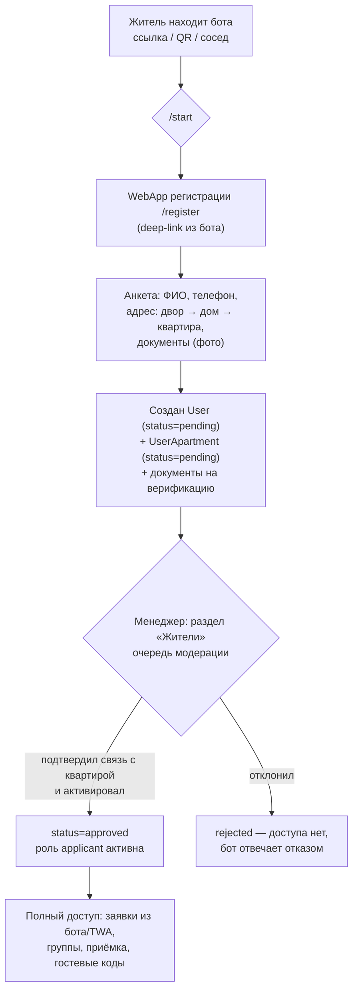
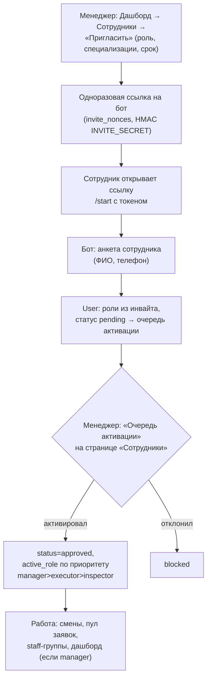
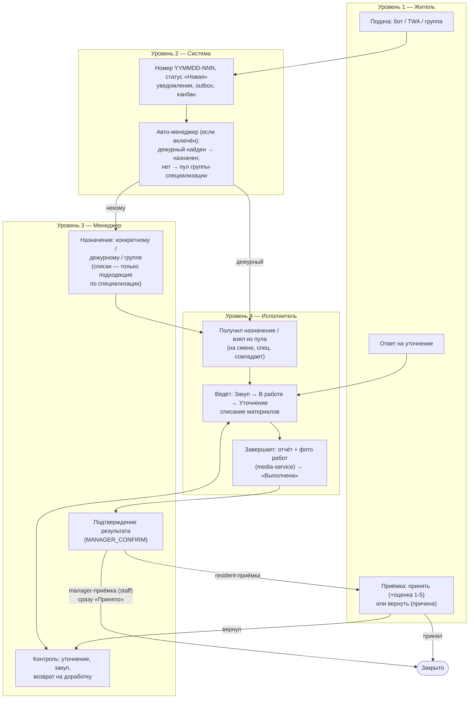
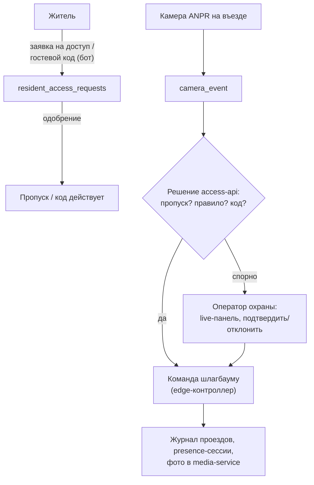

# UK Management — бизнес-процессы

> _Последнее редактирование: 2026-08-25_

> Сквозные бизнес-процессы системы на языке ролей и шагов: онбординг жителей и
> сотрудников, путь заявки от жителя к исполнителю по всем каналам и уровням,
> приёмка, смены, доступ. Для каждого процесса указано, где он живёт в коде.
> Техническая сторона — [../tech/REQUESTS.md](../tech/REQUESTS.md),
> [../tech/SHIFTS_AND_ASSIGNMENT.md](../tech/SHIFTS_AND_ASSIGNMENT.md),
> [../tech/ARCHITECTURE_DIAGRAMS.md](../tech/ARCHITECTURE_DIAGRAMS.md);
> требования — [PRD.md](PRD.md).

---

## 1. Онбординг жителя

Житель попадает в систему сам; доступ открывается только после модерации.
Ни один шаг не пропускается: не-`approved` пользователь не может ничего,
кроме регистрации.



Правила:

- **Телефон обязателен** для создания заявок — без него бот приглашает
  дозаполнить профиль.
- **Связь житель ↔ квартира** — отдельная модерируемая сущность
  (`user_apartments`: pending → approved/rejected); квартир может быть
  несколько, одна — основная (`is_primary`). Именно approved-квартиры дают
  адреса для заявок и «соседскую» приёмку.
- **Верификация документов** — независимый контур (`user_verifications`,
  `user_documents`): менеджер запрашивает и подтверждает документы; статус
  виден в карточке жителя.
- Заблокированный/удалённый пользователь в группе — полная тишина бота
  (никаких публичных ответов в группу).

Код: `frontend` `/register` (WebApp), `api/registration/`,
`handlers/onboarding.py`, `handlers/user_verification/`, дашборд «Жители»
(`ResidentsPage`, `ResidentDetailPage`).

## 2. Онбординг сотрудника (инвайт-модель)

Сотрудники сами не регистрируются — только по приглашению менеджера.



Правила:

- Инвайт-токен одноразовый и подписанный; протухший/повторный — отказ.
- Специализации задаются в инвайте и правятся в карточке; канон-словарь +
  джокер `universal` («умеет всё»). Сотрудник без специализации не попадает
  ни в один подбор — это видимый сигнал «карточка не заполнена».
- Дальнейшее управление — карточка сотрудника: правка ФИО, блокировка,
  капабилити контролёра показаний, soft-delete с переназначением активных
  заявок другому исполнителю.

Код: `api/shifts/router/employees.py` (invite/activate/decline),
`services/invite_service.py`, `handlers/employee_management/`, дашборд
«Сотрудники».

## 3. Путь заявки: от жителя к исполнителю и обратно

Главный процесс системы. Уровни: **житель → система → менеджер →
исполнитель → менеджер → житель**. Заявка на каждом уровне имеет ровно один
статус; все переходы — через канонический workflow (один писатель, аудит +
уведомления + outbox в одной транзакции).

### 3.1 Сводная схема по уровням (swim-lane)



### 3.2 Каналы подачи (уровень 1) и их различия

| Канал | Кто | Особенности пути |
|---|---|---|
| Личный бот (FSM) | approved `applicant` с телефоном | категория → адрес (inline-кнопки из своих квартир/дома/двора) → описание → срочность → до 5 медиа → подтверждение |
| Mini App (TWA) | тот же житель | та же заявка через веб-форму, `source=twa` |
| Жительская Telegram-группа | житель, участник зарегистрированной группы | LLM распознаёт заявку в свободном тексте; адрес — из профиля автора; подтверждение кнопкой «Да» (только автор); незарегистрированный получает deep-link на онбординг §1 |
| Staff-группа | approved сотрудник | фото + подпись с адресом (+тег в тег-режиме); адрес матчится по справочнику; подтверждает любой сотрудник; заявка с менеджерской приёмкой (§3.5) |
| Обходчик | `inspector` в боте | заявка уровня «дом» без членства, `source=inspector` |
| Колл-центр | оператор на дашборде | менеджер заводит заявку от имени жителя |
| Портал InfraSafe | внешняя система | входящий вебхук → inbox с дедупом → заявка |

### 3.3 Назначение (уровень 2→3→4): три дороги к исполнителю

1. **Авто-менеджер** (тумблер владельца): при создании заявки система ищет
   **дежурного** — исполнителя в `active`-смене, чья специализация покрывает
   категорию. Нашла → заявка сразу «В работе» у него. Не нашла → заявка
   остаётся «Новая» и адресуется группе-специализации.
2. **Пул дежурных**: заявки группы видят все дежурные этой специализации;
   любой жмёт «Взять в работу» → «В работе» на нём, остальные уведомлены.
3. **Менеджер вручную** (канбан-drag, карточка, бот): выбирает конкретного
   исполнителя (список отфильтрован по специализации категории), «дежурному»
   (резолвит сервер) или группе. Переназначение — в любой момент до
   завершения; снятый и новый исполнители уведомляются.

Инвариант всех трёх дорог: **«В работе» ⟺ есть конкретный исполнитель**.
Группа — это адресация, не назначение.

### 3.4 Выполнение (уровень 4)

Исполнитель на смене ведёт заявку из бота:

- **Закуп** — нужны материалы: указывает что купить; менеджер закрывает закуп
  (или исполнитель сам возвращает в работу). Списание со склада — кнопкой
  «Материалы» (FIFO-партии, себестоимость — см. модуль «Склад»).
- **Уточнение** — вопрос жителю; житель отвечает прямо из бота («Мои
  заявки»), заявка возвращается «В работе».
- **Выполнена** — отчёт обязателен: текст + фото работ; фото уходят в
  media-service и позже питают витрину «до/после».

### 3.5 Приёмка (уровень 3→1): две модели

**Жительская (дефолт, `acceptance_mode=resident`):**

1. Менеджер проверяет «Выполнена» → «Подтвердить» → «Исполнено», житель
   уведомлён.
2. Житель (владелец или сосед по approved-квартире) в «Ожидают приёмки»:
   «Принять» + оценка 1–5 → «Принято» (терминал); или «Вернуть» + причина
   (+медиа) → «Возвращена» → менеджер разбирает: возвращает в работу (с
   причиной) или принимает силой (`MANAGER_FORCE_ACCEPT`).

**Менеджерская (`acceptance_mode=manager` — staff-репорты из групп):**

1. Заказчик работы — УК, а не житель: «Подтвердить» менеджером сразу даёт
   «Принято» (терминал). Жительского этапа и оценки нет; докладчик
   (`reported_by`) получает уведомление о результате.

### 3.6 Что житель видит на каждом шаге

| Статус | Уведомление жителю | Доступные действия жителя |
|---|---|---|
| Новая | «Заявка N создана» | отменить (пока Новая), следить |
| В работе | «назначен исполнитель» | ответить на уточнение, если спросят |
| Закуп / Уточнение | «нужны материалы» / вопрос | ответить (Уточнение) |
| Выполнена | — (внутренний этап) | — |
| Исполнено | «работа выполнена, примите» | принять + оценка / вернуть |
| Принято | «спасибо, заявка закрыта» | — |
| Возвращена | — (у менеджера) | ждать повторного выполнения |
| Отменена | «заявка отменена» | — |

## 4. Смены: от расписания к пулу заявок

```mermaid
flowchart LR
    T["Шаблоны смен\n(время, специализации)"] --> P["Менеджер планирует:\nсмены planned по датам\n(сетка/календарь дашборда,\nавтопланирование бота)"]
    P --> ACT{"Джоба авто-активации\n(каждые 3 мин)"}
    ACT -->|"окно наступило,\nисполнитель назначен"| A["active — сотрудник «на смене»"]
    ADHOC["Кнопка «Начать смену»\n(активирует planned или ad-hoc)"] --> A
    A --> POOL["Видит пул свободных заявок\nсвоей специализации,\nполучает назначения дежурному"]
    A -->|"end_time истёк (джоба)\nили «Завершить смену»"| C[completed]
    P -->|передача смены\n(болезнь/авария)| TR["Transfer: менеджер назначает,\nполучатель принимает"]
```

Бизнес-правила: «на смене» = только `active` в окне; ровно этим предикатом
живут пул, авто-менеджер и профиль. Расписание — источник истины: смена из
расписания активируется сама, кнопка — для нетерпеливых и внеплановых
выходов. Мульти-специализация = несколько параллельных смен разрешены.

## 5. Group Intake: жизненный цикл группы

1. **Подключение**: менеджер добавляет группу (chat_id, тип
   residents/staff, тег-режим) на странице «Группы»; бот приглашается в
   группу; закрепляется сообщение с правилами (двуязычное): «заявка считается
   зарегистрированной только после подтверждения и номера; фото обязательно;
   в тег-режиме — начинать с `#заявка`/`#ariza`».
2. **Работа**: см. §3.2; вся фильтрация молчалива, реакция — только на
   распознанные заявки и только автору/сотрудникам.
3. **Контроль**: менеджер видит происхождение заявки (группа/сообщение) в
   карточке; тег-режим переключается per-группа; группа выключается из
   реестра без удаления бота.

## 6. Контроль въезда: житель, гость, охрана



## 7. Показания счётчиков (ежемесячный цикл)

1. Менеджер ведёт каталог (объекты, счётчики, поставщики) в «Учёте
   ресурсов»; открывает отчётный период.
2. Контролёры (капабилити `resource_meter_entry`) обходят объекты и вводят
   показания из Mini App; правила аномалий подсвечивают выбросы; правки — с
   ревизиями.
3. Период закрывается, выгрузка — Excel для поставщиков/бухгалтерии.

## 8. Витрина «до/после» (еженедельный ритм менеджера)

1. Система автоматически создаёт черновики из завершённых заявок и
   подтягивает фото до/после из media-service.
2. Менеджер в «Витрине работ» правит подпись/адрес (публичная форма без
   квартир), публикует; ошибочные — отклоняет.
3. Публичная страница `/work-reports` показывает карточки жителям без
   авторизации — аргумент УК «мы работаем».

## 9. Обратная связь

Житель из бота/TWA отправляет жалобу или пожелание → менеджер разбирает в
разделе «Обратная связь» (new → in_review → resolved). Отдельный поток от
заявок: без исполнителей и сроков.

---

## Связанные документы

- [PRD.md](PRD.md) — полное продуктовое ТЗ (FR/NFR по модулям).
- [OVERVIEW.md](OVERVIEW.md) — краткий бизнес-обзор.
- [../tech/REQUESTS.md](../tech/REQUESTS.md) — статусный контур и каталог
  действий (техника §3).
- [../tech/SHIFTS_AND_ASSIGNMENT.md](../tech/SHIFTS_AND_ASSIGNMENT.md) —
  смены и движки назначения (техника §4).
- [../tech/ARCHITECTURE_DIAGRAMS.md](../tech/ARCHITECTURE_DIAGRAMS.md) —
  сервисы, модули, ER-схемы БД.
