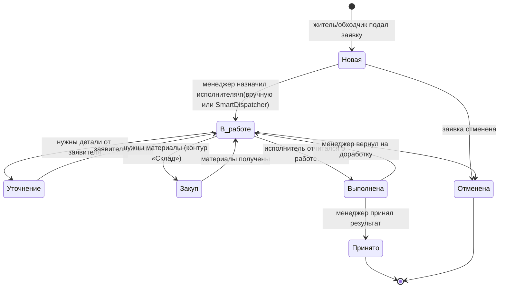

# UK Management — продуктовый обзор

> Продуктовое (бизнес-уровень) описание системы управления заявками жилого
> комплекса. Для нетехнического читателя. Техническая сторона — в
> [../tech/ARCHITECTURE.md](../tech/ARCHITECTURE.md).
>
> Источник истины — код репозитория. Ключевые факты снабжены ссылками на
> `файл:строка`. Статус: пилот / трайл (данные тестовые).

## 1. Проблема и ценность

Управляющей компании (УК) жилого комплекса нужно принимать обращения жителей
(протечка, поломка, уборка, вопрос по дому), доводить их до исполнителя и
контролировать выполнение — без потери заявок, звонков «вслепую» и ручных
табличек. Раньше единственным носителем был свободный текст в переписке.

UK Management превращает этот поток в управляемый процесс:

- Житель подаёт заявку в пару касаний в Telegram — с адресом, категорией,
  фото/видео.
- Заявка получает человекочитаемый номер (`YYMMDD-NNN`,
  `services/request_number_service.py`) и попадает в общий контур.
- Менеджер видит все заявки на канбан-доске, назначает исполнителей вручную
  или через авто-подбор (SmartDispatcher).
- Исполнитель получает работу в бот, отчитывается фото/материалами, закрывает
  заявку; менеджер принимает результат.
- Параллельно система закрывает смежные задачи УК: смены персонала, контроль
  въезда/выезда на территорию (ANPR/пропуска), учёт материалов, верификацию
  жителей, аналитику и обратную связь.

Ценность: ни одна заявка не теряется, работа персонала прозрачна, у УК есть
цифры для управленческих решений, а у жителя — понятный статус его обращения.

## 2. Аудитория

| Кто | Роль в системе | Что получает |
|---|---|---|
| Житель (заявитель) | `applicant` | Подача заявок, статус, обратная связь, публичное табло дома |
| Исполнитель (мастер/уборщик) | `executor` | Назначенные заявки, смены, отчёты о выполнении, списание материалов |
| Менеджер УК / диспетчер | `manager` | Канбан заявок, назначение, смены, аналитика, склад, верификация |
| Обходчик / инспектор | `inspector` | Осмотр объектов, создание заявок «в поле» |
| Охрана (оператор КПП) | `security_operator` | Live-панель контроля доступа: подтверждение проездов |
| Системный администратор | `system_admin` | Оборудование доступа (камеры/шлагбаумы), полная настройка |

Роли пользователя хранятся списком: `user.roles` (JSON-массив строк) +
`user.active_role` (текущая активная роль); канонический перечень —
`uk_management_bot/utils/enums.py:89` (`UserRole`). Устаревшее одиночное поле
`user.role` удалено — не использовать. Один человек может иметь несколько
ролей и переключаться между ними.

## 3. Роли и что каждая делает

- **Заявитель (`applicant`)** — создаёт заявки (в т.ч. с фото/видео и адресом
  вплоть до квартиры), следит за статусом, оставляет обратную связь, читает
  объявления УК на публичном табло.
- **Исполнитель (`executor`)** — берёт/получает назначенные заявки, ведёт их по
  статусам, прикладывает отчёт (фото, списание материалов), работает в рамках
  смен. Групповые заявки может брать «из пула».
- **Менеджер (`manager`)** — центральная роль контроля: канбан-доска всех
  заявок, ручное и авто-назначение (SmartDispatcher), приёмка/возврат
  результата, планирование смен, аналитика, склад материалов, верификация
  пользователей, история проездов и база доступа.
- **Обходчик (`inspector`)** — осмотр территории/объектов и заведение заявок по
  результатам обхода (`handlers/inspector_requests.py`).
- **Оператор охраны (`security_operator`)** — работает только с модулем
  контроля доступа: live-панель проездов, подтверждение/отклонение въезда
  (`frontend/src/pages/access/AccessControlPage.tsx`).
- **Системный администратор (`system_admin`)** — настройка оборудования доступа
  (зоны, въезды, камеры, шлагбаумы, контроллеры) и админ-функции модуля доступа.
- **Администратор (`admin`)** — общий управленческий администратор (≈ менеджер):
  заявки, персонал, верификация пользователей. Отдельная роль от `system_admin`
  (не участвует в контроле доступа). Полная модель ролей и матрица доступа —
  [../tech/ROLES_AND_ACCESS.md](../tech/ROLES_AND_ACCESS.md).

## 4. Каналы взаимодействия

Система многоканальна; у каждого канала своя аудитория.

- **Telegram-бот** (aiogram 3, Python 3.11) — основной канал жителей,
  исполнителей и обходчиков: подача заявок, работа с ними, смены, уведомления.
  Точка сборки — `uk_management_bot/main.py`.
- **Веб-дашборд** (React SPA, base-path `/uk/`) — рабочее место менеджеров и
  админов: канбан заявок, смены, сотрудники, аналитика, адреса, контроль
  доступа, склад. Маршрутизация — `frontend/src/App.tsx:99`.
- **Табло жителей** (`/resident-board`) — публичная страница-лендинг УК
  (объявления/информация), доступна без авторизации
  (`frontend/src/App.tsx:146`).
- **Telegram Mini App регистрации** (`/register`, `/twa`) — самостоятельная
  регистрация жителя и мобильный мини-клиент внутри Telegram
  (`frontend/src/App.tsx:149,152`).

Языки интерфейса: русский и узбекский (RU/UZ). См. раздел 7.

## 5. Каталог функциональных доменов

### Заявки (ядро продукта)
Приём обращений жителей, ведение по жизненному циклу, назначение исполнителей и
контроль результата. Номер заявки — строка `YYMMDD-NNN`
(`services/request_number_service.py`). Поддержаны: приёмка и возврат результата
менеджером, групповое назначение (несколько исполнителей / взятие «из пула»),
авто-подбор исполнителя SmartDispatcher (`services/smart_dispatcher.py`),
комментарии, отчёты, вложения (фото/видео). Статусы заявки — раздел 6.

### Смены и назначение
Планирование смен персонала, авто- и ручное распределение, передача смен между
исполнителями, аналитика по сменам. Код: `services/shift_*`,
`handlers/shift_management/`. Назначение заявок увязано со сменами (исполнитель
получает работу в рамках своей смены).

### Контроль доступа (ANPR / пропуска)
Отдельный домен: распознавание номеров машин на въезде/выезде, разовые гостевые
коды, пропуска, решение о пропуске и журнал проездов. Реализован как отдельный
сервис `access_control/` со своим API. Экраны: live-панель охраны, история
проездов, база доступа, оборудование (`frontend/src/pages/access/`).

### Склад материалов
Учёт закупок партиями и списания материалов на заявки с расчётом остатков и
себестоимости по FIFO. Дополняет контур «Закуп» заявок, не ломая текстовые поля.
Подробности — в [../MATERIALS_MODULE.md](../MATERIALS_MODULE.md) (здесь не
дублируется).

### Верификация пользователей
Проверка и одобрение жителей/сотрудников: только пользователь со статусом
`approved` получает доступ к API (`api/auth/router.py:133`). Код:
`services/user_verification_service.py`, `handlers/user_verification.py`.

### Аналитика
Управленческие метрики по заявкам и сменам для менеджеров
(`frontend/src/pages/AnalyticsPage.tsx`, `services/shift_analytics.py`,
`services/metrics_manager.py`).

### Обратная связь
Сбор отзывов жителей и их разбор менеджером (`services/feedback_service.py`,
`api/feedback/`, `frontend/src/pages/FeedbackPage.tsx`).

## 6. Жизненный цикл заявки (бизнес-язык)

Канонический перечень статусов — `uk_management_bot/utils/enums.py:37`
(в БД хранятся русскоязычные строки). Новая заявка создаётся со статусом
«Новая» (`database/models/request.py:37`).

> Примечание: набор статусов подтверждён по `RequestStatus`
> (`utils/enums.py`); точные правила разрешённых переходов реализованы в
> `services/request_handler_service.py` — при необходимости детализации сверять
> с этим файлом (**проверить** полную матрицу переходов перед формализацией в
> отдельном регламенте).

## 7. Двуязычие (RU / UZ)

Интерфейс доступен на русском и узбекском.

- **Бот**: словари `config/locales/{ru,uz}.json`, доступ через
  `get_text(key, language=lang)`; статусы отображаются через
  `utils/status_display.py`, адреса — через
  `utils/address_helpers.localize_address()`.
- **Фронтенд**: словари `frontend/src/i18n/locales/{ru,uz}.json`, библиотека
  i18next.

Язык привязан к пользователю; статусы и адреса локализуются централизованно,
чтобы формулировки были согласованы во всех каналах.

## 8. Что НЕ входит (границы)

- Система **не** ведёт бухгалтерию/биллинг ЖКХ и начисление платежей — только
  учёт заявок, работ и движения материалов.
- Модуль склада даёт **базовый** учёт (партии, FIFO-себестоимость, списание на
  заявку), а не полноценную ERP/складскую систему; интеграция с контуром заявок
  read-only (см. [../MATERIALS_MODULE.md](../MATERIALS_MODULE.md)).
- Публичное табло жителей — информационная витрина УК, а не соцсеть/чат
  жителей.
- Контроль доступа покрывает въезд/выезд авто и пропуска на территорию; это
  не система видеонаблюдения и не СКУД дверей/подъездов в полном объёме
  (**проверить** границы по `access_control/` перед внешними заявлениями).
- Статус проекта — пилот/трайл: данные тестовые, набор функций и регламентов
  дорабатывается.

## 9. Связанные документы

- [../tech/ARCHITECTURE.md](../tech/ARCHITECTURE.md) — техническая архитектура,
  развёртывание, аутентификация.
- [../MATERIALS_MODULE.md](../MATERIALS_MODULE.md) — модуль «Склад материалов».
- [../../README.md](../../README.md) — быстрый старт и структура репозитория.
- [../DOCUMENTATION_STATUS.md](../DOCUMENTATION_STATUS.md) — матрица
  актуальности документации.
