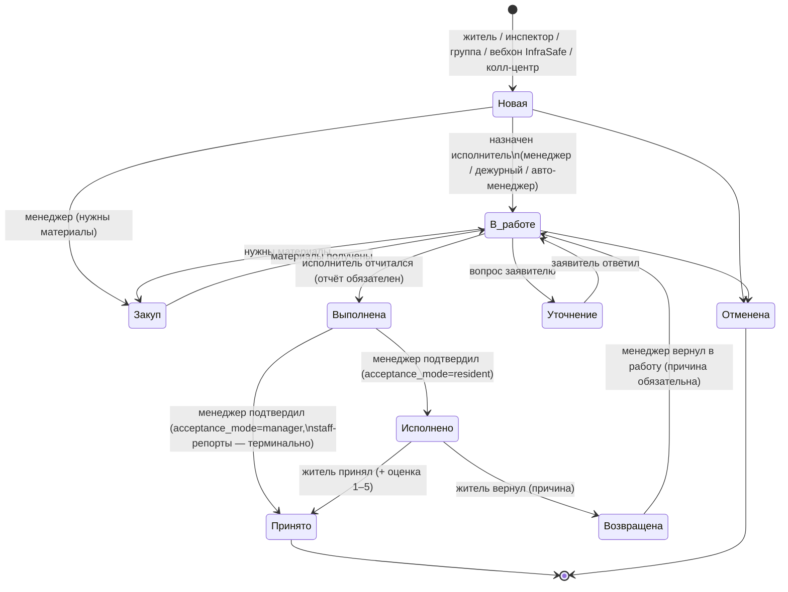

# UK Management — продуктовое ТЗ (PRD)

> _Последнее редактирование: 2026-08-25_

> Полноценное продуктовое техническое задание на систему: цели, персоны,
> сценарии, функциональные и нефункциональные требования по всем модулям.
> Написано реверс-инжинирингом от работающего продукта: источник истины — код
> репозитория; документ описывает то, что реализовано и раскатано, плюс явно
> помеченные открытые вопросы. Краткий бизнес-обзор — [OVERVIEW.md](OVERVIEW.md);
> техническая архитектура и схемы — [../tech/ARCHITECTURE.md](../tech/ARCHITECTURE.md)
> и [../tech/ARCHITECTURE_DIAGRAMS.md](../tech/ARCHITECTURE_DIAGRAMS.md).

---

## 1. Продукт и цели

### 1.1 Проблема

Управляющая компания (УК) жилого комплекса принимает обращения жителей
(протечки, поломки, уборка, свет, лифт), доводит их до исполнителей и
контролирует результат. Без системы носителем процесса были свободный текст в
чатах, звонки и ручные таблички: заявки терялись, статус был непрозрачен,
нагрузка на персонал не измерялась.

### 1.2 Продукт

**UK Management** — система управления заявками и операциями УК:
Telegram-бот (жители + персонал), веб-дашборд (менеджеры), Mini App,
автоматический приём заявок из Telegram-групп через LLM-классификатор, смены
персонала, контроль въезда (ANPR), склад материалов, учёт показаний счётчиков,
публичная витрина выполненных работ.

### 1.3 Цели продукта

| Цель | Как измеряем |
|---|---|
| Ни одна заявка не теряется | Каждое обращение получает номер `YYMMDD-NNN` и живёт в едином жизненном цикле до терминального статуса |
| Прозрачность для жителя | Житель видит статус, получает уведомления о каждом переходе, принимает и оценивает результат |
| Управляемость для УК | Канбан всех заявок, аналитика, рейтинг сотрудников = AVG оценок, история смен, аудит каждого действия |
| Снижение ручного диспетчирования | Авто-менеджер назначает дежурного по специализации; группы-специализации; Group Intake сам распознаёт заявки в чатах |
| Мультиарендность бренда | Одна кодовая база обслуживает двух заказчиков (InfraSafe / PROFK) с разным брендингом |

### 1.4 Статус и развёртывания

Две продуктивные площадки на одной кодовой базе:

| Площадка | Бренд фронта | БД | Особенности |
|---|---|---|---|
| profk.uz | `profk` | `profk_management` | Group Intake включён (жительские + staff-группы), media-service, учёт ресурсов |
| infrasafe (105) | `infrasafe` (дефолт) | `uk_management` | Полный контур + контроль доступа ANPR; Group Intake не раскатан |

---

## 2. Персоны и роли

Роли хранятся списком (`users.roles` — JSON-массив) + текущая активная
(`users.active_role`); один человек может совмещать роли и переключаться.
Доступ к системе имеет только пользователь со статусом `approved`.

| Персона | Роль | Ключевые задачи | Каналы |
|---|---|---|---|
| Житель | `applicant` | Подать заявку, следить за статусом, принять и оценить работу, показать гостевой код охране | Бот, TWA, жительская Telegram-группа, табло |
| Исполнитель (мастер) | `executor` | Получать/брать заявки, вести по статусам, отчёт с фото и материалами, работать в сменах | Бот |
| Обходчик | `inspector` | Заявки «в поле» по результатам обхода, репорты в staff-группе | Бот, staff-группа |
| Менеджер / диспетчер | `manager` | Канбан, назначение/переназначение, приёмка, смены, сотрудники, жители, аналитика, склад, группы | Дашборд, бот (админ-меню), staff-группа |
| Администратор | `admin` | ≈ менеджер (управленческий администратор); не участвует в контроле доступа | Дашборд, бот |
| Оператор охраны | `security_operator` | Live-панель проездов, подтверждение/отклонение въезда | Дашборд (модуль доступа) |
| Системный админ СКУД | `system_admin` | Оборудование доступа: зоны, въезды, камеры, шлагбаумы, контроллеры | Дашборд (модуль доступа) |
| Контролёр показаний | капабилити `resource_meter_entry` | Ввод показаний счётчиков из Mini App | TWA |
| Владелец УК | — (вне системы) | Смотрит витрину работ, табло, аналитику через менеджера | Публичные страницы |

Полная матрица доступа — [../tech/ROLES_AND_ACCESS.md](../tech/ROLES_AND_ACCESS.md).

---

## 3. Границы продукта

**Входит:** заявки полного цикла; автоматический приём из групп; смены и
расписание; сотрудники (инвайт-модель) и жители (самостоятельная регистрация +
верификация); адресный справочник «двор → дом → квартира»; уведомления RU/UZ;
склад материалов (FIFO); публичные витрины (табло, «до/после»); контроль
въезда авто (ANPR, пропуска, гостевые коды, парковка); учёт показаний
счётчиков (отдельный мульти-тенантный сервис); обратная связь; аналитика.

**Не входит:** биллинг/начисления ЖКХ; полноценная ERP/складская система;
СКУД дверей и видеонаблюдение в полном объёме; чат/соцсеть жителей;
бухгалтерия. Публичное табло — информационная витрина, не форум.

---

## 4. Ключевые пользовательские сценарии

### 4.1 Житель подаёт заявку (личный бот / TWA)

1. Житель (approved `applicant` с телефоном) выбирает «Создать заявку»:
   категория → срочность → адрес (из своих подтверждённых квартир, дома или
   двора) → описание → фото/видео (опционально).
2. Заявка получает номер `YYMMDD-NNN`, статус «Новая», попадает на канбан.
3. Житель получает подтверждение с номером; далее — уведомления о каждом
   смене статуса на своём языке (RU/UZ).

Приёмка: после подтверждения менеджером («Исполнено») житель кнопкой
принимает результат (→ «Принято») и ставит оценку 1–5, либо возвращает с
причиной (→ «Возвращена» → менеджер разбирает).

### 4.2 Заявка из жительской Telegram-группы (Group Intake)

1. Менеджер регистрирует группу в реестре (дашборд «Группы»), бот добавлен в
   группу, закреплено сообщение с правилами («нет номера — нет заявки»).
2. Житель пишет о проблеме. Бот молча фильтрует (префильтр → LLM-классификатор
   Claude Haiku); болтовня — полная тишина.
3. Адрес вычисляется до вопроса: из подтверждённых квартир автора, с
   уточнением по тексту (номер дома «14в» ↔ «14V», токены, транслитерация).
4. Бот отвечает одним сообщением: «Похоже на заявку: <категория>, срочность
   <…>. Адрес: <публичная форма без номера квартиры>. Создать? [Да / Нет /
   Другой адрес]». Решает только автор; час тишины — предложение протухает.
5. «Да» → повторная проверка прав → заявка создана, бот отвечает номером.
   Ошибка — честный текст об ошибке, не тишина.
6. Незарегистрированному автору — приглашение с deep-link в личный бот
   (cooldown 1/час), после регистрации сообщение нужно повторить.

**Тег-режим** (флаг `require_tag` на группе): бот обрабатывает только
сообщения с `#заявка`/`#ariza` — ноль LLM-вызовов и ноль реакций на всё
остальное; тег переопределяет вердикт LLM «не заявка» (fallback категория
`other`/`low`).

### 4.3 Staff-группа: сотрудник репортит проблему (менеджерская приёмка)

1. Группа с `kind=staff`: писать может только approved-сотрудник
   (executor / inspector / manager); чужие сообщения игнорируются молча.
2. Требования к репорту: фото (видео/кружочек → просьба прислать фото) +
   подпись с адресом и тегом (в тег-режиме).
3. Адрес матчится по справочнику (дом/двор, эшелоны: LLM-хинт → токены →
   цифро-токены из полного текста; кириллица ↔ узбекская латиница). Несколько
   кандидатов — кнопки выбора; подтвердить может ЛЮБОЙ approved-сотрудник,
   не только автор.
4. Заявка создаётся с `acceptance_mode=manager` и `reported_by = автор`:
   жительской приёмки нет, подтверждение менеджера («Подтвердить») сразу
   делает заявку «Принято» (терминально), оценка не запрашивается.

### 4.4 Назначение и выполнение

1. **Назначение**: менеджер с канбана/карточки назначает исполнителя
   (список фильтруется по специализации категории заявки; джокер `universal`
   подходит всем), либо «дежурному» (сервер сам подбирает на смене), либо
   заявку адресует группе-специализации (остаётся «Новая», видна дежурным
   пула — «В работе» наступает только с человеком). Авто-менеджер (если
   включён владельцем) назначает дежурного сам.
2. **Инвариант**: «В работе» ⟺ у заявки есть исполнитель.
3. **Выполнение**: исполнитель ведёт заявку: «Закуп» (материалы), «Уточнение»
   (вопрос жителю — тот отвечает из бота), «Выполнена» (отчёт обязателен,
   фото работ уходят в media-service и становятся SSOT для витрины).
4. **Переназначение**: менеджер меняет исполнителя из бота или карточки
   дашборда (тот же канон MANAGER_ASSIGN; снятый и новый исполнители получают
   уведомления; список кандидатов — только подходящие по специализации).

### 4.5 Смены

1. Менеджер строит расписание (шаблоны смен → календарь/сетка) или сотрудник
   выходит ad-hoc кнопкой «Начать смену».
2. Запланированные смены **активируются автоматически** (джоба каждые 3 мин:
   `planned` + окно наступило → `active`; истёкшие `active` с end_time →
   `completed`). Кнопка «Начать смену» активирует запланированную, а не
   плодит дубль.
3. На смене исполнитель видит пул свободных заявок своей специализации,
   может брать их; авто-менеджер выбирает дежурных именно среди `active` смен.
4. Передача смены (transfer): по болезни/аварии/загрузке, с валидируемыми
   переходами статусов и запретом передачи самому себе.

### 4.6 Регистрация и верификация жителя

1. Житель открывает WebApp регистрации (`/register`, deep-link из бота):
   ФИО, телефон, адрес (двор → дом → квартира), документы.
2. Связь «житель ↔ квартира» модерируется менеджером (pending → approved);
   верификация документов — отдельный контур (`user_verifications`).
3. До approve пользователь не имеет доступа (fail-closed).

### 4.7 Сотрудники: инвайт-модель

1. Менеджер в дашборде создаёт инвайт (роль + специализации + срок) → ссылка
   на бот с одноразовым токеном (`invite_nonces`, HMAC `INVITE_SECRET`).
2. Сотрудник проходит по ссылке, заполняет профиль → попадает в очередь
   активации (`pending`); менеджер активирует/отклоняет.
3. Менеджер управляет карточкой: ФИО (правка опечаток), блокировка,
   soft-delete с переназначением активных заявок, капабилити контролёра
   показаний.

### 4.8 Контроль въезда (ANPR) и гости

1. Камера на въезде распознаёт номер → edge-контроллер шлёт событие →
   access-api принимает решение (пропуск/правило/пропускной режим) →
   команда шлагбауму; спорные случаи — подтверждение оператором охраны
   (live-панель).
2. Житель заказывает гостевой код из бота; охрана подтверждает въезд гостя.
3. Журнал: события камер, решения, проезды, ручные открытия, presence-сессии
   (кто сейчас на территории), парковочные места.

### 4.9 Показания счётчиков

1. Менеджер ведёт каталог объектов/счётчиков в разделе «Учёт ресурсов»
   (отдельный сервис, вход прозрачный через s2s launch-ticket).
2. Контролёр с капабилити вводит показания из Mini App; аномалии ловятся
   правилами; периоды закрываются, выгрузки — в Excel.

### 4.10 Публичные витрины

- **Табло жителей** (`/resident-board`): объявления и плитки УК,
  конфигурируются менеджером (board-editor), без авторизации.
- **Витрина «до/после»** (`/work-reports`): менеджер модерирует и публикует
  отчёты о выполненных работах (фото до/после из media-service, адрес в
  публичной форме, без номеров заявок и персональных данных).

---

## 5. Жизненный цикл заявки (канон)

Статусы в БД — русские строки; канон — `utils/constants.py` /
`utils/enums.py`. Все переходы совершаются ТОЛЬКО через канонический workflow
(`utils/request_workflow/`: guards → specs → planner, один писатель
`plan_transition`), с аудитом, outbox-событиями и notify-интентами в одной
транзакции.

Ключевые правила:

- **FR-WF-1.** «В работе» ⟺ `executor_id` заполнен (инвариант в одной точке —
  `plan_transition`). Групповое назначение НЕ меняет статус.
- **FR-WF-2.** Не более одного активного назначения (partial-unique) и не более
  одной оценки на заявку (идемпотентная приёмка).
- **FR-WF-3.** `acceptance_mode='manager'` (staff-репорты): подтверждение
  менеджера терминально, жительская приёмка и возврат закрыты гвардами;
  уведомления подставляют staff-тексты.
- **FR-WF-4.** Каждый переход пишет: аудит, transactional-outbox событие
  (InfraSafe), notify-интенты (доставка после коммита), realtime pub/sub
  (канбан обновляется по WebSocket).

---

## 6. Функциональные требования по модулям

### M1. Заявки (ядро)

- FR-1.1 Номер `YYMMDD-NNN` — строковый PK, gap-safe счётчик по дню; после
  удаления не переиспользуется.
- FR-1.2 Источники создания: личный бот, TWA, инспектор «в поле», Group
  Intake (residents/staff), колл-центр (роутер `/api/v2/callcenter`),
  входящий вебхук InfraSafe. Происхождение из группы фиксируется
  (`source_chat_id`/`source_message_id` + аудит).
- FR-1.3 Адресный инвариант: `address_type` ∈ {apartment, building, yard,
  legacy} и ровно один соответствующий FK (CHECK-констрейнт).
- FR-1.4 Категории — канон-ключи (`electricity`, `plumbing`, …) + legacy-рус;
  срочность low/medium/high/critical; описание ≤ 2000 символов.
- FR-1.5 Вложения: фото/видео при создании; фото работ при завершении —
  только через media-service (SSOT `services/completion_media`).
- FR-1.6 Комментарии типизированы (status_change / clarification / purchase /
  report), есть внутренние (не видны жителю).
- FR-1.7 Права: житель видит и правит только свои заявки; исполнитель — свои
  назначенные + пул своей специализации на смене; менеджер — все.

### M2. Group Intake (LLM-приём из групп)

- FR-2.1 Реестр групп: chat_id, тип (residents/staff), активность, тег-режим;
  CRUD только менеджеру, с аудитом; страница «Группы» в дашборде.
- FR-2.2 Пайплайн (порядок обязателен): флаг → не-бот → текст-кандидат → не
  команда → (тег обходит префильтр) префильтр → реестр → тег-гейт → фото-гейт
  (тег-режим) → staff-гейт автора → дедуп → rate-limit → LLM → адрес →
  промпт/выбор. Сообщения не-сотрудников в staff-группах НЕ уходят в LLM.
- FR-2.3 Классификатор: Anthropic structured outputs (модель из env, дефолт
  Haiku), порог confidence 0.6, лимит 6 вызовов/мин на группу; исходы
  REQUEST / NOT_REQUEST / PROCESSING_ERROR / RATE_LIMITED — сбой не «не
  заявка», логируется маркером.
- FR-2.4 Приватность: в промпт LLM уходит только текст сообщения (без имён и
  id); публичная форма адреса не раскрывает квартиру; ключи и тексты не
  логируются.
- FR-2.5 Тишина — валидный ответ: болтовня, чужие в staff-группе, без тега в
  тег-режиме, кружочек без текста. Отказ создать — всегда с причиной.
- FR-2.6 Медиа: photo-only гейт (видео → просьба фото); фото грузится в
  media-service ботом-получателем (file_id привязан к боту).
- FR-2.7 Отдельный контейнер `uk-group-intake-bot` со своим токеном; включение
  флагом; уведомления жителям шлёт основной бот.

### M3. Назначение исполнителей

- FR-3.1 Способы: конкретному (список фильтрован канон-предикатом
  специализаций `matches_required_specs`: пустое требование не ограничивает,
  `universal` у исполнителя = «умеет всё», достаточно одного совпадения),
  дежурному (резолв на сервере, 409 с причиной если нет дежурного), группе
  (пул без смены статуса), авто-менеджером (тумблер владельца +
  rule engine по дежурным сменам).
- FR-3.2 Переназначение: бот (меню заявки) и дашборд (карточка) — единый
  канон MANAGER_ASSIGN; снятый исполнитель определяется по факту (под локом),
  оба уведомляются; сам-на-себя — no-op.
- FR-3.3 Одна семантика подбора во всех девяти точках (бот, API, авто-менеджер,
  пул) — второй копии предиката не существует.

### M4. Смены

- FR-4.1 Шаблоны смен (время, специализации, вместимость) и расписание по
  датам; расписание — источник истины.
- FR-4.2 Авто-активация: `planned` с исполнителем в наступившем окне →
  `active` (каждые 3 мин); истёкшие `active` (end_time) → `completed`;
  ad-hoc-смены (end_time NULL) закрывает человек.
- FR-4.3 «Начать смену» активирует запланированную, иначе создаёт ad-hoc;
  несколько активных смен разрешены (мульти-специализация).
- FR-4.4 «Кто на смене» — единый предикат (status='active', окно), им живут:
  пул заявок, авто-менеджер, профиль, дашборд.
- FR-4.5 Передачи смен: pending→assigned→accepted/rejected/…, причины,
  запрет самому себе.

### M5. Сотрудники

- FR-5.1 Инвайт-only: одноразовые подписанные ссылки, очередь `pending`,
  активация/отклонение менеджером.
- FR-5.2 Карточка: специализации (канон-словарь + `universal`), правка ФИО,
  блокировка/разблокировка, счётчик активных заявок, рейтинг = AVG(ratings)
  по выполненным, soft-delete с переназначением работ.
- FR-5.3 Мультиролевыми (staff-роли) не управляют из раздела «Жители».

### M6. Жители и верификация

- FR-6.1 Самостоятельная регистрация через WebApp (deep-link из бота);
  дозаполнение профиля (телефон, роль) — приглашениями.
- FR-6.2 Модерация связи житель↔квартира; документы и статусы верификации;
  только `approved` получает функции.
- FR-6.3 Менеджер видит карточку жителя: квартиры, документы, заявки.

### M7. Адресный справочник

- FR-7.1 Иерархия двор → дом → квартира; каскадное удаление вниз с purge-гардом
  от осиротевших заявок.
- FR-7.2 Уровни адреса заявки по роли (житель — квартира/дом/двор через
  членство; инспектор и staff-группы — дом/двор без членства).
- FR-7.3 Локализация адресов RU/UZ централизована (`localize_address`).

### M8. Дашборд менеджера

- FR-8.1 Канбан: drag&drop по разрешённой матрице переходов, модалки
  (исполнитель / причина возврата / отчёт), live-обновления по WebSocket,
  индикаторы непрочитанного («Уточнение», «Закуп»).
- FR-8.2 Разделы: заявки, аналитика, смены (сетка/календарь/heatmap),
  сотрудники, шаблоны, адреса, жители, группы, board-editor, витрина работ,
  обратная связь, материалы, доступ, учёт ресурсов.
- FR-8.3 Топбар-поиск по заявкам/людям (регистронезависимый на кириллице —
  через `sql_search.ci_contains`).
- FR-8.4 Бренд задаётся на сборке (`VITE_BRAND`); функциональность брендов
  идентична, отличия — токены темы/лого/manifest.

### M9. Уведомления и локализация

- FR-9.1 Каждый переход заявки → уведомление затронутым сторонам на их языке;
  staff-режим подставляет свои тексты; сбой доставки одному получателю не
  роняет остальных.
- FR-9.2 Все строки бота — `config/locales/{ru,uz}.json` (`get_text`);
  фронт — i18next `{ru,uz}.json`. Дефолт RU.
- FR-9.3 Объявления УК: рассылка + табло (`announcements`).

### M10. Склад материалов

- FR-10.1 Приходы партиями (лоты), списания на заявку/хозяйство/недостачу,
  FIFO-аллокации, себестоимость; append-only + сторно.
- FR-10.2 `request_number` в журнале — строка без FK (журнал переживает
  удаление заявки). Остаток — агрегат, денормализованной таблицы нет.

### M11. Витрина работ «до/после» (work-reports)

- FR-11.1 Черновики автосоздаются из завершённых заявок; медиа автозаполняется
  из media-service; менеджер модерирует и публикует.
- FR-11.2 Публичная витрина без аутентификации: превью ≈480px через
  preview-cache, минимум полей, снапшот переживает удаление заявки.
- FR-11.3 Согласованность двух БД — сага с компенсацией + фоновая сверка
  (self-healing), без 2PC. Весь модуль — за фиче-флагом.

### M12. Медиа-сервис

- FR-12.1 Отдельный сервис и БД `uk_media`: файлы, теги, каналы,
  upload-сессии; клиенты (бот, API, access, group-intake-бот) — по X-API-Key.
- FR-12.2 Раздача фронту — через прокси основного API (signed-URL); превью
  кэшируются на диске (LRU по заявке); CSP-совместимость (data:/blob:).

### M13. Учёт ресурсов (счётчики)

- FR-13.1 Отдельный мульти-тенантный сервис (свои БД/миграции/роли): объекты,
  счётчики, показания с ревизиями, правила аномалий, отчётные периоды,
  экспорт.
- FR-13.2 Вход без второго логина: s2s launch-ticket из основного API
  (opaque, одноразовый; сервисный токен живёт только на бэкенде); ввод
  показаний из TWA — по Telegram initData + капабилити.
- FR-13.3 Фронт-модуль за build-флагом `VITE_RESOURCES_ENABLED`.

### M14. Контроль доступа (ANPR/СКУД въезда)

- FR-14.1 Топология: зоны → въезды (gates) → камеры/шлагбаумы;
  edge-контроллеры с device-auth (HMAC, анти-replay nonce), offline-snapshot
  (Ed25519).
- FR-14.2 Транспорт: машины жителей (связь с квартирами), пропуска, заявки
  жителей на доступ, гостевые коды.
- FR-14.3 Поток: событие камеры → решение (правила/пропуск) → команда
  шлагбауму / подтверждение оператором; журнал решений, проездов, ручных
  открытий; presence-сессии; парковочные места и назначения.
- FR-14.4 Live-панель охраны (WebSocket через Redis-брокер); фото проездов —
  в media-service (вне «горячего» пути решений).

### M15. Обратная связь и аналитика

- FR-15.1 Жалобы/пожелания из бота и TWA; статусы разбора менеджером.
- FR-15.2 Аналитика: заявки по статусам/категориям/срочности, смены, рейтинги
  сотрудников; период-фильтры.

### M16. Интеграция InfraSafe (внешний портал)

- FR-16.1 Исходящие события заявок — transactional outbox (claim/lease,
  compare-and-set финализация), подпись HMAC, dual-secret ротация без
  разрыва.
- FR-16.2 Входящие вебхуки (создание заявок) — durable-дедуп inbox;
  `accepted` ⇒ создана заявка.

---

## 7. Нефункциональные требования

### 7.1 Безопасность

- NFR-S1 Веб-аутентификация: httpOnly-cookie (access JWT + refresh с ротацией
  и хешами в БД), MFA через Telegram-OTP для парольного входа, TWA — Bearer
  24 ч; JWT — dual-key ротация через `kid` без force-logout.
- NFR-S2 Fail-closed: деградация rate-limit-бэкенда закрывает auth-роутер;
  не-approved не проходит; guard'ы канона — единственный путь записи
  переходов.
- NFR-S3 Секреты — только Doppler (`doppler run --`); в `.env` прода секретов
  нет; никакие секреты не логируются и не выводятся в чат/транскрипты.
- NFR-S4 Наружу — только edge-nginx InfraSafe с prefix-allowlist: новый
  эндпоинт = 404, пока явно не заявлен; все host-порты — 127.0.0.1.
- NFR-S5 БД под least-privilege ролями: runtime-роли без DDL, миграции —
  отдельной ролью-владельцем (PR-7); отдельные роли для media и resource.
- NFR-S6 Пользовательский ввод эскейпится в HTML-ответах бота
  (`html.escape`); SQL — только параметризованный/через `escape_like`;
  `/metrics` — под токеном.
- NFR-S7 Аудит всех административных и workflow-действий (`audit_logs`,
  `access_audit_logs`), переживает удаление пользователя.

### 7.2 Надёжность и согласованность

- NFR-R1 Бот — один воркер (in-memory throttling); согласованность бот↔API —
  через БД и Redis pub/sub, не через общий процесс.
- NFR-R2 Кросс-БД операции (публикация витрины) — сага + идемпотентная
  фоновая сверка; интеграция — outbox/inbox с дедупом.
- NFR-R3 Контейнеры стартуют с read-only preflight схемы (drift ⇒ отказ
  старта, а не тихая работа на чужой схеме); миграции — только one-shot
  `migrate`.
- NFR-R4 Ошибка LLM/медиа/уведомления никогда не роняет основной поток —
  деградация всегда явная (лог-маркер, честный текст пользователю).

### 7.3 Наблюдаемость

- NFR-O1 Отдельный observability-хост: Prometheus + Alloy + Grafana; health
  всех контейнеров (docker-health timer, 1 мин), инвентарь ожидаемых
  контейнеров (незаявленный контейнер = алерт P2).
- NFR-O2 Метрики API — под токеном; структурированные лог-маркеры для
  ключевых деградаций (`group_intake.processing_error`, staff_match и т.п.).
- NFR-O3 Каждая раскатка тегируется (`<host>-YYYY-MM-DD`); состояние прода
  проверяемо по ssh, а не по памяти.

### 7.4 Качество и процесс

- NFR-Q1 Эталон тестов — `make test-ci` (свежий образ + одноразовые
  postgres/redis, оба набора); OpenAPI-снапшот — diff-гейт публичного
  контракта; coverage-ratchet.
- NFR-Q2 Оба бренда фронта собираются в CI; брендовые токены — гейт
  `guard:brand`.
- NFR-Q3 Языки: RU/UZ во всех пользовательских поверхностях; новые строки
  добавляются в обе локали.

---

## 8. Метрики успеха (предложение продуктовой команды)

| Метрика | Целевое поведение |
|---|---|
| Доля заявок, созданных без диспетчера (группы + TWA + бот) | Рост; ручной ввод менеджером — исключение |
| Время «Новая → В работе» | Падает с авто-менеджером и пулом дежурных |
| Время «Новая → Принято» по категориям | Отслеживается в аналитике |
| Доля возвратов («Возвращена») | Сигнал качества работ |
| Средний рейтинг исполнителя | AVG(ratings), виден в карточке |
| Precision/Recall классификатора Group Intake | Оффлайн-eval на реальных сообщениях (RU/UZ) до изменения порога |
| Покрытие смен расписанием | Доля работ, выполненных дежурными по расписанию |

---

## 9. Риски и открытые вопросы

| # | Риск / вопрос | Смягчение / статус |
|---|---|---|
| 1 | LLM-классификатор пропускает заявку (false negative) → житель ждёт молча | Закреп «нет номера — нет заявки» + тег-режим (детерминированный вход) + eval-датасет |
| 2 | Второй аккаунт жителя не в базе → тишина в группе | By-design; процесс: инвайт/смена telegram_id решением менеджера |
| 3 | Стоимость/задержка LLM при росте групп | Rate-limit на группу, префильтр, тег-режим |
| 4 | Один воркер бота — потолок пропускной способности | Достаточно для текущего масштаба; горизонтальное масштабирование потребует выноса throttling в Redis |
| 5 | Query-JWT (легаси) | Снятие после 2026-09-01 (PENT-F04) |
| 6 | Group Intake на infrasafe/105 не раскатан | Решение владельца + ключи в Doppler |
| 7 | Сдвоенная semantics статусов legacy («Исполнено» проецирование) | Канон закреплён в workflow-модуле; правки только через него |

---

## 10. Глоссарий

| Термин | Значение |
|---|---|
| Канон (workflow) | Единственный модуль переходов заявки (`utils/request_workflow/`): guards → specs → planner; один писатель |
| Дежурный | Исполнитель в `active`-смене, чья специализация покрывает категорию |
| Группа-специализация | Адресация заявки пулу дежурных без смены статуса |
| Group Intake | Автоматический приём заявок из Telegram-групп (LLM) |
| Тег-режим | Группа обрабатывает только сообщения с `#заявка`/`#ariza` |
| acceptance_mode | Кто принимает результат: житель (дефолт) или менеджер (staff-репорты) |
| Outbox / Inbox | Гарантированная доставка событий во внешний портал / дедуп входящих |
| SSOT | Single source of truth — единственный источник истины |
| Edge | Внешний nginx InfraSafe c prefix-allowlist — единственный вход снаружи |
| PR-7 | Разделение ролей БД: владелец схемы ≠ runtime-роли |

---

## 11. Связанные документы

- [OVERVIEW.md](OVERVIEW.md) — краткий бизнес-обзор.
- [../tech/ARCHITECTURE.md](../tech/ARCHITECTURE.md) — техническая архитектура.
- [../tech/ARCHITECTURE_DIAGRAMS.md](../tech/ARCHITECTURE_DIAGRAMS.md) —
  архитектурные схемы: сервисы, модули, зависимости, ER всех БД.
- [../tech/DATA_MODEL.md](../tech/DATA_MODEL.md) — модель данных с инвариантами.
- [../tech/ROLES_AND_ACCESS.md](../tech/ROLES_AND_ACCESS.md) — матрица ролей.
- [../tech/REQUESTS.md](../tech/REQUESTS.md), [../tech/SHIFTS_AND_ASSIGNMENT.md](../tech/SHIFTS_AND_ASSIGNMENT.md) — детальные регламенты доменов.
