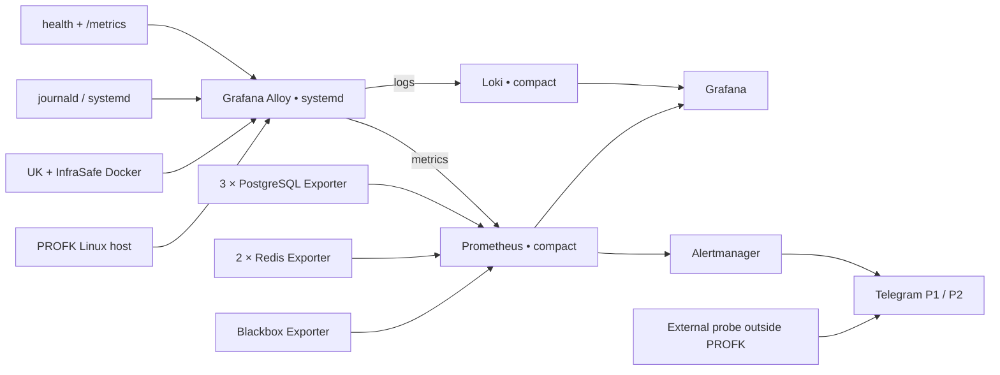

# PROFK — единая observability-платформа для UK и InfraSafe: план реализации

> **Статус:** rev 3; владельцем выбран компактный полный профиль на фактическом
> хосте, реализация не начата. Перед
> изменением production-хоста, репозиториев или secret storage требуется явное
> подтверждение владельца.
>
> **Ведущая команда:** InfraSafe/Ops. Команды UK и InfraSafe отвечают за прикладные
> метрики и runbook'и своих сервисов.

**Goal:** Развернуть на сервере `profk` единый контур наблюдаемости, который показывает
состояние Linux-хоста, Docker-контейнеров, сервисов UK и InfraSafe, PostgreSQL/Redis,
свободное место, логи, внешнюю доступность, TLS, backup freshness и состояние
интеграции UK↔InfraSafe, а также отправляет дедуплицированные алерты в Telegram.

**Architecture:** Отдельный проект `profk-observability`, независимый от compose-проектов
UK и InfraSafe. Grafana Alloy работает как доверенный host-agent; Prometheus хранит
метрики и правила, Grafana — дашборды, Alertmanager — маршрутизацию уведомлений,
Blackbox Exporter — HTTP/TCP/DNS/TLS-пробы, Loki — централизованные логи. Все
компоненты запускаются на `profk` в компактном профиле с суммарным hard memory cap
около 2 GiB, 14-дневным retention и дисковым бюджетом 12–13 GiB. До запуска
создаётся swap-файл 2 GiB; таким образом, весь резерв на текущем диске составляет
около 14–15 GiB. Полное падение `profk` обнаруживается внешней точкой на
`infrasafe.uz` (.105) плюс независимым dead-man каналом.

**Tech Stack:** Grafana Alloy, Prometheus, Alertmanager, Grafana, Blackbox Exporter,
PostgreSQL Exporter, Redis Exporter, Loki single-binary, Docker Compose, systemd,
Telegram. Secret backend выбирается один раз владельцем: UK продолжает использовать
Doppler, InfraSafe сейчас использует свои gitignored env/config-файлы.

---

## 1. Почему ведущая команда — InfraSafe/Ops

Observability затрагивает не отдельное приложение, а весь production-хост:

- Docker daemon и его socket;
- общие Docker-сети UK и InfraSafe;
- edge-nginx, порты 80/443 и TLS-сертификаты;
- системные каталоги `/proc`, `/sys`, Docker data root и диски;
- systemd/journald, reboot и backup jobs;
- общую маршрутизацию аварийных уведомлений.

Поэтому владельцем и оператором платформы должна быть команда, которая управляет
сервером и edge — InfraSafe/Ops. Это не снимает ответственность с продуктовых команд:
UK и InfraSafe должны предоставить корректные `/metrics`, доменные пороги и инструкции
по реакции на алерты.

### 1.1. Матрица ответственности

| Зона | Responsible | Approver / участники |
|---|---|---|
| Observability compose, Alloy, storage, systemd | InfraSafe/Ops | Владелец сервера |
| Edge, TLS, внешние probes | InfraSafe/Ops | Владелец сервера |
| Host/Docker/PostgreSQL/Redis dashboards | InfraSafe/Ops | UK + InfraSafe review |
| UK `/metrics`, outbox, Access API, workers | UK | InfraSafe/Ops интегрирует scrape |
| InfraSafe HTTP/telemetry/outbox/worker metrics | InfraSafe | InfraSafe/Ops интегрирует scrape |
| Telegram routing, P1/P2-политика | InfraSafe/Ops | Владелец сервера |
| Retention и resource budget | InfraSafe/Ops | Владелец сервера |
| Финальная проверка UK↔InfraSafe | UK + InfraSafe | Владелец сервера |

---

## 2. Текущий production-инвентарь

### 2.1. UK: постоянно ожидаемые сервисы

- `uk-management-bot`;
- `uk-management-api`;
- `uk-access-api`;
- `uk-postgres`;
- `uk-redis`;
- `uk-frontend`;
- `uk-media-service`;
- `uk-resource-postgres`;
- `uk-resource-api`;
- `uk-resource-worker`.

`migrate` и `provision-roles` — one-shot tools, они не должны считаться постоянно
работающими контейнерами.

### 2.2. InfraSafe: постоянно ожидаемые сервисы

- `frontend`;
- `app`;
- `redis`;
- `postgres`;
- `nginx` — общий публичный edge для InfraSafe и UK;
- `asset-web` — web-сервис asset inventory, включённый в edge-конфигурацию
  (InfraSafe commit `07db480`).

Фактические имена контейнеров и compose-project labels нужно зафиксировать на `profk`
на этапе инвентаризации. Правила не должны зависеть только от автоматически найденных
контейнеров: удалённый контейнер нельзя обнаружить без списка ожидаемых сервисов.

### 2.3. Уже существующие точки наблюдаемости

- UK API: `/health`, `/api/health`, `/api/health/ratelimit`,
  `/api/health/outbox`, `/metrics`;
- Access API: `/health`, `/metrics`, `/api/v1/access/metrics`;
- bot: внутренний `/health` на порту 8000;
- media-service: `/api/v1/health` и детальные health endpoints;
- InfraSafe app: `/health` с проверкой PostgreSQL;
- compose healthchecks уже присутствуют у большинства критичных сервисов.

### 2.4. Известные ограничения фактического хоста

Эти значения уже получены с `profk` и не являются открытыми вопросами Task 0:

- 2 vCPU;
- 5.8 GiB RAM, доступно около 3.7 GiB;
- swap отсутствует;
- один диск 40 GiB, свободно около 26 GiB;
- отдельного volume под observability нет;
- текущий общий объём Docker-логов около 48 MiB;
- на `profk` нет настроенных backup jobs: в cron присутствуют только certbot/e2scrub;
- в InfraSafe на `profk` сейчас 0 контроллеров и 0 telemetry metrics.

Следствие: исходный бюджет 2–3.5 GiB RAM и 40–60 GiB storage неприменим, но полный
состав сервисов помещается в **компактном профиле**. Для текущей низкой нагрузки
(около 15 scrape-целей и менее 100 MiB логов в день) ожидаемый footprint составляет
1.1–1.7 GiB RAM; суммарный hard cap — около 2 GiB. Prometheus получает 14 дней и
size cap 8 GiB, Loki — 14 дней и операционный бюджет 3–4 GiB с Compactor и внешним
контролем размера каталога. Общий observability storage — 12–13 GiB, плюс swap-файл
2 GiB. Узкое место — 2 vCPU, поэтому container metrics собираются раз в 60 секунд
с allowlist'ом метрик, прикладные цели — раз в 30–60 секунд.

---

## 3. Целевая архитектура



### 3.1. Размещение

- Создать отдельный репозиторий `profk-observability`.
- На сервере развернуть его в отдельном каталоге, например
  `/opt/profk-observability` или `~/profk-observability`.
- Использовать отдельное compose project name и сеть `profk-observability`.
- Не добавлять observability-сервисы в compose UK или InfraSafe.
- Не использовать `--remove-orphans` в production-командах.
- Grafana публиковать только на `127.0.0.1`; доступ — через VPN/SSH tunnel либо
  отдельно утверждённый защищённый edge.
- Prometheus, Loki, Alertmanager, Alloy UI и exporters публично не публиковать.
- Loki входит в первый релиз; отдельный volume не требуется при соблюдении caps из §5.

### 3.2. Предлагаемая структура репозитория

```text
profk-observability/
├── compose.yml
├── .env.example
├── alloy/config.alloy
├── prometheus/
│   ├── prometheus.yml
│   └── rules/
│       ├── host.yml
│       ├── docker.yml
│       ├── blackbox.yml
│       ├── postgres.yml
│       ├── redis.yml
│       ├── uk.yml
│       ├── infrasafe.yml
│       └── observability.yml
├── alertmanager/
│   ├── alertmanager.yml
│   └── templates/
├── loki/loki.yml
├── blackbox/blackbox.yml
├── grafana/
│   ├── provisioning/
│   └── dashboards/
├── scripts/docker-health-metrics.sh
├── systemd/
│   ├── alloy.service.d/
│   ├── profk-docker-health.service
│   └── profk-docker-health.timer
└── runbooks/
    ├── deployment.md
    ├── alerts.md
    ├── storage.md
    └── rollback.md
```

---

## 4. План реализации

### Task −2. Подготовить memory safety хоста

**Ответственный:** InfraSafe/Ops. **Approver:** владелец сервера.

На хосте отсутствует swap. При 5.8 GiB RAM это создаёт риск, что краткий memory spike
приведёт OOM-killer к production-контейнеру. Компактный профиль разрешён только после
добавления страховочного swap-файла.

- [ ] Повторно проверить свободное место и состояние filesystem перед изменением.
- [ ] Создать swap-файл 2 GiB с root-only permissions и включить его.
- [ ] Добавить swap в постоянную конфигурацию загрузки и установить консервативный
  `vm.swappiness` (ориентир — 10).
- [ ] Проверить `swapon --show`, права файла и восстановление swap после reboot.
- [ ] Задать каждому observability-компоненту собственный memory limit; суммарный
  hard cap — не более 2 GiB.
- [ ] Для observability-процессов задать `OOMScoreAdjust=+500`, чтобы при исчерпании
  памяти мониторинг завершался раньше production-приложений.
- [ ] Добавить alerts на использование swap, OOM events и приближение каждого
  компонента к memory limit.

**Критерий приёмки:** после reboot доступен swap 2 GiB; hard memory limits из §5
проверены до запуска полного observability-стека.

**Stop condition:** без работающего swap и per-service limits production rollout
полного компактного профиля запрещён.

### Task −1. Внедрить резервное копирование до production-пилота

**Ответственный:** InfraSafe/Ops. **Approver:** владелец сервера. **Участники:** UK.

На `profk` сейчас нет резервных копий. Поэтому backup freshness нельзя считать
готовой метрикой observability: сначала должен появиться сам backup pipeline.

- [ ] Зафиксировать перечень критичных данных: три PostgreSQL, необходимые конфиги,
  persistent volumes и данные, которые нельзя восстановить из репозитория/Telegram.
- [ ] Выбрать off-host destination: `.105`, S3-compatible storage либо другой
  независимый носитель. Копия на том же 40 GiB диске backup'ом не считается.
- [ ] Настроить ежедневные зашифрованные backups с retention и проверкой exit status.
- [ ] Не использовать application runtime-роли там, где нужна отдельная backup-role.
- [ ] После первого успешного запуска публиковать textfile-метрики:
  `configured`, `last_success_timestamp`, `duration_seconds`, `size_bytes`.
- [ ] Провести документированный restore drill минимум для каждой PostgreSQL.
- [ ] Создать runbook backup/restore и назначить владельца.

**Критерий приёмки:** существует успешная off-host копия, выполнено тестовое
восстановление, после чего разрешается включить `BackupStale > 26h`.

**Stop condition:** отсутствие backup pipeline блокирует production-пилот и боевую
P1-маршрутизацию, но не блокирует read-only разработку observability-конфигурации.

### Task 0. Инвентаризация и owner decisions

**Ответственный:** InfraSafe/Ops. **Участники:** UK, InfraSafe, владелец сервера.

- [x] Сверить UK expected inventory: 10 постоянных сервисов — совпадает с хостом.
- [x] Добавить InfraSafe `asset-web` в expected inventory.
- [ ] Зафиксировать точные container names и compose-project/service labels всех
  production-контейнеров в `inventory.yml`.
- [x] Зафиксировать характеристики хоста: 2 vCPU, 5.8 GiB RAM, no swap, диск 40 GiB,
  свободно около 26 GiB, отдельного volume нет.
- [x] Зафиксировать текущий объём Docker-логов: около 48 MiB.
- [ ] Проверить текущие опубликованные порты и выбрать свободный loopback-порт Grafana.
- [ ] Зафиксировать endpoint'ы health/metrics и необходимые bearer-токены.
- [ ] Утвердить Telegram-чат, P1/P2 threads и дежурных.
- [ ] Подтвердить `.105` как основной внешний probe и выбрать независимый dead-man
  канал (например, Healthchecks.io).
- [x] Владелец выбрал полный компактный профиль: Prometheus и Loki по 14 дней,
  observability storage 12–13 GiB, swap 2 GiB и суммарный hard memory cap ≤2 GiB.
- [x] Зафиксировать memory-safety решение: swap-файл 2 GiB, per-service limits и
  `OOMScoreAdjust=+500` для observability. Реализация выполняется в Task −2.
- [ ] Один раз выбрать secret policy для observability и InfraSafe: не вводить
  Doppler только ради мониторинга без отдельного решения владельца.
- [ ] Зафиксировать SLO: edge availability, HTTP latency и per-stack UK↔InfraSafe lag.
- [ ] Telemetry freshness SLO и alert activation отложить до появления хотя бы одного
  expected-контроллера.

**Выход:** `inventory.yml`, таблица SLO/thresholds, список получателей и решение по
доступу к Grafana.

**Stop condition:** исходный профиль 2–3.5 GiB RAM / 40–60 GiB storage запрещён.
Полный компактный профиль разрешён только после Task −2, с caps из §5 и минимум
20 GiB свободного места перед установкой observability-данных (после создания swap).

### Task 1. Создание отдельного observability-проекта

**Ответственный:** InfraSafe/Ops.

- [ ] Создать отдельный репозиторий и структуру из §3.2.
- [ ] Добавить `compose.yml` для Prometheus, Alertmanager, Grafana,
  Loki, Blackbox Exporter и exporter-сервисов.
- [ ] Зафиксировать версии образов; `latest` запрещён.
- [ ] Добавить healthchecks, restart policy, `mem_limit` и CPU limits каждому компоненту;
  суммарный hard memory limit полного стека ≤2 GiB, суммарный CPU ceiling ≤1.4 vCPU.
- [ ] Для systemd Alloy задать `MemoryMax`; для observability-процессов настроить
  `OOMScoreAdjust=+500`, чтобы мониторинг завершался раньше production-приложений.
- [ ] Создать отдельную сеть и storage на текущем диске с бюджетом 12–13 GiB.
- [ ] Настроить Grafana provisioning: Prometheus и Loki datasources,
  dashboards-as-code.
- [ ] Реализовать утверждённую в Task 0 secret policy. UK secrets продолжают идти
  из Doppler; InfraSafe не мигрировать с `.env.prod`/gitignored config неявно.
- [ ] Не хранить Telegram/Grafana/exporter secrets в репозитории или общем
  world-readable `.env`.
- [ ] Добавить `promtool`, `amtool`, Loki/Alloy config validation в CI.

**Критерий приёмки:** пустой базовый стек стартует независимо от UK и InfraSafe,
переживает restart/reboot, наружу не появляются дополнительные публичные порты.

### Task 2. Host и Docker metrics

**Ответственный:** InfraSafe/Ops.

- [ ] Установить Grafana Alloy как systemd-сервис на Linux-хосте.
- [ ] Включить Unix/node-exporter collectors для CPU, load, memory, swap,
  filesystem, inode, disk I/O, network, conntrack и boot time.
- [ ] Подключить встроенные cAdvisor/Docker collectors Alloy с интервалом 60 секунд
  и allowlist'ом необходимых per-container метрик; не собирать дорогие неиспользуемые
  collectors.
- [ ] Установить scrape interval приложений и exporters 30–60 секунд; более частый
  сбор разрешать только для доказанного P1-сигнала.
- [ ] Добавить единые labels: `host=profk`, `stack`, `compose_project`,
  `compose_service`, `container`.
- [ ] Ограничить Alloy UI loopback-интерфейсом.
- [ ] Зафиксировать root-equivalent риск Docker socket; конфигурация Alloy должна
  принадлежать root и быть недоступна product-контейнерам.
- [ ] Реализовать `docker inspect` textfile collector, который раз в минуту отдаёт:
  `expected`, `present`, `running`, `healthy`, `restart_count`, `started_seconds`.
- [ ] Исключить one-shot `migrate`/`provision-roles` из expected inventory.
- [ ] Добавить self-monitoring Alloy и alert на отсутствие его данных.

**Критерий приёмки:** Grafana показывает состояние каждого ожидаемого контейнера,
свободное место, inode, CPU/RAM и рестарты. Удалённый контейнер определяется как
`absent`, а не исчезает из дашборда бесследно.

### Task 3. PostgreSQL, Redis и Blackbox

**Ответственный:** InfraSafe/Ops.

- [ ] Создать отдельные PostgreSQL login-роли для мониторинга с минимальным доступом
  и членством в `pg_monitor`.
- [ ] Подключить exporters к трём PostgreSQL: UK, Resource и InfraSafe.
- [ ] Подключить отдельные exporter instances к двум Redis: UK и InfraSafe; один
  exporter не переиспользовать из-за разных credentials.
- [ ] Для UK Redis получить password через существующий UK secret flow.
- [ ] Для InfraSafe Redis создать отдельный root-readable password file из текущего
  gitignored `redis-config` при deploy и передать exporter'у через
  `REDIS_PASSWORD_FILE`; не помещать пароль в argv, compose или логи.
- [ ] Использовать dual-homed exporter pattern: exporter подключён к observability-сети
  и только к нужной внутренней сети целевого сервиса.
- [ ] Не менять сетевую топологию product-контейнеров и не подключать InfraSafe app
  к `uk-network`.
- [ ] Настроить Blackbox probes для:
  - `https://profk.uz/`;
  - `https://profk.uz/uk/`;
  - InfraSafe health;
  - UK API health;
  - media/resource/access health;
  - DNS и TLS certificate expiry.
- [ ] Добавить scrape health всех exporters.

**Критерий приёмки:** доступны метрики PostgreSQL connections/locks/transactions/
database size, Redis memory/clients/evictions и HTTP/TLS probes.

### Task 4. Централизованные логи

**Ответственный:** InfraSafe/Ops. **Review:** UK и InfraSafe.

Loki входит в компактный первый релиз. Текущий накопленный объём Docker-логов около
48 MiB и ожидаемый поток менее 100 MiB/день позволяют держать 14 дней на общем диске,
но только с retention, Compactor и независимым контролем размера каталога.

- [ ] Подключить Docker log discovery и journald в Alloy.
- [ ] Отправлять логи в Loki с ограниченным набором labels:
  `host`, `stack`, `service`, `container`, `level`.
- [ ] Не выносить в labels request ID, user ID, URL, building/controller ID и
  другие высококардинальные поля.
- [ ] Настроить JSON/logfmt parsing только для стабильных форматов.
- [ ] Проверить и редактировать `Authorization`, cookies, Telegram/Doppler tokens,
  пароли, DSN и персональные данные.
- [ ] Включить Loki Compactor, retention 14 дней и storage monitoring.
- [ ] Ограничить операционный бюджет Loki 3–4 GiB. Если filesystem поддерживает
  project quota — применить её; иначе публиковать размер каталога через textfile
  collector и останавливать ingestion/rollout по порогам §5. Time retention без
  контроля фактического размера hard cap не считается.
- [ ] Добавить alert на рост Loki storage и ошибки ingestion/compaction.
- [ ] Проверить log rotation Docker у всех product-контейнеров.

**Критерий приёмки:** логи обоих стеков ищутся из одной Grafana; тестовая секретная
строка не попадает в Loki; retention реально удаляет устаревшие данные.

### Task 5. Прикладные метрики UK

**Ответственный:** UK. **Интеграция scrape:** InfraSafe/Ops.

- [ ] Подключить существующий UK API `/metrics` с `HEALTH_METRICS_TOKEN`.
- [ ] Подключить Access API `/metrics`.
- [ ] Подключить outbox gauges: pending, oldest age, failed, stuck in flight.
- [ ] Подключить rate-limit backend health.
- [ ] Добавить общие HTTP count/duration/status metrics, если их ещё нет.
- [ ] Добавить bot/media/resource worker heartbeat.
- [ ] Добавить healthchecks отсутствующим долгоживущим frontend/worker-сервисам.
- [ ] После завершения Task −1 подключить backup textfile metrics: configured,
  last success timestamp, duration, size. До первого успешного backup не создавать
  фиктивную `last_success=0` и не включать `BackupStale`.
- [ ] Исключить пользовательские данные из label values.

**Критерий приёмки:** тестовая задержка outbox и пропавший worker heartbeat видны
в Grafana и формируют тестовый alert.

### Task 6. Прикладные метрики InfraSafe

**Ответственный:** InfraSafe. **Интеграция scrape:** InfraSafe/Ops.

- [ ] Добавить `prom-client` и внутренний `/internal/metrics` на существующем app-порту.
- [ ] Зарегистрировать endpoint до default-deny JWT router, но защитить отдельным
  `Authorization: Bearer <INFRASAFE_METRICS_TOKEN>` с constant-time compare.
- [ ] Хранить `INFRASAFE_METRICS_TOKEN` в существующем InfraSafe `.env.prod` либо
  в secret backend, который явно выбран владельцем в Task 0; не требовать Doppler
  только для этой настройки.
- [ ] Канонический scrape path: Alloy host-agent использует Docker service discovery
  и скрейпит container IP InfraSafe app напрямую. Не публиковать новый host-порт,
  не добавлять route в edge и не менять Docker-сети product-сервисов.
- [ ] Добавить HTTP request count/duration/status.
- [ ] Добавить telemetry ingestion count и timestamp последней телеметрии.
- [ ] Добавить `expected_controllers`, online/offline controller gauges.
- [ ] Добавить `uk_outbox` pending/dead/oldest age/retries.
- [ ] Добавить verification worker queue/heartbeat/failures.
- [ ] Добавить MV refresh duration/failures/last success.
- [ ] Добавить Redis degraded-mode metric.
- [ ] Добавить UK↔InfraSafe integration success/error/retry counters.

**Критерий приёмки:** `/internal/metrics` недоступен без токена и не доступен через
public edge; Alloy успешно скрейпит его по Docker SD. Зависание worker и рост outbox
обнаруживаются метриками. Telemetry-staleness проверяется синтетически, но боевой alert
остаётся выключенным при `expected_controllers == 0`.

### Task 7. Дашборды

**Ответственный:** InfraSafe/Ops. **Domain review:** UK и InfraSafe.

- [ ] `PROFK — Overview`: состояние хоста, edge, стеков, DB/Redis, последние P1/P2.
- [ ] `Host & Docker`: CPU/RAM/swap/disk/inode/I/O/network и все контейнеры.
- [ ] Включить `asset-web` в InfraSafe/edge service status и expected inventory panel.
- [ ] `PostgreSQL & Redis`: три PostgreSQL и два Redis.
- [ ] `UK Management`: API, bot, Access, media, resource, outbox.
- [ ] `InfraSafe`: API, telemetry, controllers, verification и MV refresh.
- [ ] `UK ↔ InfraSafe`: обе outbox-очереди, retries, latency и reconciliation drift.
- [ ] `Logs & Deployments`: Loki ingestion/storage, поиск логов обоих стеков,
  Prometheus error-rate и deploy annotations.
- [ ] Добавить переменные `stack`, `service`, `container`, `instance`, но не
  высококардинальные бизнес-идентификаторы.

**Критерий приёмки:** дежурный за одну минуту определяет, проблема в хосте, edge,
конкретном контейнере, БД/Redis или интеграции.

### Task 8. Alert rules и Telegram routing

**Ответственный:** InfraSafe/Ops. **Пороги утверждают:** UK, InfraSafe, владелец.

#### P1 — критические

- [ ] Host или внешний edge недоступен больше 2 минут.
- [ ] Ожидаемый контейнер absent/stopped/unhealthy больше 2 минут.
- [ ] PostgreSQL или Redis недоступен.
- [ ] Свободно меньше 8 GiB либо прогноз заполнения диска меньше 24 часов.
- [ ] Свободно меньше 10% inode.
- [ ] Backup старше 26 часов — включать только после завершения Task −1 и первого
  успешного backup; до этого production-пилот заблокирован prerequisite-гейтом.
- [ ] TLS истекает меньше чем через 7 дней.
- [ ] UK outbox: отдельное правило с порогом по фактической скорости UK worker;
  возраст сам по себе не является P1. P1 требует failed/stuck либо отсутствие
  уменьшения очереди дольше утверждённого drain SLA.
- [ ] InfraSafe outbox: учесть лимит drain ≈30 событий/мин. Легитимный burst не должен
  создавать P1; правило комбинирует per-stack backlog age с dead/failed/stuck либо
  отсутствием прогресса очереди за 15 минут.
- [ ] InfraSafe telemetry stale только при `expected_controllers > 0`; при текущих
  0 контроллерах правило не firing и отображает состояние `pilot_not_enabled`.
- [ ] InfraSafe outbox/verification worker stalled.
- [ ] Alloy, Prometheus или Loki перестал отдавать данные.

#### P2 — предупреждения

- [ ] CPU больше 90% в течение 15 минут.
- [ ] Доступная RAM меньше 15% либо swap используется устойчиво/растёт.
- [ ] Свободное место меньше 12 GiB или Prometheus/Loki приближается к своему
  storage budget.
- [ ] Любой OOM kill либо приближение observability-компонента к `mem_limit`.
- [ ] Более трёх рестартов контейнера за 15 минут.
- [ ] PostgreSQL connections больше 80%, long transaction больше 5 минут.
- [ ] Redis memory больше 85%, появились evictions/rejected connections.
- [ ] TLS истекает меньше чем через 21 день.
- [ ] Свободно меньше 15% inode.
- [ ] Растёт HTTP 5xx rate или нарушается утверждённый latency SLO.

#### Маршрутизация

- [ ] Включить `send_resolved`.
- [ ] Разделить P1 и P2 по Telegram thread/contact point.
- [ ] Группировать по `alertname`, `host`, `stack`, `service`.
- [ ] Настроить inhibition: `HostDown` подавляет производные container/service alerts.
- [ ] Настроить quiet/mute intervals только для P2; P1 не замалчивать.
- [ ] Добавить ссылку на Grafana и конкретный runbook в annotation каждого P1.

### Task 9. Внешняя проверка и dead-man switch

**Ответственный:** InfraSafe/Ops.

- [ ] Разместить основной внешний probe на `infrasafe.uz` (.105), организовав
  взаимный мониторинг двух хостов.
- [ ] Проверять HTTPS `profk.uz` каждую минуту.
- [ ] Считать outage после 2–3 неудачных попыток.
- [ ] Проверять TLS и DNS извне.
- [ ] Отправлять dead-man heartbeat в независимый канал, например Healthchecks.io,
  чтобы отказ обоих собственных хостов не остался незамеченным.
- [ ] Убедиться, что внешний alert не зависит от Grafana/Loki/Telegram-бота на `profk`.

**Критерий приёмки:** при остановленном локальном observability-стеке или полном
выключении `profk` внешний alert всё равно приходит.

### Task 10. Shadow rollout и ввод в эксплуатацию

**Ответственный:** InfraSafe/Ops. **Приёмка:** UK + InfraSafe + владелец.

- [ ] Сначала направить уведомления в тестовый Telegram thread.
- [ ] Запустить 48–72 часа shadow mode.
- [ ] Измерить CPU/RAM/disk overhead observability.
- [ ] Исправить шумные правила и дубли.
- [ ] Проверить конфигурации через `promtool`, `amtool`, Alloy и Loki validation.
- [ ] Провести безопасные синтетические проверки:
  - test alert через `amtool`;
  - временно неверный Blackbox target;
  - synthetic `container_healthy=0`;
  - synthetic disk metric;
  - backup heartbeat после завершения Task −1;
  - остановка только тестового контейнера;
  - пропуск тестового heartbeat.
- [ ] Проверить восстановление observability после reboot.
- [ ] Перевести Alertmanager routing в боевой Telegram thread.
- [ ] Передать runbook дежурным и зафиксировать владельцев каждого P1.

**Stop condition:** production P1 routing не включать, пока не завершены Tasks −2
и −1, не проверены внешний probe, Prometheus/Loki retention, storage/memory caps,
redaction секретов и восстановление после reboot.

---

## 5. Resource budget и retention

Фактический хост: 2 vCPU, 5.8 GiB RAM, около 3.7 GiB available, swap отсутствует,
диск 40 GiB / около 26 GiB free, отдельного volume нет. Выбран полный компактный
профиль; swap 2 GiB создаётся в Task −2 до запуска стека.

### 5.1. Compact full-stack profile

| Компонент | Ожидаемая RAM | Hard RAM limit | CPU ceiling | Storage / retention |
|---|---:|---:|---:|---|
| Prometheus | 300–500 MiB | 640 MiB | 0.35 vCPU | 14 дней, `retention.size=8GiB` |
| Loki single-binary | 300–500 MiB | 512 MiB | 0.35 vCPU | 14 дней, операционный бюджет 3–4 GiB |
| Grafana | 150–250 MiB | 256 MiB | 0.15 vCPU | до 512 MiB |
| Alloy systemd | 150–300 MiB | 320 MiB `MemoryMax` | 25% quota | WAL/buffer до 512 MiB |
| Alertmanager + Blackbox | около 80 MiB | 112 MiB суммарно | 0.10 vCPU | до 128 MiB |
| 3 × PostgreSQL Exporter | около 50 MiB | 120 MiB суммарно | 0.12 vCPU | минимально |
| 2 × Redis Exporter | около 30 MiB | 48 MiB суммарно | 0.08 vCPU | минимально |

Суммарный hard limit — 2008 MiB RAM (около 1.96 GiB), CPU ceiling — 1.4 vCPU.
Ожидаемый steady-state footprint — 1.1–1.7 GiB RAM и около 5–10% CPU; ceiling нужен
для защиты production при аномальном запросе, compaction или cardinality spike.
Каждому компоненту обязателен отдельный лимит: общий бюджет без per-service limits
не считается выполненным.

Дисковый бюджет:

- Prometheus — hard size cap 8 GiB и time retention 14 дней;
- Loki — 14 дней, Compactor и рабочий бюджет 3–4 GiB;
- Grafana, Alertmanager, Alloy WAL/buffer и служебные данные — до 1 GiB;
- observability data — суммарно 12–13 GiB;
- swap-файл — ещё 2 GiB;
- общий резерв на текущем диске — 14–15 GiB из 26 GiB свободных.

У Loki на обычном filesystem time retention не заменяет жёсткую квоту. Поэтому
предпочтителен filesystem project quota; если она недоступна, размер каталога
публикуется как метрика минимум раз в минуту. Warning — свободно меньше 12 GiB или
Loki больше 3 GiB, P1 — свободно меньше 8 GiB, Loki больше 4 GiB либо прогноз
заполнения меньше 24 часов.

### 5.2. Путь роста и scale-out gates

Владелец добавляет отдельный volume либо Loki выносится на другой хост, если выполнено
любое из условий после shadow-периода:

- observability использует больше 1.6 GiB RAM устойчиво 15 минут либо был OOM;
- средний CPU overhead observability больше 20% хоста в течение 15 минут;
- Prometheus превышает 6 GiB или Loki превышает 3 GiB при текущем retention;
- поток логов выше 200 MiB/день семь дней подряд;
- прогноз свободного места опускается ниже 10 GiB в течение 30 дней.

Миграция storage не меняет scrape, labels, dashboards и alert rules: компактный
профиль является начальной конфигурацией той же архитектуры, а не отдельным тупиковым
решением.

---

## 6. Security requirements

- Docker socket считать root-equivalent доступом.
- Alloy устанавливать только из зафиксированной версии; конфиг root-owned.
- Не передавать Docker socket Grafana, Loki, Prometheus или product-контейнерам.
- Exporters использовать с отдельными read-only credentials.
- Prometheus/Loki/Alertmanager не публиковать в интернет.
- Grafana: secure cookies, отключённая anonymous access, сильный admin secret,
  доступ через VPN/SSH либо защищённый edge.
- Secret backend выбирается явно: UK остаётся на Doppler, InfraSafe — на текущих
  gitignored `.env.prod`/config-файлах до отдельной миграции. Для observability
  допускаются Doppler либо root-owned secret files; смешанная неявная схема запрещена.
- Redis passwords передавать через `REDIS_PASSWORD_FILE`, не через argv/compose.
- Не писать секреты в labels, annotations и alert messages.
- Не использовать application owner/superuser credentials для exporters.
- Не менять существующие alias'ы и сетевую топологию UK/InfraSafe.
- Не выполнять `down -v` и `--remove-orphans` на production.

---

## 7. Risk register

| Риск | Уровень | Митигация |
|---|---|---|
| Loki заполняет production-диск | High | 14d retention, Compactor, quota либо directory-size metric, 3/4 GiB warning/P1, общий disk forecast |
| No swap + memory spike вызывает OOM production | High | Task −2: swap 2 GiB, hard per-service limits, Alloy `MemoryMax`, `OOMScoreAdjust=+500` |
| Docker socket скомпрометирован | High | Host-agent, root-owned config, минимальный доступ, нет публичного UI |
| Мониторинг исчезает вместе с сервером | High | Независимый внешний probe и dead-man switch |
| Логи содержат секреты/ПД | High | Redaction, sample audit, ограниченные labels |
| Сетевой alias collision | High | Не менять product-сети; dual-homed exporters только по необходимости |
| Алерт-шторм и потеря доверия | Medium | Shadow mode, grouping, inhibition, P1/P2 separation |
| Высокая cardinality | Medium | Label allowlist, запрет business/request IDs в labels |
| Observability забирает ресурсы приложений | High | Полный стек ≤2 GiB RAM / ≤1.4 vCPU, scrape 30–60s, урезанные container metrics, 72h shadow mode |
| Удалённый контейнер не виден discovery | Medium | Явный expected inventory + textfile collector |
| Ротация credentials ломает exporters | Medium | Явный per-stack secret flow, password files, отдельный alert на scrape failure |
| BackupStale не имеет источника | High | Task −1 до production-пилота; правило включается после первого успешного backup |
| TelemetryStale всегда firing при 0 контроллеров | High | `expected_controllers > 0` gate и activation вместе с пилотом |

---

## 8. Verification и приёмка

Решение считается введённым в эксплуатацию, когда выполнены все условия:

1. Все ожидаемые UK/InfraSafe контейнеры, включая `asset-web`, отображаются с
   present/running/healthy.
2. Удалённый или unhealthy тестовый контейнер создаёт Telegram alert не позднее 3 минут.
3. Видны CPU, RAM, активный swap 2 GiB, disk, inode, I/O, network и прогноз
   заполнения диска.
4. Видны три PostgreSQL и два Redis; недоступность exporter/target алертится.
5. Blackbox видит public edge, UK path, TLS expiry и latency.
6. UK outbox и Access metrics собраны с правильной авторизацией.
7. InfraSafe `/internal/metrics` скрейпится Alloy по container IP/Docker SD, защищён
   токеном и не доступен через edge.
8. InfraSafe outbox/worker metrics собраны; telemetry alert не firing при
   `expected_controllers == 0` и включается вместе с пилотным контроллером.
9. Фактически работают Prometheus `retention.size=8GiB`, Loki retention 14 дней,
   Compactor и quota/directory-size alert; выполнена проверка redaction секретов.
10. Tasks −2 и −1 завершены: swap пережил reboot; off-host backup восстановлен в
    тесте, freshness и
    restore-check heartbeat отображаются и алертятся.
11. Полное отключение локального мониторинга определяется внешним probe.
12. После reboot весь стек восстанавливается автоматически.
13. У каждого P1 alert есть владелец и runbook.
14. Observability не создаёт новых публичных портов и укладывается в compact profile:
    ≤2 GiB RAM, ≤1.4 vCPU ceiling и 12–13 GiB observability data.

---

## 9. Rollback

Observability разворачивается отдельно, поэтому rollback не должен затрагивать UK или
InfraSafe:

1. Остановить Alertmanager routing, чтобы избежать ложного storm.
2. Остановить отдельный observability compose без `-v`.
3. Остановить Alloy systemd-service и docker-health timer.
4. Сохранить volumes и конфигурацию для диагностики.
5. Проверить, что UK, InfraSafe и edge продолжают работать.

Удаление volumes, ролей PostgreSQL, каталогов storage и secrets — отдельная
деструктивная операция, только после подтверждения владельца.

---

## 10. Оценка и порядок передачи между командами

**Сложность:** средне-высокая.

| Этап | Ответственный | Оценка |
|---|---|---:|
| Swap 2 GiB + reboot-проверка (Task −2) | InfraSafe/Ops | 0.5 дня + окно reboot |
| Off-host backup + restore drill (Task −1) | InfraSafe/Ops + UK | отдельная prerequisite-задача |
| Инвентаризация + compact full stack, включая Loki | InfraSafe/Ops | 1–2 дня |
| Host/Docker/DB/Redis/Blackbox | InfraSafe/Ops | 1–2 дня |
| Logs, dashboards + alerts | InfraSafe/Ops | 1–2 дня |
| UK application metrics | UK | 1–2 дня |
| InfraSafe application metrics | InfraSafe | 1–2 дня |
| Shadow mode и приёмка | Совместно | 2–3 календарных дня |

Ориентир compact full stack: 5–8 инженерных дней плюс prerequisite backup и
shadow-период.

Рекомендуемый порядок передачи:

1. Владелец разрешает изменение хоста; InfraSafe/Ops выполняет Task −2.
2. Владелец утверждает backup destination; InfraSafe/Ops с UK выполняют Task −1.
3. InfraSafe/Ops выполняет Tasks 0–4 и предоставляет UK/InfraSafe scrape-контракты.
4. UK выполняет Task 5, InfraSafe — Task 6 параллельно.
5. InfraSafe/Ops завершает dashboards/alerts/external probe и compact rollout.
6. UK и InfraSafe совместно проводят Task 10 и подписывают критерии §8.

---

## 11. Owner gates

До явного подтверждения владельца запрещено:

- менять production-хост или systemd;
- создавать PostgreSQL/Redis credentials;
- добавлять/менять Doppler, `.env.prod`, `redis-config` или observability secret files;
- добавлять swap/zram или новый volume;
- менять edge-nginx;
- публиковать Grafana;
- включать боевые Telegram alerts;
- изменять код UK или InfraSafe;
- выполнять deploy, commit или push.

Архитектурный gate закрыт: владелец выбрал полный компактный профиль. Первый
операционный gate — разрешение на **Task −2 (swap 2 GiB)** и Task 0 read-only
инвентаризацию. Отдельные подтверждения потребуются на установку, reboot window,
backup destination, secret policy, изменение приложений и production rollout.
