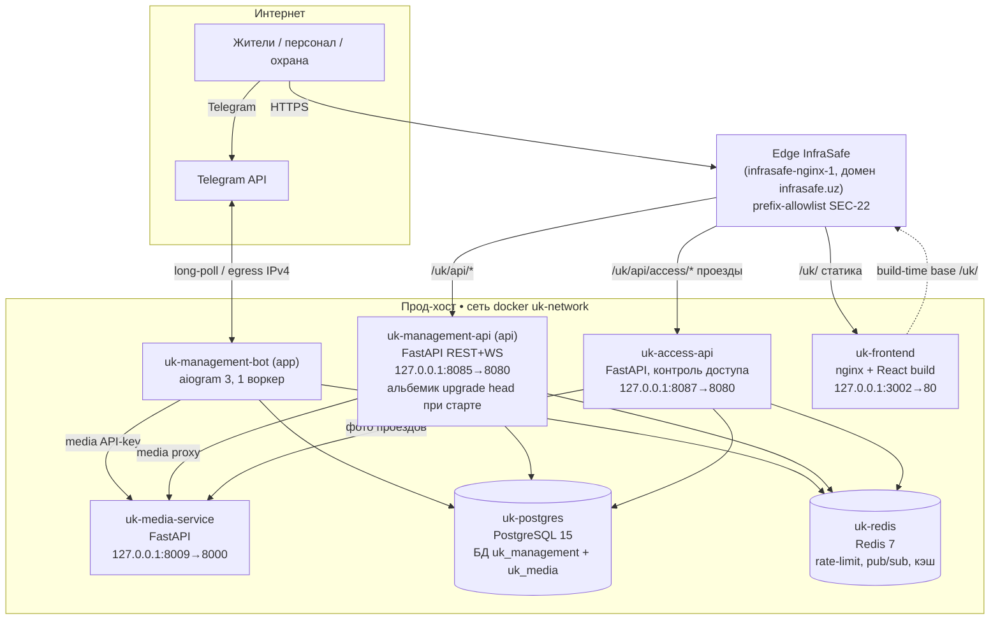

# UK Management — техническая архитектура

> Техническое описание системы: компоненты монорепо, развёртывание, потоки
> данных, аутентификация и локализация. Продуктовый обзор — в
> [../product/OVERVIEW.md](../product/OVERVIEW.md).
>
> Источник истины — код. Ключевые факты снабжены ссылками `файл:строка`.
> Помеченное **проверить** требует сверки перед использованием как норматив.

## 1. Компоненты монорепо

| Компонент | Каталог | Стек | Назначение |
|---|---|---|---|
| Telegram-бот | `uk_management_bot/` | aiogram 3, Python 3.11 | Основной канал жителей/исполнителей; точка сборки `main.py` |
| REST + WS API | `uk_management_bot/api/` | FastAPI, SQLAlchemy async | Бэкенд дашборда и Mini App; собирается в `Dockerfile.api` |
| Frontend SPA | `frontend/` | Vite + TS, React, shadcn/ui, TanStack Query, Zustand, i18next | Дашборд `/dashboard`, табло `/resident-board`, Mini App `/twa`, регистрация `/register`; base-path `/uk/` |
| Контроль доступа | `access_control/` | FastAPI, отдельный образ `Dockerfile.access` | ANPR/пропуска/проезды; собственный API, общая БД/Redis |
| Медиа-сервис | `media_service/` | FastAPI | Хранение и раздача фото/видео; своя логическая БД `uk_media` |
| Миграции | `alembic/` | Alembic | Схема PostgreSQL; выполняются **только** в api-контейнере |
| Документация | `docs/` | Markdown | Доки, аудит, планы |

Единая БД PostgreSQL и Redis общие для бота, основного API и access-API
(access-API миграции **не** гоняет — их применяет `uk-management-api`,
`docker-compose.yml:126-128`). Медиа-сервис использует отдельную логическую БД
`uk_media` в том же PostgreSQL (`docker-compose.media.yml:6`).

Бот рассчитан на **один воркер** (in-memory throttling в
`middlewares/throttling.py`; см. `docs/development/known-constraints.md`).

## 2. Диаграмма развёртывания

Прод собирается двумя compose-файлами:
`docker compose -f docker-compose.yml -f docker-compose.media.yml ...`;
**никогда** не использовать `--remove-orphans` (в стеке есть orphan-контейнеры
edge/InfraSafe). Все host-порты биндятся на `127.0.0.1` — наружу система
доступна только через edge InfraSafe (`infrasafe.uz`) по prefix-allowlist
(SEC-22).

Порты и контейнеры (источник — `docker-compose.yml`, `docker-compose.media.yml`):

| Контейнер | Host-порт → контейнер | Файл:строка |
|---|---|---|
| `uk-management-bot` (`app`) | — (health на :8000 внутри) | `docker-compose.yml:8,60` |
| `uk-management-api` (`api`) | `127.0.0.1:8085 → 8080` | `docker-compose.yml:94-95` |
| `uk-access-api` | `127.0.0.1:8087 → 8080` (порт 8086 занят influxdb на shared-деплое) | `docker-compose.yml:156-157` |
| `uk-postgres` | `127.0.0.1:5432` | `docker-compose.yml:216-217` |
| `uk-redis` | `127.0.0.1:6379` | `docker-compose.yml:250-251` |
| `uk-frontend` | `127.0.0.1:3002 → 80` | `docker-compose.yml:260-261` |
| `uk-media-service` | `127.0.0.1:8009 → 8000` | `docker-compose.media.yml:28-29` |

Сеть — фиксированное имя `uk-network` без префикса compose-проекта
(`docker-compose.yml:283`, реконсиляция прод-дрейфа). Egress — только IPv4:
IPv6 отключён на интерфейсах бота/API/access (в Узбекистане нет рабочего
IPv6-egress; иначе aiogram/httpx виснут на TCP-connect к `api.telegram.org`,
`docker-compose.yml:22-24,75-77,120-122`).

## 3. Потоки данных

### 3.1 Бот ↔ API ↔ PostgreSQL ↔ дашборд

- **Бот** обрабатывает апдейты Telegram, пишет/читает `uk_management` напрямую
  через SQLAlchemy (`uk_management_bot/main.py`, `database/session.py`), шлёт
  уведомления пользователям.
- **API** (`uk_management_bot/api/main.py`) обслуживает дашборд и Mini App:
  роутеры под `/api/v2/*` (auth, requests, shifts, addresses, feedback,
  materials, profile, callcenter, public, board-config, webhooks, registration)
  и WebSocket `/ws/v2/*` для live-обновлений
  (`api/main.py:120-138`). Пишет ту же БД `uk_management`.
- **Дашборд** (`uk-frontend`) — статическая сборка React, ходит в API через
  edge по `/uk/api/*`; live-события получает по WebSocket. Роуты и гарды —
  `frontend/src/App.tsx`.
- Бот и API — **разные процессы над одной БД**; согласованность через БД и
  Redis (pub/sub, `services/redis_pubsub.py`), а не через общий процесс.

### 3.2 Медиа

Фото/видео заявок и проездов хранит отдельный `media-service` (своя БД
`uk_media`, `docker-compose.media.yml`). Клиенты (бот, API, access-API) ходят в
него по внутреннему URL `http://media-service:8000` с `X-API-Key`. API отдаёт
медиа фронтенду через прокси-роут (`api/routes/media_proxy.py`, подписанные
signed-URL). Медиа-канал вынесен из «горячего» пути решений access-домена
(`docker-compose.yml:147-152`).

### 3.3 Контроль доступа как отдельный сервис

`uk-access-api` — самостоятельный образ (`Dockerfile.access`) с собственным API
(`access_control/api/`: ingestion, decision, edge, operator, camera-events,
equipment) и доменной логикой (`access_control/domain/`, `services/`,
`repositories/`). Инфраструктура общая: та же БД `uk_management` (миграции
применяет основной API) и тот же Redis. Multi-worker-безопасность обеспечена
внешними бэкендами на Redis: nonce-store анти-replay
(`ACCESS_NONCE_BACKEND=redis`) и брокер live-событий
(`ACCESS_EVENT_BROKER=redis`, `docker-compose.yml:136-137`). Домен требует
секретов Ed25519/HMAC (offline-snapshot, device-auth, signed-URL фото, гостевые
коды) — код падает `RuntimeError` при их отсутствии
(`docker-compose.yml:138-145`). Фронт-мост в основном API —
`services/access_notify_subscriber.py`, `handlers/access_control.py`.

## 4. Модель аутентификации

Два независимых контура: бот-сессии и веб-cookie.

### 4.1 Бот (Telegram)
Пользователь идентифицируется по `telegram_id`; авторизация и режим ролей —
через middleware (`middlewares/auth.py`: `auth_middleware`,
`role_mode_middleware`, `uk_management_bot/main.py:60`). Роли берутся из
`user.roles`, активная — `user.active_role`. Доступ имеет только пользователь со
статусом `approved`.

### 4.2 Веб (дашборд / Mini App)
Реализация — `uk_management_bot/api/auth/router.py`.

- **Web SPA**: два httpOnly-cookie на общем домене `infrasafe.uz`:
  - `uk_access` — JWT доступа, `Path=/uk/` (шлётся на каждый UK-запрос, REST+WS),
    `api/auth/router.py:45-47`.
  - `uk_refresh` — refresh-токен, `Path=/uk/api/` (только refresh/logout),
    `api/auth/router.py:48`.
  - Cookie: `httponly=True`, `samesite=strict`, `secure` вне DEBUG
    (`api/auth/router.py:58-76`).
- **Входы**: Telegram Widget (`/telegram-widget`), TWA initData (`/twa`),
  пароль + MFA. Парольный вход обязательно требует **MFA через Telegram-OTP**:
  `/login` отдаёт короткоживущий `mfa_token` и шлёт OTP в Telegram,
  `/login/verify-otp` меняет его на полноценные токены
  (`api/auth/router.py:175-236`).
- **Refresh-токены** хранятся хешами в таблице `refresh_tokens` с ротацией
  (старый отзывается, выдаётся новый; `api/auth/router.py:256-311`). Web-SPA —
  30 дней; TWA — 24 часа (`TWA_REFRESH_TOKEN_EXPIRE_HOURS`), т.к. Telegram
  WebView ненадёжно хранит cookie и TWA работает по Bearer в теле ответа.
- **Fail-closed**: весь auth-роутер закрывается при деградации rate-limit
  backend (`auth_ratelimit_guard`, `api/auth/router.py:34`).
- **Доступ**: только `user.status == "approved"`; иначе 403
  (`api/auth/router.py:133,159,182`).

Прочие защиты API: security-заголовки на каждом ответе
(`api/main.py:107-116`), CORS по явному списку origin (`api/main.py:84-99`),
интерактивная OpenAPI-документация отключена в прод (`api/main.py:58-62`).

## 5. Локализация

Двуязычие RU/UZ, два независимых слоя:

- **Бот**: `config/locales/{ru,uz}.json`, доступ через
  `get_text(key, language=lang)`; статусы — `utils/status_display.py`, адреса —
  `utils/address_helpers.localize_address()`. Статусы заявок хранятся в БД
  русскими строками, а перечень канонизирован в `utils/enums.py`
  (`RequestStatus`, `utils/enums.py:37`).
- **Фронтенд**: `frontend/src/i18n/locales/{ru,uz}.json`, библиотека i18next.

## 6. Домен → код → документация

| Домен | Где код | Документация |
|---|---|---|
| Заявки | `handlers/requests/`, `services/request_service.py`, `services/request_handler_service.py`, `api/requests/` | `docs/requests.md`, `docs/REQUEST_ASSIGNMENT_SYSTEM.md`, `../product/OVERVIEW.md` §6 |
| Назначение / SmartDispatcher | `services/smart_dispatcher.py`, `services/assignment_service.py`, `handlers/request_assignment.py` | `docs/TECHNICAL_GUIDE_REQUEST_ASSIGNMENT.md` |
| Смены | `services/shift_*`, `handlers/shift_management/`, `api/shifts/` | `docs/РАЗДЕЛ_3_СИСТЕМА_СМЕН_СВОДКА.md` |
| Контроль доступа | `access_control/` (api/domain/services/repositories), `handlers/access_control.py`, `frontend/src/pages/access/` | `access_control/` (in-code), **проверить** сводный док |
| Склад материалов | `database/models/material.py`, `services/material_service.py`, `api/materials/`, `handlers/*/materials.py`, `frontend/src/pages/materials/` | [../MATERIALS_MODULE.md](../MATERIALS_MODULE.md) |
| Верификация пользователей | `services/user_verification_service.py`, `handlers/user_verification.py` | `docs/РАЗДЕЛ_6_МНОГОРОЛЕВОЙ_РЕЖИМ.md` (**проверить**) |
| Аналитика | `services/shift_analytics.py`, `services/metrics_manager.py`, `frontend/src/pages/AnalyticsPage.tsx` | — (**проверить**) |
| Обратная связь | `services/feedback_service.py`, `api/feedback/`, `frontend/src/pages/FeedbackPage.tsx` | — |
| Аутентификация (web) | `uk_management_bot/api/auth/` | §4 этого документа, `docs/AUTH_P{1,2,3}_COMPLETED.md` |
| Адреса | `services/address_service.py`, `services/request_address.py`, `api/addresses/` | `docs/TASK_15_ADDRESS_DIRECTORY.md` |

## 7. Связанные документы

- [../product/OVERVIEW.md](../product/OVERVIEW.md) — продуктовый обзор.
- [../MATERIALS_MODULE.md](../MATERIALS_MODULE.md) — модуль «Склад материалов».
- [../../README.md](../../README.md) — быстрый старт, тесты, конвенции.
- [../../CLAUDE.md](../../CLAUDE.md) — правила работы с репозиторием.
- [../ops/RUNBOOK.md](../ops/RUNBOOK.md) —
  эксплуатация, деплой/откат и эксплуатационные ограничения (свежие грабли).
- [../DOCUMENTATION_STATUS.md](../DOCUMENTATION_STATUS.md) — матрица
  актуальности документации.
