# UK Management — архитектурные схемы

> _Последнее редактирование: 2026-08-25_

> Диаграммный компаньон к [ARCHITECTURE.md](ARCHITECTURE.md): контейнеры и их
> зависимости, модульная структура каждого сервиса, потоки данных и ER-схемы
> всех баз данных. Источник истины — код (`docker-compose*.yml`, модели
> SQLAlchemy, роутеры). Текстовые регламенты доменов — [REQUESTS.md](REQUESTS.md),
> [SHIFTS_AND_ASSIGNMENT.md](SHIFTS_AND_ASSIGNMENT.md), [DATA_MODEL.md](DATA_MODEL.md).

---

## 1. Общая схема системы (контейнеры и внешние зависимости)

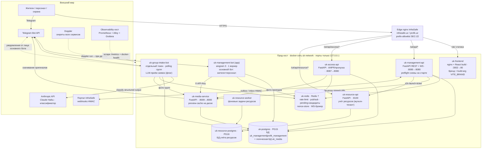

One-shot-контейнеры (не на схеме): `provision-roles` → `migrate` (основная
схема, alembic head `014`), `media-migrate` (`uk_media`),
`resource-provision-roles` → `resource-migrate` (ресурсы).

**Матрица «кто с кем говорит»:**

| Клиент → Сервис | postgres | redis | media | resource-api | Telegram | Anthropic | InfraSafe |
|---|---|---|---|---|---|---|---|
| app (основной бот) | RW | RW | API-key | — | polling | — | — |
| group-intake-bot | RW | RW (pending/dedup/rate) | API-key | — | polling (свой токен) + send основным | classify | — |
| api | RW | RW (pub/sub, rate) | proxy | s2s ticket | send (OTP, уведомления) | — | outbox→ / ←inbox |
| access-api | RW | RW (nonce, WS-брокер) | API-key | — | — | — | — |
| media-service | RW (только uk_media) | — | — | — | download file_id | — | — |
| resource-api/worker | — | — | — | — | — | — | — |
| frontend | — | — | — | — | — | — | — (статика, всё через edge→api) |

---

## 2. Модульная структура основного приложения

### 2.1 Telegram-бот (`uk_management_bot/`)

```mermaid
flowchart LR
    subgraph MW[Middlewares]
        AUTH[auth: identity+роли\nтихий group-path]
        ROLE[role_mode]
        THR[throttling in-memory]
    end
    subgraph H["Handlers (роутеры aiogram)"]
        GI[group_intake\nпервый, catch-all групп]
        REQ[requests / создание,\nстатусы, комментарии, отчёты]
        ASSIGN[admin: assignment,\nreassignment, views]
        SHIFTS[shifts, my_shifts,\nshift_management, transfer]
        EMP[employee_management,\nuser_management, rename]
        VERIF[user_verification,\napartments, yards]
        ACCH[access_control\nгостевые коды]
        MISC[onboarding, profile,\nfeedback, inspector, ...]
    end
    subgraph S["Services (бизнес-логика)"]
        WF["request_workflow канон\nguards → specs → planner\nодин писатель plan_transition"]
        RSVC[request_service,\nsave_request]
        DISP[dispatch / auto_manager\nrule engine дежурных]
        SHS[shift_service,\nshift_scheduler 11+1 джоб]
        NOTIF[workflow_notifications\nнотифай-интенты]
        MEDIA_S[completion_media SSOT,\nmedia_client]
        GIS[group_intake:\nprefilter, classifier, pending]
        ADDR[request_address,\naddress_service]
    end
    subgraph U["Utils / канон"]
        SPEC[specializations\nmatches_required_specs]
        CAT[constants/categories\ncategory→specialization]
        ENUMS[enums, constants\nстатусы канон]
        LOC["get_text (ru/uz)"]
    end
    DB[(SQLAlchemy models\n33 таблицы)]

    MW --> H --> S --> DB
    S --> U
    H --> U
```

Точки сборки: `main.py` (основной бот: `setup_dispatcher` = middlewares +
роутеры; health-сервер :8000) и `group_intake_main.py` (отдельный процесс
group-intake-бота: только группа-роутер + свой polling).

### 2.2 REST/WS API (`uk_management_bot/api/`)

| Префикс | Роутер | Назначение |
|---|---|---|
| `/api/v2/auth` | auth | Widget/TWA/пароль+MFA, refresh-ротация, cookie |
| `/api/v2/requests` | requests, stats | CRUD заявок, канон-переходы (PATCH), канбан |
| `/api/v2/callcenter` | callcenter | Приём обращений оператором |
| `/api/v2/profile` | profile | Профиль текущего пользователя |
| `/ws/v2` | ws | Live-обновления (канбан, доступ) |
| `/api/v2/shifts` | shifts (+employees) | Смены, сотрудники, инвайты, активация |
| `/api/v2/executor/shifts` | executor_shifts | Смены глазами исполнителя |
| `/api/v2/addresses` | addresses | Справочник двор/дом/квартира |
| `/api/v2/residents` | residents, verification, documents | Жители, модерация, документы |
| `/api/v2/public` | public, work-reports public | Табло, витрина «до/после» (без auth) |
| `/api/v2/board-config` | board_config | Конфиг табло |
| `/api/v2/auto-manager` | auto_manager | Тумблер и правила авто-назначения |
| `/api/v2/webhooks` | webhooks | Входящие InfraSafe (inbox) |
| `/api/v2/registration` | registration | WebApp-регистрация жителя |
| `/api/v2/feedback` | feedback | Обратная связь |
| `/api/v2/monitored-groups` | monitored_groups | Реестр групп Group Intake |
| `/api/v2/materials` | materials | Склад (FIFO) |
| `/api/v2/work-reports` | work_reports | Модерация витрины (менеджер) |
| `/api/v2/resource-accounting` | resource_accounting | s2s-ticket, TWA-ticket |
| прочее | health, announcements, media(proxy) | Health, объявления, signed-media |

### 2.3 Frontend SPA (`frontend/`)

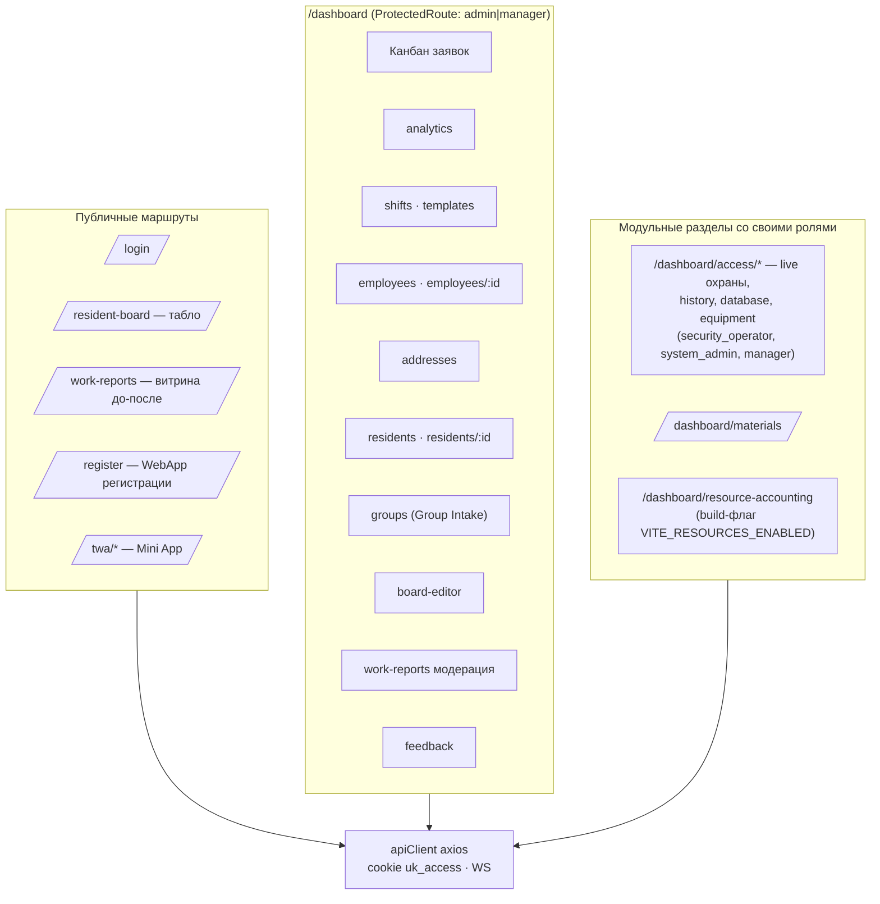

### 2.4 Пайплайн Group Intake (сообщение группы → заявка)

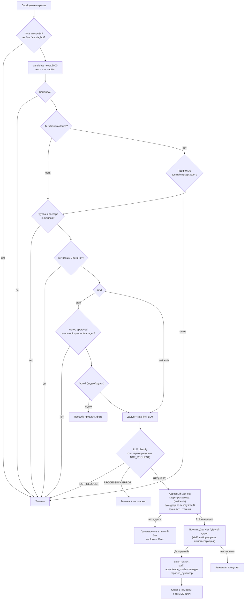

---

## 3. Схемы баз данных

Четыре независимых хранилища:

| БД | Инстанс | Владелец схемы | Runtime-роль | Таблиц |
|---|---|---|---|---|
| `uk_management` / `profk_management` | uk-postgres (PG15) | `uk_migration_owner` (alembic, head 014) | `uk_bot_runtime`, `uk_api_runtime`, `uk_access_runtime` | 33 ORM + 22 access |
| `uk_media` | тот же uk-postgres | `uk_media_owner` | та же (create_all) | 4 |
| ресурсы | uk-resource-postgres (PG16) | `resource` | `resource_app` | 17 |
| Redis | uk-redis | — | — | ключи: `gint:*`, rate, pub/sub, nonce |

### 3.1 Основная БД — домен «Пользователи и доступ к системе»

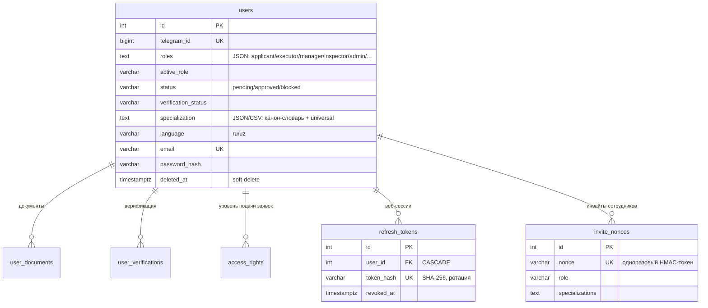

### 3.2 Основная БД — домен «Заявки» (ядро)

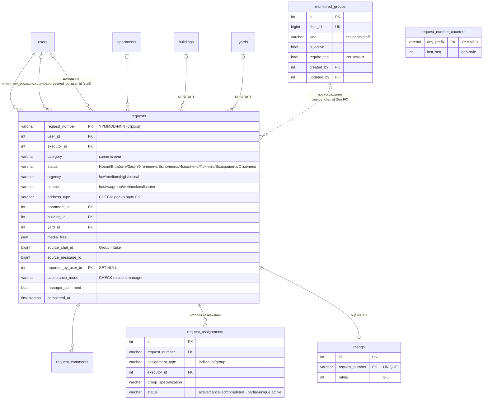

### 3.3 Основная БД — домен «Смены»

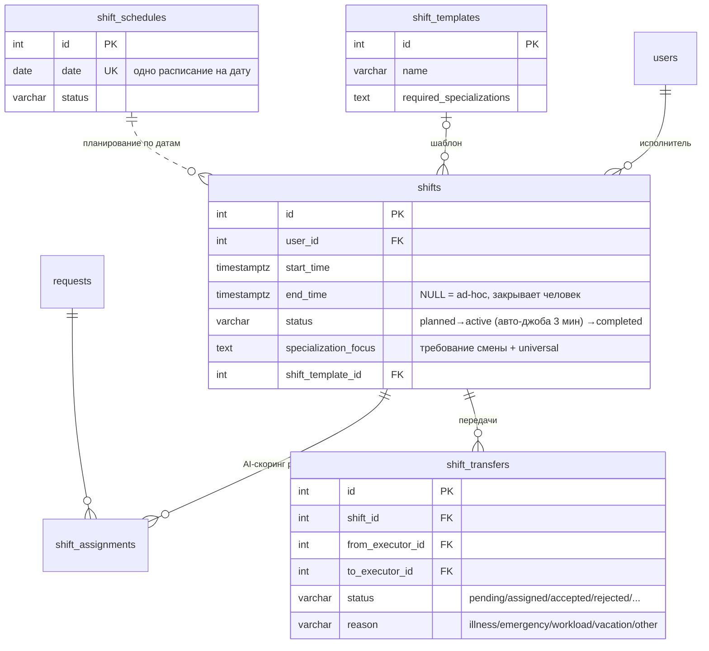

### 3.4 Основная БД — домен «Адреса», «Коммуникации», «Материалы», «Витрина»

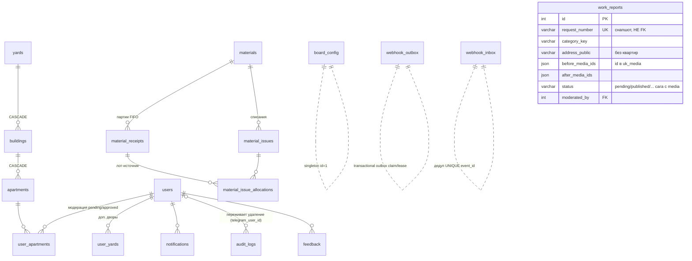

### 3.5 Основная БД — домен access_control (СКУД/ANPR, 22 таблицы)

Отдельный сервис, raw-DDL (без ORM в `database/models/`). Группами:

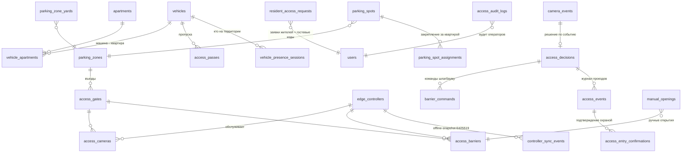

Ключевые правила: анти-replay nonce и WS-брокер — в Redis
(multi-worker-safe); фото проездов — в media-service (вне «горячего» пути);
правила доступа (`access_rules`) вычисляют решение при событии камеры.

### 3.6 БД `uk_media` (media-service)

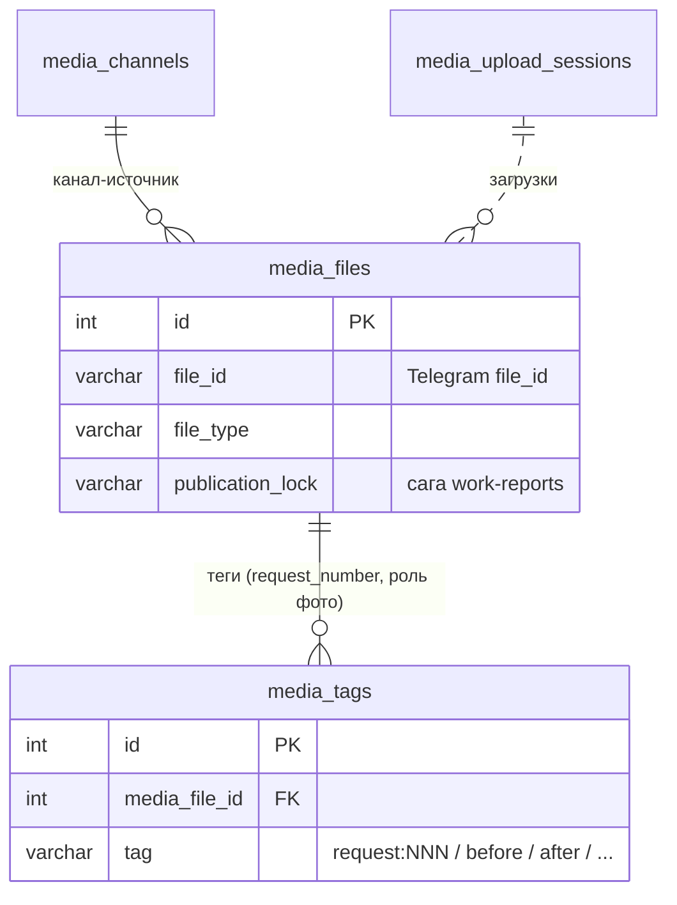

Файлы физически живут в Telegram; media-service хранит метаданные, скачивает
оригиналы по требованию и держит дисковый preview-cache (~480px JPEG, LRU по
заявке).

### 3.7 БД учёта ресурсов (resource-accounting, PG16)

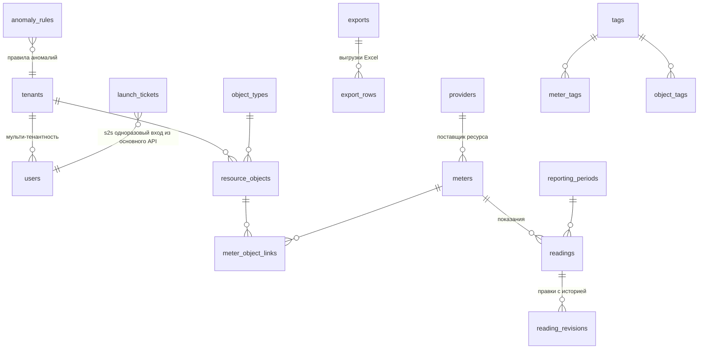

### 3.8 Redis (не БД, но контракт ключей)

| Префикс | Назначение | TTL |
|---|---|---|
| `gint:cand:{chat}:{msg}` | pending-кандидат Group Intake (payload) | 1 ч |
| `gint:seen:{chat}:{msg}` | дедуп обработанных сообщений | 24 ч |
| `gint:llm:{chat}` | rate-limit LLM (6/мин) | 1 мин |
| `gint:invite:{tg_id}` | cooldown приглашений | 1 ч |
| pub/sub каналы | realtime заявок (канбан), access-события | — |
| nonce access | анти-replay device-auth | короткий |
| rate-limit auth/API | fail-closed гварды | скользящий |

---

## 4. Сквозной поток: заявка из staff-группы до «Принято»

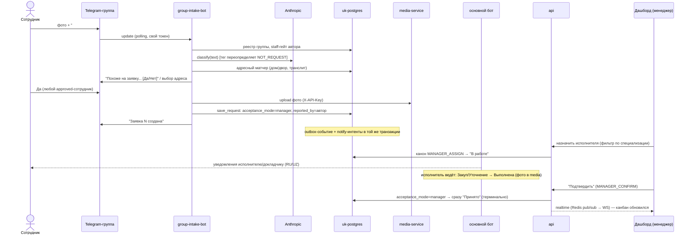

---

## 5. Развёртывание и окружения

| Артефакт | infrasafe/105 | profk |
|---|---|---|
| Compose | `-f docker-compose.yml -f docker-compose.media.yml` | `-f docker-compose.yml -f docker-compose.profk.yml` (тонкий override, оба -f обязательны) |
| БД | `uk_management` | `profk_management` |
| Бренд фронта | `infrasafe` | `VITE_BRAND=profk` |
| Group Intake | выключен | включён (profile `group-intake`) |
| Секреты | Doppler config `infrasafe` | Doppler config `profk` |
| Деплой | build 4 образа → migrate → up (по одному, `--no-deps --wait`) → frontend отдельно → тег `<host>-YYYY-MM-DD` | так же |

Наблюдаемость (отдельный хост): Prometheus (rules/alerts) + Grafana; Alloy на
прод-хостах шлёт метрики remote-write (uk_api scrape — под
`HEALTH_METRICS_TOKEN`); systemd-таймер docker-health раз в минуту сверяет
фактические контейнеры с инвентарём (`expected-containers.tsv`,
`inventory.yml`) — незаявленный контейнер = алерт P2.

---

## 6. Связанные документы

- [ARCHITECTURE.md](ARCHITECTURE.md) — текстовая архитектура (потоки, auth, медиа).
- [DATA_MODEL.md](DATA_MODEL.md) — инварианты модели данных по доменам.
- [../product/PRD.md](../product/PRD.md) — продуктовое ТЗ.
- [../product/OVERVIEW.md](../product/OVERVIEW.md) — бизнес-обзор.
- `.claude/skills/uk-deploy/SKILL.md` — деплой-runbook (роли БД, Doppler, ротации).
