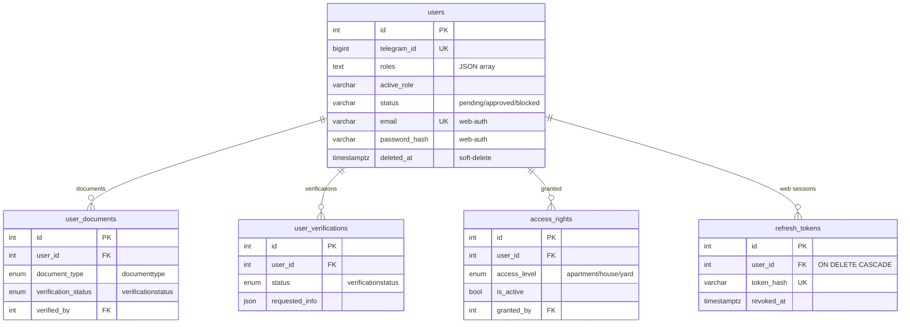
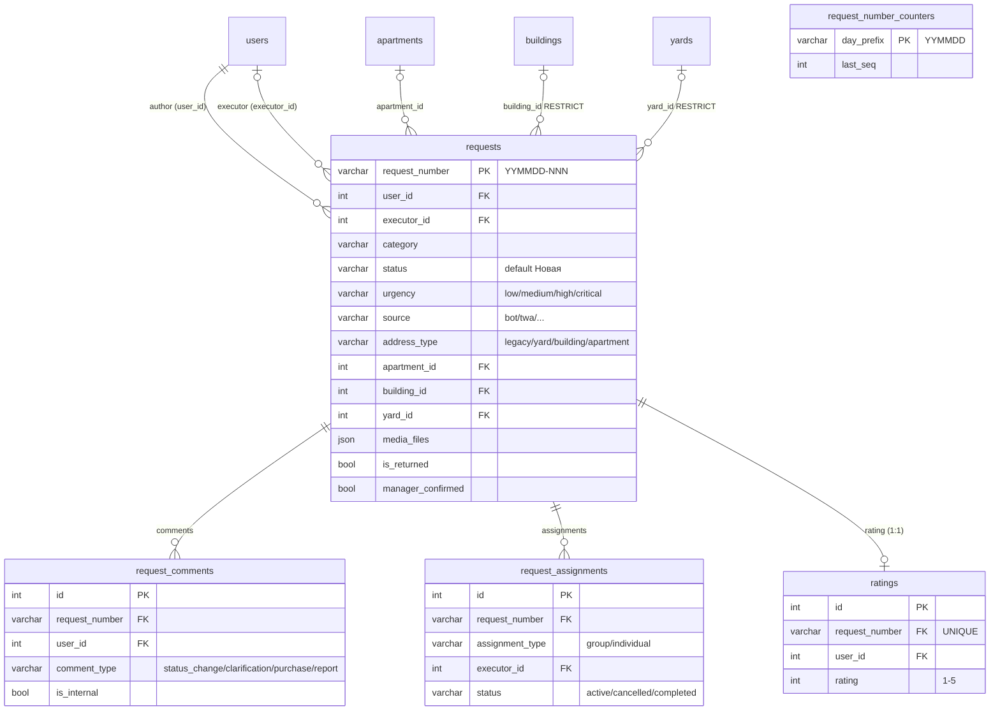
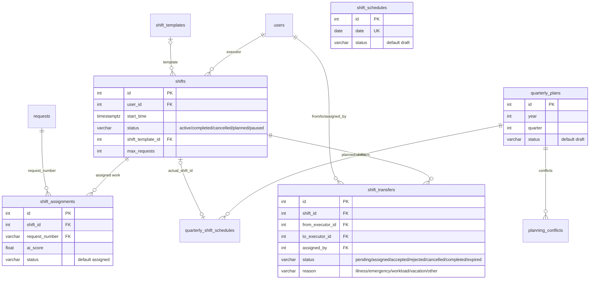
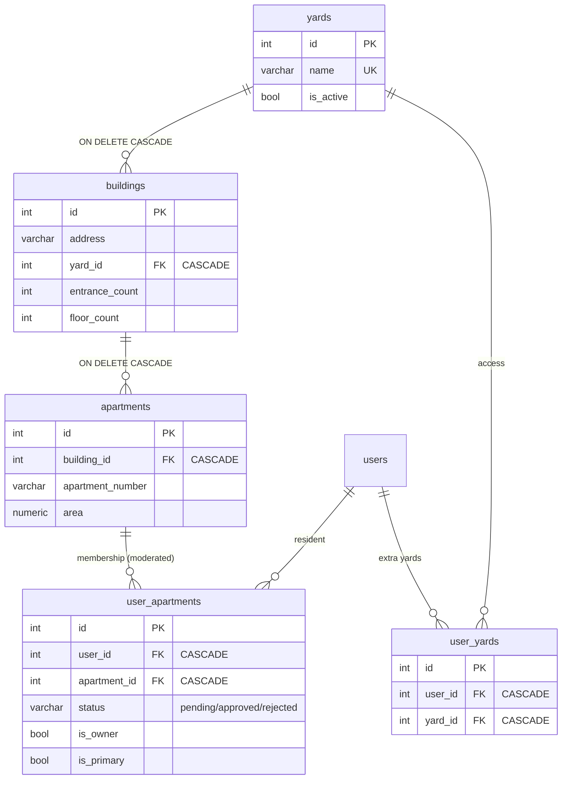
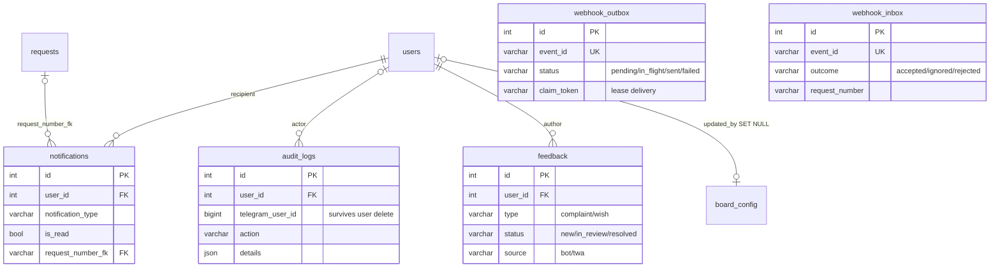
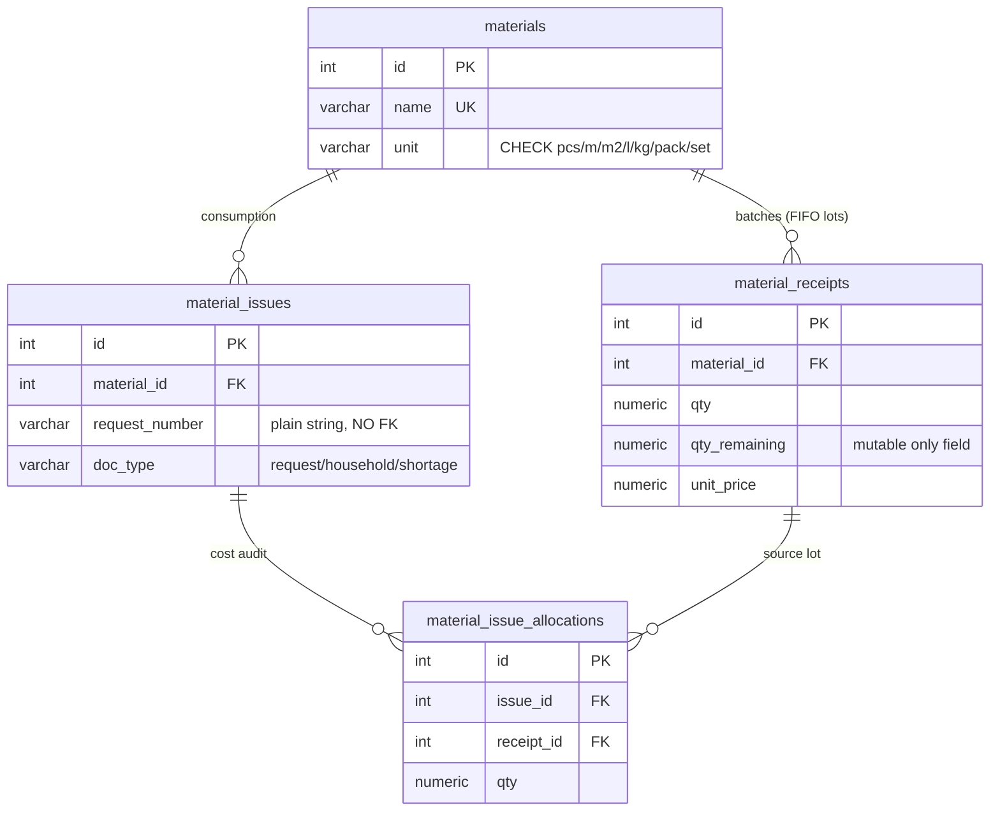

# UK Management — модель данных

**Назначение:** обзор доменов данных, ERD по доменам, ключевые связи и инварианты.
**Источник истины:** SQLAlchemy-модели `uk_management_bot/database/models/*.py` + миграции `alembic/versions/` (head = `036`).
**Полный дамп колонок:** см. [DATABASE_SCHEMA_ACTUAL.md](../DATABASE_SCHEMA_ACTUAL.md).
**Дата:** 2026-07-06.

---

## 1. Домены данных

Система (~56 прикладных таблиц) делится на предметные домены:

| Домен | Таблицы (кратко) | Владелец |
|-------|------------------|----------|
| **Пользователи и верификация** | `users`, `user_documents`, `user_verifications`, `access_rights`, `refresh_tokens`, `invite_nonces` | бот/API |
| **Заявки** | `requests`, `request_comments`, `request_assignments`, `request_number_counters`, `ratings` | бот/API |
| **Смены и планирование** | `shifts`, `shift_templates`, `shift_schedules`, `shift_assignments`, `shift_transfers`, `quarterly_plans`, `quarterly_shift_schedules`, `planning_conflicts` | бот/API |
| **Справочник адресов** | `yards`, `buildings`, `apartments`, `user_apartments`, `user_yards` | бот/API |
| **Коммуникации / инфраструктура** | `notifications`, `audit_logs`, `board_config`, `feedback`, `webhook_outbox`, `webhook_inbox` | бот/API |
| **Склад материалов** | `materials`, `material_receipts`, `material_issues`, `material_issue_allocations` | бот/API — см. [MATERIALS_MODULE.md](../MATERIALS_MODULE.md) |
| **access_control (СКУД/ANPR)** | 22 таблицы (`parking_zones`, `vehicles`, `access_passes`, `camera_events`, `access_decisions`, `barrier_commands`, …) | отдельный сервис (`Dockerfile.access`), raw-миграции 025–035 |

> `users` — центральная сущность: почти все таблицы ссылаются на `users.id` (заявитель, исполнитель, менеджер-ревьюер, автор аудита). На диаграммах эти многочисленные FK на `users` показаны выборочно, чтобы не перегружать ERD.

---

## 2. Домен «Пользователи и верификация»

**Инварианты / правила:**
- Роль пользователя = JSON-массив `users.roles` + текущая `users.active_role`. **Колонка `users.role` удалена** (миграция `022_drop_legacy_role`) — не использовать (`user.py:15`).
- `users.status='blocked'` блокирует доступ к API (`get_current_user`, `dependencies.py:78`); `pending` не блокируется на уровне auth, отсекается точечно через `require_approved_roles`.
- `access_rights` (уровень подачи заявок) — **не путать с доменом access_control** (СКУД/шлагбаумы); это разные подсистемы с похожими именами.
- Web-сессия: `refresh_tokens.token_hash` (SHA-256 значения), ротация при `/refresh`, каскадное удаление вместе с пользователем.

---

## 3. Домен «Заявки»

**Инварианты / правила:**
- **PK заявки — строка `request_number` формата `YYMMDD-NNN`** (не int), генерируется через `RequestNumberService` из `request_number_counters` (gap-safe, монотонный; `request_number_counter.py:1`). Не переиспользуется после удаления заявки.
- **Адресный инвариант (CHECK `ck_requests_address_type_fk`, `request.py:14`):** либо `address_type IS NULL`, либо заполнен ровно один FK, соответствующий дискриминатору (`apartment`→`apartment_id`, `building`→`building_id`, `yard`→`yard_id`, `legacy`→все NULL). FK на `buildings`/`yards` — `ON DELETE RESTRICT` (защита от нарушения CHECK; каскадное удаление адресов ловит purge-гард).
- **Не более одного активного назначения** на заявку: partial-unique `uq_request_assignments_active` WHERE `status='active'` (`request_assignment.py:20`). История cancelled/completed сохраняется.
- **Одна оценка на заявку:** UNIQUE `uq_ratings_request_number` (`rating.py:11`) — идемпотентность приёмки (повторный APPLICANT_ACCEPT не создаёт дубль).
- `request_comments`/`ratings`/`request_assignments` ссылаются на `requests.request_number` (строковый FK, не на `id`).

---

## 4. Домен «Смены и планирование»

**Инварианты / правила:**
- `shift_schedules.date` — UNIQUE (одно расписание на календарную дату).
- Переходы статуса `shift_transfers` валидируются в модели (`shift_transfer.py:109`): `pending→assigned/cancelled`, `assigned→accepted/rejected/cancelled` и т.д.; нельзя назначить передачу самому себе (`from_executor_id`).
- `shift_transfers.created_at`/`assigned_at`/… — tz-aware (REG-02/AUD3-11).
- `shift_assignments` несёт AI-скоринг (`ai_score`, `confidence_level`, `specialization_match_score`, `geographic_score`, `workload_score`) для авто-распределения заявок по сменам.
- Каскад: `shifts` → `shift_assignments`/`shift_transfers` с `cascade="all, delete-orphan"` (ORM-уровень, `shift.py:82`).

---

## 5. Домен «Справочник адресов»

**Инварианты / правила:**
- Иерархия «двор → дом → квартира» с каскадным удалением вниз (`Building.yard_id ON DELETE CASCADE`, `Apartment.building_id ON DELETE CASCADE`).
- UNIQUE: `uix_building_apartment` (`building_id`,`apartment_number`), `uix_user_apartment` (`user_id`,`apartment_id`), `uix_user_yard` (`user_id`,`yard_id`).
- `user_apartments.status` — модерация связи житель↔квартира (`pending/approved/rejected`); подтверждает менеджер (`user_apartment.py:83`).
- `user_yards` даёт доступ к доп. дворам (менеджеры нескольких дворов, жители с квартирами в разных дворах).

---

## 6. Домен «Коммуникации / инфраструктура»

**Инварианты / правила:**
- **`webhook_outbox`** — transactional outbox: событие пишется в одной транзакции с бизнес-изменением, доставляется воркером по claim/lease-модели (`claim_token`+`claimed_at`, CODE-01), финализация compare-and-set. Статус — закрытое множество (CHECK).
- **`webhook_inbox`** — durable-дедуп входящих InfraSafe-вебхуков (UNIQUE `event_id`); `outcome=accepted` ⇒ создана заявка (`request_number`).
- `audit_logs.telegram_user_id` (BigInteger) хранится отдельно от FK, чтобы аудит переживал удаление пользователя.
- `board_config` — singleton (id=1), `updated_by` FK→users `ON DELETE SET NULL`.

---

## 7. Домен «Склад материалов»

Полная модель, FIFO-инварианты и API — в **[MATERIALS_MODULE.md](../MATERIALS_MODULE.md)**. Схема агрегата:

**Ключевые инварианты (кратко):** append-only + сторно; `material_issues.request_number` — plain-строка **без FK** (журнал переживает удаление заявки); `qty_remaining = qty − SUM(allocations)`; остаток = агрегат `SUM(qty_remaining)` (денормализованной таблицы нет). Подробности — в модуле.

---

## 8. Домен access_control (СКУД/ANPR) — вне основной ORM

22 таблицы (`parking_zones`, `edge_controllers`, `access_gates`, `access_cameras`, `access_barriers`, `vehicles`, `vehicle_apartments`, `access_rules`, `access_passes`, `resident_access_requests`, `camera_events`, `access_decisions`, `access_events`, `controller_sync_events`, `barrier_commands`, `manual_openings`, `access_audit_logs`, `parking_spots`, `parking_spot_assignments`, `access_entry_confirmations`, `vehicle_presence_sessions`). DDL — raw-миграции 025–035; ORM-моделей в `database/models/` нет (домен обслуживает отдельный сервис, образ `Dockerfile.access`). Перечень — в [DATABASE_SCHEMA_ACTUAL.md §1.2](../DATABASE_SCHEMA_ACTUAL.md).

---

## 9. Alembic

- **Head:** `036_materials_inventory`.
- Миграции прогоняет **только контейнер `uk-management-api`** (у образа бота нет `alembic`). Форс: `docker exec uk-management-api alembic upgrade head`.
- `alembic_version` может опережать реальную схему при частичном апгрейде — сверять через `information_schema`.
