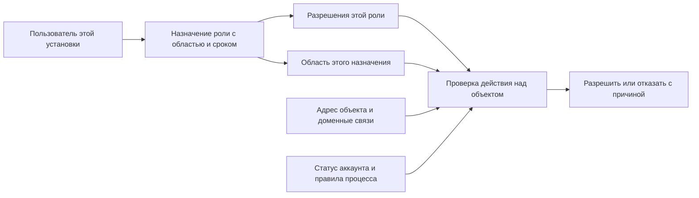

> Проектный документ (2026-09-05), закоммичен в main 2026-09-19 как канон для `AUD7-SEC-03` (AUD7-DOC-01). Реализация unified RBAC в main не влита — код, статус реализации и план внедрения живут на ветке `codex/unified-rbac` (`d1aeb281`). Текст идентичен версии на ветке; ссылки на строки в бэклоге даны по этой (без шапки ветки) нумерации + 2.

# Развитие модели доступа UK Management System

Дата исходного анализа: 2026-09-05. **Редакция 4: целесообразность модели для одной УК в одной установке, 2026-09-09.** Этот документ — актуальный план выбора объёма и перехода; [единая целевая модель](/Users/andreyafanasyev/Code/UK/docs/tech/UNIFIED_RBAC_TARGET_MODEL_2026-09-05.md) описывает архитектуру независимо от текущего хранения. Оба документа согласованы по объёму и смете. Реализация не выполнялась.

**Цель подтверждена владельцем:** одна установка обслуживает только одну УК, смешивания компаний в платформе не будет; до нескольких сотен домов; типовые исполнительские роли и управляющие с разными правами по домам, дворам и ЖК. Отдельный запрос пилотного клиента с автором/датой не найден. Конкретный пример «диспетчер А / наблюдатель Б» первоначально предложил автор плана; позднейшее уточнение владельца подтверждает класс территориальных сценариев, но не превращает пример в клиентскую заявку.

**Два направления одной архитектуры оцениваются отдельно:** A — действия вместо имён ролей; B — область каждого назначения. A1 за 8–12 рабочих дней — полезный подготовительный выпуск без территории. Пилот с территорией P = A1 + B1 — 18–28 дней при оговорённых границах. Полное ядро A + B + исправление ресурсных сессий R — 38–60 дней; с редактором ролей C и группами доступа G — 47–74 дня. Все значения без резерва; единственная действующая расчётная таблица находится в разделе 10.

**Результат уточнения 09.09:** отдельное измерение компании в новом RBAC исключено: нет company_id/tenant_id в каждой новой роли/выдаче, членств в УК и переключателя компаний. Территории внутри УК сохраняются. Обоснование, минимальное хранение и влияние на стоимость — в разделе 15; текущая смета уже была рассчитана для одной УК.

C и G полезны для развития УК, но не являются необходимыми условиями первой проверки назначений «роль + область». Первое внедрение может использовать кодовый состав ролей и личные назначения. Пользовательский редактор deny, оргструктура, прямая ACL и каскадный отзыв выдач вслед за увольнением их автора отложены.

Разделы 1–2 сохраняют исходные наблюдения; ключевые пути повторно проверены на локальном HEAD f0631ae109416fb319e508c4e4c495112ff82c88 от 2026-09-06. Статические количественные подсчёты обозначены датой первоначального замера. Раздел 12 сохранён дословно; его историческая заключительная рекомендация не заменяет выбор выпуска из раздела 10. Результаты повторного ревью и соответствие замечаниям приведены в разделе 14.

Повреждённый пункт 4 письма трактуется как «роль в подписанной сессионной cookie, без перезаписи user.role». Пункт 5 про выпуски трактуется как запрос на работу без нового редактора прав; дополнительно перечислены изменения без пересмотра бизнес-полномочий. Это явно указанные интерпретации повреждённого текста.

**1. Что фактически реализовано**

| Участок | Фактическое поведение | Основание в коде |
|---|---|---|
| Пользователи | Несколько ролей в JSON/CSV внутри TEXT `users.roles`; отдельно `active_role`; нет таблиц назначений ролей и разрешений | [user.py](/Users/andreyafanasyev/Code/UK/uk_management_bot/database/models/user.py:15), [auth_helpers.py](/Users/andreyafanasyev/Code/UK/uk_management_bot/utils/auth_helpers.py:15) |
| Реестр | Шесть канонических ролей: applicant, executor, manager, inspector, system_admin, security_operator | [constants.py](/Users/andreyafanasyev/Code/UK/uk_management_bot/utils/constants.py:27) |
| Дополнительные роли | `admin` действует вне канонического реестра; `resource_meter_entry` хранится рядом с ролями как отдельная возможность | [ROLES_AND_ACCESS.md](/Users/andreyafanasyev/Code/UK/docs/tech/ROLES_AND_ACCESS.md:31), [employees.py](/Users/andreyafanasyev/Code/UK/uk_management_bot/api/shifts/service/employees.py:182) |
| Основной API | `require_roles` проверяет наличие любой разрешённой роли; `require_approved_roles` дополнительно требует approved | [dependencies.py](/Users/andreyafanasyev/Code/UK/uk_management_bot/api/dependencies.py:88) |
| Живое состояние аккаунта | Основной API загружает пользователя из БД, отклоняет blocked и deleted; pending разрешается/запрещается конкретным сценарием | [dependencies.py](/Users/andreyafanasyev/Code/UK/uk_management_bot/api/dependencies.py:45) |
| Бот | Сосуществуют `require_role`, `has_admin_access`, пакетный `RoleGate`, фильтрация по `active_role` | [auth.py](/Users/andreyafanasyev/Code/UK/uk_management_bot/middlewares/auth.py:148), [RoleGate](/Users/andreyafanasyev/Code/UK/uk_management_bot/handlers/_role_gate.py:27), [RoleFilter](/Users/andreyafanasyev/Code/UK/uk_management_bot/filters/role_filter.py:46) |
| Доступ к конкретной заявке | Есть чистый общий предикат: manager, автор, назначенный исполнитель, групповое назначение при смене, одобренный сосед на приёмке | [request_access.py](/Users/andreyafanasyev/Code/UK/uk_management_bot/utils/request_access.py:95) |
| Изменение состояния заявки | Централизованы команды, разрешённые переходы, назначение, смена и системные возможности; запись через общий runner с блокировкой заявки | [guards.py](/Users/andreyafanasyev/Code/UK/uk_management_bot/utils/request_workflow/guards.py:28), [workflow_runner.py](/Users/andreyafanasyev/Code/UK/uk_management_bot/services/workflow_runner.py:343) |
| Территория | Есть Yard → Building → Apartment; подтверждённые UserApartment и дополнительные UserYard. Отдельные ЖК и подразделения в основных моделях не представлены | [yard.py](/Users/andreyafanasyev/Code/UK/uk_management_bot/database/models/yard.py:10), [user_scope.py](/Users/andreyafanasyev/Code/UK/uk_management_bot/services/address_service/user_scope.py:25) |
| Старые «права доступа» | `AccessRights` — права для подачи заявок с текстовыми номерами квартиры/дома/двора, а не универсальная матрица операций | [user_verification.py](/Users/andreyafanasyev/Code/UK/uk_management_bot/database/models/user_verification.py:100) |
| Охрана | Общая идентификация пользователей с основным API, собственные наборы ролей для событий, реестра, фото и оборудования | [registry.py](/Users/andreyafanasyev/Code/UK/access_control/api/registry.py:40), [equipment.py](/Users/andreyafanasyev/Code/UK/access_control/api/equipment.py:33) |
| Учёт ресурсов | Отдельная БД, локальный пользователь с одной `role`, пять ресурсных ролей и фильтры по tenant; центральный API выдаёт launch-ticket с одной ролью | [deps.py](/Users/andreyafanasyev/Code/UK/resource-accounting/backend/app/core/deps.py:13), [resource router](/Users/andreyafanasyev/Code/UK/uk_management_bot/api/resource_accounting/router.py:102) |
| Фронтенд | Роли повторяются в route guards, навигации, отдельных кнопках и хелперах ресурсоучёта | [App.tsx](/Users/andreyafanasyev/Code/UK/frontend/src/App.tsx:74), [DashboardLayout.tsx](/Users/andreyafanasyev/Code/UK/frontend/src/layouts/DashboardLayout.tsx:83) |

Текущая модель уже сочетает роли, связи с объектами и условия процесса. Развивать её как «только RBAC с большим числом ролей» было бы шагом назад: принадлежность квартиры и смену всё равно пришлось бы проверять отдельно.

**1.1. Источник требования и измеренный масштаб**

| Вопрос | Проверенный ответ |
|---|---|
| Кто и когда запросил территориальный доступ? | Владелец проекта в этой задаче после первой рецензии уточнил: управляющие могут различаться правами по адресам/дворам/ЖК внутри одной УК; это зафиксировано в целевой модели от 2026-09-05. Отдельный автор/дата клиентской заявки не найдены. Пример «диспетчер А / наблюдатель Б» предложен автором плана 2026-09-05 |
| Что действительно сообщил владелец? | Сначала — одна УК и несколько территорий; затем — до нескольких сотен домов и разные управляющие по правам и адресной области. 09.09 дополнительно исключена совместная платформа нескольких УК. Это граница установки, а не отмена различий прав внутри компании |
| Есть ли близкие существующие требования? | UserYard уже предназначен в том числе для управляющих несколькими дворами; функциональность появилась в коммите f9fd42a4 от 2025-10-13. BUG-186 от 2026-09-01 — сужение пользовательского режима «Мои заявки», а не запрет менеджеру смотреть другие дворы |
| Прогноз на год | Числа менеджеров и дворов на следующий год не предоставлены и в просмотренных документах не найдены. Неизвестно для обеих площадок; экстраполировать по текущему количеству записей нельзя |

[Назначение UserYard](/Users/andreyafanasyev/Code/UK/uk_management_bot/database/models/user_yard.py:13), [план исправления BUG-186](/Users/andreyafanasyev/Code/UK/docs/superpowers/plans/2026-09-01-twa-requests-view-scope.md).

Замер выполнен через SSH → локальный сокет PostgreSQL, одной агрегатной SELECT-командой на площадку внутри REPEATABLE READ / READ ONLY, с statement_timeout 10 s и lock_timeout 2 s. Персональные данные и секреты не извлекались. Точные SQL и результаты сохранены в разделе 13.

| Показатель на 2026-09-07 | PROFK | InfraSafe |
|---|---:|---:|
| Время замера UTC | 12:04:41 | 12:04:46 |
| Менеджеры с ролью manager, approved, без deleted_at | **4** | **3** |
| Все неудалённые менеджеры, независимо от статуса | 4 | 3 |
| Пользователи admin, approved, без deleted_at | 1 | 0 |
| Пользователи system_admin, approved, без deleted_at | 1 | 1 |
| Уникальные approved manager ИЛИ admin | 4 | 3 |
| Дворы активные / всего | **3 / 3** | **4 / 8** |
| Всего хранимых заявок | 53 | 15 |
| address_type = legacy | **2 (3,77%)** | **6 (40,00%)** |
| address_type IS NULL, отдельно от legacy | 0 | 1 |
| Заявки за последние 90 дней / legacy среди них | 53 / 2 | 15 / 6 |
| Ожидаемые менеджеры и дворы через год | Нет прогноза | Нет прогноза |

Это количество учётных записей с ролью, не метрика ежедневно работающих сотрудников. admin на PROFK входит в число четырёх manager, а не добавляет пятого. Считались все строки requests, без исключения закрытых заявок; статистика не описывает удалённые/внешние архивы.

**Вывод из замера:** измерены 2 legacy-записи на PROFK и 6 legacy + 1 NULL на InfraSafe. Это малое абсолютное число не обосновывает многонедельную миграцию именно этих строк. Однако запрос не проверяет все FK, связность адресного дерева, активность родителей и неоднозначность текстовых адресов. Нельзя считать «2/7» доказанным полным объёмом разметки. Для A адресная миграция не нужна; перед B проводится отдельная проверка целостности всех защищаемых объектов. Замер 05.09 (50 заявок и 4% legacy на PROFK) остаётся историческим и не смешивается с текущим.

**2. Ограничения и причины рефакторинга**

**Роль слишком часто означает целый пакет несвязанных полномочий.** Manager используется для заявок, персонала, адресов, аналитики и выдачи некоторых прав. Отдельно выдать человеку только диспетчеризацию, только просмотр или только модерацию жителей сейчас трудно: понадобятся новые строки ролей и правки проверок по всему стеку.

**Территория не ограничивает менеджера.** В `access_reason` manager получает доступ сразу; в `list_requests_rows` manager без параметра view получает выборку без ограничения по пользователю или двору. В статистическом сервисе функции принимают период, но не контекст доступа. Поэтому назначения «менеджер двора А» нельзя реализовать одной таблицей или фильтром меню. Нужно одинаковое ограничение карточек, выборок, итоговых чисел, экспорта и доставки событий. Основание: [предикат](/Users/andreyafanasyev/Code/UK/uk_management_bot/utils/request_access.py:101), [выборка](/Users/andreyafanasyev/Code/UK/uk_management_bot/api/requests/service.py:187), [статистика](/Users/andreyafanasyev/Code/UK/uk_management_bot/api/requests/stats_service.py:50).

**`admin` и `system_admin` не взаимозаменяемы.** Первый проходит на основной dashboard, но ряд API требует именно manager. Второй имеет возможности охраны, склада и административную роль ресурсоучёта, но сам по себе не открывает основной dashboard. Документ ROLES_AND_ACCESS прямо фиксирует admin как действующую роль. Автоматически удалить её или заменить на system_admin означало бы изменить полномочия. В миграции эти назначения должны сохраняться раздельно, пока не определена целевая бизнес-роль.

**Реестр не покрывает все выдаваемые возможности.** `AuthService.assign_role` разрешает applicant/executor/manager/inspector/resource_meter_entry, но не system_admin/security_operator. При этом эти две роли есть в каноническом реестре. Тест паритета трёх списков это различие не обнаруживает. Источник: [assign_role](/Users/andreyafanasyev/Code/UK/uk_management_bot/services/auth_service.py:390).

**Назначение прав защищается преимущественно точками входа.** `assign_role` получает `assigned_by`, но использует его для аудита, не проверяя внутри, какие именно роли и кому этот актор вправе выдавать. Обработчики проверяют manager/admin. Для ограниченных руководителей подразделений этого недостаточно: нужен общий сервис выдачи, проверяющий делегируемые полномочия и территорию. Это архитектурное ограничение доверенной функции, а не доказательство внешнего обхода авторизации.

**Разрешение на просмотр недостаточно для всех действий над объектом.** Сейчас `check_request_access` переиспользуется для карточки, комментариев и медиа, а конкретные ограничения записи добавляются рядом. При появлении роли наблюдателя нужно отдельно различать read, comment, upload, edit, assign и approve; иначе новый читатель может унаследовать операции записи через общий предикат. Пример: [media proxy](/Users/andreyafanasyev/Code/UK/uk_management_bot/api/routes/media_proxy.py:78).

**Даже централизованное чтение заявки ещё не означает паритет всех выборок.** Детальный сборщик проверяет `Shift.status == active` и использует `matches_required_specs`; SQL списка использует `is_on_shift_now_async` с временным окном и точное вхождение специализации. Есть явно отмеченный в коде отказ от wildcard-расширения для списка. Это подтверждённое различие предикатов, но в этом анализе не воспроизводились все его пользовательские последствия. При миграции нужна общая спецификация с отдельной проверкой SQL и проверкой конкретного объекта, включая universal и завершившуюся смену. Источники: [сборщики](/Users/andreyafanasyev/Code/UK/uk_management_bot/services/request_access.py:115), [SQL списка](/Users/andreyafanasyev/Code/UK/uk_management_bot/api/requests/service.py:150).

**Привязки проживания и служебный доступ сейчас легко спутать.** UserYard участвует в выборе двора для подачи заявки; UserApartment подтверждает проживание. Ни одна из этих связей не должна автоматически давать руководителю доступ ко всем данным территории. У AccessRights текстовые адреса, и найденные места использования не образуют общий механизм авторизации. Переносить их как универсальные разрешения без проверки смысла нельзя.

**В ресурс-сервисе полномочия меняются при входе.** `exchange_ticket` записывает `user.role = ticket.role` и `user.is_active = True`. Один сотрудник, открывающий web и Mini App с разными ролями, получает зависимость локальных полномочий от последнего обменянного билета. Последующие запросы читают одну локальную роль. Отзыв роли в основной системе в рассмотренном пути не синхронизирует уже работающую ресурсную сессию. Для целевой модели нужны отдельные назначения и явный механизм отзыва. Источник: [exchange_ticket](/Users/andreyafanasyev/Code/UK/resource-accounting/backend/app/api/auth.py:126).

**WebSocket уже перепроверяет аккаунт, но ещё не территорию.** Оба потока проверяют живые права раз в 60 секунд; при ошибке БД существующий поток сохраняется до срока токена. Потоки пересылают события общей подписки. При территориальной изоляции нужны фильтрация каждого события и ограниченная по времени актуальность разрешений; даже идентификаторы и счётчики чужих объектов нельзя считать автоматически допустимыми. Источники: [основной WS](/Users/andreyafanasyev/Code/UK/uk_management_bot/api/ws/router.py:271), [охрана WS](/Users/andreyafanasyev/Code/UK/access_control/api/ws_security.py:204).

**Оценка поверхности изменений по статическому сканированию 2026-09-05; в этом ревью счётчики не пересчитывались.** AST-подсчёт Python без тестовых файлов дал 177 декораторов HTTP/WS-маршрутов основного API, 67 access-control и 52 ресурсоучёта. Это не число незащищённых или обязательно изменяемых эндпоинтов: сюда входят служебные и публичные маршруты. Вызовов фабрик `require_roles`/`require_approved_roles`: 91 в основном API, 57 в access-control, 46 в ресурсоучёте. В обработчиках бота: 86 `require_role`, 104 `has_admin_access`, 10 `RoleGate`. Подсчёт не охватывает все inline-условия и не заменяет семантический аудит. Вывод о масштабе: затронуты десятки файлов и несколько сотен мест принятия/применения решений, а не один middleware.

**Разграничение выводов:** отсутствие территориального ограничения — разрыв с уточнённой целевой моделью B, а не доказательство нарушения прежнего договора доступа. Разрозненные имена ролей, реестр назначения и смешение роли с meter-entry — подтверждённый технический долг A. Сценарий ресурсной сессии — отдельный ограниченный дефект R, учитываемый отдельно от A. Расхождение списка и карточки по смене/специализации относится к уже существующим правилам, а не появляется вследствие B.

**3. Два направления одной архитектуры**

| | A — что можно | B — над какими объектами |
|---|---|---|
| Основание | Разрозненные роли, правила выдачи, workflow и отдельная возможность meter-entry | Подтверждённая владельцем потребность в разных управляющих по домам/дворам/ЖК |
| Решение | Каталог действий, role→permissions, общий writer и действие вместо имени роли | Целое назначение роль–область–срок; одинаковая проверка карточек и всех способов выборки/доставки |
| Что сохраняется | Существующие права на объекты, отношения, смены и workflow | Доменные ограничения A; область не отменяет их |
| Отдельный выпуск | A1 без территории и полного редактора ролей | B1 после A1 для полного контура заявок; остальные домены — B2 |
| Что не требуется | Универсальные scopes, группы, таблицы изменяемых ролей, сетевой IAM | Редактор ролей и группы тоже не обязательны для первого B1 |

Разделение сметы не означает две конкурирующие модели. В A действие уже имеет место для последующей проверки контекста объекта. B дополняет единое решение областью, а не добавляет альтернативный allow. В A1 менеджер сохраняет прежнюю видимость; такой выпуск не объявляется завершённой территориальной моделью.

Для одной УК с частыми релизами Python-словарь достаточен для состава системных ролей. Размер персонала сам по себе не требует хранения каталога permissions в БД. Возможность менять состав роли без релиза — опция C; массовое управление одинаковыми назначениями — опция G. Они имеют отдельные сценарии и стоимость.

Ролевые назначения и дополнительные условия согласуются с [NIST RBAC](https://csrc.nist.gov/Projects/role-based-access-control/faqs). Проверки действий, объектов и запрет по умолчанию — с [OWASP Authorization](https://cheatsheetseries.owasp.org/cheatsheets/Authorization_Cheat_Sheet.html). Выбор конкретного хранения и этапов — инженерное решение этого плана.

**4. Принципы единой модели — B и последующие опции**

Этот раздел сохраняет принятую семантику целого назначения и запрета по умолчанию. Территории входят в подтверждённую целевую модель B, но не в A1. Подразделения, группы и прямые исключения не включаются в обязательную схему. Временное назначение существующей роли поддерживается без прямой ACL.

Три независимых понятия:

- **Роль** — набор действий: диспетчер, наблюдатель, кладовщик, оператор охраны, администратор доступа.
- **Назначение** — кому выдана роль, в какой области и на какой срок.
- **Область действия** — явно вся УК, ЖК, двор или дом внутри этой установки. Квартира жителя, заявка исполнителя и ресурсный объект учитываются через доменные отношения; ручные выдачи на каждый такой объект не требуются.

Например: «Иван — диспетчер во дворе А, наблюдатель во дворе Б; до пятницы замещает управляющего домом В». Для этого не нужны роли `dispatcher_yard_a` и `viewer_yard_b`.



Каждое назначение проверяется целиком: **разрешение этой роли × область этого назначения × условия**. Затем результаты разрешающих назначений объединяются. Нельзя отдельно объединить все разрешения и все дворы: иначе роль диспетчера во дворе А и наблюдателя во дворе Б дадут право диспетчеризации в обоих.

Обязательные ограничения проверяются до любого положительного ответа: аккаунт существует, не удалён/не заблокирован, имеет допустимый для операции статус; назначение активно; объект принадлежит разрешённой области; выполнены ограничения действия. Если ни одно основание не подходит — отказ. Для публичных и регистрационных операций есть явные политики, поэтому запрет по умолчанию не ломает онбординг.

`active_role` сохраняется как режим меню и пользовательских сценариев бота. Он не является источником дополнительных прав. Для обычной авторизации учитываются подходящие назначения пользователя. Если потребуется режим сознательного понижения привилегий, его надо вводить как отдельный контекст сессии; глобальное поле User.active_role плохо подходит для независимых вкладок и устройств.

Для первого выпуска достаточно разрешающих назначений и обязательных запретов домена. Пользовательский механизм произвольных deny-правил отложить: при наследовании через группы он существенно усложняет объяснение доступа. Ограничение конкретного сотрудника достигается более узкой ролью/областью и удалением лишнего назначения. Если появится подтверждённая потребность в deny, заранее определить, что применимый deny имеет приоритет над всеми allow, и расширить тесты.

Временное назначение содержит пользователя, роль, область, начало/конец действия, выдавшего и причину. Оно не обходит блокировку аккаунта, состояние заявки, смену или другие обязательные условия. Назначенная роль не даёт права передавать полномочия дальше без отдельного административного основания.

Подразделение и специализация описывают рабочую организацию людей. Группы доступа G могут автоматизировать одинаковые назначения, но кадровое членство само не выдаёт права. Прямые permissions на заявку/файл остаются отложенной опцией, не частью основной диаграммы.

ЖК вводится как группа дворов, если бизнес действительно различает эти уровни. Если нынешний Yard уже означает ЖК, достаточно сначала сохранить эту сущность и уточнить отображение; добавлять пустой уровень ради диаграммы не нужно. Членство дворов в ЖК должно определяться структурированными связями, не совпадениями названий.

**5. Иллюстрация возможной бизнес-матрицы — не обязательный состав A1**

Это предложение бизнес-пакетов, **не описание уже действующих полномочий**. Роли можно сочетать. В A состав системных ролей меняется релизом; после реализации опции C новые пользовательские роли можно будет создавать из существующего каталога разрешений без изменения кода. Новая бизнес-операция и новый тип условия требуют реализации и тестов.

| Действие | Житель | Исполнитель | Диспетчер | Руководитель участка | Наблюдатель | Кладовщик | Охрана | Администратор прав |
|---|---|---|---|---|---|---|---|---|
| Просмотр заявок | Свои / приёмка квартиры | Назначенные / допустимый групповой пул | Назначенная территория | Назначенная территория | Назначенная территория | Через отдельное назначение | Через отдельное назначение | Через отдельное назначение |
| Создание заявки | Разрешённые адреса | По дополнительной роли | Служебные заявки в области | Служебные заявки в области | — | — | По дополнительной роли | — |
| Назначение исполнителя | — | Взять подходящую групповую | В области | В области | — | — | — | — |
| Выполнение/отчёт | — | Назначение + смена | По дополнительной роли | По дополнительной роли | — | — | — | — |
| Подтверждение работы УК | — | — | — | В области, по правилам процесса | — | — | — | — |
| Приёмка жителем | Автор / одобренный сосед, допустимый статус | При отдельной связи жителя | При отдельной связи жителя | При отдельной связи жителя | — | — | — | — |
| Просмотр внутренних комментариев | — | Отдельное разрешение | В области | В области | Отдельное разрешение | — | — | — |
| Модерация жителей | — | — | — | Отдельное разрешение в области | — | — | — | — |
| Склад и приход/расход | — | Списание по своей работе и правилам склада | — | Просмотр по назначению | — | В области склада | — | — |
| Открытие шлагбаума | — | — | — | По дополнительной роли | — | — | В назначенной зоне, с причиной | — |
| Фото охраны | — | — | — | По дополнительному разрешению | — | — | Отдельное право в зоне | — |
| Выдача ролей | — | — | — | Только явно делегируемые пакеты | — | — | — | В пределах административной области |

Обходчик, оператор/проверяющий ресурсоучёта, контролёр показаний и технический администратор оборудования — дополнительные небольшие пакеты. Например, `resources.readings.enter` не даёт `resources.periods.approve` или управление справочниками. `system_admin` не получает автоматически всю бизнес-информацию УК; прежние права этой роли переносятся через явно заданные совместимые назначения.

Для подтверждения работы самим её исполнителем и для проверки собственных показаний рекомендуется отдельное правило разделения обязанностей. Это новое бизнес-ограничение: его вводить осознанно по конкретным операциям после сверки с действующим процессом, а не добавлять скрытно при техническом переносе.

**6. Хранение: сценарий или отложенная сущность**

**A1: ноль новых таблиц авторизации.** Каталог и состав ролей — в Python; users.roles пока хранит назначения. Вынос известного meter-entry из массива ролей может использовать один явный признак и существующий AuditLog. Это локальная совместимая миграция A1. В B возможность превращается в узкую роль с областью; если A1 и B идут одним релизом, промежуточное поле можно не вводить. Экономия не вычитается из оценки заранее без конкретного плана миграции.

| Исходная сущность | Сценарий, требующий хранения | Решение для A1 / B1 / опций |
|---|---|---|
| authz_permissions | Отдельного сценария хранения каталога в БД нет | **Отложено**. Permission-ключи и условия контролируются кодом; число людей и домов этого не меняет |
| authz_roles | Администратор создаёт/клонирует роль без релиза | **C**. В A1/B1 достаточно RoleSpec в коде |
| authz_role_permissions | Администратор меняет состав роли без релиза | **C**. В A1/B1 — ROLE_PERMISSIONS. Данные матрицы могут жить в БД при кодовом permission-каталоге; это разные сущности |
| authz_scopes | Нужно адресное покрытие назначений | В **B1** нужны дом/двор/ЖК и режим all для всей УК. Самостоятельная таблица организации/корня и универсальный реестр шести видов scope не нужны: использовать проверенные доменные ссылки/административные узлы |
| authz_role_bindings | Один человек управляет А и наблюдает Б; временно замещает управляющего | **B1**. Нужны назначение и его области. Если один binding содержит несколько выбранных территорий, нужна связь binding–scope; не прятать её стоимость в слове «binding» |
| org_units | Требуется отдельный кадровый/организационный процесс | **Отложено**. Специализация и групповая диспетчеризация продолжают работать |
| org_unit_memberships | Права должны наследоваться именно по составу оргподразделения | **Отложено**. Для одинаковых назначений людям достаточно плоских групп доступа G; это не полная оргструктура |
| authz_direct_grants | Нужна выдача отдельного permission на объект вне роли | **Отложено**. Временная замена решается ролью со сроком; meter-entry — узким пакетом |
| authz_groups / memberships | Массовый приём/перевод сотрудников меняет набор одинаковых назначений | **G**, отдельно от B1. Не называть эти дополнительные отношения частью обязательного «минимума» |
| Policy revision | Нужен контроль актуальности кэша/реплики | В A1 **не вводить**. В B сначала актуальное чтение; кэш и его версии добавлять вместе с обоснованным протоколом |
| Версия редактируемой роли | Конкурентная публикация общей роли, аудит состава | Нужна в **C**; это версия изменяемого объекта, не обязательная глобальная revision политики |
| Новый authz-аудит | Существующий AuditLog не покрывает событие | **Не добавлять без пробела**. Назначение/отзыв и запись аудита — одна транзакция |

В B1 достаточно личных назначений с ролью из кодового реестра и адресными областями. Permission/role-коды проверяются общим writer и evaluator; неизвестное значение закрывается по умолчанию. После C появляются нормализованные изменяемые роли и необходимые FK. Для территории ссылочная целостность и проверка административных связей обязательны с B1; строка type/id без проверки не подходит. Для одной установки отдельные company_id/tenant_id в новом RBAC не вводятся. Минимум B1 — authz_role_bindings и authz_binding_scopes; режим all задан явно, selected требует хотя бы одну проверенную территорию. Адресные изменения учитываются отдельно от числа отношений авторизации.

Запрошены **дом/адрес, двор и ЖК**, явно вся УК нужна для общих служб. Отдельные выдачи на квартиру, заявку, файл, произвольную зону или ресурсный узел не подтверждены и не включаются автоматически. Привязка оборудования/файла к разрешённой территории нужна в B, но сама по себе не требует нового типа ручной выдачи.

UserYard полезен как существующая связь пользователя с несколькими дворами. Он не хранит роль и не различает все причины привязки. Массово считать каждую такую строку служебным allow нельзя. В B связи сверяются по смыслу; новые назначения сохраняют роль и область целиком.

**admin/system_admin:** известный реестр и список разрешённых выдач разделяются. A1 устраняет дубли и делает расхождения явными, но не принимает за бизнес решение автоматически объединить полномочия двух ролей. Иначе «рефакторинг без изменения поведения» станет скрытым расширением. Для каждого спорного действия фиксируется before/after и отдельное решение.

**Meter-entry:** существующий переключатель, регистрация, инвайты, AuthService и оба toggle-пути используют один writer. В A1 сохраняются прежние получатели и право выдачи; в B признак мигрирует в узкое назначение. Перенос не должен расширить доступ к чтению ресурсов, справочникам и подтверждению показаний.

**7. Что переиспользуется, что меняется и альтернатива ресурсоучёта**

В A нужен небольшой слой разрешений внутри текущего Python-пакета: каталог, role-to-permissions и проверка действия на готовом ActorContext. Это развитие существующего чистого ядра. Отдельный сетевой сервис, собственный язык политик и общий граф объектов не нужны.

| Существующий механизм | Решение в A | Дополнительное изменение только при B |
|---|---|---|
| SYSTEM_CAPABILITIES в guards.py | **Переиспользовать как есть:** уже есть system actor → набор Action. Человеческие разрешения не подменяют system principal | Только явно запрошенные ограничения системного процесса, если появятся |
| Action, ACTION_TABLE, ActorContext, allowed_actions, runner | **Расширить:** role membership преобразуется в action permissions, данные статуса/назначения/смены и транзакционная запись сохраняются | Добавить объектную область перед разрешением и в SQL |
| _is_manager в workflow | **Заменить action-specific разрешением:** assign, confirm, change_category и т. п. Не одним универсальным manage, воспроизводящим старую широкую роль | Область конкретного назначения |
| request_access и sync/async-сборщики | **Сохранить отношения и правила.** Добавить различение чтения и записи; сохранить действующую видимость manager | Убрать безусловный глобальный manager-проход для ограниченных назначений |
| API require_roles, require_approved_roles, бот require_role/RoleGate | Тонкие адаптеры к общему решению, сохраняющие особенности статуса аккаунта/онбординга. Не массовая механическая замена | Добавление/передача области |
| allowedRoles и реестры модулей фронтенда | **Переиспользовать структуру** constants/roles и NAV_ENTRIES. Сначала генерируемые/серверные capabilities рядом со старым полем; затем потребители читают requiredPermission. Не переписывать навигацию целиком | Отдельный выбранный двор и объектные allowed_actions, когда это понадобится |
| UserYard и AddressService | **Оставить существующее назначение:** доп. дворы, в том числе для управляющих несколькими дворами. Отсутствие универсального scope не делает эту модель бесполезной | Проверить назначенные связи и уточнить, являются ли они источником ответственности; добавить роль/смысл назначения при необходимости |
| Специализации + RequestAssignment group | **Оставить** диспетчеризацию на специализацию; не заменять подразделениями | Оргструктура лишь при отдельном требовании к сотрудникам/заявкам |
| AuditLog, чтение User из БД, WS-recheck | **Переиспользовать**, включая текущую минутную проверку. Не добавлять revision без кэша | Пообъектная фильтрация потока; при кэшировании понадобится механизм актуальности |
| users.roles и legacy helpers | В A1 сохранить хранение назначений; убрать дубли списков и централизовать writers. legacy helpers сокращать по потребителям | Нормализованные роль–область в B |

У `request_workflow` заменить проверку имени manager/executor на соответствующее разрешение, сохранив назначение, смену, статус и acceptance_mode. Просто заменить все роли на manager в адаптере нельзя: так новый диспетчер получит также подтверждение работ. `allowed_actions` и исполнение команды должны пользоваться одним решением. Повторная загрузка актора и проверка критического доступа остаются внутри транзакции команды; для конфликтующего отзыва прав нужен согласованный порядок блокировок user/заявки и финальная проверка; отдельная revision для A не требуется.

В A1 фраза «соответствующее разрешение» означает точное разрешение конкретного Action. Для не-workflow чтений/комментариев/медиа нужны отдельные ключи. Существующие собственность, проживание и назначение не превращаются в разрешение на все операции.

Оптимизация request_access, разрешающая доступ по неполным фактам, проверяется при изменении предиката. В A сохраняются действующие обязательные проверки; в B scope должен быть известен до раннего allow. Непроверенную территорию нельзя подставлять как «подходит».

**R. Более простое исправление ресурсных сессий**

Повреждённый фрагмент пункта 4 рецензии трактуется так: «роль из launch-ticket хранится в подписанной сессионной cookie, exchange не перезаписывает user.role». Это оцениваемая альтернатива, не уже реализованный контракт.

Текущая cookie содержит только uid; dependency читает user.role из БД. Минимальное изменение: сервер подписывает uid + role + формат токена (+ контекст, если используются два cookie-контекста); get_current_user загружает существующего активного пользователя, а роль для решения берётся из проверенного токена и кладётся в отдельный ResourcePrincipal. **Нельзя временно присваивать ORM user.role роль cookie:** autoflush может снова записать её в общую строку. /auth/me также возвращает роль сессии.

exchange перестаёт менять user.role у существующего аккаунта и не включает автоматически user.is_active=True у отключённого. Для нового пользователя создаётся обычная identity-запись. Старые cookies только с uid после переключения отклоняются и переобмениваются через существующий mint; fallback к общей роли сохранил бы исходный дефект.

| Случай | Закрывает ли простая роль в cookie? |
|---|---|
| Два независимых cookie-хранилища: web и Telegram WebView | **Да:** вход meter-entry не меняет роль уже выданной web-сессии |
| Web и Mini App в одном cookie-хранилище, одинаковые имя/host/path | **Не полностью:** новый Set-Cookie заменит тот же cookie. Фронт также может повторно использовать чужой режим через ensureResourceSession → /auth/me |
| Локальная блокировка user.is_active=False | Сохраняется живая проверка каждого запроса, если exchange не реактивирует аккаунт |
| Отзыв manager/meter-entry в основной UK | **Нет:** cookie хранит слепок роли до истечения установленного срока; загрузка локального User этого не исправляет |
| Произвольные комбинации ресурсных ролей, территориальные scopes, немедленный отзыв конкретной сессии | **Нет:** это отдельные требования |

Оба текущих host-компонента используют /uk/api/resource, cookie по умолчанию resource_session с Path=/, а ensureResourceSession считает любой успешный /auth/me достаточным. Поэтому независимость хранилищ нельзя принимать на веру. Для гарантированной независимости в общем браузере добавить два явно именованных cookie-контекста web/meter-entry и выбор контекста при exchange, me, logout и остальных запросах. Контекст связан с подписанной ролью/билетом; клиентский переключатель сам не выдаёт полномочий. Проверяются обе сессии одного uid одновременно и отсутствие переиспользования другого контекста. Область отправки cookie определяется её host/path, не страницей React. [MDN Set-Cookie](https://developer.mozilla.org/en-US/docs/Web/HTTP/Reference/Headers/Set-Cookie).

[security.py](/Users/andreyafanasyev/Code/UK/resource-accounting/backend/app/core/security.py:16), [dependency](/Users/andreyafanasyev/Code/UK/resource-accounting/backend/app/core/deps.py:25), [exchange](/Users/andreyafanasyev/Code/UK/resource-accounting/backend/app/api/auth.py:126), [session.ts](/Users/andreyafanasyev/Code/UK/frontend/src/features/resource-accounting/session.ts:19).

Контекст передаётся последовательно через клиент конкретного режима и каждый запрос; /auth/me проверяет ожидаемые пользователя и контекст, а не только успешный статус. In-flight обмены разделяются по контексту. Общая изменяемая настройка «текущий режим» не должна снова связать независимые экраны. Это часть R, вместе с переходом старых cookies и тестом одновременных сессий.

**Оценка R: 3–5 рабочих дней** для токена v2, ResourcePrincipal, явных контекстов, тестов параллельных сессий и переключения. Узкое исправление только для независимых cookie-хранилищ — 1–2 дня, но его нельзя объявлять общим решением. R можно выпускать отдельно от A и B; в новой расчётной таблице это отдельная строка. Прежнее «A полностью 18–28» означало A + R.

**Остаток R, требующий решения о допустимом сроке отзыва:** до истечения cookie старые полномочия UK остаются в сессии. Фактический session_ttl_seconds в работающих uk-resource-api на обеих площадках повторно проверен 2026-09-07: **43200 секунд, то есть 12 часов**; прочитано только это несекретное значение. При сохранении TTL после R окно устаревших полномочий может достигать 12 часов с момента выдачи cookie. Уменьшение TTL с обязательным повторным mint ограничит окно без протокола событий, но меняет частоту повторного входа и доступность. Срочный индивидуальный отзыв потребует server-side session state/проверки или отдельного канала синхронизации. Сам механизм max_age уже поддерживается текущим itsdangerous. [ItsDangerous: timed signing](https://itsdangerous.palletsprojects.com/en/stable/timed/).

Снимки назначений, аренда 60 секунд, outbox-событие отзыва и компенсация пропущенных событий из редакции 1 **не нужны для R и отложены как оптимизация**. Для завершённого B отдельный сервис должен получать актуальные целые назначения: базовый вариант — онлайн-проверка через внутренний контракт, включённая в B. Кэш с ограниченным сроком вводится только при измеренной потребности; 60 секунд — вариант SLO, не автоматически согласованный бизнесом срок. Надёжная событийная инвалидация поверх работающего контракта — отдельные 4–7 дней, вне базовых итогов.

**Дополнительный остаток R:** уже выданный launch-ticket может быть обменян после изменения прав в UK. Поэтому срок cookie нельзя выдавать за точную верхнюю границу отзыва от момента блокировки. Нужны правила для уже выпущенных tickets, а при строгом отзыве — актуальная проверка при exchange. В коде ticket TTL по умолчанию 60 секунд; фактический production ticket TTL в этом ревью не измерялся. Переключение cookie-контекстов — изоляция режимов, не отдельная граница доверия между приложениями одного origin.

**8. Разделение рефакторинга по проектам**

Ниже сохранены области первоначальной таблицы, но состав работы разделён. Пометка **только B** относится к указанной работе, а не ко всему файлу: например, медиа нужны функциональные read/upload-права в A и территориальная фильтрация в B.

| Область таблицы редакции 1 | A: разрешения действий | Только B: новая территория | Отложено отдельно |
|---|---|---|---|
| БД пользователей / auth_helpers | Реестр, общие writers, известный meter-entry признак; хранение roles пока прежнее | Связь роль–область, миграция территориальных назначений, связанные индексы | Полная нормализация roles/отказ от всех LIKE — только по фактической необходимости |
| AuthService, роли, invites | Проверка права выдачи, известные/выдаваемые роли, аудит | Пределы выдачи по области, ограничения действия приглашения по области | Делегирование через иерархию подразделений |
| API dependencies / middleware / RoleGate | require_permission, approved/blocked/deleted и онбординг | Передача/проверка yard scope | — |
| request_access / workflow / runner | _is_manager → точный action permission; разделение read/write; сохранение доменных условий | Область актора и заявки до разрешения, пересмотр раннего allow | — |
| requests/service и stats_service | Проверка requests.read / analytics.read / export; существующие собственные и назначенные выборки сохраняются | **Scope в SQL списков и всех агрегатов до LIMIT/OFFSET/GROUP BY**, согласование detail/list/count | — |
| Адреса, жители, персонал, смены | Функциональные read/manage/moderate-права | **Служебная область двора** в выборках и изменениях | Оргструктура / responsible_org_unit_id |
| Медиа, WS, уведомления, фоновые экспорты | Отдельные функциональные read/upload/subscribe/export; действующие связи с объектом сохраняются | **Пообъектная фильтрация событий и получателей по дворам, scope содержимого экспортов/медиа** | Сложные кэши и revision без потребности не вводятся |
| Склад, публикации, доска, группы, payment-control | Разделение действий; согласованный текущий контракт | **Области доменных объектов**, где бизнес их определит | Создание сущности отдельных складов не входит в B автоматически |
| access-control | Существующие наборы ролей → action permissions, фото отдельно | **Ограничение конкретных зон/шлагбаумов и связанных событий по территории** | Произвольные прямые права на каждое устройство |
| resource-accounting | R: независимые роли сессий; затем локальные role→permissions | **Сопоставление дворов UK с деревом ресурсов и фильтрация этого дерева** | Синхронизация отзыва как отдельное требование |
| SPA/TWA | Переиспользовать реестры, capabilities/allowed_actions, старый интерфейс назначения | UI выбора территории и отображение областей | Редактор состава ролей C; группы G; прямые исключения — отложено |
| Тесты/документация/edge | Матрица действий, baseline различий, маршрутные контракты обеих площадок | Сценарии двух дворов во всех каналах | Тесты отложенных возможностей включаются с их реализацией |

**Работы исключительно B:** role–yard binding; привязка исторических заявок к двору; SQL scope; территориальные агрегаты/выгрузки; территориальная фильтрация WS, уведомлений и медиа; ограничения выдачи прав по территории; отображение областей между UK, охраной и ресурсами. Простая защита «кто вообще может выгружать/загружать/подтверждать» относится к A.

**Первый B1 и завершённый B различаются охватом:** B1 закрывает все каналы заявок и базовые назначения по домам/дворам/ЖК; B2 — остальные домены, их агрегаты и отдельные сервисы. Незавершённый модуль не считается защищённым только потому, что ядро уже понимает scope.

**9. Выдача, отзыв и что можно выпускать без редактора прав**

**A1 использует имеющийся интерфейс.** Экран выбора ролей, карточка сотрудника с meter-entry и текущие маршруты остаются. Новые имена/состав пакетов обновляются релизом. Отдельный /api/v2/iam/ для A1 не требуется: capabilities добавляются в существующий /api/v2/profile. Это не обход edge, а расширение того же профильного ресурса.

Без нового интерфейса управления правами можно выпускать:

- единый реестр известных ролей и отдельную allowlist выдачи;
- каталог разрешений и ROLE_PERMISSIONS в коде;
- адаптеры permissions для API/бота и action permissions в workflow;
- дополнительные capabilities профиля и использование их существующими меню/кнопками;
- вынос meter-entry из массива ролей через существующий переключатель;
- общий writer назначения/отзыва с AuditLog, статические проверки и матрицу регрессии;
- R — исправление ресурсных сессий с отдельными контекстами.

Каждый пакет выпускается после проверки поведения и зависит от предыдущих шагов только там, где использует их контракт. «Можно выпустить без UI» не означает нулевого риска: таблица различий и проверка всех потребителей пакета обязательны. Не вводить скрытые новые роли/расширенные полномочия под видом технического рефакторинга.

**Отзыв в A:** основной API уже читает User из БД; бот получает живую identity; продолжать эти проверки. Не вводить межзапросный кэш пользовательских capabilities. В финальных шагах FSM/команд загрузить актуального актора, не доверять старому снимку экрана. WS повторно получает пользователя с тем же минутным интервалом; изменение статической карты разрешений применяет новый артефакт, поэтому WS-workers при таком релизе должны перезапускаться/переподключать сессии. Revision не заменяет обновление старого процесса.

Текущее сохранение WS при ошибке БД до exp является существующим ограничением, а не гарантией отзыва за 60 секунд при отказе БД. A1 его не маскирует новой метаданной. Изменять fail-open на fail-closed можно отдельным небольшим изменением с проверкой поведения при сбое; при B, где события содержат данные чужой территории, политика недоступности должна быть определена до запуска.

**Опция C:** новый UI для создания/клонирования роли и редактирования её разрешений без релиза. Для C разумно добавить роли, role-permissions и нормализованные назначения; permission-каталог всё ещё может оставаться кодовым. Пользовательские роли не требуют прямых исключений, оргструктуры или графа scopes. Право редактировать роль и право назначать её — разные действия; защита последнего администратора и атомарный аудит входят в C при введении таких операций.

**Опция G:** плоские группы для одинаковых назначений. Масштаб УК делает их полезными, но для первого пилота достаточно личных bindings. Кадровое подразделение и рабочая специализация не превращаются в группу доступа автоматически.

**B1 без полного редактора ролей:** состав пакетов остаётся в коде; требуется минимальный способ назначить человеку роль, область и срок — расширение существующей карточки или защищённый административный инструмент с аудитом. Нельзя обещать работу с территорией вообще без средства ввода назначений. Этот минимум входит в B1; C добавляет именно редактирование состава ролей. Для одной УК рекомендуется сначала центральная выдача уполномоченным администратором. Право управляющего работать в своём ЖК не означает право выдавать роли. Локальная делегация подключается по подтверждённой потребности; её детальный объём уточняется отдельно, а скидка из B1 заранее не вычитается.

**Без пересмотра бизнес-полномочий:** можно выпускать каталог, известные/выдаваемые роли, совместимые guards, отображение capabilities, writer и аудит. Конкретное новое ограничение admin, новая роль наблюдателя и территориальная изоляция меняют поведение и требуют своей матрицы ожидаемых результатов. Поэтому «без нового UI» и «без изменения прав» — разные признаки выпуска.

**10. Единая смета, варианты первого выпуска и edge**

Это предварительная инженерная оценка **для одной УК в одной установке**, не измеренная скорость команды и не календарное обязательство. Уточнение 09.09 не вычитает проект мультитенантности: он ранее в расчёт не входил. Один день означает полную занятость знакомого с проектом разработчика. Включены относящиеся к строке реализация, тесты, документация, обычный выпуск и миграционная проверка. Ожидание внешнего edge, продуктовая работа над лифтами/payment-control и восстановление неизвестных массивов данных не включены.

**Базовые строки складываются только так:**

| Работа | Минимальный результат | Рабочие дни без резерва | Зависимость |
|---|---|---:|---|
| A1 | Каталог/выдача, конкретные workflow permissions, meter-entry, профиль и существующие UI; без территории | **8–12** | Самостоятельно |
| A2 | Функциональные проверки остальных модулей, без изменения объектной видимости | **7–11** | После A1 |
| R | Роль в cookie v2, ResourcePrincipal, два контекста, отсутствие перезаписи/реактивации и проверка перехода | **3–5** | Можно отдельно |
| B1 | Назначения по домам/дворам/ЖК, минимальный ввод назначения, целый контур заявок: список/карточка/статистика/медиа/WS/уведомления/экспорт | **10–16** | После A1; ограничения неперенесённых модулей обязательны |
| B2 | Области остальных доменов и отдельные сервисы; сопоставление ресурсов; актуальный межсервисный контракт и общая проверка отзыва/отката | **10–16** | После A2, B1 и R |
| C | Изменяемые роли/матрица без релиза, публикация, предпросмотр и UI | **6–9** | Опция; после A1, с подключением к bindings B |
| G | Группы доступа и членства, массовое назначение, защита изменений состава группы | **3–5** | Опция; после B1 |

**Раздельный ответ по двум задачам:** A = A1 + A2 = **15–23 дня**; B = B1 + B2 = **20–32 дополнительных дня**. R — отдельный дефект за 3–5 дней. Прежняя оценка A в 18–28 дней включала R; теперь это явно A + R, а не цена только отделения действий от роли.

B1 включает определение адресного покрытия, простую центральную административную выдачу в разрешённых пределах и её тесты. Полноценный процесс самостоятельного администрирования каждого ЖК не является условием пилота; его конкретный интерфейс/операции уточняются перед выбором локальной делегации. B2 включает базовую онлайн-авторизацию отдельного сервиса; обязательная инфраструктура событий отзыва в этот объём не спрятана. G включает проверки того, что добавление в группу не выдаёт неделегируемые права.

Основание разложения B1: адресный контракт и матрица — 1–2 дня; bindings и минимальный ввод — 2–3; применение в каналах заявок — 4–6; сценарии, репетиция перевода аккаунтов и выпуск — 3–5. Итого 10–16. Для G: схема/общий writer — 1 день, интерфейс членства/выдачи — 1–2, проверка косвенного расширения и выпуска — 1–2. Итого 3–5. A2/B2 рассчитываются с переиспользованием ядра, а не с отдельной реализацией движка для каждого модуля. B имеет наибольшую неопределённость до проверки адресов и контрактов общих объектов; диапазоны не заменяют эту проверку.

| Вариант решения | Формула | Без резерва | С резервом около 20% |
|---|---|---:|---:|
| Минимум по первой задаче | A1 | **8–12** | **10–15** |
| Первая задача полностью + ресурсный дефект | A + R | **18–28** | **22–34** |
| Первый территориальный пилот P | A1 + B1 | **18–28** | **22–34** |
| Пилот с редактором и группами | P + C + G | **27–42** | **33–51** |
| Всё ядро единого RBAC по текущим доменам | A + B + R | **38–60** | **46–72** |
| Ядро с группами, без редактора | A + B + R + G | **41–65** | **50–78** |
| Ядро с редактором и группами | A + B + R + C + G | **47–74** | **57–89** |

Пилот P использует кодовые роли и личные назначения. Это первый результат, проверяющий уточнённое требование, но не территориальная готовность всех модулей. Для действующих сотрудников с доступом к ресурсам может понадобиться сначала R либо контролируемое закрытие их старого ресурсного доступа; R, если выбран до пилота, добавляет 3–5 дней, а не считается выполненным внутри P.

Историческая оценка пилота 26–40 дней в целевой модели заменена формулами выше: в ней были сцеплены обязательное ядро, редактор и группы без прозрачного разделения. Полный диапазон 47–74 сохранён, но теперь видны его слагаемые. Первоначальные 48–75 дней с резервом не использовать как цену любого первого этапа.

**Разложение A1:** baseline и спорные admin/system_admin — 1–2 дня; каталог/writer/meter-entry — 2–3; action permissions workflow и адаптеры — 3–4; профиль, существующие UI, проверка и переключение — 2–3. Сумма 8–12. Этот этап приводит правила к общему механизму, но не выбирает за владельца новую бизнес-семантику admin.

**Календарь:** A1 с резервом — 2–3 недели полной занятости или 5–8 недель при 2 днях в неделю. Ядро с C/G — 12–18 недель полной занятости или 29–45 недель при 2 днях в неделю. Доля времени разработчика не задана; даты завершения не обещаются.

**Окно совместимости:**

- По одному переключаемому контуру — 2–3 релиза, плановый предел **10 календарных дней** при заранее выделенном времени. Теневое наблюдение — 2–3 рабочих дня плюс воспроизводимые сценарии при малом трафике.
- После переключения старые wrappers вызывают новое решение. Наличие их имён не означает две независимые авторизации.
- Перенесённые и ещё не перенесённые модули могут сосуществовать в течение всей программы. Для A + R это ориентир 4–6 недель полной занятости без резерва; для ядра A + B + R — 8–12 недель. Если выбрали только A1, срок остального переноса остаётся неопределённым и фиксируется как отложенный объём.
- Если невозможно обеспечить завершение отдельного окна, не выдавать новые комбинации в этом контуре. Сбой не разрешает автоматический fallback к старому allow.

**Edge — обязательная зависимость обоих выпусков B/C, если появляется новый префикс.** На обеих площадках действует allowlist публичных путей; новый /api/v2/iam будет закрыт до объявления независимо от готовности FastAPI. Основание: [договор edge](/Users/andreyafanasyev/Code/UK/docs/audit/2026-06-07-infrasafe-edge-allowlist-contract.md:115).

A1 использует существующий profile и employee/role-пути. B1 может расширить их в согласованном ресурсе или ввести IAM-префикс; выбор не отменяет проверку маршрутов. Для нового префикса подготовить точные методы/пути и границу /uk/api/v2/iam(/|$) на **обоих** edge, включая коллекцию без завершающего слеша, дочерние пути и правила редиректа.

До включения UI: разрешённый путь достигает приложения; без credentials — ожидаемый ответ приложения (обычно JSON 401/403, либо согласованный DARK-404), с credentials — нужный handler; /iam-other и внутренние пути остаются закрыты. Отличать HTML-404 edge от JSON-404 приложения по существующему контракту. В этом ревью правила edge не менялись, никому запросы не отправлялись. Календарное ожидание владельца edge оценивается отдельно.

**Что не включено:** новые бизнес-функции лифтов/платежей; сложная общая административная принадлежность дома; произвольная ACL/deny; кадровая иерархия; обязательный распределённый outbox-протокол и строгая атомарность отзыва с commit в разных БД. Опциональная событийная инвалидация — ещё 4–7 дней после работающего межсервисного контракта. Перед стартом B1 проверить адресную топологию и уточнить диапазон по конкретным ресурсам.

**11. Миграция и выпуск с одним источником решений**

1. **До первого релиза:** зафиксировать baseline по действующим ролям, статусам и каналам. Несовпадение admin в API и боте нельзя одновременно «сохранить без изменений» и «унифицировать». В A1 спорные случаи остаются явными временными совместимыми правилами; выбранное владельцем изменение каждого спорного действия оформляется отдельно с before/after. Не расширять admin до system_admin и не считать все известные роли разрешёнными для выдачи менеджером.
2. **Релиз совместимости:** добавить реестр/permission evaluator и meter-entry-поле, не удаляя users.roles. Выпустить все consumers/writers этого признака в боте, API, инвайтах и утилитах. Пока legacy-признак — источник истины, новый writer синхронно обновляет обе формы в одной транзакции с AuditLog; это проекция одного источника, не независимые выдачи. Не разрешать новые бизнес-комбинации.
3. **Schema preflight:** при добавлении поля следовать uk-deploy: согласованные образы api/access-api/app/migrate, миграция до up, согласованная EXPECTED_ALEMBIC_HEAD. Пользовательские данные не переводить до готовности readers. Через новые consumers переключить оба продовых набора процессов; между площадками не предполагается общая база ролей.
4. **Теневое сравнение:** старый механизм принимает решение, новый только вычисляет результат; покрыть REST, бот, TWA и workflow перенесённого пакета. Никогда не использовать `old_allow OR new_allow` как временный способ «не ломать доступ». Расхождения классифицировать как ошибку или согласованное изменение, а не автоматически принимать расширение.
5. **Переключение meter-entry:** убедиться, что старых writers не осталось. На время финальной сверки/переключения кратко закрыть только выдачу/снятие meter-entry (целевое окно 5–15 минут на площадку; операции заявок продолжаются). Проверить равенство нового признака и старой строки, сделать поле единственным источником, включить новый writer и снять блокировку. Старую строку удалять после окна совместимости; до удаления она лишь поддерживаемая проекция, а не fallback. Если сверка не прошла, не переключать.
6. **Переключение action-пакета:** один enforcement-mode на всех его точках входа; старые wrappers после переключения вызывают новую проверку. До переноса следующего модуля его старые роли не расширяются и новые пакеты там закрыты по умолчанию. Конкретные новые read-only/dispatcher-роли не выдаются раньше проверки всех доступных им операций.
7. **Ресурсный R:** отдельный релиз токена v2 и ResourcePrincipal. Старые uid-only cookies отклоняются; новый вход только через актуальный server-minted ticket. Проверить два независимых контекста, me/logout и запрет реактивации локально отключённого аккаунта. Не обещать отзыв UK за минуту: оставшееся окно TTL явно согласуется.
8. **Edge до включения новых маршрутов:** сверить используемые префиксы с allowlist обеих площадок; если появляется /api/v2/iam, получить применение точных правил владельцем edge и выполнить внешние положительные/отрицательные пробы из раздела 10. До этого UI/фича не включаются. Существующий профиль проверяется также через публичный edge, не только localhost.
9. **Завершение окна:** не позднее целевых 10 календарных дней пакета — сверка writers/readers, отзыв роли на уже открытых экранах/FSM, WS-recheck, наблюдение логов и отключение старого авторизующего пути. Статический ratchet запрещает новые строковые role-проверки в уже перенесённой части; остальная поверхность остаётся явным backlog полного A.
10. **B после выбора объёма:** подтвердить адресную топологию и семантику истории при переносе дома, проверить все FK/области, разметить legacy/NULL и другие найденные ошибки. Не считать 2/7 уже доказанным полным объёмом. Прогнать сценарий смешанных назначений. Переключить карточки, SQL, статистику, медиа, события, уведомления и экспорт связным пакетом. Нельзя включить B только в REST и объявить область защищённой для бота.

**Меры на период совместимости:** один общий writer; атомарная проекция старого формата; запрет ручной записи JSON в обход сервиса; сохранение аудита; явный список версий процессов на каждой площадке; новые возможности закрыты до переноса всех зависимых проверок; финальные операции перечитывают актора. Сбой нового evaluator после переключения не вызывает автоматического fallback к старому allow.

**Что можно откатить:** пока новые бизнес-полномочия не выданы и legacy-проекция поддерживается, можно вернуть совместимый артефакт пакета после проверки совпадения источников. После выдачи новых узких пакетов безопасный аварийный режим — закрыть затронутые операции, сохранив назначения и аудит. Для R откат к чтению общей user.role возвращает известный дефект, поэтому предпочтительнее временное закрытие exchange и исправление вперёд.

**После появления scoped-роли нельзя вернуть пользователя на старую глобальную manager-проверку.** Для B это отдельный обязательный барьер отката. Не удалять новые назначения/аудит при rollback миграции. Удаление users.roles не входит в A1.

**Дополнительный барьер пилота:** у ограниченного пользователя не должно оставаться обходного глобального доступа в неперенесённых модулях, включая отдельные ресурсные cookies, refresh-пути и уже выпущенные launch-tickets. Перед выдачей scoped-назначения убрать старое глобальное основание, закрыть mint в неперенесённый сервис и аннулировать/дождаться истечения старых tickets; при необходимости закрыть локальный аккаунт сервиса. Не считать блокировку в UK автоматическим отзывом чужой сессии. Если это нельзя проверить, такой аккаунт не переводится в пилот. Простой R исправляет взаимное изменение ролей, но сам по себе не закрывает центральный отзыв.

**Политика выдач при уходе администратора:** обычное назначение действует до собственного срока или явного отзыва, даже если его автор уволен. Авторство сохраняется в аудите; временная делегация ограничивает срок новых выдач. Автоматическое каскадное приостановление всех выдач и цепочки восстановления не входят в первый выпуск. Изменение состава группы, роли и области всё равно проверяется как изменение полномочий.

**12. Как проверить, что модель действительно работает**

OWASP предлагает проверяемую матрицу, включающую функции, роли и измерение данных. Для UK она должна также включать каналы исполнения. Ожидаемые результаты бизнес-сценариев фиксируются отдельно от кода policy, иначе тест и реализация могут одинаково ошибаться. [OWASP Authorization Testing Automation](https://cheatsheetseries.owasp.org/cheatsheets/Authorization_Testing_Automation_Cheat_Sheet.html).

Обязательные сценарии при реализации:

- Менеджер двора А не читает и не меняет данные двора Б по подставленному ID; ограничения работают в списке, карточке, поиске, aggregate count, экспорте и медиа.
- Диспетчер А + наблюдатель Б не может назначать исполнителя в Б. Два разрешённых назначения объединяются без потери своих областей.
- Прямое временное разрешение действует только на указанные действия/объекты; истечение срока работает без перезапуска и без события отзыва.
- Удаление сотрудника из подразделения отзывает унаследованные права; прямое отдельное назначение продолжает действовать и объясняется именно им.
- Владелец, назначенный исполнитель, одобренный сосед и посторонний проверяются на всех значимых статусах, включая staff-report с manager acceptance.
- Совпадают sync/async-сборщики; SQL-видимость соответствует разрешению на чтение с учётом выбранного UI-фильтра. Клиентский view может сужать, но не расширять доступ.
- Universal-специализация, устаревшие значения и смена за временными границами имеют одинаковую семантику в списке и карточке.
- Отзыв в процессе FSM бота, между открытием карточки и нажатием кнопки, в живом WS и в ресурсной сессии соблюдает установленный срок.
- Read-only пользователь не загружает медиа и не создаёт комментарии без дополнительных разрешений. Запрещённые персональные поля не приходят в JSON.
- Администратор ограниченной области не выдаёт права за её пределами, не расширяет общую роль и не добавляет себя в привилегированную группу обходным маршрутом.
- Вход web → Mini App → web в ресурсоучёте не меняет глобальные полномочия; блокировка UK не оставляет ресурсный доступ бессрочным.
- Сервисный актор, камера и человек имеют разные контракты; пользователь не может запросить системный principal.
- Фоновый экспорт проверяет область при создании/исполнении и при скачивании; уведомление проверяет разрешённого получателя перед отправкой.
- Некорректная/отсутствующая область даёт отказ, а не глобальный scope; удаление/перенос объектов не оставляет устаревших разрешений.

Существующие тесты `test_request_access_parity.py`, `test_request_workflow.py`, проверки роли/поверхности обработчиков, WS live authorization и тесты operator RBAC дают хорошую основу. Их нужно расширять, а не заменять общим процентом покрытия. Перед слиянием реализации: проектный `make test-ci`, проверки access-control и resource-accounting в их тестовом окружении, `npm test`, сборки обоих брендов и `alembic check` после миграций.

**Фактически выполненная проверка в рамках анализа:**

Команда из корня проекта:

```sh
DATABASE_URL=sqlite:////private/tmp/uk-rbac-analysis-2026-09-05.sqlite .venv/bin/python -m pytest -q --tb=short uk_management_bot/tests/utils/test_request_access.py uk_management_bot/tests/test_request_workflow.py uk_management_bot/tests/test_roles_parity.py
```

Результат: **184 passed**, одно предупреждение о deprecated `declarative_base`. Первый запуск с in-memory SQLite дал 6 ошибок инициализации SQLAlchemy из-за параметров пула; повторный запуск с файловым SQLite прошёл без изменения кода. Это ограниченная проверка действующих правил, не полная проверка CI и не проверка ещё не реализованной новой модели. Production, контейнеры и назначения пользователей не изменялись.

Рекомендуемая первая реализационная задача — этапы 0–1 с заранее выбранным сценарием пилота: «диспетчер двора А, наблюдатель двора Б». Он сразу проверяет ключевое требование гибкости и выявляет ошибочное смешивание прав разных территорий.

**13. Воспроизводимые данные и статус неизменённого раздела 12**

**Применимость раздела 12:** текст сохранён дословно, включая исторический результат 184 тестов и первоначальную рекомендацию пилота. Вариант первого выпуска выбирается по разделу 10 этой редакции. Для B обязательны территориальные сценарии, для G — групповые, для будущей прямой ACL — сценарий прямого исключения. Остальные применяются по затрагиваемым операциям. Сохранность текста не означает обязательство реализовать все отложенные опции одновременно.

Повторное ревью 07.09 включало чтение ключевых исходников, проверку документов/сметы и read-only замеры. Runtime-тесты не запускались; новая модель не реализована и её работоспособность не подтверждается историческими 184 тестами.

**SQL production-замера, выполненный без изменения данных:**

```sql
BEGIN TRANSACTION ISOLATION LEVEL REPEATABLE READ READ ONLY;
SET LOCAL statement_timeout = '10s';
SET LOCAL lock_timeout = '2s';
WITH u AS (
 SELECT id, status, deleted_at,
   EXISTS (SELECT 1 FROM regexp_split_to_table(
     replace(replace(replace(coalesce(roles,''),'[',''),']',''),'"',''), ','
   ) AS r WHERE btrim(r) = 'manager') AS has_manager,
   EXISTS (SELECT 1 FROM regexp_split_to_table(
     replace(replace(replace(coalesce(roles,''),'[',''),']',''),'"',''), ','
   ) AS r WHERE btrim(r) = 'admin') AS has_admin,
   EXISTS (SELECT 1 FROM regexp_split_to_table(
     replace(replace(replace(coalesce(roles,''),'[',''),']',''),'"',''), ','
   ) AS r WHERE btrim(r) = 'system_admin') AS has_system_admin
 FROM users
), us AS (
 SELECT count(*) FILTER (WHERE has_manager AND deleted_at IS NULL) AS managers_non_deleted,
        count(*) FILTER (WHERE has_manager AND deleted_at IS NULL AND status='approved') AS managers_approved,
        count(*) FILTER (WHERE has_admin AND deleted_at IS NULL AND status='approved') AS admins_approved,
        count(*) FILTER (WHERE has_system_admin AND deleted_at IS NULL AND status='approved') AS system_admins_approved,
        count(*) FILTER (WHERE (has_manager OR has_admin) AND deleted_at IS NULL AND status='approved') AS managers_or_admins_approved
 FROM u
), ys AS (
 SELECT count(*) AS yards_total, count(*) FILTER (WHERE is_active) AS yards_active FROM yards
), rs AS (
 SELECT count(*) AS requests_total,
        count(*) FILTER (WHERE address_type='legacy') AS requests_legacy,
        round(100.0 * count(*) FILTER (WHERE address_type='legacy') / nullif(count(*),0), 2) AS legacy_percent,
        count(*) FILTER (WHERE address_type IS NULL) AS requests_address_type_null,
        count(*) FILTER (WHERE created_at >= current_timestamp - interval '90 days') AS requests_last_90_days,
        count(*) FILTER (WHERE address_type='legacy' AND created_at >= current_timestamp - interval '90 days') AS legacy_last_90_days
 FROM requests
)
SELECT json_build_object(
 'database', current_database(), 'observed_at_utc', current_timestamp AT TIME ZONE 'UTC',
 'users',row_to_json(us),'yards',row_to_json(ys),'requests',row_to_json(rs)
) FROM us CROSS JOIN ys CROSS JOIN rs;
ROLLBACK;
```

Запрос исполнен через docker exec -i uk-postgres psql -X -U uk_admin с ON_ERROR_STOP=1, локальным сокетом контейнера, для баз profk_management (PROFK) и uk_management (InfraSafe). Соединение uk_admin использовано в соответствии с существующей процедурой local-only; права SQL дополнительно ограничены READ ONLY-транзакцией.

Исторические результаты 2026-09-05:

```jsonl
{"site":"PROFK","database":"profk_management","observed_at_utc":"2026-09-05T11:38:21.575809","users":{"managers_non_deleted":4,"managers_approved":4,"admins_approved":1,"system_admins_approved":1,"managers_or_admins_approved":4},"yards":{"yards_total":3,"yards_active":3},"requests":{"requests_total":50,"requests_legacy":2,"legacy_percent":4.00,"requests_address_type_null":0,"requests_last_90_days":50,"legacy_last_90_days":2}}
{"site":"InfraSafe","database":"uk_management","observed_at_utc":"2026-09-05T11:38:32.982366","users":{"managers_non_deleted":3,"managers_approved":3,"admins_approved":0,"system_admins_approved":1,"managers_or_admins_approved":3},"yards":{"yards_total":8,"yards_active":4},"requests":{"requests_total":15,"requests_legacy":6,"legacy_percent":40.00,"requests_address_type_null":1,"requests_last_90_days":15,"legacy_last_90_days":6}}
```

Повторный замер 2026-09-07 тем же SQL:

```jsonl
{"site":"PROFK","database":"profk_management","observed_at_utc":"2026-09-07T12:04:41.570564","users":{"managers_non_deleted":4,"managers_approved":4,"admins_approved":1,"system_admins_approved":1,"managers_or_admins_approved":4},"yards":{"yards_total":3,"yards_active":3},"requests":{"requests_total":53,"requests_legacy":2,"legacy_percent":3.77,"requests_address_type_null":0,"requests_last_90_days":53,"legacy_last_90_days":2}}
{"site":"InfraSafe","database":"uk_management","observed_at_utc":"2026-09-07T12:04:46.273346","users":{"managers_non_deleted":3,"managers_approved":3,"admins_approved":0,"system_admins_approved":1,"managers_or_admins_approved":3},"yards":{"yards_total":8,"yards_active":4},"requests":{"requests_total":15,"requests_legacy":6,"legacy_percent":40.00,"requests_address_type_null":1,"requests_last_90_days":15,"legacy_last_90_days":6}}
```

Дополнительно 07.09 прочитан только session_ttl_seconds из работающего uk-resource-api на каждой площадке: **43200 / 43200 секунд**. Настройки/секреты целиком не извлекались. Ни SQL, ни чтение TTL не меняли состояние приложения.

Точный годовой прогноз людей/дворов не найден. Сотни домов — заданная владельцем ёмкость целевого продукта, а не подтверждённое число на конкретную дату следующего года. Нагрузочные числа целевой модели являются параметрами предлагаемого стенда, а не прогнозом продаж.

До реализации соответствующего участка остаётся определить: бюджет времени разработчика и первый выпуск; семантику истории при перемещении дома; допустимый срок и поведение отзыва при отказах; конкретные изменения admin/system_admin; нужен ли C/G уже в пилоте. Саму необходимость территориальной модели повторно подтверждать не требуется.

**14. Результат глубокого ревью от 2026-09-07 и ответы по замечаниям**

Ревью выявило ошибки самого плана, а не только недостаток пояснений. Ниже приоритет означает влияние на решение/безопасность будущего внедрения; это не утверждение, что ещё не реализованный обход уже существует в production.

| Находка | Последствие прежнего текста | Исправление |
|---|---|---|
| P1. Противоречивый источник требования | Один документ называл B неподтверждённым, другой — обязательным | Разделены исходный авторский пример, позднее требование владельца и отсутствие отдельной клиентской заявки; разделы 1/3 |
| P1. Пилот мог сохранить старый сервисный доступ | Scoped-роль в UK не отзывает cookie/launch-ticket отдельного сервиса | Явный барьер миграции аккаунта и неперенесённых модулей; раздел 11 |
| P1. Непрозрачная смета и зависимости | Цена действий включала R; пилот подразумевал обязательные C/G | Единственная таблица A1/A2/R/B1/B2/C/G и формулы вариантов; раздел 10 |
| P2. Динамические роли и группы стали обязательным «минимумом» | Сценарий территории связывался с шестью отношениями хранения без необходимости | Кодовый каталог/состав ролей, личные назначения B1; данные матрицы C и группы G отдельно; раздел 6 |
| P2. Автоматический каскадный отзыв по автору выдачи | Увольнение одного администратора могло приостановить работу множества сотрудников | Удалено из обязательной модели; назначения имеют собственный срок/явный отзыв; авторство — аудит |
| P2. Малая доля legacy трактовалась как измеренная полная очередь миграции | Не проверены целостность цепочек FK и семантика текстовых адресов | Точный ограниченный вывод из агрегата; полная адресная проверка — gate B |
| P2. Отзыв смешивался с изоляцией cookie | Локальное исправление могло восприниматься как общий отзыв прав | Разделены R, срок сессии, ранее выпущенные tickets и актуальная межсервисная авторизация B |
| P2. Топология и история адресов подавались как готовое решение | Перенос дома мог без отдельного решения изменить доступ к истории | Основной административный родитель и наследование истории обозначены проектным предложением; проверить до B |

**Соответствие пунктам письма:**

| Пункт | Где закрыт | Что остаётся неизвестным |
|---|---|---|
| 1. Источник, масштаб, legacy | 1.1 и 13; новый production-замер 07.09 | Отдельный запрос пилотного клиента и точный прогноз на год не найдены |
| 2. Две задачи и B-only | 3, 8 и 10; A = 15–23, B = 20–32, R отдельно | Детализация доменных работ после выбора первого контура |
| 3. Восемь таблиц и revision | 6, по каждой сущности дан сценарий/отложенный этап | C/G — выбор объёма, а не обязательное следствие сотен домов |
| 4. Простая cookie-альтернатива | 7, подтверждён текущий путь; R = 3–5 | Повреждённый текст трактуется явно; нужный бизнесу срок центрального отзыва не задан |
| 5. Минимум, окно, выпуски | 9–11; A1 = 8–12; окно контура до 10 календарных дней | Реальная доля времени разработчика |
| 6. Edge и переиспользование | 7, 10 и 11 | Применение будущего нового префикса проверяется перед его выпуском |
| 7. Принятые положения | 4, 7, 11 и неизменённый 12 | Без изменений принятой семантики |

**Рекомендация к решению:** сохранить единую целевую архитектуру «действие + область + доменные условия». Для ограниченного бюджета выбрать A1 как полезную подготовку либо P как первый территориальный результат. Полный редактор, группы и события отзыва не добавлять в первый выпуск автоматически. Решение о конкретном выпуске и сроках реализации этим ревью не подменяется.


**15. Оценка целесообразности при одной УК в одной установке — 2026-09-09**

**Вывод:** единый RBAC с областями по домам/дворам/ЖК целесообразен. Отдельный уровень компаний в нём избыточен. Основная сложность остаётся в корректном применении одних правил к операциям и данным всех модулей; число компаний эту работу не определяет.

**15.1. Граница, на которой основана оценка**

Последнее уточнение владельца принимается как постоянное ограничение продукта: одна установка содержит пользователей и данные одной УК. Несколько ЖК или подразделений внутри неё не являются tenants. Разные независимые установки могут использовать одну версию ПО и общие кодовые шаблоны; это не основание объединять их аккаунты и данные.

Граница компании обеспечивается отдельным логическим контуром установки. Основной backend и ресурсоучёт/payment-control могут иметь разные БД внутри этого контура. При общей физической инфраструктуре сохраняется разделение хранилищ, файлов, очередей, кэша и доверенных учётных данных установок. Общая таблица пользователей разных УК потребовала бы другой архитектуры и сюда не входит.

Из этой границы не следует «все сотрудники доверенные» или «все данные доступны всем»: управляющий ЖК А, наблюдатель ЖК Б, бухгалтер и исполнитель по-прежнему имеют разные полномочия.

**15.2. Пересмотр предложений**

| Элемент предложения | Целесообразность для одной УК | Принятое уточнение |
|---|---|---|
| Компания как измерение каждой роли/группы/назначения | **Избыточно**: значение одинаковое для всех строк | Новые company_id/tenant_id, company resolver, членства в УК и переключение компаний исключены |
| Отдельная таблица организаций ради RBAC | **Не нужна** | Реквизиты собственной УК могут храниться для бизнеса; разрешение на всю УК — явный режим all |
| Каталог действий и общий механизм решения | **Обязательное ядро** | Типовые роли и permissions в коде; домены используют один контракт |
| Назначение «человек — роль — область — срок» | **Обязательное ядро** | Разные управляющие внутри одной компании без копий роли на каждый ЖК |
| ЖК/двор/дом и адресная целостность | **Обязательны для заявленной цели** | Использовать доменные связи; не создавать отдельную tenant-иерархию поверх адресной |
| Прямое назначение роли сотруднику | **Достаточно для старта** | Меняется в данных без релиза, даже если состав самой роли хранится в коде |
| Прямые permissions каждому сотруднику/объекту | **Необоснованно как основа** | Редкие исключения отложены; временная замена — роль со сроком |
| Группы доступа G | **Полезны при повторяющихся кадровых операциях** | При большом штате исполнителей могут дать пользу раньше редактора ролей; плоские группы, без обязательного кадрового дерева |
| Редактор состава ролей C | **Условно полезен** | Нужен для самостоятельной настройки пакетов без релиза; число домов или УК само по себе его не требует |
| Локальное администрирование прав в каждом ЖК | **Условно полезно** | Первый вариант — центральная выдача; делегирование при подтверждённой нагрузке на администратора |
| Полная оргструктура, deny, наследование ролей, произвольный язык политик | **Не оправданы подтверждёнными сценариями** | Отложены; не закладывать их реализацию «на всякий случай» |
| Отдельный сетевой IAM/графовая БД | **Не обоснованы масштабом домов** | Общее ядро в приложении, реляционное хранение и доменные адаптеры |
| Отдельные сервисы, отзыв, контексты web/Mini App | **Не зависят от числа УК** | Сохраняются R и базовый актуальный межсервисный контракт B2 |
| Аудит, защита выдачи и проверка каждого канала | **Обязательны** | Одна компания не устраняет ошибки назначения и утечки между её сотрудниками |

Принцип устойчивых ролевых наборов с дополнительными ограничениями соответствует описанию RBAC у [NIST](https://csrc.nist.gov/projects/role-based-access-control/faqs). Серверные проверки действий и отношений к объектам остаются нужны внутри одной организации; см. [OWASP Authorization](https://cheatsheetseries.owasp.org/cheatsheets/Authorization_Cheat_Sheet.html). Выбор именно этой минимальной схемы — вывод из требований проекта, а не требование стандарта создавать конкретные таблицы.

**15.3. Достаточное хранение и вид гибкости**

В A1 новых таблиц авторизации нет. В B1 рекомендуются две связи:

- authz_role_bindings: пользователь, стабильный ключ роли, режим all/selected, период/статус, автор и причина.
- authz_binding_scopes: ссылка на назначение и проверенная территория — дом, двор или ЖК; несколько строк имеют общий срок и отзыв через binding.

Для selected нужна хотя бы одна проверенная ссылка на территорию; all задаётся явно без таких строк. Отсутствующее значение режима, неизвестная роль или потерянная ссылка не дают широких прав. Доменные ограничения продолжают действовать: исполнитель с областью all работает с назначенными ему работами, а не получает автоматически полный обзор УК. Общие данные без адреса защищаются своими permissions и доменными правилами; им не придумывают фиктивный дом.

Пользователи, адресные сущности и AuditLog переиспользуются. Две связи RBAC не означают два изменения схемы на весь продукт: недостающий ЖК, восстановление адресов и сопоставление оборудования требуют отдельной доменной работы B. Редактор C добавляет роли и составы ролей в БД; G — группы и членства. Кодовый каталог permissions остаётся общим даже после C.

Такая модель уже гибкая: можно менять получателя, сочетание готовых пакетов, территорию и срок без нового релиза. C добавляет **другую степень гибкости** — изменение набора действий внутри роли без разработчика. Например, нескольким управляющим можно выдать операционный пакет, но только одному добавить финансовый просмотр; для этого не нужен персональный ACL или новая роль на каждый дом.

Число сотрудников влияет прежде всего на удобство массового назначения. Число домов — на поиск и покрытие территорий. Число разных функций — на каталог действий и матрицу. Сложность интеграции определяется доменами и каналами, а не произведением «сотрудники × дома»: полная матрица такого размера в БД не хранится.

**15.4. Что это означает для существующих модулей**

| Наблюдение по коду, проверено в этом ревью | Следствие |
|---|---|
| Основной User имеет локальные уникальные email/telegram_id без company_id: [user.py](/Users/andreyafanasyev/Code/UK/uk_management_bot/database/models/user.py:9) | Новый RBAC не требует добавлять корпоративную принадлежность в каждый запрос |
| Payment-control прямо описывает отдельную БД/сервисный токен на контур УК: [app.py](/Users/andreyafanasyev/Code/UK/payment_control/app.py:1) | Межсервисные проверки нужны внутри одной УК; общей платформы из этого не следует |
| Ресурсоучёт создаёт стандартный Tenant с code=uk и выбирает tenant на сервере: [seed.py](/Users/andreyafanasyev/Code/UK/resource-accounting/backend/app/seed.py:15), [auth.py](/Users/andreyafanasyev/Code/UK/resource-accounting/backend/app/api/auth.py:36) | Существующий namespace не превращать в обязательный уровень нового RBAC |
| tenant_id ресурсоучёта участвует в FK, уникальности, списках и экспорте: [catalog.py](/Users/andreyafanasyev/Code/UK/resource-accounting/backend/app/models/catalog.py:29), [meters.py](/Users/andreyafanasyev/Code/UK/resource-accounting/backend/app/models/meters.py:35), [exports.py](/Users/andreyafanasyev/Code/UK/resource-accounting/backend/app/services/exports.py:36) | Его механическое удаление — отдельная миграция без доказанной пользы для пользователя. Внедрению RBAC она не нужна; tenant_id не заменяет ограничения по территории |
| tenant в access-control — тип жителя «арендатор»: [enums.py](/Users/andreyafanasyev/Code/UK/access_control/domain/enums.py:21) | Не путать бизнес-термин с компанией и не удалять по совпадению имени |
| Основной access JWT содержит sub/roles/exp, без iss/aud: [service.py](/Users/andreyafanasyev/Code/UK/uk_management_bot/api/auth/service.py:126) | Доверенная установка/назначение будущего межсервисного контекста — целевой контракт, не уже реализованная проверка issuer/audience |

Существующая ошибка ресурсоучёта возникает, когда две сессии одного человека перезаписывают локальную роль. Даже один пользователь одной УК способен воспроизвести её; отсутствие других компаний дефект не закрывает. R устраняет конфликт контекстов, B2 обеспечивает актуальность центральных полномочий. Подписанная длительная cookie сама по себе не даёт актуальный отзыв.

Сохраняются миграционные ограничения разделов 10–11: edge allowlist, целостное переключение каждого контура, прекращение старых глобальных оснований, проверка старых tickets/cookies и запрет old_allow OR new_allow. Ни одна из этих работ не является стоимостью мультитенантности.

**15.5. Сложность, стоимость и практический выбор**

| Работа | Оценка сложности после уточнения | Что определяет объём |
|---|---|---|
| Ролевое ядро и две связи B1 | Умеренная | Семантика действий, сроки, целое назначение, writer и аудит |
| Адресная модель | Умеренная, с неопределённостью данных | Иерархия ЖК/двор/дом, общие объекты, legacy, политика истории при переносе |
| Подключение всех каналов | Высокая по охвату | Единая видимость списков, итогов, файлов, уведомлений, WS и фоновых задач |
| Отдельные сервисы и безопасный переход | Высокая по согласованию | Источники решений, старые сессии, отзыв и отказоустойчивость |
| C/G | Отдельная продуктовая сложность | Изменение общей матрицы, массовые выдачи и косвенное расширение прав |

**Оснований уменьшать A/B/R на определённое число дней сейчас нет.** Проект общей платформы нескольких УК в действующую смету не входил. Исключение повторяющихся полей из ещё не реализованной схемы делает проект яснее, но не сокращает автоматически тесты и переход всех доменов. Отдельное удаление уже существующего Tenant, напротив, добавило бы работу.

По единственной расчётной таблице раздела 10: A1 — **8–12**, пилот A1+B1 — **18–28**, полное ядро A+B+R — **38–60 рабочих дней без резерва**. Ядро с G, без C — **41–65**; с C/G — **47–74**. Отсрочка C/G уменьшает выбранный объём на 9–14 дней, а отказ только от C — на 6–9; эти варианты уже следуют из прежних слагаемых и не являются новой скидкой за одну УК.

**Рекомендуемый выбор:** сохранить единый целевой RBAC во всех доменах; начать с кодовых пакетов, личных назначений и центральной выдачи. Для территориального пилота выбрать P с барьером доступа к неперенесённым модулям; A1 отдельно остаётся подготовкой. При росте повторяющихся кадровых операций добавить G. C включать, когда подтверждена потребность самостоятельно менять пакеты без релиза. Удалённое администрирование каждым ЖК, события инвалидации и усложнение хранилища не включать автоматически.

Критерии пересмотра: фактическая очередь изменений назначений; частота запросов на новые сочетания действий; стоимость ручного перевода групп сотрудников; измеренная нагрузка на проверки; согласованный срок отзыва. Нагрузочные числа из целевой модели — предложенный стенд одной УК, не фактический прогноз персонала и не замер производительности.

Это уточнение архитектуры и объёма, не реализация. Production повторно 09.09 не измерялся; приведённые ранее количества относятся к замерам 07.09. Принятые правила целого назначения, отсутствия deny в первой версии, запрета old_allow OR new_allow и замены _is_manager на действие сохранены. **Раздел 12 оставлен дословно.**
