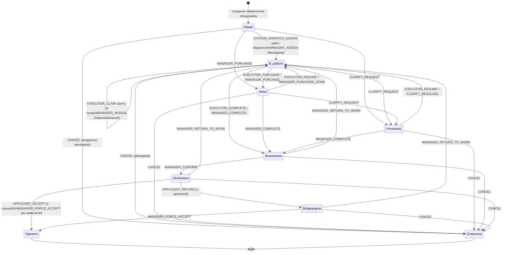

# Домен «Заявки» — техническое описание

> **Статус:** актуальная версия (Source of Truth по домену заявок).
> Истина — код; ссылки на файлы даны в формате `путь:строка`. При расхождении
> кода и документа верен код — правьте документ.
>
> Смежные документы:
> - Смены и алгоритм назначения на смены: [SHIFTS_AND_ASSIGNMENT.md](./SHIFTS_AND_ASSIGNMENT.md)
> - Списание материалов исполнителем и складской учёт: [../MATERIALS_MODULE.md](../MATERIALS_MODULE.md)
> - Руководство жителя: [../guides/USER_GUIDE_APPLICANT.md](../guides/USER_GUIDE_APPLICANT.md)
> - Руководство исполнителя: [../guides/USER_GUIDE_EXECUTOR.md](../guides/USER_GUIDE_EXECUTOR.md)

## 1. Назначение и границы домена

Домен «Заявки» отвечает за полный жизненный цикл сервисной заявки в ЖК: от
создания жителем до приёмки выполненной работы. Ядро — чистая action-модель
переходов статусов (`utils/request_workflow.py`), которая не содержит ORM/IO;
адаптеры (бот, REST API) загружают снимок заявки под блокировкой и применяют
результат перехода в одной транзакции.

Ключевой архитектурный принцип (SSOT-кластер #1): **все workflow-поля заявки
(`status`, `executor_id`, `assigned_*`, `is_returned`, `manager_confirmed`, …)
пишутся только через канонический слой** `services/workflow_runner.run_command_sync`.
Прямые записи `request.status = ...` из хендлеров запрещены.

## 2. Роли

Значения ролей (`user.roles` — JSON-массив строк, `user.active_role` — активная
роль): `constants.py:28-42`.

| Роль | Ключ | Отношение к заявкам |
|------|------|---------------------|
| Заявитель | `applicant` | Создаёт заявки, отслеживает, принимает/возвращает выполненные |
| Исполнитель | `executor` | Берёт/выполняет назначенные заявки, отчитывается, списывает материалы |
| Менеджер | `manager` | Назначает, ведёт по статусам, подтверждает, принимает за заявителя, отменяет |
| Обходчик | `inspector` | Заводит заявки уровня «дом» (building-only) |
| Системный администратор | `system_admin` | Полный доступ (роли контроля доступа) |
| Оператор охраны | `security_operator` | Модуль контроля доступа (вне домена заявок) |

Авторизация переходов — предикатами per-action в `request_workflow.py:372-424`
(`_is_manager`, `_is_assigned_executor`, `_executor_can_work`,
`_executor_can_claim`, `_is_owner`, `_can_accept`, `_can_cancel`).

## 3. Модель данных

### 3.1 Request — `database/models/request.py`

Первичный ключ — `request_number` (строка `YYMMDD-NNN`, `request.py:27`), а не
целочисленный id.

Основные группы полей:
- **Идентификация/владелец:** `request_number`, `user_id` (`request.py:27-32`).
- **Содержание:** `category`, `status` (default `"Новая"`), `description`,
  `urgency` (канон-ключ, default `"low"`), `source` (`request.py:35-42`).
- **Адрес (3 уровня):** `apartment_id` / `building_id` / `yard_id` +
  дискриминатор `address_type` (`legacy|yard|building|apartment`); legacy-поле
  `address` (текст) сохранено для отображения (`request.py:44-57`). Инвариант
  «ровно один FK соответствует `address_type`» закреплён CHECK-constraint
  `ck_requests_address_fk` (`request.py:14-24`).
- **Медиа:** `media_files` (JSON, telegram file_id как backup; основное
  хранилище — Media Service), `completion_media` (`request.py:60,70`).
- **Назначение:** `executor_id`, `assignment_type` (`group`/`individual`),
  `assigned_group`, `assigned_at`, `assigned_by` (`request.py:64-76`).
- **Материалы/отчёт:** `completion_report`, `requested_materials`,
  `manager_materials_comment`, `purchase_history` (`request.py:69-82`).
- **Приёмка/возврат:** `is_returned`, `return_reason`, `return_media`,
  `returned_at`, `returned_by` (`request.py:85-89`).
- **Подтверждение менеджером:** `manager_confirmed`, `manager_confirmed_by`,
  `manager_confirmed_at`, `manager_confirmation_notes` (`request.py:92-95`).
- **Тайм-стемпы:** `created_at`, `updated_at`, `completed_at` (`request.py:99-101`).

Связи: `ratings`, `comments`, `assignments`, `apartment_obj`, `building_obj`,
`yard_obj`, `executor`, `user` (`request.py:32,56-57,64-65,104-109`).

### 3.2 RequestAssignment — `database/models/request_assignment.py`

Запись о назначении заявки группе (`assignment_type="group"` +
`group_specialization`) или конкретному исполнителю (`assignment_type="individual"`
+ `executor_id`). Статус `active|cancelled|completed` (`request_assignment.py:35-44`).

Инвариант «не более одного активного назначения на заявку» — частичный
уникальный индекс `uq_request_assignments_active` (WHERE `status='active'`),
история cancelled/completed сохраняется (`request_assignment.py:17-28`).

### 3.3 RequestComment — `database/models/request_comment.py`

Комментарии с типом `comment_type`: `status_change`, `clarification`,
`purchase`, `report` (`request_comment.py:24`, `constants.py:85-89`). Списание
материалов пишет комментарий с типом `'material'` (см.
[MATERIALS_MODULE.md](../MATERIALS_MODULE.md)). Поля контекста: `previous_status`,
`new_status`, `is_internal`, `media_files` (`request_comment.py:27-30`).

## 4. Нумерация заявок

Формат `YYMMDD-NNN` (суффикс 3+ цифр — поддержка >999 заявок/день),
`services/request_number_service.py:59-60`.

- Дневной префикс формируется по **бизнес-дате Asia/Tashkent**, независимо от tz
  сервера (`request_number_service.py:26-31`).
- Номер выдаёт атомарный счётчик дня `request_number_counters` через
  `INSERT … ON CONFLICT DO UPDATE … RETURNING` (`request_number_service.py:40-53`).
  Self-seed при первой заявке дня — из числового `MAX(SUBSTR(...))` существующих
  заявок (покрывает legacy). Счётчик монотонный и gap-safe: удаление заявки с
  MAX-суффиксом не приводит к повторной выдаче номера.
- `next_number()` вызывается **в той же транзакции**, что и INSERT заявки, без
  сетевого I/O до commit — row-lock счётчика держится до конца транзакции
  (`request_number_service.py:79-94`). Fallback'ов нет: ошибка БД = ошибка.
- Отображение: `format_for_display()` → `№YYMMDD-NNN (DD.MM.YYYY)`
  (`request_number_service.py:256-277`).

## 5. Адрес заявки

Единый резолвер `services/request_address.py` — источник истины по правилам «кто
на какой двор/дом/квартиру может завести заявку». Policy-core без I/O + тонкие
sync/async-адаптеры (бот — sync `Session`, API — `AsyncSession`).

Матрица уровней по ролям (`request_address.py:44-47`):
- `applicant` — `yard`, `building`, `apartment` (свои — через approved-квартиры
  ∪ `UserYard`; вся цепочка квартира→дом→двор должна быть активна);
- `inspector` — только `building` (любой активный дом, принадлежность не нужна).

Ошибки резолва (`request_address.py:63-73`): `403` — адрес существует и активен,
но чужой; `422` — не существует / неактивен / уровень не поддержан ролью.

Важно (R17): в боте адрес выбирается **только inline-кнопками**
`addr:<type>:<id>` — свободный текст отклоняется, поскольку неуникальный
`Building.address` мог увести в чужой дом (`handlers/requests/create.py:212-228`).
При сохранении заявки адрес **повторно резолвится** по `(address_type, address_id)`
через `resolve_request_address_sync` — FSM-данным не доверяем
(`create.py:469-481`).

## 6. Статусный контур

Канон-статусы (`constants.py:47-71`, `request_workflow.py:51-57`):

| Статус (БД) | Смысл | Эмодзи |
|-------------|-------|--------|
| `Новая` | Создана, ждёт назначения | 🆕 |
| `В работе` | Назначена исполнителю, в процессе | 🛠️ |
| `Закуп` | Требуется закупка материалов | 💰 |
| `Уточнение` | Требуется уточнение деталей | ❓ |
| `Выполнена` | Выполнена исполнителем, ждёт проверки менеджером | ✅ |
| `Исполнено` | Проверена менеджером, отправлена заявителю на приёмку | ⭐ |
| `Принято` | Принята заявителем — **терминальный** | ✔️ |
| `Возвращена` | Возвращена заявителем, ждёт повторного разбора менеджером | ↩️ |
| `Отменена` | Отменена — **терминальный** | ❌ |

Эмодзи и локализованные названия — `utils/status_display.py:15-54`.

Особенность статуса `Возвращена` (`constants.py:55-60`, `request_workflow.py:44-49`):
это канон-статус (пишется в БД после cutover PR3+4), но **наружу — в REST/TWA и
InfraSafe — проецируется как `Исполнено`** до обновления потребителей
(`project_public_status`, `request_workflow.py:284-291`). Legacy-кодировка
возврата — `Исполнено + is_returned=True`; `normalize_status` сводит обе
кодировки к канону (`request_workflow.py:265-277`).

Терминальные статусы: `Принято`, `Отменена` (`request_workflow.py:57`) — из них
переходов нет, редактирование полей заморожено (`validate_edits`,
`request_workflow.py:847-857`).

### 6.1 Диаграмма переходов

Источник рёбер — `ACTION_TABLE` в `request_workflow.py:439-515`.

> Примечание: `CANCEL` доступен из любого нетерминального статуса
> (`request_workflow.py:511-514`); на диаграмме показаны основные рёбра.
> Житель-владелец может отменить только **свою «Новую»** заявку; менеджер —
> из любого нетерминального (`_can_cancel`, `request_workflow.py:418-423`).

### 6.2 Каталог действий (Action)

Определение — `request_workflow.py:100-133`, спецификации — `ACTION_TABLE:439-515`.

| Action | Из → В | Кто (авторизация) | repeat_policy |
|--------|--------|-------------------|---------------|
| `SYSTEM_DISPATCH_ASSIGN` | Новая → В работе | система (dispatcher) | NO_OP_IF_SAME |
| `MANAGER_ASSIGN` | Новая/В работе → В работе | менеджер | NO_OP_IF_SAME |
| `EXECUTOR_PURCHASE` | В работе → Закуп | назначенный исполнитель на смене | REJECT |
| `MANAGER_PURCHASE` | Новая/В работе → Закуп | менеджер | REJECT |
| `MANAGER_PURCHASE_DONE` | Закуп → В работе | менеджер | REJECT |
| `CLARIFY_REQUEST` | Новая/В работе/Закуп → Уточнение | менеджер | REJECT |
| `CLARIFY_RESOLVED` | Уточнение → В работе | менеджер | REJECT |
| `EXECUTOR_RESUME` | Закуп/Уточнение → В работе | назначенный исполнитель на смене | REJECT |
| `EXECUTOR_CLAIM` | В работе → В работе | исполнитель на смене, спец. совпадает | REJECT* |
| `EXECUTOR_COMPLETE` | В работе → Выполнена | назначенный исполнитель на смене | REPEATABLE |
| `MANAGER_COMPLETE` | В работе/Закуп/Уточнение → Выполнена | менеджер | REPEATABLE |
| `MANAGER_CONFIRM` | Выполнена → Исполнено | менеджер | NO_OP_IF_SAME |
| `MANAGER_RETURN_TO_WORK` | Выполнена/Возвращена/Исполнено → В работе | менеджер | REJECT |
| `APPLICANT_ACCEPT` | Исполнено → Принято | владелец/одобренный сосед | REJECT |
| `APPLICANT_RETURN` | Исполнено → Возвращена | только владелец | REJECT |
| `MANAGER_FORCE_ACCEPT` | Исполнено/Возвращена → Принято | менеджер | REJECT |
| `CANCEL` | любой нетерминальный → Отменена | владелец «Новой»/менеджер | REJECT |

\* Для `EXECUTOR_CLAIM` `from==to==«В работе»`; repeat_policy формален
(недостижим), фактический гейт — предикат `_executor_can_claim`
(`request_workflow.py:387-401,479-481`).

## 7. Создание заявки

Точка входа в боте — реплай-кнопка «📝 Создать заявку»
(`handlers/requests/create.py:48`, тексты — `button_texts.get_create_request_texts`).
Гейт: пользователь найден, содержит роль `applicant`, `status="approved"` и имеет
телефон (`create.py:69-79`).

FSM `RequestStates` (`handlers/requests/shared.py:193-204`), шаги:
1. **Категория** — inline-кнопки (`create.py:94-98`).
2. **Адрес** — inline `addr:<type>:<id>`, резолв через
   `resolve_request_address_sync` (`create.py:125-180`).
3. **Описание** — текст, валидация `Validator.validate_description`
   (`create.py:231-254`).
4. **Срочность** — inline (`low/medium/high/critical`, `create.py:257-271`).
5. **Медиа** — фото/видео, до 5 файлов (`create.py:276-308`).
6. **Подтверждение** — сводка + кнопка подтверждения (`create.py:331-415`).

Сохранение — `save_request` (`create.py:428-551`):
- повторный резолв адреса (`create.py:469-481`);
- генерация номера в транзакции (`create.py:485`);
- запись заявки + `emit_request_created_sync` (outbox) в одной транзакции —
  защита от orphan-заявок (`create.py:495-517`);
- **авто-dispatch** на группу-специализацию через
  `auto_dispatch_new_request_sync` (Новая→В работе + group-назначение),
  best-effort после commit (`create.py:521-525`);
- загрузка медиа в Media Service — после commit (`create.py:527-545`).

Обходчик (`inspector`) заводит заявки своим путём с `source="inspector"`;
`source` задаёт доверенный call-site, а не FSM/клиент (`create.py:428-443`).

## 8. Назначение исполнителя

Три механизма (все пишут `executor_id`/назначение через канонический слой):

### 8.1 Авто-dispatch при создании
`services/dispatch.auto_dispatch_new_request_sync` — при создании заявки
подбирает группу-специализацию по категории и переводит Новая→В работе с
**групповым** назначением (`create.py:521-525`). Заявка попадает в пул
«свободных» для дежурных исполнителей этой специализации.

### 8.2 Ручное назначение менеджером
`handlers/request_assignment.py` (FSM `RequestAssignmentStates`), только для
роли `manager` (`request_assignment.py:36-38`):
- выбор типа назначения (групповое/индивидуальное, `request_assignment.py:29-64`);
- **групповое** — выбор специализации → `AssignmentService.assign_to_group`
  (`request_assignment.py:66-100,276-282`);
- **индивидуальное** — специализация выводится из категории заявки, затем выбор
  доступного исполнителя → `AssignmentService.assign_to_executor`
  (`request_assignment.py:102-166,283-289`).

`AssignmentService` создаёт строку `RequestAssignment`, отменяет устаревшие
активные назначения и пишет audit-лог. Просмотр назначений —
`view_assignments_*` (`request_assignment.py:324-366`).

### 8.3 Взятие из пула (групповой self-claim)
`handlers/requests/executor.py` — исполнитель на смене открывает пул «🆓
Свободные заявки» (`executor.py:185-260`) и берёт заявку кнопкой «🙋 Взять в
работу» → `EXECUTOR_CLAIM` (`executor.py:262-300`). Чисто-групповое назначение
(`executor_id IS NULL`) конвертируется in-place в individual на взявшего;
заявка уходит из пула, остальным дежурным группы уходит уведомление
(`executor.py:203-241`, `request_workflow.py:577-584,648-649`).

### 8.4 SmartDispatcher
`services/smart_dispatcher.py` — интеллектуальный диспетчер для авто-назначения
пачек неназначенных заявок на активные смены. **Единственный диспетчер** в
системе (оптимизаторы `AssignmentOptimizer`/`GeoOptimizer` удалены, ARC-04).

- Многокритериальная оценка `calculate_assignment_score`
  (`smart_dispatcher.py:250-330`) с весами (`smart_dispatcher.py:53-60`):
  специализация 0.35, гео-близость 0.25, балансировка нагрузки 0.20, рейтинг
  исполнителя 0.15, срочность 0.05.
- Пороги: `min_assignment_score=0.6`, `max_requests_per_executor=8`
  (`smart_dispatcher.py:63-65`).
- `auto_assign_requests` — подбор и назначение (`smart_dispatcher.py:69-155`);
  `handle_urgent_requests` — приоритет срочных (`smart_dispatcher.py:157-190`);
  `balance_workload` — перебалансировка между сменами (`smart_dispatcher.py:192-248`).
- Само назначение выполняется через канонический `SYSTEM_DISPATCH_ASSIGN`
  (`_execute_assignment`, `smart_dispatcher.py:415-469`); `ShiftAssignment` —
  метаданные планирования смены (вне workflow-полей заявки).

Подробнее об алгоритме и связке со сменами — [SHIFTS_AND_ASSIGNMENT.md](./SHIFTS_AND_ASSIGNMENT.md).

## 9. Выполнение заявки исполнителем

Хендлеры — `handlers/requests/executor.py`, все переходы через
`_run_executor_command` (единый canonical-write, авторизация = назначен +
активная смена, `executor.py:115-145`):
- **Закуп:** `executor_purchase_*` → комментарий → `EXECUTOR_PURCHASE`,
  текст исполнителя пишется в `requested_materials` (`executor.py:303-382`).
- **Возврат в работу:** `executor_work_*` → `EXECUTOR_RESUME` (self-resume из
  Закуп/Уточнение разрешён продуктовым решением, `executor.py:594-638`).
- **Выполнение:** `executor_complete_*` → комментарий → сбор медиа (или «✅
  Завершить без медиа») → `EXECUTOR_COMPLETE`. Медиа грузятся в Media Service
  **до** транзакции (сетевой I/O вне лока); отчёт → `completion_report`, файлы →
  `completion_media` (`executor.py:385-591`).
- **Списание материалов** — кнопка «📦 Материалы» в карточке «В работе»
  (`handlers/requests/materials.py`); детали — [MATERIALS_MODULE.md](../MATERIALS_MODULE.md).

## 10. Приёмка и возврат

Хендлеры — `handlers/request_acceptance.py`.

- **Список ожидающих приёмки** — реплай-кнопка «✅ Ожидают приёмки»
  (`request_acceptance.py:64-152`). Показывает свои заявки и заявки соседей по
  approved-квартире; фильтр `awaiting_applicant_clause()` — обе живые кодировки
  «ожидает приёмки» (web: `Исполнено`; telegram: `Выполнена+manager_confirmed`),
  возвращённые исключены (`request_acceptance.py:100-112`).
- **Просмотр выполненной** — `view_completed_*`; доступ только владельцу/
  одобренному соседу (`can_accept`), медиа завершения — потенциальный PII
  (`request_acceptance.py:155-316`).
- **Принять с оценкой** — `accept_request_*` → выбор 1–5 → `rate_*` →
  `APPLICANT_ACCEPT` с `{"rating": N}`. Оценка валидируется по типу и диапазону
  до записи (`request_acceptance.py:319-435`). Создаётся `Rating`, статус →
  `Принято`, `completed_at` = now.
- **Вернуть** — `return_request_*` → причина → медиа (или пропуск) →
  `APPLICANT_RETURN` (`is_returned=True`, `return_reason/_media`, статус
  канон-`Возвращена`). Авторизация — **только владелец**
  (`request_acceptance.py:438-657`). Уведомляются исполнитель, канал и напрямую
  менеджеры.
- **Менеджер может принять за заявителя** — `MANAGER_FORCE_ACCEPT` (Исполнено/
  Возвращена → Принято, rating не требуется, `request_workflow.py:507-510`).

## 11. Комментарии и медиа

- **Медиа заявки** — `media_files` (JSON telegram file_id как backup; основное —
  Media Service). При создании до 5 файлов (`create.py:284`); лимит на уровне
  домена — `MAX_MEDIA_FILES_PER_REQUEST=10` (`constants.py:9`).
- **Медиа завершения** — `completion_media`, грузятся в Media Service с
  `report_type` (`completion_photo/video/document`, `executor.py:498-543`).
- **Комментарии** — `RequestComment` с типами `status_change`, `clarification`,
  `purchase`, `report`, а также `material` (списание материалов). Изменения
  статуса могут нести `previous_status`/`new_status`.

## 12. Что где в коде

| Область | Файл | Ключевые точки |
|---------|------|----------------|
| Чистое ядро workflow | `uk_management_bot/utils/request_workflow.py` | `Action`, `ACTION_TABLE`, `plan_transition`, `normalize_status`, `project_public_status` |
| Применение перехода (адаптер) | `uk_management_bot/services/workflow_runner.py` | `run_command_sync` |
| Нумерация | `uk_management_bot/services/request_number_service.py` | `next_number`, `_NEXT_SEQ_SQL`, `business_today` |
| Резолвер адреса | `uk_management_bot/services/request_address.py` | `resolve_request_address_sync/async`, `ROLE_ALLOWED_LEVELS` |
| SmartDispatcher | `uk_management_bot/services/smart_dispatcher.py` | `auto_assign_requests`, `calculate_assignment_score` |
| Ручное назначение | `uk_management_bot/services/assignment_service.py` | `assign_to_group`, `assign_to_executor`, `reassign_executor` |
| Авто-dispatch при создании | `uk_management_bot/services/dispatch.py` | `auto_dispatch_new_request_sync` |
| Создание заявки (бот) | `uk_management_bot/handlers/requests/create.py` | `start_request_creation`, `save_request` |
| Исполнитель (бот) | `uk_management_bot/handlers/requests/executor.py` | пул/claim/purchase/complete/resume |
| Назначение (бот) | `uk_management_bot/handlers/request_assignment.py` | менеджерский FSM назначения |
| Приёмка/возврат (бот) | `uk_management_bot/handlers/request_acceptance.py` | accept/return, оценка, force-accept |
| Материалы (бот) | `uk_management_bot/handlers/requests/materials.py` | списание материалов |
| «Мои заявки» (бот) | `uk_management_bot/handlers/requests/myrequests.py` | список/фильтры/ответ на уточнение |
| Отображение статусов | `uk_management_bot/utils/status_display.py` | `get_status_with_emoji` |
| Локализация адреса | `uk_management_bot/utils/address_helpers.py` | `localize_address` |
| Модель заявки | `uk_management_bot/database/models/request.py` | `Request` |
| Модель назначения | `uk_management_bot/database/models/request_assignment.py` | `RequestAssignment` |
| Модель комментария | `uk_management_bot/database/models/request_comment.py` | `RequestComment` |
| Константы (статусы/роли/срочность) | `uk_management_bot/utils/constants.py` | `REQUEST_STATUS_*`, `ROLE_*`, `URGENCY_*` |

## 13. Наблюдения (для владельца продукта)

- **Проекция `Возвращена` → `Исполнено` наружу** (`project_public_status`) —
  временная мера до обновления потребителей (kanban/InfraSafe). В боте менеджер
  видит канон-статус, в REST/TWA — `Исполнено`. Стоит держать в поле зрения при
  интеграциях: внешний потребитель не отличит возврат от исполнения.
- **Двойная кодировка приёмки** (web `Исполнено` vs telegram
  `Выполнена+manager_confirmed`) — источник сложности в фильтрах приёмки
  (`awaiting_applicant_clause`). После полного cutover упрощается.

---
*Документ описывает состояние кода на дату последнего обновления. Источник
истины — код; при расхождении правьте документ.*
