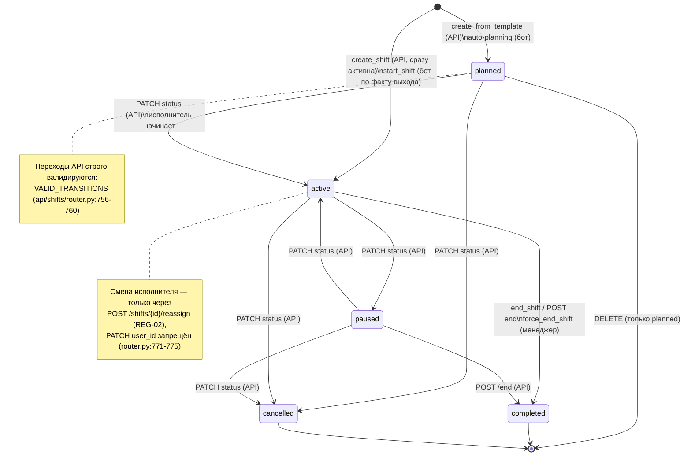
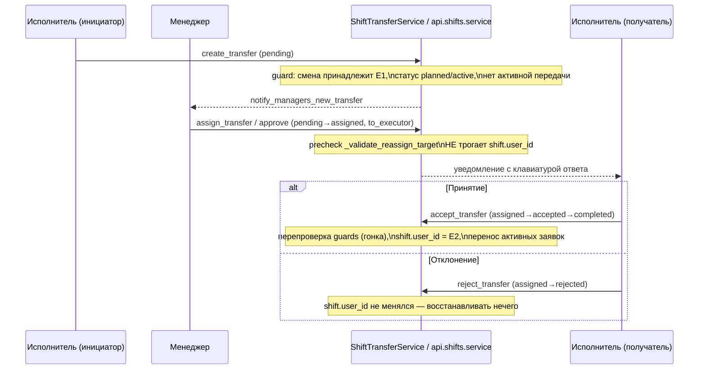
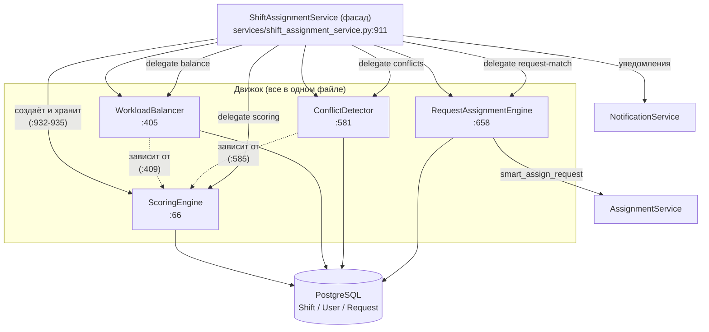
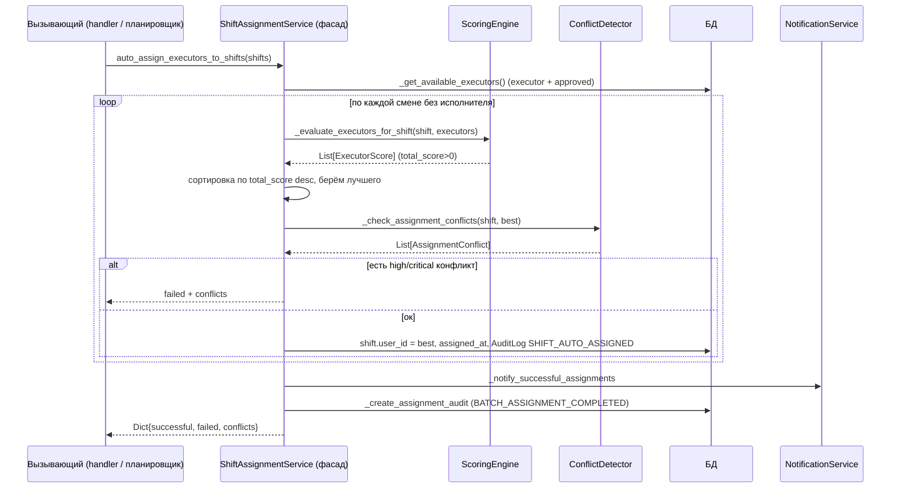

# Домен «Смены и движок назначения» — техническая документация

> _Последнее редактирование: 2026-07-06_

> **Статус:** актуальная тех-версия. Отражает код на момент написания (после ARC-03 декомпозиции движка и ARC-04 удаления кластера оптимизации).
> **Истина — код.** Все утверждения проверяемы по `file:line`. Где поведение неочевидно из кода — помечено «проверить вручную».
> **Связанные домены:** заявки — см. [docs/tech/REQUESTS.md](./REQUESTS.md) (движок назначения переносит и создаёт заявки-исполнитель-привязки через workflow-слой домена «Заявки»).
> **Архивные обзоры (не истина):** `docs/shifts.md` (продуктовый обзор), `docs/SHIFT_SYSTEM_ANALYSIS.md` (архив).

---

## 1. Обзор

Домен решает две связанные задачи:

1. **Управление сменами** — жизненный цикл смены исполнителя (создание → старт → пауза → завершение), передача смен между исполнителями, шаблоны для массового/автоматического создания.
2. **Движок назначения** — интеллектуальный подбор исполнителя на смену (scoring) и заявки на смену/исполнителя (dispatch), с балансировкой нагрузки и детекцией конфликтов.

Домен реализован в двух средах:

| Среда | Точка входа | Технология | Транзакции |
|-------|-------------|------------|------------|
| Telegram-бот | `handlers/shift_management/*`, `services/shift_service.py`, `services/shift_transfer_service.py` | aiogram 3, sync SQLAlchemy `Session` | синхронные |
| Web/API дашборд | `api/shifts/router.py` → `api/shifts/service.py` | FastAPI, `AsyncSession` | асинхронные, с `with_for_update` |

Оба тонких слоя (бот-handlers и API-router) делегируют данные/логику в сервисный слой. API-router намеренно «тонкий»: весь ORM вынесен в `api/shifts/service.py` (`api/shifts/service.py:1-13`, AST-гейт `tests/api/test_shifts_router_inventory.py` держит прямой ORM в роутере на нуле).

---

## 2. Модели данных

Пять таблиц (`database/models/shift*.py`):

| Модель | Таблица | Файл | Назначение |
|--------|---------|------|-----------|
| `Shift` | `shifts` | `database/models/shift.py:6` | Рабочая смена исполнителя (время, статус, специализация, метрики нагрузки/производительности) |
| `ShiftTemplate` | `shift_templates` | `database/models/shift_template.py:8` | Шаблон для создания смен (время, требуемые специализации, режим повторения) |
| `ShiftAssignment` | `shift_assignments` | `database/models/shift_assignment.py:9` | Привязка заявки к конкретной смене (метаданные планирования, ML-оценки) |
| `ShiftSchedule` | `shift_schedules` | `database/models/shift_schedule.py:8` | План покрытия на дату (планируемое/фактическое покрытие по часам и специализациям) |
| `ShiftTransfer` | `shift_transfers` | `database/models/shift_transfer.py:12` | Журнал/машина состояний передачи смены между исполнителями |

### 2.1 Ключевые поля `Shift` (`database/models/shift.py`)

- `user_id` (nullable) — исполнитель; `null` = неназначенная смена (`shift.py:12`).
- `start_time` / `end_time` (`tz-aware`) — фактическое время (`shift.py:17-18`).
- `planned_start_time` / `planned_end_time` — планируемое; бот читает именно `planned_*` в расписании, поэтому API синхронизирует их при изменениях (`shift.py:28-29`; синхронизация — `api/shifts/service.py:657-660`).
- `status` — `active | completed | cancelled | planned | paused` (`shift.py:21`; каноничные константы — `utils/constants.py:133-137`).
- `specialization_focus` (JSON-массив) — требуемые специализации смены (`shift.py:39`).
- `max_requests` / `current_request_count` — ёмкость и текущая загрузка; свойства `is_full`, `load_percentage` (`shift.py:49-52`, `shift.py:90-100`).
- Метрики: `completed_requests`, `average_completion_time`, `efficiency_score`, `quality_rating` (`shift.py:57-71`).

> **Расхождение статусов (проверить вручную при доработке):** каноничный набор в коде — `active/completed/cancelled/planned/paused` (`utils/constants.py:133-137`). Продуктовый обзор `docs/shifts.md` упоминает `in_transition` и статусы заявок при передаче (`active_in_shift`, `pending_transfer` и т.п.) — в коде домена смен их **нет**; это нереализованная концепция, не источник истины.

### 2.2 `ShiftTemplate` — режимы повторения (`database/models/shift_template.py`)

Два режима (`shift_template.py:66-77`, метод `is_date_included` `shift_template.py:122-136`):
- `weekday` — по дням недели (`days_of_week`, конвенция 1=Пн … 7=Вс).
- `cycle` — N рабочих / M выходных от `cycle_anchor_date` (график «сутки через трое», «5/2» и т.п.). Фаза считается как `(d - anchor).days % (on+off) < on`.

### 2.3 `ShiftTransfer` — машина состояний (`database/models/shift_transfer.py`)

Валидные переходы жёстко заданы в `update_status` (`shift_transfer.py:109-140`):

```
pending   → assigned | cancelled
assigned  → accepted | rejected | cancelled
accepted  → completed | cancelled
rejected  → pending | cancelled
cancelled → (терминал)
completed → (терминал)
```

Плюс статус `expired` (планировщик помечает истёкшие; `shift_transfer.py:33`). Retry-поля `retry_count/max_retries` (`shift_transfer.py:59-60`).

---

## 3. Жизненный цикл смены

### 3.1 Диаграмма состояний



### 3.2 Пути создания смены

| Путь | Начальный статус | Где |
|------|------------------|-----|
| Бот, исполнитель начинает смену «по факту» | `active` | `ShiftService.start_shift` (`services/shift_service.py:70-118`) |
| API, менеджер создаёт смену вручную | `active` | `service.create_shift` (`api/shifts/service.py:628-645`) |
| API, из шаблона на дату | `planned` | `service.create_shifts_from_template` (`api/shifts/service.py:500-530`) |
| Бот, автопланирование (неделя/месяц/завтра) | `planned` | `handlers/shift_management/auto_planning.py` → `ShiftPlanningService` |

**Старт смены в боте** (`services/shift_service.py:70-118`): проверка роли (`executor` или `manager`, `shift_service.py:75-77`), создание `Shift(status=active, start_time=now)`, аудит `SHIFT_STARTED`, уведомление `notify_shift_started`. **Важно:** проверка «одна активная смена на пользователя» намеренно снята — один сотрудник может вести несколько смен разных специализаций одновременно (`shift_service.py:79-83`).

**Завершение** (`services/shift_service.py:120-159` — своя смена; `161-207` — `force_end_shift` менеджером): проставляется `end_time=now`, `status=completed`, аудит `SHIFT_ENDED`, уведомление.

**API-переходы статусов** валидируются картой (`api/shifts/router.py:756-760`):
```
planned → active | cancelled
active  → paused | cancelled
paused  → active | cancelled
```
Завершение активной/приостановленной — отдельный эндпоинт `POST /{shift_id}/end` (`router.py:883-907`). Удаление — только `planned` (`router.py:863-880`). Контент-правки запрещены после терминального статуса (`router.py:783-789`).

**Защита от двойного бронирования:** при создании и правке времени/исполнителя проверяется пересечение с активными/планируемыми сменами через `find_overlapping_shift_for_update` (`api/shifts/service.py:609-625`), использующий `with_for_update` для блокировки строки.

---

## 4. Передача смен (REG-02 / REG-03)

Передача смены — перевод владения сменой (и её активных заявок) от одного исполнителя к другому. Реализована в двух ядрах-зеркалах:

- **Бот-ядро:** `ShiftTransferService` (`services/shift_transfer_service.py:68`).
- **Web-зеркало:** функции в `api/shifts/service.py` (async, с `with_for_update`).

### 4.1 Два сценария

**A. Прямой менеджерский reassign (без согласия получателя).**
Бот: `ShiftTransferService.reassign_shift(..., record_history=True)` (`services/shift_transfer_service.py:152-209`).
Web: `reassign_shift_web` (`api/shifts/service.py:726-784`) ← эндпоинт `POST /shifts/{id}/reassign` (`api/shifts/router.py:829-860`).
Смена сразу меняет владельца, активные заявки переносятся, пишется завершённая (`status=completed`) запись `ShiftTransfer` как история.

**B. Флоу с согласием (executor-initiated + manager assign + executor accept).**



Ключевое архитектурное решение (REG-02): на шаге `assign`/`approve` **владелец смены НЕ меняется** — смена переходит к получателю только при `accept` (`api/shifts/service.py:551-564` `approve_transfer`; бот — `assign_transfer` `services/shift_transfer_service.py:259-287`). Это устраняет расхождение «assign vs фактический владелец».

### 4.2 Guard-набор целевого исполнителя

Единый для обоих ядер (`_validate_reassign_target` `services/shift_transfer_service.py:77-112`; web-зеркало inline в `reassign_shift_web` `api/shifts/service.py:742-762`). Возвращает error-key:
`shift_not_transferable` (нет владельца / не planned|active) · `executor_not_found` · `not_approved` (статус ≠ approved) · `not_executor` (нет роли) · `same_executor` · `spec_mismatch` (нет требуемых специализаций, `utils/specializations.has_required_specs`) · `overlap` (пересечение по времени, `with_for_update`).

### 4.3 Перенос активных заявок (status-preserving)

`_move_active_requests` (бот `services/shift_transfer_service.py:116-148`; web `_move_active_requests_web` `api/shifts/service.py:684-723`):
1. Скоуп — не-терминальные `ShiftAssignment` этой смены.
2. Fallback (только для `active`-смены без привязок) — по `Request.executor_id`.
3. Переносятся только заявки в активных статусах `{В работе, Закуп, Уточнение}` (`REASSIGN_MOVE_STATUSES`, `api/shifts/service.py:35`).
4. Переброска `executor_id` идёт **через allowlist-слой** `AssignmentService` / `AsyncAssignmentService.reassign_executor` — не сырым ORM (обновляет и активный `RequestAssignment`).

### 4.4 Блокировки и надёжность

- `get_transfer_for_update` / `get_shift_for_update` — `SELECT ... FOR UPDATE` (`api/shifts/service.py:537-548`).
- Уведомления шлются **после commit** (иначе можно уведомить о переносе, который откатился) — бот собирает `notification_jobs` и рассылает их владелец после commit (`services/shift_transfer_service.py:160-208`); web шлёт Telegram-уведомление получателю в `BackgroundTasks` (`api/shifts/router.py:578-594`, `681-687`).
- `process_expired_transfers` — планировщик помечает истёкшие передачи (`services/shift_transfer_service.py:489`).

---

## 5. Шаблоны смен

Модель — `ShiftTemplate` (§2.2). CRUD через API (`api/shifts/router.py:476-535`): list/get/create/update/delete (soft-delete через `is_active=False`, `api/shifts/service.py:478-480`). Создание смен из шаблона — `POST /from-template` (`router.py:538-575`).

Важные нюансы:
- При создании смен из шаблона на конкретную дату правила повторения (`days_of_week`/`cycle`) **намеренно не применяются** — менеджер выбрал дату вручную, это осознанный разовый override (`api/shifts/router.py:548-551`).
- `planned_*` проставляются равными фактическим start/end, чтобы бот-расписание показывало реальное время (`api/shifts/service.py:510-513`).
- Бот-управление шаблонами (создание, редактирование, специализации, удаление) — `handlers/shift_management/templates_a.py` и `templates_b.py`.

---

## 6. Архитектура движка назначения

### 6.1 Две подсистемы

В домене **два разных движка**, работающих на разных уровнях:

| Движок | Файл | Что подбирает | Направление |
|--------|------|---------------|-------------|
| `ShiftAssignmentService` (+ 4 подкласса) | `services/shift_assignment_service.py` | **исполнителя → на смену** | кого поставить на смену |
| `SmartDispatcher` | `services/smart_dispatcher.py` | **заявку → на смену/исполнителя** | какой смене отдать заявку |

> **ARC-04 (не упоминать как живой):** прежний кластер оптимизации (`assignment_optimizer`, `geo_optimizer`, ~1900 строк) **удалён** как мёртвый код (0 вызовов). Живыми остаются `smart_dispatcher`, recommendation- и metrics-подсистемы.

### 6.2 Декомпозиция `ShiftAssignmentService` (ARC-03)

До ARC-03 это был god-сервис (~1316 строк). Декомпозирован на **4 специализированных класса + фасад**, все в одном файле `services/shift_assignment_service.py`:



Фасад инстанцирует все четыре подкласса в конструкторе, передавая общий `db` и веса; `WorkloadBalancer` и `ConflictDetector` получают ссылку на `ScoringEngine` (`services/shift_assignment_service.py:917-935`).

### 6.3 Таблица «класс → файл → ответственность»

| Класс | Определён | Ответственность | Вход | Выход |
|-------|-----------|-----------------|------|-------|
| **`ScoringEngine`** | `services/shift_assignment_service.py:66` | Read-only скоринг соответствия исполнителя смене. Считает 6 факторов + штрафы, блокирует по специализации. Без побочных эффектов. | `_evaluate_executors_for_shift(shift, executors)` (`:74`), `_calculate_executor_score(shift, executor)` (`:92`) | `List[ExecutorScore]` / `ExecutorScore` (dataclass `:38`) |
| **`WorkloadBalancer`** | `services/shift_assignment_service.py:405` | Балансировка нагрузки: анализ распределения смен по исполнителям, перенос смен от перегруженных к недогруженным. **Владеет мутациями** (`shift.user_id` + `db.commit`). Зависит от `ScoringEngine`. | `balance_executor_workload(target_date)` (`:413`) | `Dict` с результатами ребаланса |
| **`ConflictDetector`** | `services/shift_assignment_service.py:581` | Read-only детекция конфликтов назначения (роль, статус, пересечение времени). Зависит от `ScoringEngine` (переиспользует availability-score). | `_check_assignment_conflicts(shift, executor_id)` (`:589`) | `List[AssignmentConflict]` (dataclass `:54`) |
| **`RequestAssignmentEngine`** | `services/shift_assignment_service.py:658` | Matching заявок к сменам/исполнителям: автоназначение заявок исполнителям активных смен + синхронизация. `AssignmentService` создаёт локально. | `auto_assign_requests_to_shift_executors(date)` (`:665`), `sync_request_assignments_with_shifts(date)` (`:831`) | `Dict` с результатами |
| **`ShiftAssignmentService`** | `services/shift_assignment_service.py:911` | **Фасад.** Оркестрация автоназначения исполнителей на смены (`auto_assign_executors_to_shifts`), разрешение конфликтов, переназначение при отсутствии, аудит, уведомления. Делегирует в подклассы. | `auto_assign_executors_to_shifts(shifts, force_reassign)` (`:939`), `get_best_executor_for_shift` (`:1237`), `reassign_on_absence` (`:1263`), `balance_executor_workload` (`:1099`, делегат) | `Dict` результатов / `ExecutorScore` |

### 6.4 Поток «исполнитель → смена» (фасад)



Точка входа сборки одной смены — `_assign_single_shift` (`services/shift_assignment_service.py:1025-1095`).

---

## 7. Алгоритм подбора исполнителя (`ScoringEngine`)

### 7.1 Факторы и веса

Веса заданы в фасаде и передаются в `ScoringEngine` (`services/shift_assignment_service.py:923-930`):

| Фактор | Вес | Метод | Логика |
|--------|-----|-------|--------|
| specialization | 0.35 | `_calculate_specialization_match` (`:174`) | **Блокирующий.** Исполнитель обязан иметь ВСЕ требуемые специализации смены, иначе `-1.0` (снимается с рассмотрения). Точное совпадение → 1.0; надмножество → 0.9; универсальная смена (нет focus) → 0.5 |
| workload | 0.25 | `_calculate_workload_score` (`:236`) | Чем меньше смен за ±7 дней и активных заявок, тем выше. Порог: 7 смен/нед, 10 активных заявок |
| rating | 0.15 | `_calculate_rating_score` (`:273`) | Нормализация `executor.rating` 1–5 → 0–1; без рейтинга — 0.5 |
| availability | 0.10 | `_calculate_availability_score` (`:281`) | Пересечение с другими сменами: одинаковая специализация → 0.0 (блок); разная специализация → 0.8 (разрешено, повышенная нагрузка); недостаточный отдых <8ч → 0.7; иначе 1.0 |
| preference | 0.10 | `_calculate_preference_score` (`:374`) | **Заглушка** — всегда 0.5 (система предпочтений не реализована) |
| geographic | 0.05 | `_calculate_geographic_score` (`:380`) | **Заглушка** — всегда 0.5 |

Итоговая формула (`services/shift_assignment_service.py:133-141`):
```
total = Σ(factor_i * weight_i) − conflict_penalties
```
Штрафы `_calculate_conflict_penalties` (`:385`): +0.3 при ≥5 сменах в окне ±3 дня.

> **Наблюдение:** два фактора из шести (`preference`, `geographic`, суммарный вес 0.15) — заглушки. Скоринг фактически опирается на specialization/workload/rating/availability. Это стоит учитывать при интерпретации `total_score`.

### 7.2 Балансировка нагрузки (`WorkloadBalancer`)

`balance_executor_workload(target_date)` (`services/shift_assignment_service.py:413-462`):
1. Берёт `planned`-смены на дату.
2. `_analyze_workload_distribution` (`:463`) — считает загрузку по исполнителям, дисперсию; «сбалансировано» если `max-min ≤ 1` и `variance < 1.0`.
3. `_rebalance_shifts` (`:506`) — переносит смены от перегруженных (>avg+1) к недогруженным (<avg-1), проверяя `_can_assign_shift` (роль + approved + availability>0.5). **Мутирует** `shift.user_id` и коммитит (`:564-565`).

### 7.3 Детекция конфликтов (`ConflictDetector`)

`_check_assignment_conflicts(shift, executor_id)` (`services/shift_assignment_service.py:589-644`) возвращает список `AssignmentConflict` с полем `severity` (`low/medium/high/critical`) и `can_resolve`:
- `executor_not_found` (critical), `invalid_role` (high), `invalid_status` (high, resolvable), `time_conflict` (critical, resolvable — через availability-score от `ScoringEngine`).

Фасад блокирует назначение при наличии `high`/`critical` (`services/shift_assignment_service.py:1051`). Авто時разрешение — `_auto_resolve_conflict` (`:1159`): для `time_conflict` пытается найти альтернативного исполнителя.

---

## 8. `SmartDispatcher` — назначение заявок на смены

`services/smart_dispatcher.py:47`. Отдельный движок: подбирает **смену для заявки** (обратное направление к `ShiftAssignmentService`).

### 8.1 Роль и место

- Вход: неназначенные заявки (`status ∈ {Новая, Принята}`, `executor_id IS NULL`, `smart_dispatcher.py:334-347`) и активные смены с исполнителем (`smart_dispatcher.py:353-367`).
- `auto_assign_requests` (`:69`) — основной цикл: приоритизация заявок (`_prioritize_requests` по urgency-канону, `:373`), поиск лучшей смены (`_find_best_assignment` `:388`), выполнение (`_execute_assignment` `:415`).
- `handle_urgent_requests` (`:157`) — режим срочных (`urgency ∈ {high, critical}`), временно поднимает вес срочности до 0.3.
- `balance_workload` (`:192`) — перераспределение заявок между перегруженными (>avg×1.3) и недогруженными (<avg×0.7) сменами.

### 8.2 Веса dispatch-скоринга

`smart_dispatcher.py:53-65` (сумма = 1.0), метод `calculate_assignment_score` (`:250`):

| Фактор | Вес | Метод |
|--------|-----|-------|
| specialization_match | 0.35 | `_calculate_specialization_match` (`:481`) — извлекает специализацию из категории заявки по ключевым словам, matching со `specialization_focus` смены |
| geographic_proximity | 0.25 | `_calculate_geographic_proximity` (`:519`) — совпадение адреса заявки с `coverage_areas` смены |
| workload_balance | 0.20 | `_calculate_workload_balance_score` (`:553`) — оптимум загрузки 50–70% |
| executor_rating | 0.15 | `_calculate_executor_rating_score` (`:577`) — по `shift.quality_rating` |
| urgency_priority | 0.05 | `_calculate_urgency_priority_score` (`:591`) — канон-ключи low/medium/high/critical |

Пороги: `min_assignment_score=0.6`, `max_requests_per_executor=8` (`smart_dispatcher.py:63-64`).

### 8.3 Ключевое: назначение идёт через workflow-слой домена «Заявки»

`_execute_assignment` (`smart_dispatcher.py:415-469`) **не пишет** `request.status/executor_id` сырым ORM. Он вызывает канонический workflow-командой `SYSTEM_DISPATCH_ASSIGN` через `run_command_sync` (`smart_dispatcher.py:435-443`), которая в одной транзакции: `Новая → В работе` + назначение исполнителя + создание `RequestAssignment` (created_by = seeded system-user). Отдельно создаётся `ShiftAssignment` как метаданные планирования смены (вне workflow-полей). Перераспределение (`_redistribute_assignment` `:695`) тоже переназначает `executor_id` через `AssignmentService.reassign_executor`, не сырьём.

> Это и есть точка стыка с доменом «Заявки»: движок назначения смен/диспетчер **изменяет заявки только через allowlist/workflow-слой** — см. [docs/tech/REQUESTS.md](./REQUESTS.md).

---

## 9. Связь с доменом «Заявки»

| Механизм | Кто | Как меняет заявку |
|----------|-----|-------------------|
| Диспетчеризация новых заявок | `SmartDispatcher._execute_assignment` | workflow-команда `SYSTEM_DISPATCH_ASSIGN` (`smart_dispatcher.py:435-443`) |
| Перенос заявок при передаче/reassign смены | `ShiftTransferService._move_active_requests` / `_move_active_requests_web` | `AssignmentService/AsyncAssignmentService.reassign_executor` (`services/shift_transfer_service.py:146`, `api/shifts/service.py:721`) |
| Автоназначение заявок исполнителям смен | `RequestAssignmentEngine.auto_assign_requests_to_shift_executors` | `AssignmentService.smart_assign_request` (`services/shift_assignment_service.py:722`) |
| Переброска заявок при soft-delete исполнителя | `api/shifts/service.soft_delete_employee` | `AsyncAssignmentService.reassign_executor` (`api/shifts/service.py:204-213`) |

Каноничный набор «активных» статусов заявки для переноса — `{В работе, Закуп, Уточнение}` (`REASSIGN_MOVE_STATUSES`, `api/shifts/service.py:35`); для подсчёта активной нагрузки — расширенный `ACTIVE_REQUEST_STATUSES` (`api/shifts/service.py:41`). Детали статусной модели заявок и workflow-движка — в [docs/tech/REQUESTS.md](./REQUESTS.md).

---

## 10. API-эндпоинты (сводно)

Все под `require_roles("manager")` (`api/shifts/router.py`). База: см. монтирование роутера в API-приложении.

| Метод | Путь | Действие |
|-------|------|----------|
| GET | `/employees`, `/employees/{id}` | Список/карточка сотрудника со сменами |
| POST | `/employees`, `/employees/invite` | Создание сотрудника / инвайт-токен |
| PATCH | `/employees/{id}/{approve,reject,block,unblock,delete}` | Управление статусом/верификацией/soft-delete |
| GET | `` (list), `/{id}`, `/schedule`, `/stats` | Смены: список/карточка/расписание (overlap-фильтр)/дашборд-статистика |
| POST | `` (create), `/{id}/reassign`, `/{id}/end` | Создать / reassign (REG-02) / завершить смену |
| PATCH | `/{id}` | Правка смены (переход статуса + контент; `user_id` запрещён) |
| DELETE | `/{id}` | Удалить (только `planned`) |
| GET/POST/PATCH/DELETE | `/templates*` | CRUD шаблонов (soft-delete) |
| POST | `/from-template` | Создать смены из шаблона на дату |
| GET | `/transfers` | Активные передачи (pending/assigned) |
| POST | `/transfers/{id}/handle` | Менеджер: approve/reject/cancel передачи |

Realtime: мутации публикуют события через `publish_shift_event` / `publish_request_event` (Redis pub/sub): `shift.created/updated/ended`, `transfer.updated`, `request.updated`.

---

## 11. Handlers бота (`handlers/shift_management/`)

Пакет (split AUD3-06), все submodules регистрируются на общий `router` (`_router.py`). Группы (`__init__.py:9-95`):

| Модуль | Ответственность |
|--------|-----------------|
| `auto_planning.py` | Команда `/shifts`, автопланирование неделя/месяц/завтра (с подтверждениями) |
| `manual_planning.py` | Ручное создание смен из шаблона, выбор даты, недельное планирование |
| `schedule.py` | Просмотр расписания (день/неделя/месяц), reassign исполнителя из расписания |
| `templates_a.py` / `templates_b.py` | CRUD шаблонов: базовые поля / специализации и удаление |
| `assignment_a.py` / `assignment_b.py` | AI-назначение, bulk-назначение, анализ/перераспределение нагрузки, конфликты |
| `analytics.py` | Аналитика смен, прогноз нагрузки, рекомендации оптимизации |
| `shared.py` | Кросс-модульные хелперы, `_db_scope`, локализация специализаций |

---

## 12. Наблюдения и рекомендации

1. **Дублирование scoring-логики.** `ScoringEngine` (исполнитель→смена) и `SmartDispatcher` (заявка→смена) имеют близкие, но независимые наборы факторов и весов (оба с `specialization 0.35`). Стоит зафиксировать в глоссарии, что это разные движки, чтобы не путать при доработке.
2. **Заглушки в скоринге.** `preference` и `geographic` факторы `ScoringEngine` захардкожены в 0.5 (суммарный вес 0.15). Требует решения владельца продукта: реализовывать или убрать из весов.
3. **Расхождение статусной модели** между кодом (`utils/constants.py:133-137`) и продуктовым обзором `docs/shifts.md` (`in_transition` и статусы заявок-при-передаче отсутствуют в коде). Данная тех-версия — источник истины.
4. **Naive vs aware datetime (AUD3-11).** В `reassign_on_absence` отмечена хрупкость сравнения `planned_start_time` (tz-aware) с `datetime.now()` (`services/shift_assignment_service.py:1280-1282`) — проверить вручную при работе с TZ.

---

*Документ отражает состояние кода после ARC-03 (декомпозиция движка) и ARC-04 (удаление кластера оптимизации). При изменении сигнатур классов/методов — обновить таблицы §6.3 и ссылки file:line.*
