# Инструкция жителя

> _Последнее редактирование: 2026-07-06_

Добро пожаловать! Этот раздел поможет вам пользоваться системой управляющей компании: подавать заявки на обслуживание, следить за их выполнением и принимать работу. Пользоваться можно двумя способами:

- **через чат Telegram-бота** — всё делается кнопками прямо в переписке;
- **через мини-приложение (Mini App / TWA)** — то же самое, но в виде удобного приложения внутри Telegram.

Оба способа работают с одними и теми же заявками — выбирайте, что удобнее. Ниже сначала описан путь через бота, затем — через мини-приложение.

## Как это работает — обзор

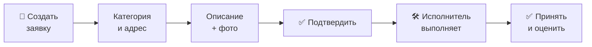

---

## Кто вы и что можете

Вы — **житель** жилого комплекса. Через систему вы можете:

- подать заявку на обслуживание (сантехника, электрика, уборка, благоустройство и т.д.);
- прикрепить к заявке фото или видео проблемы;
- следить за статусом заявки — на каком она этапе;
- принять выполненную работу и поставить оценку;
- вернуть заявку на доработку, если что-то не устроило;
- оставить отзыв о работе;
- (если доступно в вашем ЖК) заказать пропуск для гостя, такси или зарегистрировать свой автомобиль для въезда.

**Язык интерфейса.** Система работает на русском и узбекском. Переключить язык можно в настройках — все кнопки и подсказки поменяются автоматически.

---

## С чего начать

Чтобы подавать заявки, ваша учётная запись должна быть подтверждена управляющей компанией, а ваша квартира — привязана к вашему профилю. Обычно это происходит так:

1. Вы получаете приглашение или ссылку от управляющей компании и открываете бота.
2. Бот попросит указать ваш **номер телефона** — поделитесь им кнопкой.
3. Управляющая компания подтверждает вашу учётную запись и привязывает ваш адрес (двор, дом, квартиру).
4. После подтверждения в главном меню появятся кнопки для работы с заявками.

Если бот просит телефон или не показывает кнопку создания заявки — значит, ваша учётная запись ещё не подтверждена или не привязан адрес. В этом случае обратитесь в управляющую компанию.

---

# Способ 1. Через чат бота

## Как подать заявку

**Шаг 1. Откройте создание заявки.**
В главном меню нажмите кнопку **«📝 Создать заявку»**.

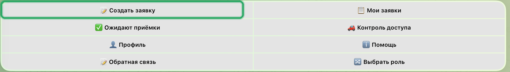

**Шаг 2. Выберите категорию.**
Бот покажет кнопки с категориями (Электрика, Сантехника, Отопление, Лифт, Уборка, Благоустройство, Безопасность, Интернет/ТВ и др.). Выберите подходящую **кнопкой** — не вводите категорию текстом, бот примет только выбор кнопкой.

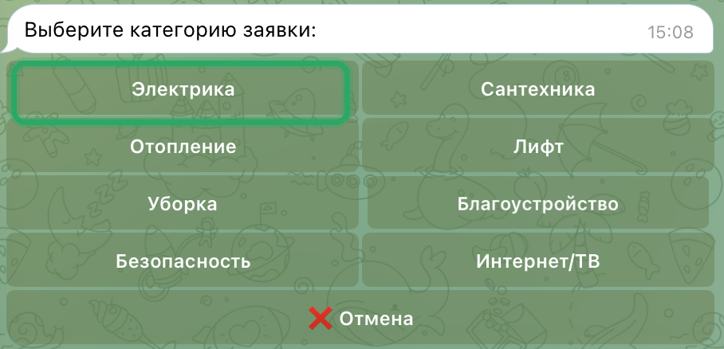

**Шаг 3. Выберите адрес.**
Из списка выберите **кнопкой** нужный адрес (двор / дом / квартиру). В списке только те адреса, к которым вы привязаны.

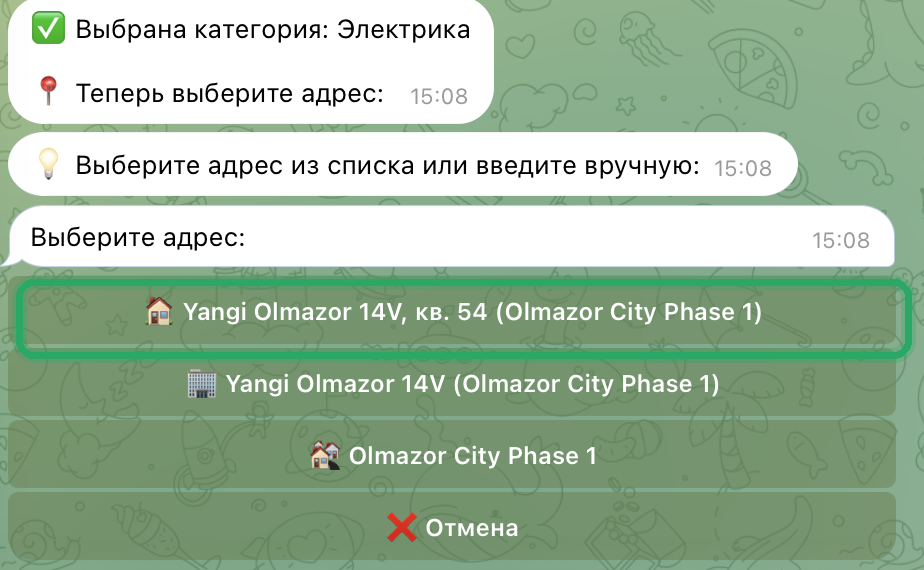

> Адрес выбирается только кнопками, вручную вводить его нельзя — так исключаются ошибки с чужим адресом. Если в списке пусто, значит ваша квартира ещё не привязана — обратитесь в управляющую компанию.

**Шаг 4. Опишите проблему.**
Напишите текстом, что случилось, как можно подробнее. Слишком короткое описание бот попросит дополнить.

**Шаг 5. Укажите срочность.**
Выберите кнопкой: Обычная, Средняя, Срочная или Критическая.

**Шаг 6. Прикрепите фото или видео (по желанию).**
Можно добавить до 5 файлов — это помогает исполнителю понять проблему заранее. Если фото не нужно, нажмите **«Продолжить»**.

**Шаг 7. Проверьте и подтвердите.**
Бот покажет сводку заявки: категория, адрес, описание, срочность, число прикреплённых файлов. Проверьте всё и нажмите **«Подтвердить»**. Если нужно что-то поправить — нажмите **«Назад»**, а чтобы отменить создание — **«Отмена»**.

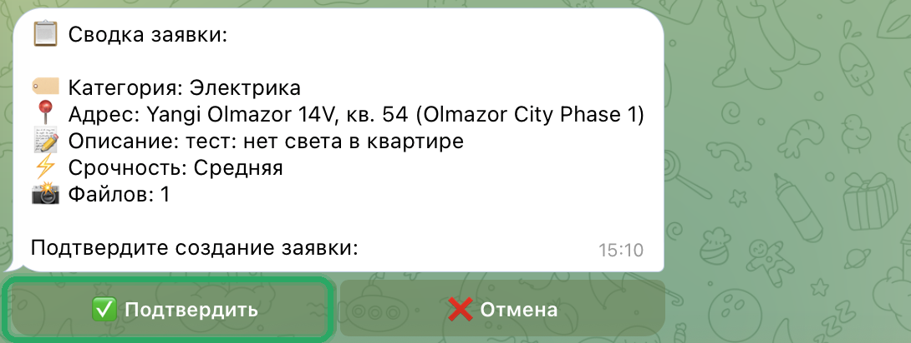

После подтверждения заявка создаётся, ей присваивается номер вида `250917-001` (дата и порядковый номер за день), и бот сообщает об успехе. Заявка автоматически уходит в работу подходящим специалистам.

---

## Как следить за статусом

Нажмите кнопку **«📋 Мои заявки»**. Бот покажет ваши заявки — их можно отфильтровать по статусу, категории или периоду.

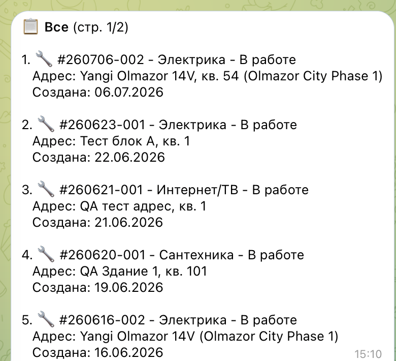

Что означают статусы:

| Статус | Что происходит |
|--------|----------------|
| 🆕 Новая | Заявка создана, подбирается исполнитель |
| 🛠️ В работе | Исполнитель занимается вашей заявкой |
| 💰 Закуп | Исполнитель закупает нужные материалы |
| ❓ Уточнение | Нужны дополнительные детали — возможно, у вас спросят подробности |
| ✅ Выполнена | Работа сделана, её проверяет менеджер |
| ⭐ Исполнено | Проверено менеджером — **ждёт вашей приёмки** |
| ✔️ Принято | Вы приняли работу, заявка закрыта |
| ❌ Отменена | Заявка отменена |

> Отменить можно только **свою «Новую»** заявку, пока её ещё не взяли в работу. Если исполнитель уже назначен, отмену выполняет менеджер — напишите ему.

---

## Как принять выполненную работу

Когда заявка перешла в статус **⭐ Исполнено**, её нужно принять.

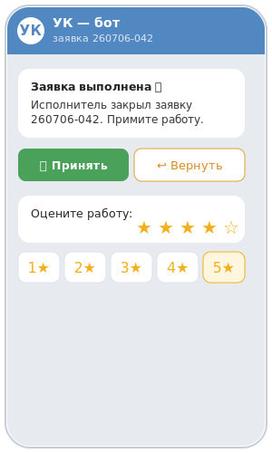

**Шаг 1.** Нажмите кнопку **«✅ Ожидают приёмки»**. Бот покажет заявки, которые ждут вашей приёмки (в том числе заявки других членов вашей семьи по этой квартире).

**Шаг 2.** Выберите заявку — откроется карточка с отчётом исполнителя и, если он приложил, фото или видео результата.

**Шаг 3.** Если всё устраивает — нажмите **«Принять»** и поставьте оценку от 1 до 5 звёзд. После этого заявка перейдёт в статус **✔️ Принято** и закроется.

---

## Как вернуть работу на доработку

Если работа выполнена некачественно:

**Шаг 1.** В карточке выполненной заявки нажмите **«Вернуть»**.

**Шаг 2.** Опишите текстом, что именно не так.

**Шаг 3.** При желании прикрепите фото или видео проблемы, либо пропустите этот шаг.

Заявка вернётся к менеджеру для повторного разбора, а исполнитель и менеджеры получат уведомление с вашей причиной возврата.

> Вернуть заявку может только тот, кто её создавал. Другие члены семьи могут просматривать и принимать заявку, но не возвращать её.

---

# Способ 2. Через мини-приложение (TWA)

Мини-приложение открывается прямо в Telegram (кнопка меню бота или пункт «Открыть приложение»). Внизу — панель вкладок: **Главная**, **Заявки**, **Создать**, **Приёмка**, **Доступ**, **Профиль**.

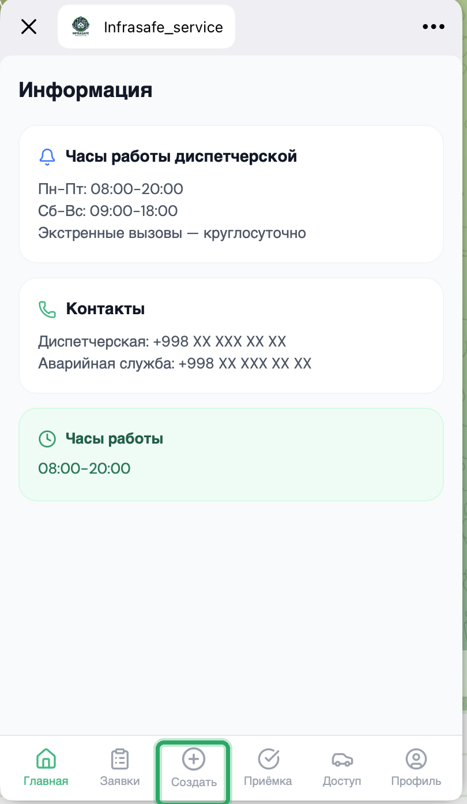

На **Главной** видны часы работы диспетчерской и контакты управляющей компании.

## Как подать заявку в приложении

Откройте вкладку **«Создать»** — приложение проведёт вас по шагам, а полоска сверху показывает прогресс.

**Шаг 1. Категория.**

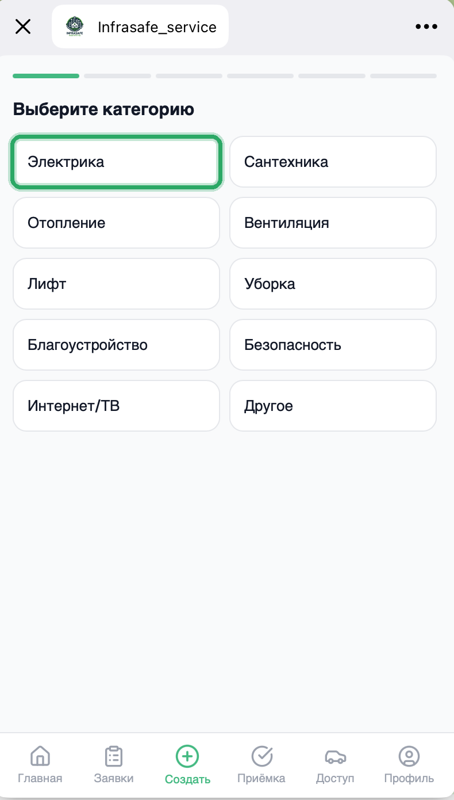

**Шаг 2. Адрес.** Выберите вашу квартиру из списка привязанных адресов.

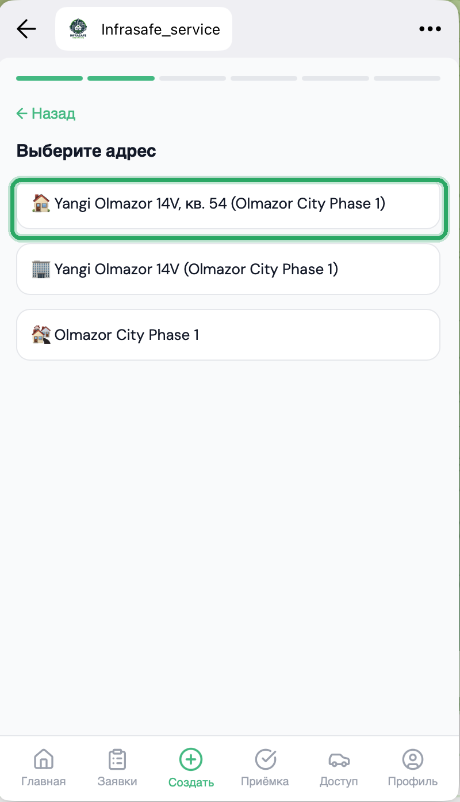

**Шаг 3. Описание.** Опишите проблему и нажмите **«Далее»**.

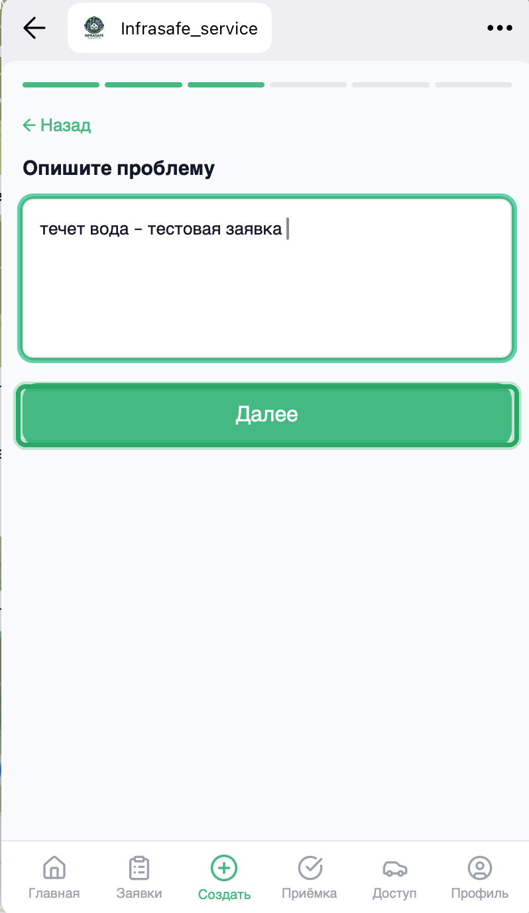

**Шаг 4. Фото (по желанию).** Добавьте до 5 фото с камеры или из галереи и нажмите **«Далее»**.

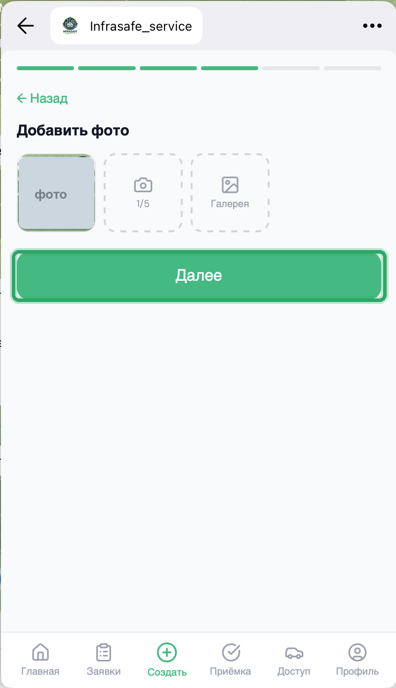

**Шаг 5. Срочность.** Выберите уровень срочности.

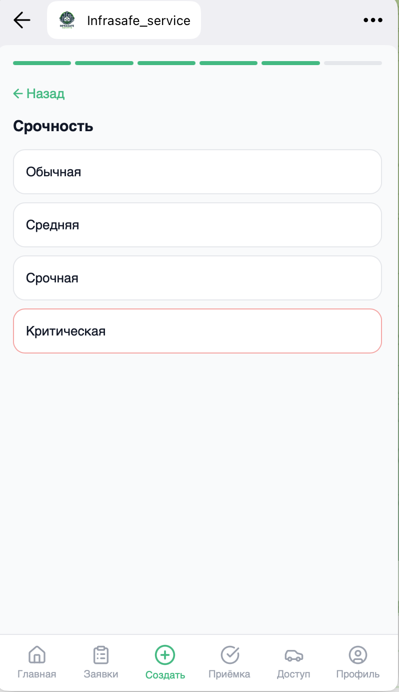

**Шаг 6. Подтверждение.** Проверьте сводку и нажмите **«Отправить заявку»**.

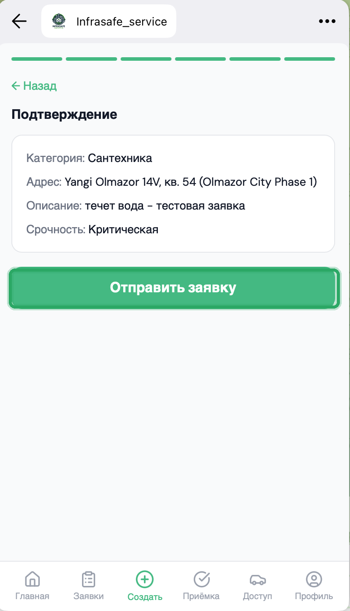

## Как следить за статусом и принимать работу

На вкладке **«Заявки»** — ваши заявки с фильтром **Активные / Архив** и цветными метками статуса.

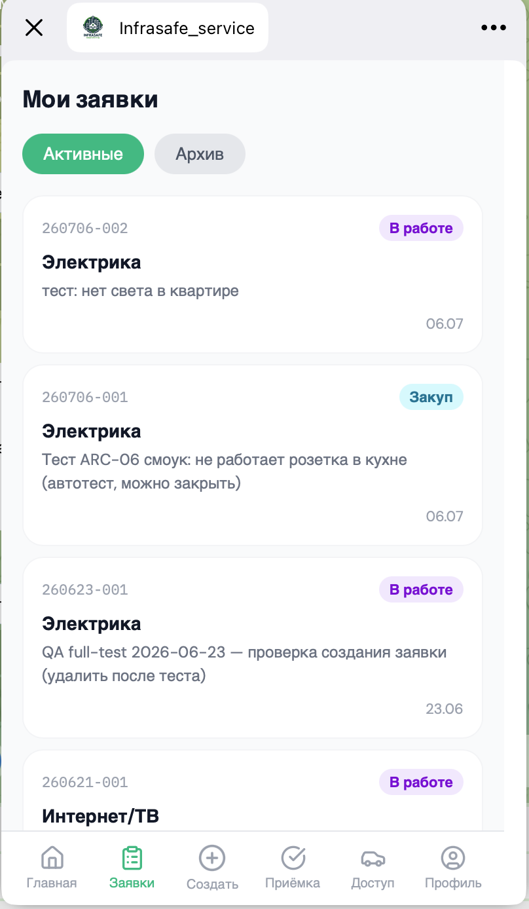

Нажмите на заявку, чтобы открыть карточку с адресом, датой, фотографиями и перепиской с исполнителем.

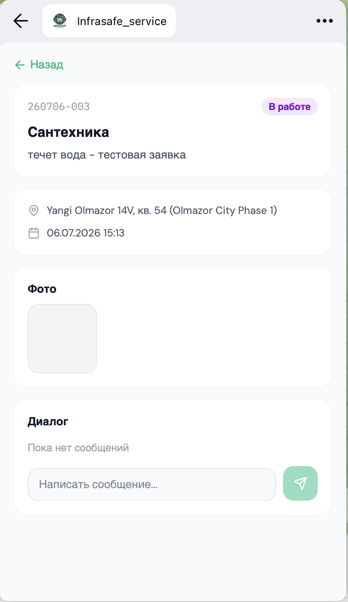

Когда заявка готова к приёмке, она появится на вкладке **«Приёмка»** — там её можно принять и оценить.

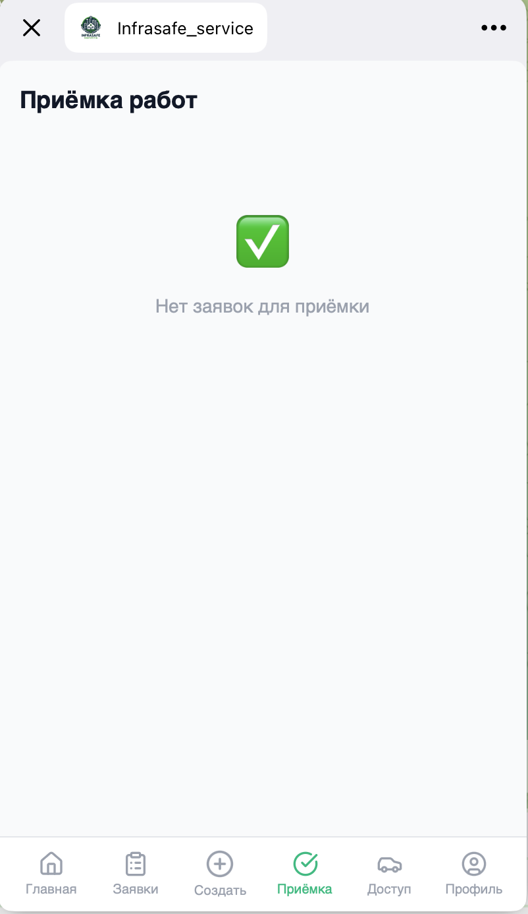

## Контроль доступа в приложении

Если в вашем ЖК подключён контроль доступа, на вкладке **«Доступ»** есть разделы **Авто**, **Место**, **Пропуска** и **Проезды**.

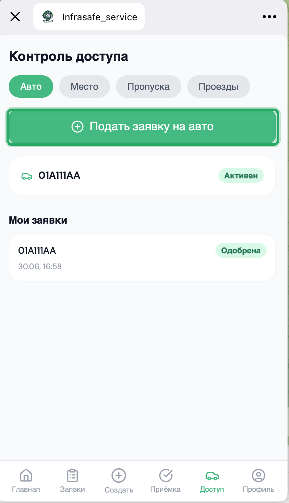

Чтобы заказать разовый пропуск (такси, гость, доставка) — откройте **Пропуска → «Заказать пропуск»**, выберите тип, при необходимости укажите гос-номер и срок, затем **«Заказать»**.

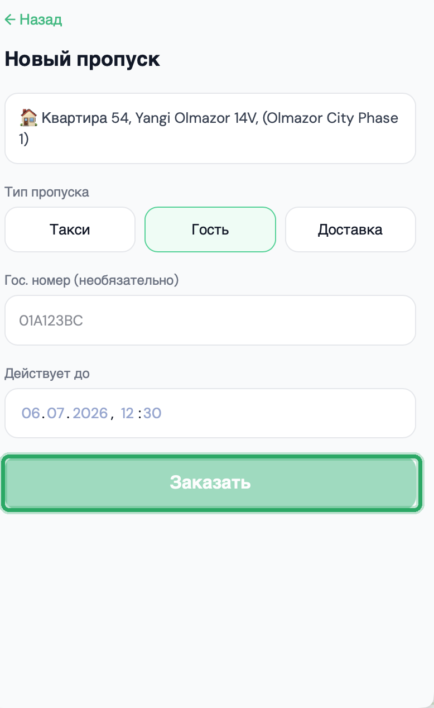

## Профиль и язык

На вкладке **«Профиль»** — ваши адреса, переключатель языка (Русский / O'zbek), быстрый переход в режим исполнителя (если у вас есть такая роль) и кнопка обратной связи.

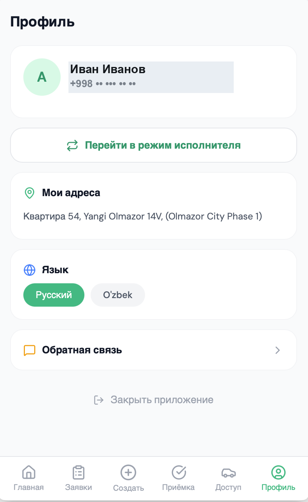

---

## Заявки на въезд автомобиля и пропуска

Если в вашем ЖК подключён контроль доступа, доступны разделы **Авто**, **Пропуска** и **Проезды** (в боте — раздел «Контроль доступа», в приложении — вкладка «Доступ»). Все действия — только для ваших подтверждённых квартир.

### Постоянный автомобиль

Чтобы ваш автомобиль пускали автоматически:

1. Откройте **Авто → «Подать заявку на авто»**.
2. Укажите гос-номер, тип связи (владелец / арендатор / член семьи / служебный), при необходимости — марку, модель, цвет и квартиру.
3. Отправьте. Заявка появится в списке со статусом «На рассмотрении».
4. После решения управляющей компании придёт уведомление («Одобрено» или «Отклонено» с причиной). Одобренный автомобиль начнёт открывать шлагбаум сам.

### Пропуск для такси, гостя или доставки

1. Откройте **Пропуска → «Заказать пропуск»**.
2. Выберите тип: такси, гость или доставка.
3. Укажите гос-номер (если известен) и срок действия, при необходимости — квартиру.
4. Пропуск станет активным. В списке видно срок и счётчик въездов. Активный пропуск можно отменить кнопкой **«Отменить»**.

### Гостевой код (когда номер машины неизвестен)

Если номер гостя заранее неизвестен — создайте гостевой пропуск **без номера**. Система выдаст одноразовый 8-значный код.

- Код показывается **один раз** — скопируйте и передайте гостю.
- Код действует до 30 минут и работает один раз.
- На въезде гость называет код охране, охрана его проверяет и открывает шлагбаум.
- Если код потерялся — просто создайте новый гостевой пропуск.

### Спорный въезд

Иногда система может прислать запрос: «Спорный въезд по вашему авто, это вы?» с кнопками **«Подтвердить»** и **«Отклонить»**. Ваш ответ увидит охрана. Окончательное решение об открытии всё равно принимает оператор охраны — это сделано для защиты от подмены номера.

### Проезды

В разделе **Проезды** видна история последних въездов по вашим автомобилям: время, направление и решение (разрешён / отказ). Видны только ваши события.

---

## Частые ситуации

- **Не вижу кнопку «Создать заявку» / бот просит телефон.** Ваша учётная запись ещё не подтверждена или не указан телефон. Обратитесь в управляющую компанию.
- **В списке адресов пусто.** Ваша квартира ещё не привязана — обратитесь в управляющую компанию.
- **Заявка стала «Исполнено», но я не нажимал «Принять».** Возможно, менеджер принял заявку за вас — это допустимо.
- **Не вижу раздел «Контроль доступа».** Он появляется, только если функция подключена в вашем ЖК и у вас есть подтверждённая квартира.
- **Заявка на авто долго «на рассмотрении».** Решение принимает управляющая компания, уведомление придёт в бот.

---

## Куда обращаться при проблеме

Если что-то не работает или непонятно:

- по вопросам подтверждения учётной записи, привязки квартиры и статуса заявок — обращайтесь в **управляющую компанию** вашего ЖК;
- если бот выдаёт ошибку или зависает — попробуйте перезапустить его командой `/start` и повторить действие;
- по вопросам въезда и пропусков — к менеджеру или охране вашего ЖК.
