# Yashovchi uchun qo'llanma

> _Oxirgi tahrir: 2026-07-08_
>
> 🇷🇺 На русском: [02-resident.md](02-resident.md)

Xush kelibsiz! Ushbu bo'lim boshqaruv kompaniyasi tizimidan foydalanishga yordam beradi: xizmat ko'rsatish uchun arizalar berish, ularning bajarilishini kuzatish va ishni qabul qilish. Ikki usulda foydalanish mumkin:

- **Telegram-bot chati orqali** — hammasi yozishmalarda to'g'ridan-to'g'ri tugmalar bilan bajariladi;
- **mini-ilova (Mini App / TWA) orqali** — xuddi shu narsa, lekin Telegram ichidagi qulay ilova ko'rinishida.

Ikkala usul ham bir xil arizalar bilan ishlaydi — qaysi biri qulay bo'lsa, shuni tanlang. Quyida avval bot orqali yo'l, so'ngra mini-ilova orqali yo'l tasvirlangan.

## Bu qanday ishlaydi — umumiy ko'rinish

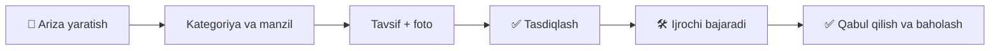

---

## Siz kimsiz va nima qila olasiz

Siz — turar-joy majmuasining **yashovchisisiz**. Tizim orqali siz quyidagilarni qila olasiz:

- xizmat ko'rsatish uchun ariza berish (santexnika, elektrika, tozalash, obodonlashtirish va h.k.);
- arizaga muammoning foto yoki videosini biriktirish;
- ariza holatini kuzatish — u qaysi bosqichda ekanini;
- bajarilgan ishni qabul qilish va baho qo'yish;
- biror narsa yoqmasa, arizani qayta ishlashga qaytarish;
- ish haqida fikr-mulohaza qoldirish;
- (agar turar-joy majmuangizda mavjud bo'lsa) mehmon, taksi uchun ruxsatnoma buyurtirish yoki kirish uchun o'z avtomobilingizni ro'yxatdan o'tkazish.

**Interfeys tili.** Tizim rus va o'zbek tillarida ishlaydi. Tilni sozlamalarda almashtirish mumkin — barcha tugmalar va maslahatlar avtomatik o'zgaradi.

## Nimadan boshlash kerak

Ariza berish uchun hisobingiz boshqaruv kompaniyasi tomonidan tasdiqlangan bo'lishi, kvartirangiz esa profilingizga bog'langan bo'lishi kerak. Odatda bu quyidagicha bo'ladi:

1. Siz boshqaruv kompaniyasidan taklif yoki havola olasiz va botni ochasiz.
2. Bot sizning **telefon raqamingizni** ko'rsatishni so'raydi — uni tugma bilan ulashing.
3. Boshqaruv kompaniyasi hisobingizni tasdiqlaydi va manzilingizni (hovli, uy, kvartira) bog'laydi.
4. Tasdiqlangandan so'ng bosh menyuda arizalar bilan ishlash uchun tugmalar paydo bo'ladi.

Agar bot telefon so'rasa yoki ariza yaratish tugmasini ko'rsatmasa — demak, hisobingiz hali tasdiqlanmagan yoki manzil bog'lanmagan. Bunday holda boshqaruv kompaniyasiga murojaat qiling.

---

# 1-usul. Bot chati orqali

## Qanday qilib ariza berish

**1-qadam. Ariza yaratishni oching.** Bosh menyuda «📝 Ariza yaratish» tugmasini bosing.

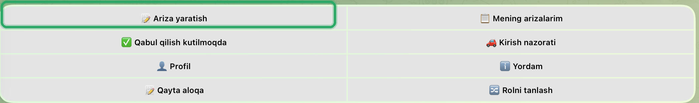

**2-qadam. Kategoriyani tanlang.** Bot kategoriyalar bilan tugmalarni ko'rsatadi (Elektrika, Santexnika, Isitish, Lift, Tozalash, Obodonlashtirish, Xavfsizlik, Internet/TV va b.). Mos kelganini **tugma bilan** tanlang — kategoriyani matn bilan kiritmang, bot faqat tugma tanlovini qabul qiladi.

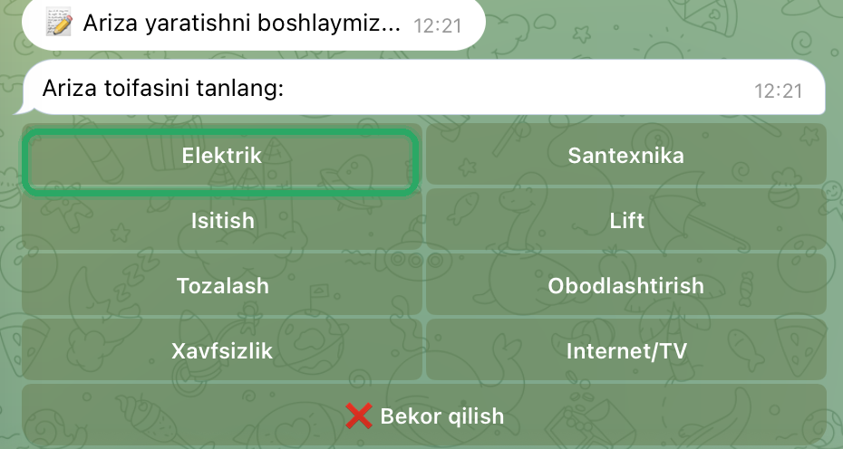

**3-qadam. Manzilni tanlang.** Ro'yxatdan kerakli manzilni (hovli / uy / kvartira) **tugma bilan** tanlang. Ro'yxatda faqat siz bog'langan manzillar bor.

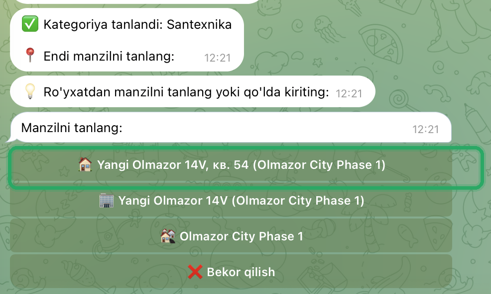

> Manzil faqat tugmalar bilan tanlanadi, uni qo'lda kiritib bo'lmaydi — shu tarzda begona manzil bilan bog'liq xatolar oldi olinadi. Agar ro'yxat bo'sh bo'lsa, demak kvartirangiz hali bog'lanmagan — boshqaruv kompaniyasiga murojaat qiling.

**4-qadam. Muammoni tasvirlang.** Nima sodir bo'lganini matn bilan, imkon qadar batafsil yozing. Juda qisqa tavsifni bot to'ldirishni so'raydi.

**5-qadam. Shoshilinchlikni ko'rsating.** Tugma bilan tanlang: Oddiy, O'rta, Shoshilinch yoki Kritik.

**6-qadam. Foto yoki video biriktiring (ixtiyoriy).** 5 tagacha fayl qo'shish mumkin — bu ijrochiga muammoni oldindan tushunishga yordam beradi. Agar foto kerak bo'lmasa, **«Davom etish»** tugmasini bosing.

**7-qadam. Tekshiring va tasdiqlang.** Bot ariza xulosasini ko'rsatadi: kategoriya, manzil, tavsif, shoshilinchlik, biriktirilgan fayllar soni. Hammasini tekshiring va **«Tasdiqlash»** tugmasini bosing. Agar biror narsani to'g'rilash kerak bo'lsa — **«Orqaga»** tugmasini bosing, yaratishni bekor qilish uchun esa — **«Bekor qilish»**.

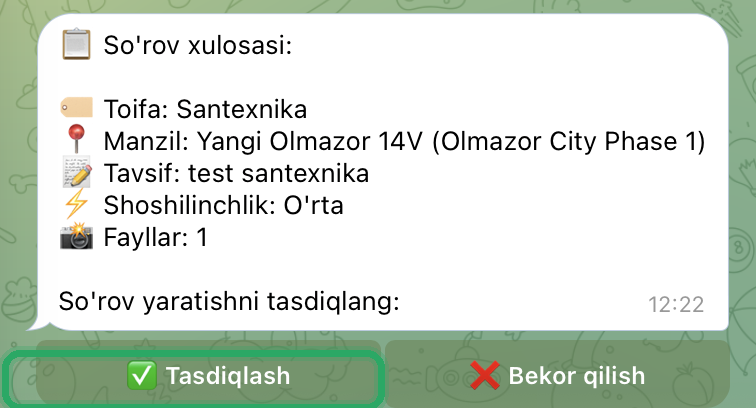

Tasdiqlangandan so'ng ariza yaratiladi, unga 250917-001 ko'rinishidagi raqam beriladi (sana va kunlik tartib raqami), va bot muvaffaqiyat haqida xabar beradi. Ariza avtomatik ravishda mos mutaxassislarga ishlashga jo'natiladi.

---

## Holatni qanday kuzatish

«🗂️ Mening arizalarim» tugmasini bosing. Bot arizalaringizni ko'rsatadi — ularni holat, kategoriya yoki davr bo'yicha filtrlash mumkin.

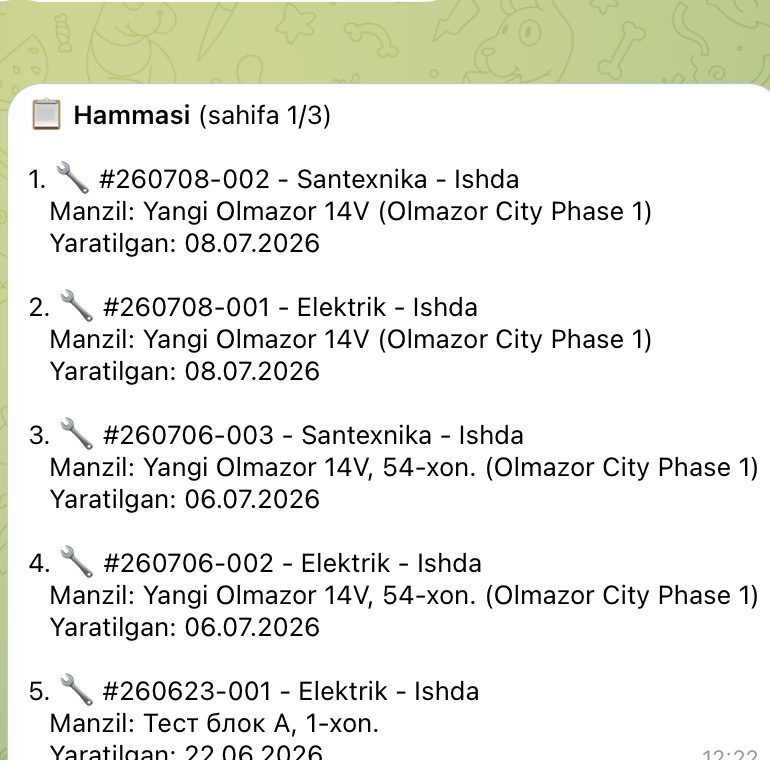

Holatlar nimani anglatadi:

| Holat | Nima sodir bo'lmoqda |
|-------|----------------------|
| 🆕 Yangi | Ariza yaratildi, ijrochi tanlanmoqda |
| 🛠️ Jarayonda | Ijrochi sizning arizangiz bilan shug'ullanmoqda |
| 💰 Xarid | Ijrochi kerakli materiallarni xarid qilmoqda |
| ❓ Aniqlashtirish | Qo'shimcha tafsilotlar kerak — sizdan tafsilotlar so'ralishi mumkin |
| ✅ Bajarildi | Ish bajarildi, uni menejer tekshirmoqda |
| ⭐ Ijro etildi | Menejer tomonidan tekshirildi — **sizning qabulingizni kutmoqda** |
| ✔️ Qabul qilindi | Siz ishni qabul qildingiz, ariza yopildi |
| ❌ Bekor qilindi | Ariza bekor qilindi |

> Faqat **o'zingizning «Yangi»** arizangizni, u hali ishga olinmagan bo'lsa, bekor qilish mumkin. Agar ijrochi allaqachon tayinlangan bo'lsa, bekor qilishni menejer amalga oshiradi — unga yozing.

## Bajarilgan ishni qanday qabul qilish

Ariza ⭐ **Ijro etildi** holatiga o'tganda, uni qabul qilish kerak.

**1-qadam.** «✅ Qabulni kutmoqda» tugmasini bosing. Bot sizning qabulingizni kutayotgan arizalarni ko'rsatadi (shu jumladan ushbu kvartira bo'yicha oilangizning boshqa a'zolari arizalarini ham).

**2-qadam.** Arizani tanlang — ijrochi hisoboti bilan kartochka ochiladi, agar u biriktirgan bo'lsa, natijaning fotosi yoki videosi ham ko'rinadi.

**3-qadam.** Agar hammasi ma'qul bo'lsa — **«Qabul qilish»** tugmasini bosing va 1 dan 5 gacha yulduz baho qo'ying. Shundan so'ng ariza ✔️ **Qabul qilindi** holatiga o'tadi va yopiladi.

## Ishni qayta ishlashga qanday qaytarish

Agar ish sifatsiz bajarilgan bo'lsa:

**1-qadam.** Bajarilgan ariza kartochkasida **«Qaytarish»** tugmasini bosing.

**2-qadam.** Aynan nima noto'g'ri ekanini matn bilan tasvirlang.

**3-qadam.** Xohlasangiz muammoning foto yoki videosini biriktiring, yoki bu qadamni o'tkazib yuboring.

Ariza qayta ko'rib chiqish uchun menejerga qaytadi, ijrochi va menejerlar esa sizning qaytarish sababingiz bilan bildirishnoma oladi.

> Arizani faqat uni yaratgan kishi qaytara oladi. Oilaning boshqa a'zolari arizani ko'rishlari va qabul qilishlari mumkin, lekin uni qaytara olmaydilar.

---

# 2-usul. Mini-ilova (TWA) orqali

Mini-ilova to'g'ridan-to'g'ri Telegramda ochiladi (bot menyusi tugmasi yoki «Ilovani ochish» bandi). Pastda — bo'limlar paneli: **Bosh sahifa**, **Arizalar**, **Yaratish**, **Qabul**, **Kirish**, **Profil**.

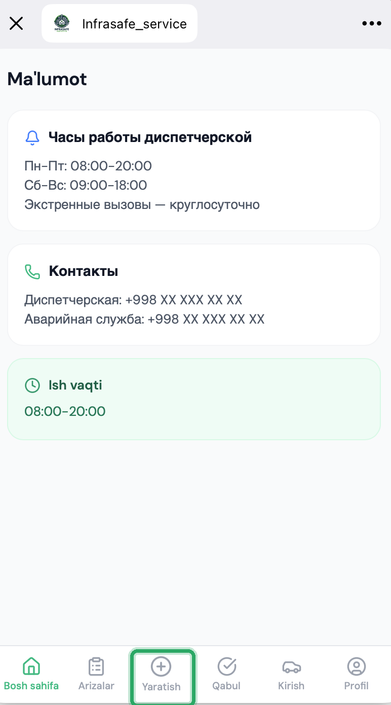

**Bosh sahifada** dispetcherlik xizmati ish vaqti va boshqaruv kompaniyasi kontaktlari ko'rinadi.

## Ilovada qanday qilib ariza berish

**«Yaratish»** bo'limini oching — ilova sizni bosqichma-bosqich olib o'tadi, yuqoridagi chiziq esa jarayonni ko'rsatadi.

**1-qadam. Kategoriya.**

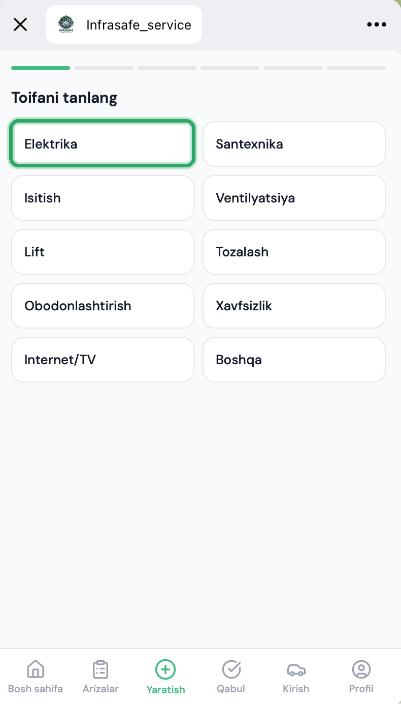

**2-qadam. Manzil.** Bog'langan manzillar ro'yxatidan kvartirangizni tanlang.

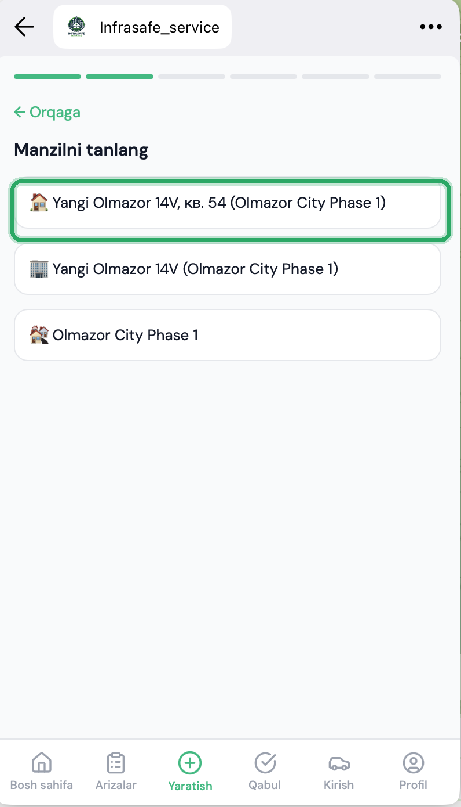

**3-qadam. Tavsif.** Muammoni tasvirlang va **«Keyingisi»** tugmasini bosing.

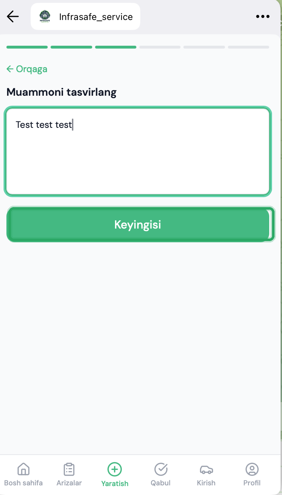

**4-qadam. Foto (ixtiyoriy).** Kamera yoki galereyadan 5 tagacha foto qo'shing va **«Keyingisi»** tugmasini bosing.

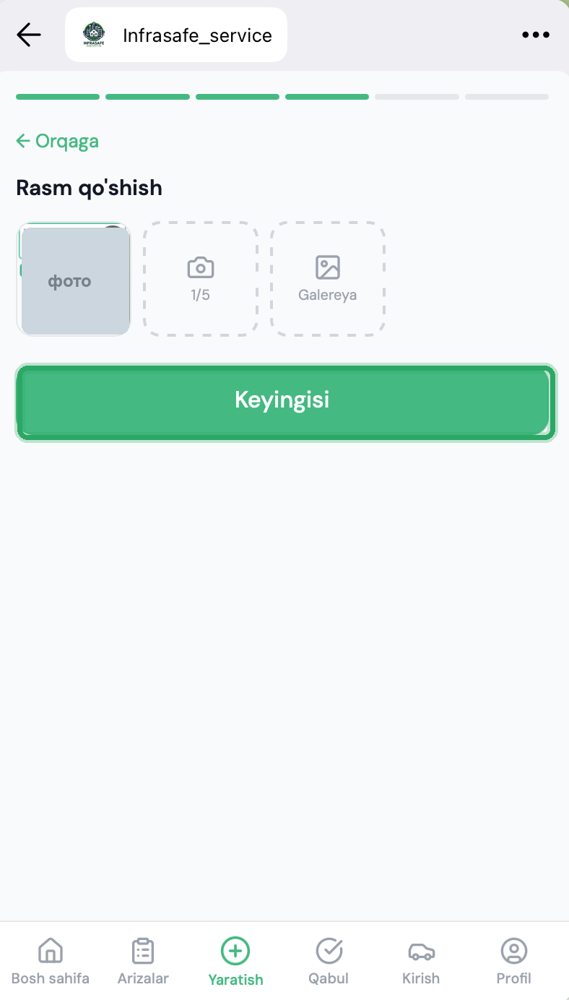

**5-qadam. Shoshilinchlik.** Shoshilinchlik darajasini tanlang.

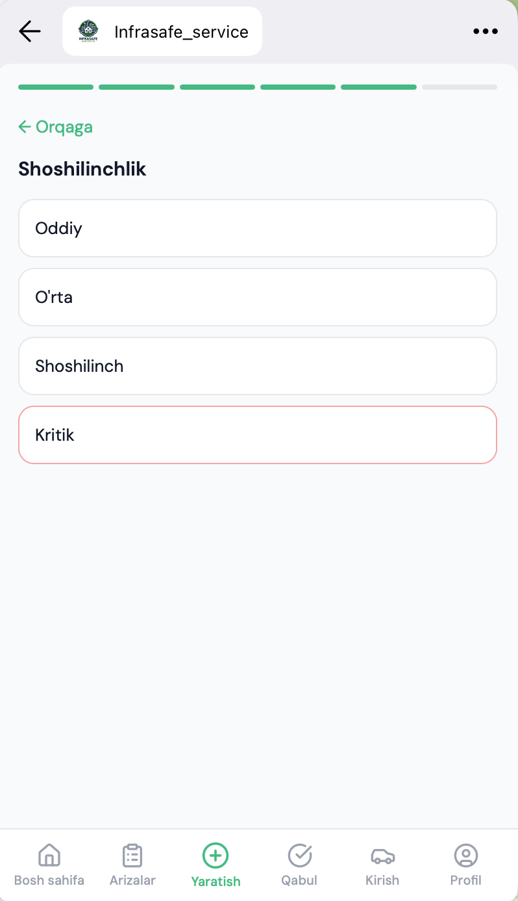

**6-qadam. Tasdiqlash.** Xulosani tekshiring va **«Arizani yuborish»** tugmasini bosing.

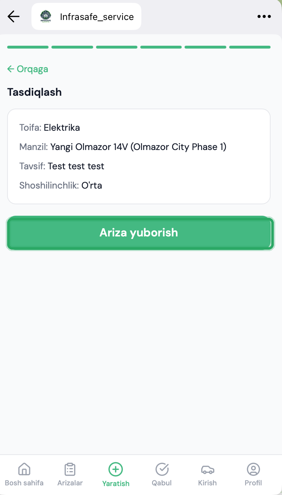

## Holatni kuzatish va ishni qabul qilish

**«Arizalar»** bo'limida — **Faol / Arxiv** filtri va rangli holat belgilari bilan arizalaringiz.

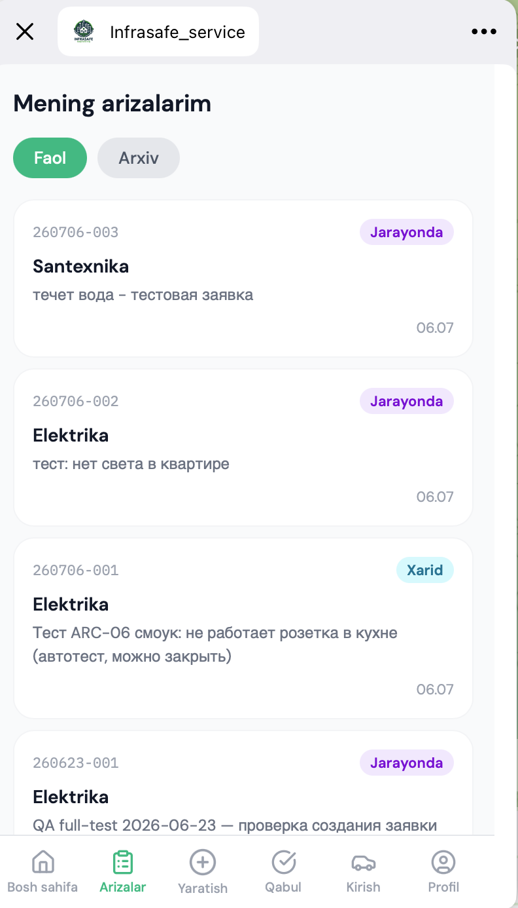

Manzil, sana, fotosuratlar va ijrochi bilan yozishmalar bo'lgan kartochkani ochish uchun arizani bosing.

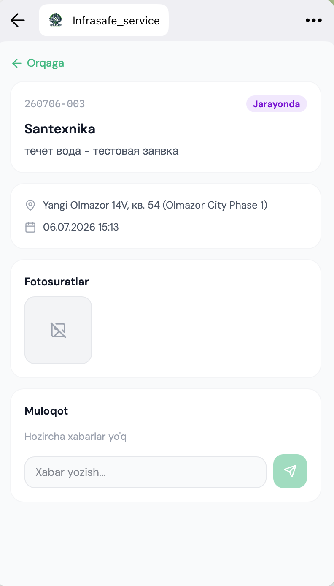

Ariza qabulga tayyor bo'lganda, u **«Qabul»** bo'limida paydo bo'ladi — u yerda uni qabul qilish va baholash mumkin.

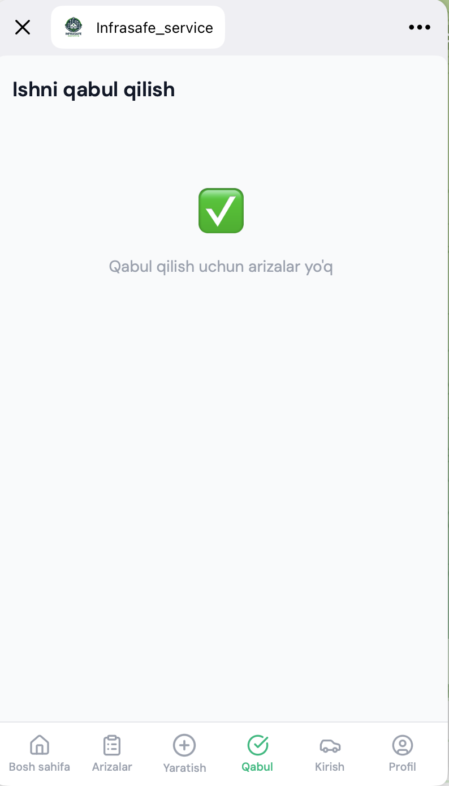

## Ilovada kirishni boshqarish

Agar turar-joy majmuangizda kirishni boshqarish ulangan bo'lsa, **«Kirish»** bo'limida **Avto**, **Joy**, **Ruxsatnomalar** va **O'tishlar** bo'limlari mavjud.

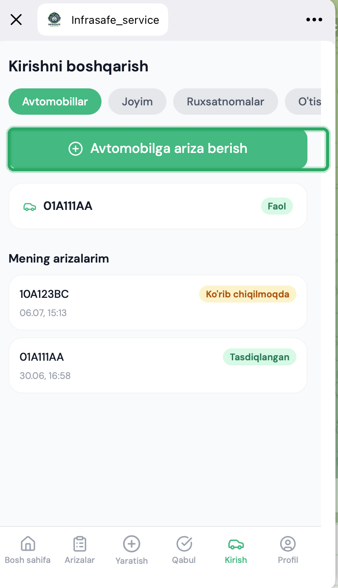

Bir martalik ruxsatnoma (taksi, mehmon, yetkazib berish) buyurtirish uchun — **Ruxsatnomalar → «Ruxsatnoma buyurtirish»** ni oching, turini tanlang, kerak bo'lsa davlat raqami va muddatni ko'rsating, so'ngra **«Buyurtirish»**.

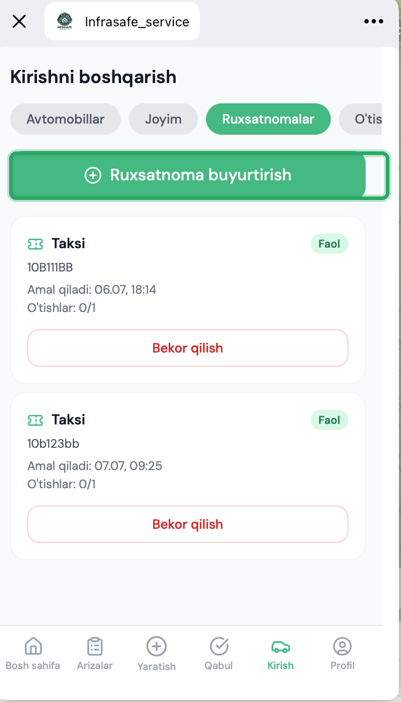

## Profil va til

**«Profil»** bo'limida — manzillaringiz, til o'zgartirgichi (Ruscha / O'zbek), ijrochi rejimiga tez o'tish (agar sizda shunday rol bo'lsa) va fikr-mulohaza tugmasi.

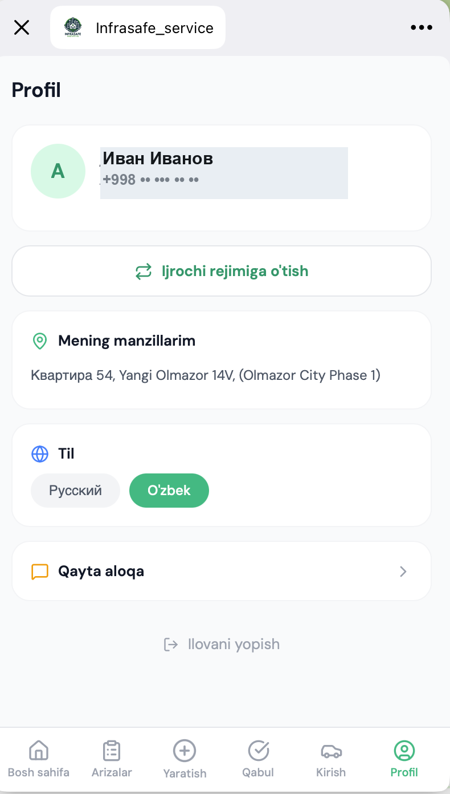

---

# Avtomobil kirishi va ruxsatnomalar uchun arizalar

Agar turar-joy majmuangizda kirishni boshqarish ulangan bo'lsa, **Avto**, **Ruxsatnomalar** va **O'tishlar** bo'limlari mavjud (botda — «Kirishni boshqarish» bo'limi, ilovada — «Kirish» bo'limi). Barcha amallar — faqat sizning tasdiqlangan kvartiralaringiz uchun.

## Doimiy avtomobil

Avtomobilingiz avtomatik kiritilishi uchun:

1. **Avto → «Avto uchun ariza berish»** ni oching.
2. Davlat raqami, bog'lanish turini (egasi / ijarachi / oila a'zosi / xizmat) ko'rsating, kerak bo'lsa — marka, model, rang va kvartira.
3. Yuboring. Ariza «Ko'rib chiqilmoqda» holati bilan ro'yxatda paydo bo'ladi.
4. Boshqaruv kompaniyasi qarori chiqqach, bildirishnoma keladi («Tasdiqlangan» yoki sabab bilan «Rad etilgan»). Tasdiqlangan avtomobil shlagbaumni o'zi ocha boshlaydi.

## Taksi, mehmon yoki yetkazib berish uchun ruxsatnoma

1. **Ruxsatnomalar → «Ruxsatnoma buyurtirish»** ni oching.
2. Turini tanlang: taksi, mehmon yoki yetkazib berish.
3. Davlat raqamini (agar ma'lum bo'lsa) va amal qilish muddatini, kerak bo'lsa — kvartirani ko'rsating.
4. Ruxsatnoma faollashadi. Ro'yxatda muddat va kirishlar hisoblagichi ko'rinadi. Faol ruxsatnomani **«Bekor qilish»** tugmasi bilan bekor qilish mumkin.

## Mehmon kodi (mashina raqami noma'lum bo'lganda)

Agar mehmonning raqami oldindan noma'lum bo'lsa — **raqamsiz** mehmon ruxsatnomasini yarating. Tizim bir martalik 8 xonali kod beradi.

- Kod **bir marta** ko'rsatiladi — nusxa oling va mehmonga bering.
- Kod 30 daqiqagacha amal qiladi va bir marta ishlaydi.
- Kirishda mehmon kodni qorovulga aytadi, qorovul uni tekshiradi va shlagbaumni ochadi.
- Agar kod yo'qolsa — shunchaki yangi mehmon ruxsatnomasini yarating.

## Bahsli kirish

Ba'zan tizim so'rov yuborishi mumkin: «Sizning avtomobilingiz bo'yicha bahsli kirish, bu sizmi?» degan **«Tasdiqlash»** va **«Rad etish»** tugmalari bilan. Javobingizni qorovul ko'radi. Ochish bo'yicha yakuniy qarorni baribir qorovul operatori qabul qiladi — bu raqamni almashtirishdan himoya qilish uchun qilingan.

## O'tishlar

**O'tishlar** bo'limida avtomobillaringiz bo'yicha oxirgi kirishlar tarixi ko'rinadi: vaqt, yo'nalish va qaror (ruxsat berilgan / rad etilgan). Faqat sizning voqealaringiz ko'rinadi.

---

## Tez-tez uchraydigan holatlar

- **«Ariza yaratish» tugmasini ko'rmayapman / bot telefon so'rayapti.** Hisobingiz hali tasdiqlanmagan yoki telefon ko'rsatilmagan. Boshqaruv kompaniyasiga murojaat qiling.
- **Manzillar ro'yxati bo'sh.** Kvartirangiz hali bog'lanmagan — boshqaruv kompaniyasiga murojaat qiling.
- **Ariza «Ijro etildi» holatiga o'tdi, lekin men «Qabul qilish»ni bosmadim.** Ehtimol, menejer arizani siz uchun qabul qilgan — bu joizdir.
- **«Kirishni boshqarish» bo'limini ko'rmayapman.** U faqat funksiya turar-joy majmuangizda ulangan va sizda tasdiqlangan kvartira bo'lsa paydo bo'ladi.
- **Avto uchun ariza uzoq vaqt «ko'rib chiqilmoqda».** Qarorni boshqaruv kompaniyasi qabul qiladi, bildirishnoma botga keladi.

---

## Muammo yuzaga kelganda qayerga murojaat qilish

Agar biror narsa ishlamasa yoki tushunarsiz bo'lsa:

- hisobni tasdiqlash, kvartirani bog'lash va arizalar holati bo'yicha — turar-joy majmuangizning **boshqaruv kompaniyasiga** murojaat qiling;
- agar bot xatolik bersa yoki qotib qolsa — uni /start buyrug'i bilan qayta ishga tushirib, amalni takrorlab ko'ring;
- kirish va ruxsatnomalar bo'yicha — turar-joy majmuangizning menejeri yoki qorovuliga.
