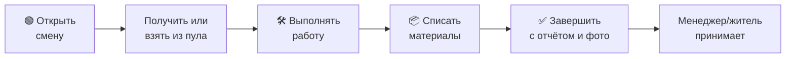
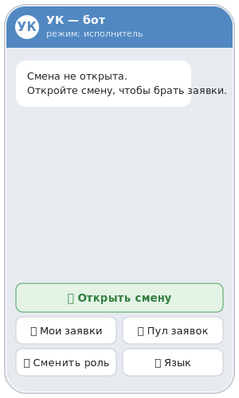
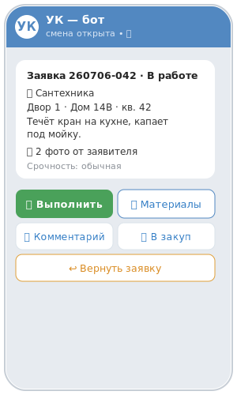
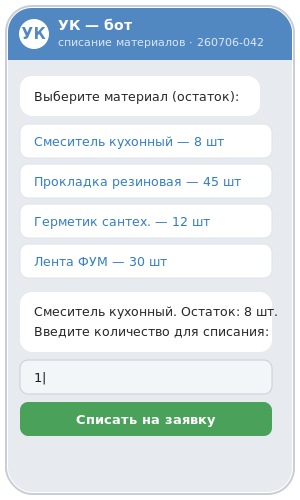
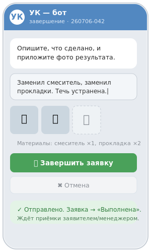

# Инструкция исполнителя

> _Последнее редактирование: 2026-07-06_

Этот раздел для сотрудников, которые выполняют заявки: мастеров, сантехников, электриков, уборщиков. Здесь описано, как работать с заявками в Telegram-боте управляющей компании.

## Как это работает — обзор

> Ниже — как выглядят экраны бота на ключевых шагах.

---

## Кто вы и что можете

Вы — **исполнитель**. Через бота вы:

- открываете и закрываете рабочую смену;
- получаете назначенные заявки или берёте свободные из общего пула;
- ведёте заявку по этапам: работа, закуп материалов, уточнение;
- списываете использованные материалы на заявку;
- отчитываетесь о выполненной работе текстом и фото;
- при необходимости возвращаете заявку менеджеру.

Важно: любые действия с заявкой возможны, только если заявка **назначена именно вам** и вы находитесь **на активной смене**.

**Язык интерфейса.** Бот работает на русском и узбекском. Переключить язык можно в настройках бота.

---

## Смена

Прежде чем работать с заявками, откройте смену — нажмите кнопку **«Принять смену»**.

Без активной смены бот не даст переводить заявки между этапами и не покажет список свободных заявок. Когда рабочий день закончен, закройте смену соответствующей кнопкой.

---

## Откуда приходят заявки

Заявка попадает к вам одним из способов:

1. **Менеджер назначил её лично вам** или вашей группе специалистов.
2. **Заявка распределилась автоматически** при создании — ушла группе подходящей специализации и появилась в общем пуле свободных заявок.
3. **Вы взяли её сами** из пула свободных заявок.

Свои заявки смотрите в разделе **«📋 Мои заявки»**. Для вас активными считаются заявки в статусах «В работе», «Закуп» и «Уточнение».

---

## Как взять заявку из пула

Если заявка назначена вашей группе, но конкретный исполнитель ещё не выбран, вы можете взять её себе:

**Шаг 1.** Нажмите **«🆓 Свободные заявки»**.

**Шаг 2.** У каждой заявки в списке есть кнопка **«🙋 Взять в работу #НОМЕР»** — нажмите её.

**Шаг 3.** Заявка закрепится за вами и исчезнет из пула, а у вас появятся рабочие действия. Остальным сотрудникам группы придёт уведомление, что заявку уже взяли.

> Взять можно только заявку своей специализации и только находясь на смене. Если её уже кто-то забрал, бот сообщит «Заявку уже взяли».

---

## Как вести заявку

Откройте карточку заявки в статусе **«В работе»** — там доступны рабочие действия.

### Перевести в «Закуп»

Если для работы нужны материалы, выберите действие закупа и напишите текстом, что требуется приобрести. Заявка перейдёт в статус **💰 Закуп**, а ваш текст сохранится в заявке.

### Вернуть в работу

Из статусов «Закуп» или «Уточнение» действие **«Вернуть в работу»** возвращает заявку обратно в статус **🛠️ В работе** — когда материалы получены или детали уточнены.

### Списать материалы

Если ваш ЖК использует складской учёт, вы можете списать израсходованные материалы прямо на заявку:

**Шаг 1.** В карточке заявки «В работе» нажмите **«📦 Материалы»**.

**Шаг 2.** Выберите нужный материал из списка склада.

**Шаг 3.** Введите количество и подтвердите.

Списание зафиксируется в заявке отдельной записью. Списать можно только материал, который есть в наличии на складе; если остатка не хватает, бот об этом сообщит. Управлением складом (закупки, поступления) занимается менеджер.

### Завершить заявку

**Шаг 1.** Выберите действие завершения и напишите отчёт — что именно было сделано.

**Шаг 2.** Прикрепите фото, видео или документы результата, либо нажмите **«✅ Завершить без медиа»**, если прикладывать нечего.

**Шаг 3.** Подтвердите. Заявка перейдёт в статус **✅ Выполнена** и уйдёт менеджеру на проверку. Ваш отчёт и файлы сохранятся в заявке.

---

## Что происходит после завершения

После того как вы перевели заявку в «Выполнена»:

- менеджер проверяет работу и переводит её в **⭐ Исполнено** (или возвращает вам в работу, если есть замечания);
- житель принимает работу и ставит оценку (**✔️ Принято**) либо возвращает на доработку.

Если житель вернул заявку, менеджер решает, что делать дальше. Если он снова отправит её вам, заявка опять окажется в статусе **«В работе»**.

---

## Памятка по статусам

| Статус | Ваши действия |
|--------|---------------|
| 🛠️ В работе | Перевести в закуп, списать материалы, завершить |
| 💰 Закуп | Вернуть в работу, когда материалы получены |
| ❓ Уточнение | Вернуть в работу, когда детали уточнены |
| ✅ Выполнена | Ждёте проверки менеджера |

---

## Частые ситуации

- **Не могу перевести заявку — бот пишет «нет прав».** Проверьте, что вы на активной смене и заявка назначена именно вам.
- **Не вижу «Свободные заявки».** Этот раздел доступен только исполнителям на активной смене. Откройте смену.
- **Заявку вернули.** Дальнейшее решает менеджер. Если он отправит заявку вам, она снова станет «В работе».
- **Не получается списать материал.** Убедитесь, что заявка в статусе «В работе» и назначена вам, а материал есть в наличии на складе.

---

## Куда обращаться при проблеме

- по вопросам назначения заявок, смен и складских остатков — к **менеджеру** вашей управляющей компании;
- если бот выдаёт ошибку или зависает — перезапустите его командой `/start` и повторите действие.
