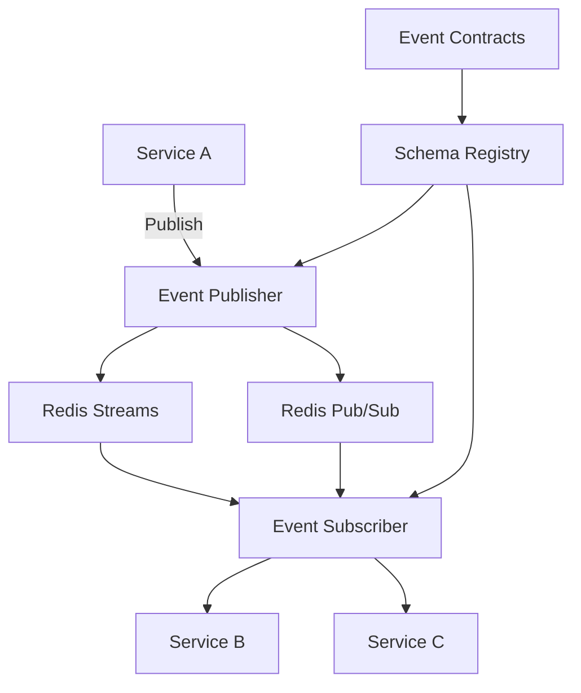

# 🎯 Event Architecture

Comprehensive event-driven architecture for UK Management Bot microservices with schema validation, versioning, and reliable delivery.

## 📋 Overview

The event system enables loose coupling between microservices through:

- **Event Schema Registry**: Centralized schema validation and versioning
- **Event Contracts**: Strongly-typed event definitions
- **Redis Streams**: Reliable event delivery with consumer groups
- **Redis Pub/Sub**: Real-time event broadcasting
- **Event Replay**: Recovery and debugging capabilities

## 🏗️ Architecture



## 📝 Event Types

### User Events
- `user.created` - New user registration
- `user.updated` - Profile changes
- `user.verified` - Document verification completed
- `user.deleted` - User account deletion

### Request Events
- `request.created` - New maintenance request
- `request.updated` - Request details changed
- `request.assigned` - Executor assigned
- `request.completed` - Work finished
- `request.cancelled` - Request cancelled

### Assignment Events
- `assignment.created` - Task assigned to executor
- `assignment.accepted` - Executor accepts task
- `assignment.rejected` - Executor rejects task
- `assignment.completed` - Task marked as done

### Shift Events
- `shift.created` - New shift scheduled
- `shift.updated` - Shift details changed
- `shift.assigned` - Executor assigned to shift
- `shift.transferred` - Shift transferred between executors

### Notification Events
- `notification.send` - Notification queued
- `notification.delivered` - Successfully delivered
- `notification.failed` - Delivery failed

### System Events
- `system.health_check` - Service health status
- `system.error` - System errors and exceptions

## 📊 Event Schema

### Base Event Structure

All events inherit from `BaseEvent`:

```python
class BaseEvent(BaseModel):
    event_id: str           # Unique event identifier
    event_type: EventType   # Type of event
    version: EventVersion   # Schema version
    timestamp: datetime     # When event occurred
    source_service: str     # Service that published event
    correlation_id: str     # Request correlation ID
    user_id: int           # User who triggered event
    metadata: Dict[str, Any]  # Additional context
```

### Example Event

```python
{
    "event_id": "123e4567-e89b-12d3-a456-426614174000",
    "event_type": "user.created",
    "version": "v1",
    "timestamp": "2025-09-26T10:30:00Z",
    "source_service": "users-service",
    "correlation_id": "req-789",
    "user_id": 12345,
    "metadata": {"registration_source": "telegram"},

    # Event-specific payload
    "telegram_id": 987654321,
    "first_name": "John",
    "last_name": "Doe",
    "role": "executor",
    "specializations": ["electrical", "plumbing"]
}
```

## 🔄 Event Flow

### 1. Publishing Events

```python
from shared.events.schema_registry import EventType
from events.publisher import EventPublisher

publisher = EventPublisher()

# Publish user creation event
await publisher.publish(
    EventType.USER_CREATED,
    {
        "user_id": 123,
        "telegram_id": 456789,
        "first_name": "John",
        "last_name": "Doe",
        "role": "executor",
        "specializations": ["electrical"]
    },
    correlation_id="req-123"
)
```

### 2. Subscribing to Events

```python
from events.subscriber import EventSubscriber

subscriber = EventSubscriber()

# Handler function
async def handle_user_created(event):
    print(f"New user: {event.first_name} (ID: {event.user_id})")
    # Business logic here

# Subscribe to events
subscriber.subscribe(EventType.USER_CREATED, handle_user_created)

# Start consuming
await subscriber.start_consuming()
```

### 3. Event Processing

Events are processed through both:

- **Redis Streams**: Persistent, ordered, with consumer groups
- **Redis Pub/Sub**: Real-time, fire-and-forget

```python
# Stream processing (reliable)
await redis.xreadgroup(
    consumer_group,
    consumer_name,
    {"events:user.created": ">"},
    count=10,
    block=1000
)

# Pub/sub processing (real-time)
await pubsub.subscribe("events.user.created")
```

## 🔒 Schema Validation

### Registry

The schema registry validates all events:

```python
from shared.events.schema_registry import get_schema_registry

registry = get_schema_registry()

# Validate event data
validated_event = registry.validate_event(
    EventType.USER_CREATED,
    event_data,
    EventVersion.V1
)
```

### Versioning

Events support multiple schema versions:

```python
# V1 Schema
class UserCreatedEventV1(BaseEvent):
    user_id: int
    first_name: str
    role: str

# V2 Schema (backward compatible)
class UserCreatedEventV2(BaseEvent):
    user_id: int
    first_name: str
    last_name: Optional[str] = None  # New optional field
    full_name: str                   # Computed field
    role: str
    permissions: List[str] = []      # New field with default
```

### Migration

Events can be migrated between versions:

```python
# Migrate from V1 to V2
migrated_event = registry.migrate_event(v1_event, EventVersion.V2)
```

## 🔄 Event Delivery

### Reliability Guarantees

1. **At-least-once delivery** via Redis Streams
2. **Consumer groups** for load balancing
3. **Message acknowledgment** to prevent loss
4. **Dead letter queues** for failed processing
5. **Event replay** for recovery

### Consumer Groups

Each service gets its own consumer group:

```python
# Service-specific consumer group
subscriber = EventSubscriber(
    consumer_group="users-service-consumer"
)

# Multiple instances share work
# Instance 1: users-service-consumer-1
# Instance 2: users-service-consumer-2
```

### Failure Handling

```python
try:
    # Process event
    await handle_event(event)
    # Acknowledge success
    await redis.xack(stream, group, message_id)

except Exception as e:
    # Log error and retry later
    logger.error(f"Event processing failed: {e}")
    # Message remains unacknowledged for retry
```

## 🎭 Event Replay

### Use Cases

- **Recovery**: Rebuild service state after downtime
- **Debugging**: Reproduce issues in development
- **Migration**: Process historical events with new logic

### Implementation

```python
# Replay last hour of user events
replayed_count = await subscriber.replay_events(
    EventType.USER_CREATED,
    from_timestamp=datetime.now() - timedelta(hours=1),
    to_timestamp=datetime.now(),
    max_count=1000
)
```

## 📊 Monitoring

### Event Metrics

- **Published events** per type and service
- **Processing latency** from publish to consume
- **Failed processing** counts and error rates
- **Consumer lag** in Redis Streams

### Health Checks

```python
# Publisher health
health = await publisher.health_check()
# Returns: {"status": "healthy", "redis_connected": true}

# Subscriber health
health = await subscriber.health_check()
# Returns: {"status": "healthy", "subscribed_events": [...], "pending_messages": {...}}
```

## 🛠️ Development

### Testing Events

```python
import pytest
from unittest.mock import AsyncMock

@pytest.mark.asyncio
async def test_user_creation():
    # Mock event handler
    handler = AsyncMock()

    # Subscribe to event
    subscriber.subscribe(EventType.USER_CREATED, handler)

    # Publish test event
    await publisher.publish(EventType.USER_CREATED, {
        "user_id": 123,
        "first_name": "Test User",
        "role": "executor"
    })

    # Verify handler called
    handler.assert_called_once()
```

### Event Debugging

```python
# Enable debug logging
logging.getLogger("events").setLevel(logging.DEBUG)

# Monitor Redis streams
await redis.xinfo_stream("events:user.created")

# Check pending messages
await redis.xpending("events:user.created", "my-consumer-group")
```

## 🚀 Best Practices

### ✅ Do

- **Include correlation IDs** for request tracing
- **Use specific event types** instead of generic ones
- **Version your schemas** for backward compatibility
- **Handle processing failures** gracefully
- **Monitor consumer lag** and processing metrics
- **Test event flows** end-to-end

### ❌ Don't

- **Include sensitive data** in events (use references)
- **Make events too large** (> 1MB)
- **Process events synchronously** in handlers
- **Ignore schema validation** errors
- **Forget to acknowledge** processed messages
- **Create circular event dependencies**

## 🔧 Configuration

### Publisher Settings

```python
# Publisher configuration
EVENT_PUBLISHER_REDIS_URL=redis://localhost:6379/0
EVENT_PUBLISHER_MAX_BATCH_SIZE=100
EVENT_PUBLISHER_PUBLISH_TIMEOUT=5000
```

### Subscriber Settings

```python
# Subscriber configuration
EVENT_SUBSCRIBER_CONSUMER_GROUP=my-service
EVENT_SUBSCRIBER_BATCH_SIZE=10
EVENT_SUBSCRIBER_BLOCK_TIME=1000
EVENT_SUBSCRIBER_MAX_RETRIES=3
```

## 📈 Performance

### Throughput

- **Publisher**: 10,000+ events/second
- **Subscriber**: 5,000+ events/second per consumer
- **Latency**: < 10ms end-to-end (local Redis)

### Scaling

- **Horizontal**: Add more consumer instances
- **Vertical**: Increase batch sizes and worker threads
- **Partitioning**: Use multiple Redis instances

## 🆘 Troubleshooting

### Common Issues

**Events not being consumed:**
```bash
# Check consumer group exists
redis-cli XINFO GROUPS events:user.created

# Check pending messages
redis-cli XPENDING events:user.created my-consumer-group
```

**High consumer lag:**
```bash
# Add more consumers
docker-compose up --scale my-service=3

# Increase batch size
EVENT_SUBSCRIBER_BATCH_SIZE=50
```

**Schema validation errors:**
```python
# Check event structure
print(json.dumps(event_data, indent=2))

# Verify schema compatibility
registry.validate_event(event_type, event_data, version)
```

---

**Architecture Version**: 1.0.0
**Last Updated**: September 2025
**Redis Version**: 7.0+